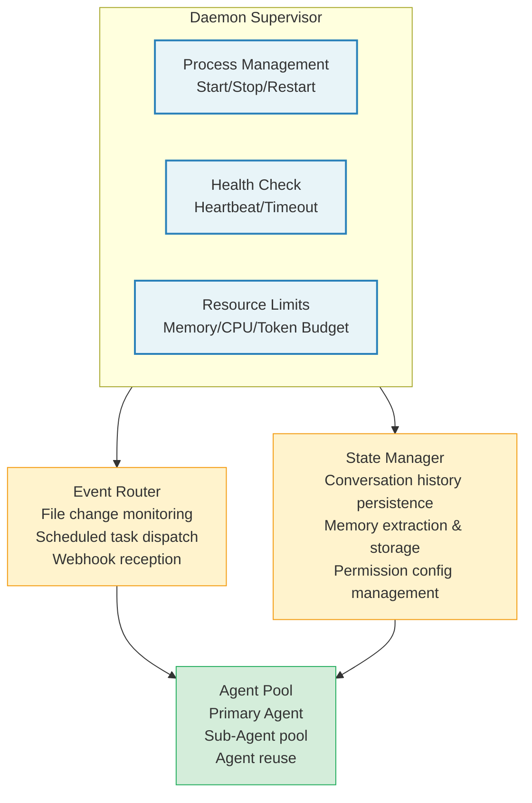
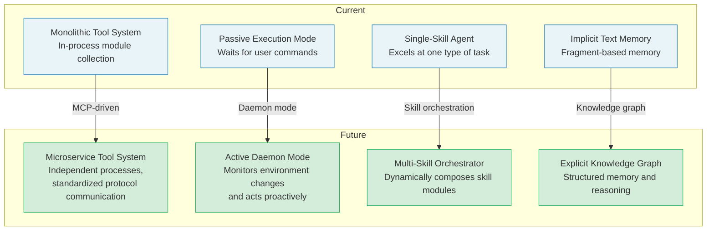

## 15.5 The Future of Agent Harnesses

### Multimodal Interaction

Current tool systems are text-centric, but multimodal interaction is changing this landscape. Claude Code already handles image input (`ImageSizeError`, `ImageResizeError`) and Computer Use tools. Future Agent Harnesses will need:

- **Native multimodal tools:** Tool inputs and outputs are no longer limited to text, but include images, audio, and video
- **Visual understanding tools:** Screenshot analysis, UI element location, chart interpretation
- **Voice interaction:** Voice input triggers tool calls, voice output announces tool results

Multimodal interaction has far-reaching architectural implications for Agent Harnesses. The current `ContentBlock` type system needs extending to support binary data, tool `inputSchema` needs to support file references rather than text-only parameters, and streaming needs to support chunked binary data. These changes aren't simple feature additions, but a refactoring of the core data model.

**New challenges in multimodal scenarios:**

| Challenge | Description | Possible Solutions |
|-----------|-------------|-------------------|
| Large payloads | Images/video can be tens of MB | Chunked transfer + streaming + compression |
| Cost control | Multimodal token prices far exceed text | Adaptive resolution + preprocessing filters |
| Cache efficiency | Image content is hard to prefix-match | Semantic-level caching instead of byte-level |
| Permission model | Screenshots may contain sensitive info | Content moderation + redaction |

### Long-Running Agents (Daemon Mode)

Claude Code's `taskSummaryModule` and background session mechanism foreshadow a new pattern: agents are no longer one-shot command-line tools, but long-running daemon processes. Daemon mode agents feature:

- **Persistent state:** Maintaining context and memory across sessions
- **Event-driven wakeup:** File changes, scheduled tasks, and external notifications trigger actions
- **Multi-agent collaboration:** A primary agent coordinates multiple sub-agents (Claude Code's `AgentTool` already implements this pattern)
- **Resource-aware scheduling:** Intelligently scheduling tasks based on token budget, API quotas, and system load

The implementation challenges of Daemon mode are far more complex than one-shot Agents. First, **state persistence**: conversation history, memory data, and permission configuration all need to persist beyond process lifetimes. Second, **error recovery**: Daemon processes need to recover from crashes, and the recovered state must be consistent. Third, **resource management**: long-running processes mean memory leaks accumulate over time, requiring careful memory management and periodic cleanup.

### Standardized Protocols (MCP Evolution)

Model Context Protocol (MCP) is becoming the de facto standard for tool invocation. Claude Code has deeply integrated MCP: tools can come from MCP servers, the `mcp_info` field tracks tool provenance, and `handleElicitation` supports interactive requests from MCP servers.

Future MCP evolution directions include:

- **Standardized tool discovery:** Agents dynamically discover available tools at runtime
- **Cross-agent communication protocol:** Agents from different vendors exchange messages and tool calls through MCP
- **Sandboxed execution:** MCP servers execute tools in isolated environments, providing stronger security guarantees
- **Streaming result delivery:** Tool execution results are streamed back through the MCP protocol, supporting long-running tools

**MCP's impact on Agent Harness design:** MCP standardization means future Agent Harness tool systems will no longer be closed. Tools can come from any MCP-compatible server, and Agents won't need to know all available tools in advance. This poses new challenges for permission systems -- how do you set permission rules for a tool discovered only at runtime? Possible solutions include: automatic permission inference based on tool capability descriptions, trust tiering at the MCP server level, and more granular sandbox isolation.

> **Cross-reference:** The detailed architecture of MCP integration is fully analyzed in Chapter 12, "MCP Integration and External Protocols."

### Forward-Looking Analysis of Future Architectures

Based on deep analysis of Claude Code's architecture and observations of industry trends, we can foresee the following evolution directions for Agent Harnesses:

**1. From Monolith to Microservices**

Currently, Claude Code's tool system is an in-process module collection. As MCP matures, future Agent Harnesses may adopt a microservice architecture -- each tool or tool group runs in an independent process, communicating through standardized protocols. This provides better isolation, scalability, and independent deployment capability.

**2. From Passive to Active**

The current Agent execution model is passive -- it waits for user commands before acting. Daemon mode will make Agents active -- they can monitor environment changes and proactively take action. This poses new requirements for prompt design: the Agent needs to determine "does this change require notifying the user" and "can I handle this issue autonomously."

**3. From Single-Skill to Multi-Skill Orchestration**

Currently, an Agent typically excels at one type of task. Future Agent Harnesses may be "skill orchestrators" that dynamically compose different skill modules based on task type. For example, a code change Agent automatically orchestrates code analysis, test generation, code review, and documentation update as four skill modules.

**4. From Implicit Memory to Explicit Knowledge Graphs**

The current memory system is implicit, text-fragment-based memory. Future memory may be structured knowledge graphs -- an Agent doesn't just remember "the user likes Jest," but can also remember "Project A uses Jest, Project B uses Vitest, because..." This structured memory supports more precise retrieval and reasoning.
