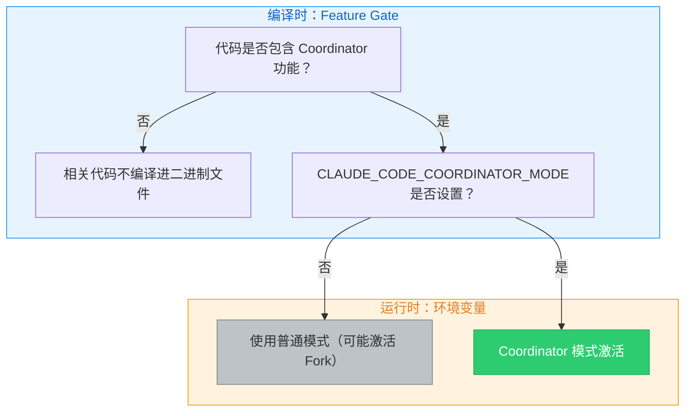
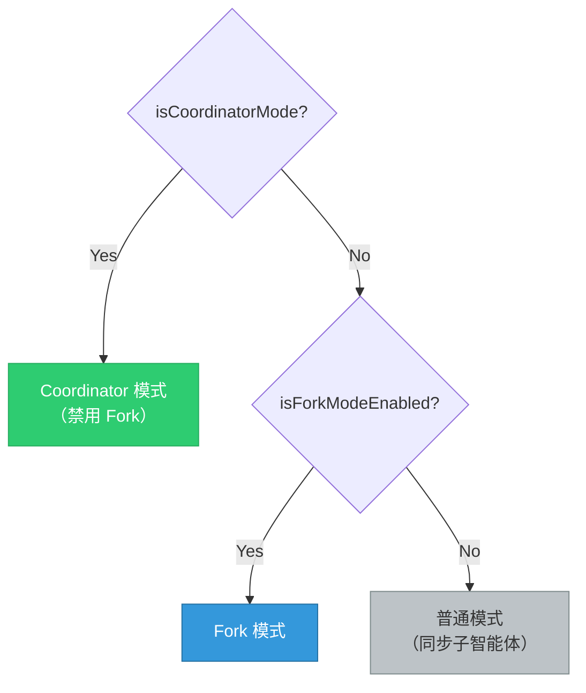
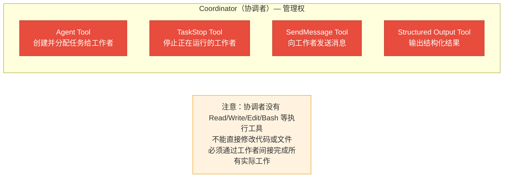
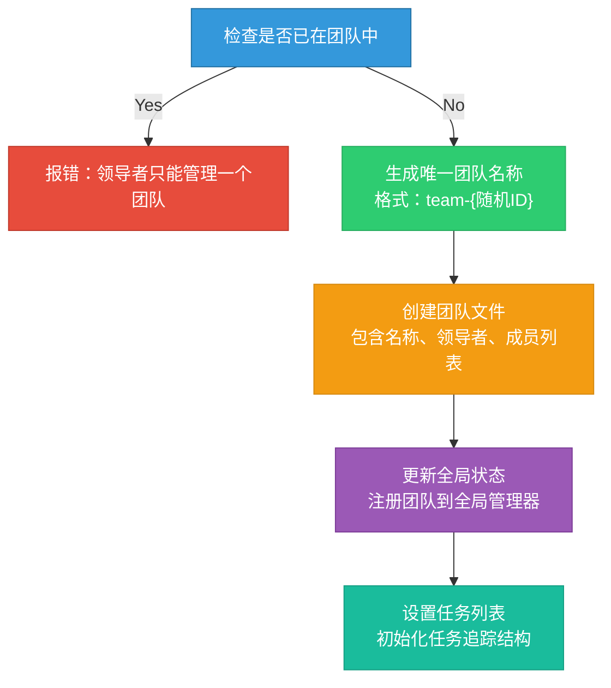

# 第10章：协调器模式 -- 多智能体企业级编排

> **学习目标：**
> - 理解 Coordinator 模式的"协调者-工作者"架构及其设计动机
> - 掌握多智能体协作的完整工作流：从需求分析到交付验证
> - 深入理解任务分配、故障恢复和 Scratchpad 协作空间的机制
> - 能够对比 Coordinator 模式与 Fork 模式的适用场景并做出正确选择

当单个智能体无法应对复杂工程任务时，Claude Code 提供了 Coordinator 模式——一种中心化的多智能体编排方案。与 Fork 模式的对等并行不同，Coordinator 模式采用"协调者-工作者"架构，由一个专职协调者管理多个并行工作者的生命周期和任务分配。

这就像一个建筑工地的运作方式：项目经理（Coordinator）不需要亲自砌砖、布线、安装管道，但他需要知道哪些工人（Worker）擅长什么、哪些任务可以并行、哪些有依赖关系、如何协调共享资源（Scratchpad）。当某个工人遇到问题时，项目经理需要决定是重新分配任务还是调整整体计划。

本章将深入源码设计，揭示这一企业级编排模式的设计哲学。

---

## 10.1 协调器架构

### coordinatorMode 核心模块

Coordinator 模式的核心代码位于协调器模块中。这个模块虽然只有约 370 行，却定义了整个多智能体协作的交互模型。代码的精炼并非偶然——协调器的职责是"编排"而非"执行"，它需要保持简洁以避免成为系统的性能瓶颈或故障点。

模块的入口是 `isCoordinatorMode()` 函数，它揭示了 Coordinator 模式的双重门控机制：

1. **Feature gate**：在编译时确定是否包含该功能的代码
2. **环境变量**：`CLAUDE_CODE_COORDINATOR_MODE` 在运行时控制是否激活

> **设计洞察：为什么使用双重门控而非单一开关？**
>
> Feature gate 是编译时优化——不需要 Coordinator 功能的部署（如轻量级 SDK 嵌入场景）可以完全排除相关代码，减小二进制体积和攻击面。环境变量是运行时控制——即使在包含功能的构建中，也需要显式启用。这种"编译时排除 + 运行时显式启用"的模式在企业软件中很常见，既满足了灵活性需求，又符合最小权限原则。

### 激活条件与互斥关系

Coordinator 模式在多处与其他模式产生交互。首先是与 Fork 模式的互斥：当两者同时满足条件时，Coordinator 模式优先。这是因为 Coordinator 已经拥有自己的任务委派模型，它不需要 Fork 模式的隐式并行能力。

> **交叉引用：** Fork 模式的缓存共享机制在第9章中详细讨论。两者的核心区别在于：Fork 是"无中心的并行"（所有子智能体平等，共享相同上下文），而 Coordinator 是"有中心的编排"（协调者控制全局，工作者只看到分配给自己的任务）。

Coordinator 模式还影响智能体注册表。当 Coordinator 模式激活时，内置智能体注册函数不再返回普通的内置智能体列表，而是通过懒加载引入 Coordinator 专用的工作者智能体定义。这种懒加载方式是有意为之的，目的是避免协调器模块与工具模块之间的循环依赖。

### 会话恢复的模式匹配

`matchSessionMode()` 函数处理会话恢复时的模式一致性：当当前模式与会话记录的模式不匹配时，系统会自动翻转环境变量以匹配会话模式。这确保了当用户恢复一个以 Coordinator 模式创建的会话时，系统会自动激活 Coordinator 模式，即使当前的启动配置没有设置环境变量。

这个设计解决了一个实际问题：用户可能在某次启动时设置了 Coordinator 环境变量并创建了一个会话，但下次恢复该会话时忘记设置。如果没有自动模式匹配，会话将在错误的模式下恢复，导致行为不一致甚至错误。

### Coordinator 的系统提示

Coordinator 的角色定义在系统提示生成函数中，这是一段精心设计的系统提示，定义了协调者的完整行为规范。核心要点包括：

**角色定义**：协调者不是执行者，而是编排者。它直接回答简单问题，将复杂任务委派给工作者。

**工具集**：协调者只有四个核心工具——生成工作者的 Agent 工具、停止工作者的 TaskStop 工具、向工作者发送消息的 SendMessage 工具、以及结构化输出工具。

**关键约束**：系统提示明确禁止协调者"使用一个工作者去检查另一个工作者"、"使用工作者来简单报告文件内容"、"预测或编造智能体结果"。这些约束确保协调者直接管理所有通信，避免信息传递链过长。

> **反模式警告：为什么禁止"工作者检查工作者"？**
>
> 允许工作者 A 去检查工作者 B 的结果会形成"信息链式传递"：工作者 B 完成任务 -> 工作者 A 读取 B 的结果 -> 工作者 A 向协调者报告。这种链式传递有两个严重问题：
>
> 1. **信息衰减**：每次传递都会丢失细节。就像传话游戏一样，经过多轮传递后的信息可能与原始结果差异巨大。
>
> 2. **调试困难**：当最终结果出错时，需要逐层追溯是哪个环节出了问题。
>
> 正确的模式是：协调者直接接收每个工作者的结果，自行理解后编写下一步指令。

---

## 10.2 工作器工具分配

### INTERNAL_WORKER_TOOLS

Coordinator 模式下，工作者（Worker）的工具分配通过两个集合控制。内部工作者工具集合定义了工作者**不应该看到**的工具——它们是协调者的专属工具，包括团队创建、团队删除、消息发送和结构化输出。

这形成了一个清晰的权力边界：

```mermaid
graph LR
    subgraph Coordinator["Coordinator（协调者）— 管理权"]
        C1["Agent Tool"]
        C2["TaskStop Tool"]
        C3["SendMessage Tool"]
        C4["Structured Output"]
    end
    subgraph Worker["Worker（工作者）— 执行权"]
        W1["Read / Write"]
        W2["Edit / Bash"]
        W3["Grep / Glob"]
        W4["WebSearch"]
        W5["Skill / MCP"]
    end

    Coordinator x-- 管理vs执行 --x Worker

    style C1 fill:#e74c3c,stroke:#c0392b,color:#fff
    style C2 fill:#e74c3c,stroke:#c0392b,color:#fff
    style C3 fill:#e74c3c,stroke:#c0392b,color:#fff
    style C4 fill:#e74c3c,stroke:#c0392b,color:#fff
    style W1 fill:#3498db,stroke:#2471a3,color:#fff
    style W2 fill:#3498db,stroke:#2471a3,color:#fff
    style W3 fill:#3498db,stroke:#2471a3,color:#fff
    style W4 fill:#3498db,stroke:#2471a3,color:#fff
    style W5 fill:#3498db,stroke:#2471a3,color:#fff
```

### Simple 模式和完整模式的工具集

`getCoordinatorUserContext()` 函数根据模式返回不同的工具描述：

- **Simple 模式**：工作者只有 Bash、Read、Edit 三个工具，适用于资源受限环境
- **完整模式**：工作者拥有白名单中除内部工具外的所有工具，包括 Read、Write、Edit、Bash、Grep、Glob、WebSearch、WebFetch、NotebookEdit、Skill、ToolSearch 等

| 模式 | 工具集 | 适用场景 |
|------|--------|---------|
| Simple | Bash, Read, Edit | CI/CD 环境、资源受限容器、快速验证 |
| Full | 全部白名单工具 | 本地开发、完整 IDE 集成、复杂重构 |

在完整模式下，工作者还能使用 MCP 工具和 Skill 工具。系统提示通过 user context 告知协调者可用的工作者工具列表。

> **实际场景：何时使用 Simple 模式？**
>
> Simple 模式适用于以下场景：
> - **CI/CD 管道中的自动化任务**：构建服务器上不需要 Web 搜索或文件发现
> - **快速修复任务**：只需要读取、编辑、运行测试的简单修复
> - **安全受限环境**：最小化工具集减少潜在的安全风险
> - **资源受限容器**：减少工具初始化的开销

### 工具池的独立组装

工作者的工具池独立于父级组装，这确保工作者始终获得完整的工具集，不受父级工具限制的影响。工作者默认使用 `acceptEdits` 权限模式（自动接受文件编辑），除非智能体定义指定了其他模式。

这个设计决策反映了一个重要原则：**工作者是执行者，不应该被权限问题阻碍**。如果工作者每次编辑文件都需要用户确认，多智能体协作的优势就被完全抵消了。当然，这要求协调者正确地分配任务——如果分配了错误的修改任务，工作者也会毫不犹豫地执行。

> **最佳实践：在 Coordinator 模式下预先确认任务范围**
>
> 由于工作者自动接受编辑，用户应该在 Coordinator 接受任务前先审查整体计划。建议在 CLAUDE.md 中加入提示，要求协调者在开始 Implementation 阶段前展示完整的任务分配计划。

---

## 10.3 团队管理

### TeamCreateTool / TeamDeleteTool

Coordinator 模式与 Agent Teams（多智能体蜂群）共享团队基础设施。团队创建工具负责创建团队，核心流程包括：检查是否已在团队中（领导者只能管理一个团队）、生成唯一团队名称、创建团队文件（包含团队名称、领导者 ID、会话 ID、成员列表等），然后写入团队文件、更新全局状态、设置任务列表。

团队删除工具负责清理：先检查是否还有活跃成员，只有在所有成员都已完成工作后才允许清理，然后清除团队目录、worktree 和团队上下文。

### 团队删除的安全保障

团队删除不是简单的"删除所有"，而是包含多重安全检查的过程：

1. **活跃成员检查**：如果还有工作者在运行，拒绝删除并返回仍在运行的成员列表
2. **资源清理顺序**：先清理团队目录（Scratchpad 等），再清理 worktree，最后清理团队上下文
3. **错误容忍**：单个资源的清理失败不会阻止其他资源的清理

> **反模式警告：不要在工作完成前删除团队**
>
> 如果协调者在工作者仍在运行时强制删除团队，工作者将失去与团队的关联，可能导致：
> - 工作者的任务通知无法送达协调者
> - Scratchpad 文件被删除，正在使用的工作者读到空数据
> - worktree 被清理，工作者的文件修改丢失
>
> 这就是为什么团队删除需要"所有成员完成"的前置条件。

### SendMessageTool 消息传递

消息发送工具是团队协作的核心通信通道。它支持四种消息类型：关闭请求、关闭响应和计划审批响应。

消息传递的寻址模式：

| 寻址模式 | 格式 | 使用场景 | 通信范围 |
|---------|------|---------|---------|
| 点对点 | `to: "agent-name"` | 向指定工作者发送具体指令 | 单个工作者 |
| 广播 | `to: "*"` | 向所有工作者发布公共信息 | 全体工作者 |
