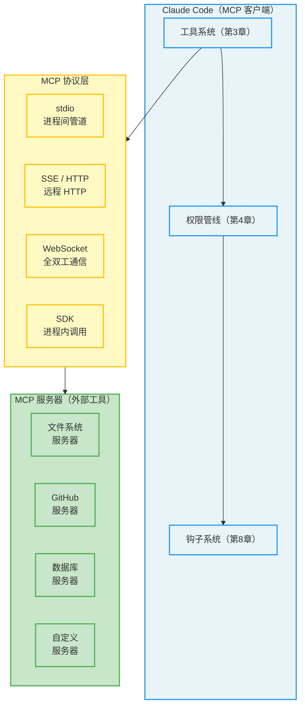
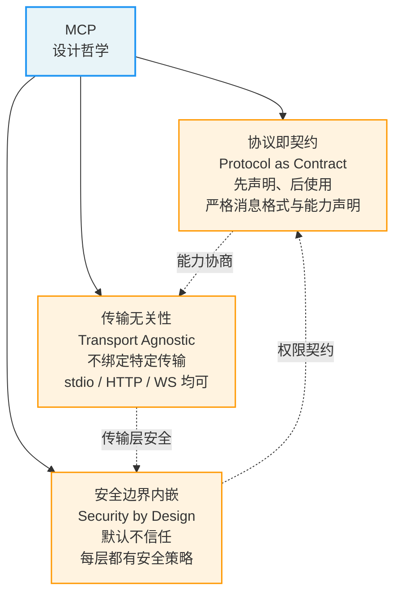
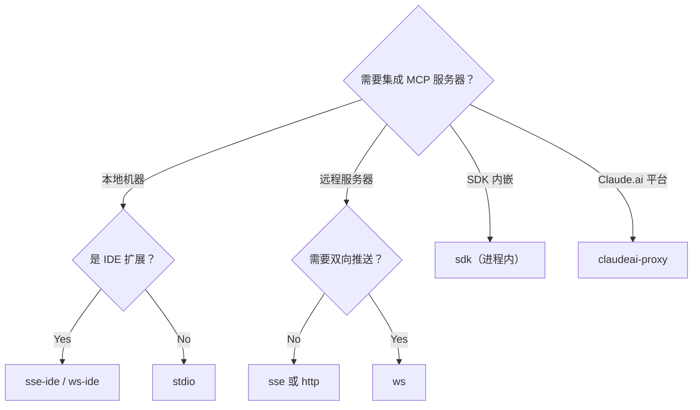
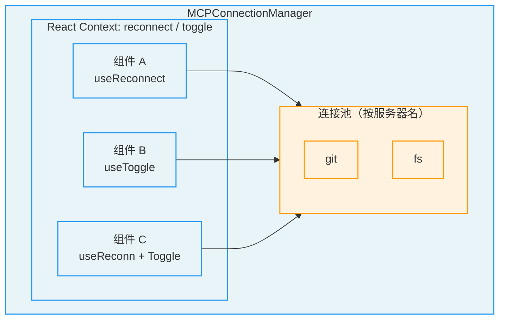
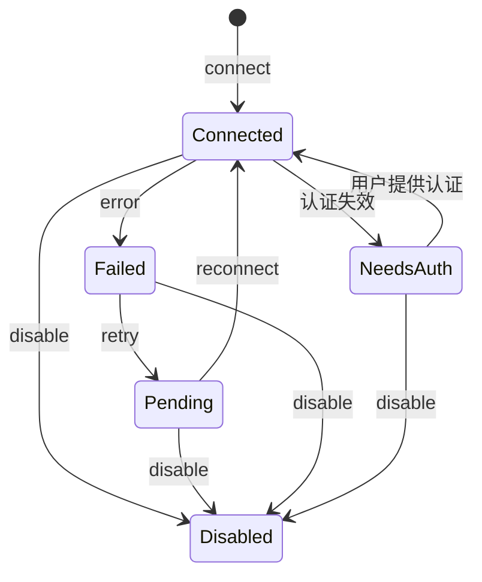
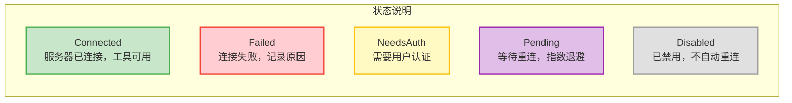
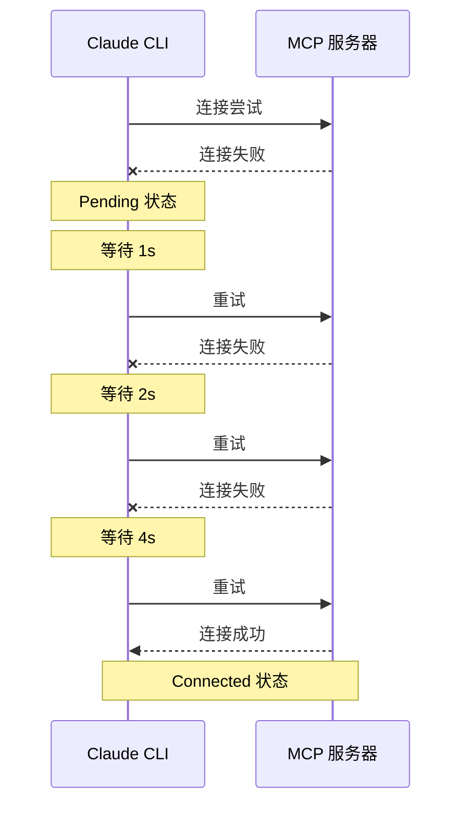

## 12.1 MCP 架构概览



### 12.1.1 为什么需要 MCP：问题与解决方案

在深入技术细节之前，让我们先理解 MCP 试图解决的根本问题。

**碎片化的集成困境**

在大语言模型（LLM）应用生态中，一个核心挑战长期存在：每个 AI 应用都需要连接外部数据源和工具，但每个应用的集成方式各不相同。想象一下，你是一个数据库供应商，想让你的数据能被各种 AI 工具访问。在没有统一标准的情况下，你需要为每个 AI 平台分别开发适配器——为 Claude 写一个，为 ChatGPT 写一个，为 Cursor 写一个……这就像在 USB 标准出现之前，每台手机都有自己独特的充电器接口。

MCP 的出现，正是为了成为 AI 世界的"USB-C 接口"。它定义了一个开放的标准协议，让任何 AI 应用都能以统一的方式连接任何数据源和工具。对于工具开发者而言，只需实现一次 MCP 服务器，就能被所有支持 MCP 的 AI 应用使用；对于 AI 应用开发者而言，只需实现一次 MCP 客户端，就能接入整个 MCP 生态。

**设计哲学的三个核心原则**

MCP 的设计遵循三个核心原则，这些原则贯穿了 Claude Code 的整个 MCP 实现：



1. **协议即契约（Protocol as Contract）**：MCP 定义了客户端与服务器之间的严格消息格式和能力声明机制。服务器声明自己提供哪些工具、资源和 Prompt 模板；客户端通过标准化的请求获取这些信息。这种"先声明、后使用"的模式，让双方可以在不相互了解内部实现的前提下协作。这与第3章中工具系统的"接口即架构"哲学一脉相承。

2. **传输无关性（Transport Agnostic）**：MCP 协议本身不绑定任何特定的网络传输方式。同一个 MCP 服务器可以通过 stdio、HTTP、WebSocket 等多种方式提供服务。这种设计使得 MCP 服务器可以在本地进程中运行（高性能、低延迟），也可以部署在远程服务器上（集中管理、多用户共享），而不需要修改业务逻辑。

3. **安全边界内嵌（Security by Design）**：MCP 将安全策略集成到协议的每一个层次——从连接建立时的能力协商，到工具调用时的权限检查，再到企业级的审批控制。这种"默认不信任"的设计确保即使接入了不可信的第三方工具，也不会危及整个系统的安全。

> **类比理解：** 把 MCP 想象成 USB 协议栈。物理层（USB-C 线缆）对应 MCP 的传输层（stdio/SSE/WS）；协议层（USB 描述符和端点）对应 MCP 的能力声明和工具发现；应用层（USB 设备驱动）对应具体的 MCP 工具实现。正如你不需要知道鼠标内部如何工作就能使用它，Claude Code 也不需要知道 MCP 服务器内部如何工作就能调用其工具。

> **交叉引用：** MCP 工具被映射为 Claude Code 内部 Tool 对象后，会完全融入第3章描述的工具系统。这意味着 MCP 工具同样经过权限管线（第4章）的四阶段检查，同样参与并发调度策略，同样可以通过钩子系统（第8章）进行拦截和增强。

### 12.1.2 连接配置与底层传输

本章讨论的 `McpServerConfigSchema` 定义了 8 类连接配置，包含底层传输、IDE 专用变体、SDK 集成和代理配置，不能将其等同于 MCP 标准定义了 8 种独立传输协议。选型时应区分传输方式与部署适配层。

| 配置类别 | 配置类型 | 传输方式 | 延迟特征 | 适用场景 |
|---------|---------|---------|---------|---------|
| `stdio` | `McpStdioServerConfig` | 标准输入/输出管道 | 本地进程间通信 | 本地开发工具、文件系统操作、CLI 工具封装 |
| `sse` | `McpSSEServerConfig` | Server-Sent Events | 网络延迟 | 远程 HTTP 服务、云端部署的 MCP 服务器 |
| `sse-ide` | `McpSSEIDEServerConfig` | SSE + IDE 元数据 | 本地网络 | IDE 扩展专用，包含 `ideName` 标识 |
| `http` | `McpHTTPServerConfig` | HTTP Streamable | 网络延迟 | MCP 规范新协议，支持流式响应 |
| `ws` | `McpWebSocketServerConfig` | WebSocket 全双工 | 网络延迟 | 需要实时双向通信的场景 |
| `ws-ide` | `McpWebSocketIDEServerConfig` | WebSocket + IDE 元数据 | 本地网络 | IDE 扩展专用，需要低延迟双向通信 |
| `sdk` | `McpSdkServerConfig` | 进程内函数调用 | 无外部传输跳转 | SDK 内部调用，不启动实际进程或网络连接 |
| `claudeai-proxy` | `McpClaudeAIProxyServerConfig` | Claude.ai 代理 | 网络延迟 | Claude.ai 平台代理服务器 |

**传输协议选型决策树**

当你需要为 MCP 服务器选择传输协议时，可以参考以下决策路径：



**协议详解与适用场景分析**

**stdio 协议**是最常见也是最推荐的类型。它通过 `command` 和 `args` 启动本地 MCP 服务器子进程，利用操作系统的标准输入/输出管道进行通信。这种方式的优势在于：零网络开销（数据在进程间通过内存缓冲区传递）、无需监听网络端口，以及可显式管理的生命周期。子进程并不是安全沙箱：继承的权限可能很宽，父进程退出也不保证子进程自动终止，仍需管理关闭、信号和回收。绝大多数本地开发场景——文件系统访问、Git 操作、数据库客户端——都应优先选择 stdio。

```json
{
  "mcpServers": {
    "filesystem": {
      "type": "stdio",
      "command": "npx",
      "args": ["-y", "@modelcontextprotocol/server-filesystem", "/home/user/projects"],
      "env": { "NODE_OPTIONS": "--max-old-space-size=4096" }
    }
  }
}
```

**SSE 协议**适用于远程部署的 MCP 服务器。Server-Sent Events 是一种基于 HTTP 的单向推送技术：客户端通过 HTTP POST 发送请求，服务器通过 SSE 流式推送响应和通知。这种方式的优势在于部署灵活——MCP 服务器可以运行在云端的任何位置，Claude Code 只需要知道 URL 就能连接。但也带来了额外的网络延迟和认证复杂性。

**sse-ide 和 ws-ide 协议**是 IDE 集成的专用类型，在标准 SSE/WebSocket 协议基础上增加了 IDE 标识信息（如 `ideName` 字段，标识是 VS Code 还是 JetBrains）。这种"协议变体"的设计模式避免了在通用协议中塞入平台特定的逻辑，保持了核心协议的简洁性。

**HTTP Streamable 协议**是 MCP 规范中的新协议，相比 SSE 提供了更灵活的流式响应能力。它支持在单个 HTTP 连接上逐步返回响应内容，适合需要返回大量数据或长时间运行的工具。

**WebSocket 协议**提供了全双工通信能力，适合需要实时双向数据交换的场景。与 SSE 的单向推送不同，WebSocket 允许服务器主动向客户端发送消息，也允许客户端在任何时刻发送请求，无需建立新的 HTTP 连接。

**SDK 协议**是最特殊的类型——它不启动任何进程，也不打开任何网络连接。SDK 类型的 MCP 服务器是通过函数调用直接嵌入 Claude Code 进程的，延迟接近零。它主要用于 SDK 集成场景，允许嵌入 Claude Code 的第三方应用直接注册 MCP 工具，而不需要额外的进程间通信。正因如此，SDK 服务器被豁免于企业安全策略检查——它们运行在与 Claude Code 相同的进程中，安全边界由宿主应用保证。

> **最佳实践：** 优先选择 stdio 协议。只有当 MCP 服务器必须运行在远程机器上（如访问公司内部数据库、使用集中式计算资源）时，才考虑 SSE/HTTP/WebSocket。SDK 协议仅用于程序化集成场景。

> **反模式警告：** 不要在 stdio 服务器中执行需要长时间运行的初始化操作。Claude Code 启动时会并行连接所有配置的 MCP 服务器，如果某个服务器的初始化耗时过长（如建立数据库连接池、加载大型模型），会拖慢整个启动过程。应考虑延迟初始化策略——在首次工具调用时才建立连接。

### 12.1.3 连接管理器 MCPConnectionManager

MCP 连接管理器是一个 React Context Provider，为整个组件树提供 MCP 连接管理能力。它的设计体现了"集中管控、分散使用"的架构模式——连接的建立、断开和重试由管理器统一处理，而工具的使用则分散在各个组件中。

**为什么选择 Context Provider 模式？**

Claude Code 的 UI 层基于 React 构建。在 React 组件树中，如果每个组件都独立管理 MCP 连接，会导致两个严重问题：一是连接资源浪费（同一个 MCP 服务器可能被多个组件重复连接），二是状态不一致（一个组件已经发现服务器断开，另一个组件还在使用缓存的工具列表）。Context Provider 模式通过在组件树的顶层注入共享的连接管理服务，确保所有子组件看到一致的 MCP 状态。

其核心接口提供两个操作：

- **重新连接（reconnect）**：触发指定 MCP 服务器的重连流程，返回更新后的工具列表、命令列表和资源列表。这在服务器配置变更或网络中断后恢复时使用。
- **启用/禁用（toggle）**：控制指定 MCP 服务器的启用状态。禁用服务器会断开连接并移除其所有工具；启用服务器会重新建立连接并注册工具。

子组件通过两个 Hook 访问这些操作：一个获取重连函数（`useMcpReconnect`），一个获取切换函数（`useMcpToggle`）。两者都要求在 `MCPConnectionManager` 组件树内部使用，否则会抛出错误。这是 React Context 的标准安全模式——确保 Context 只在合法的组件层级中消费。



### 12.1.4 服务器连接状态与生命周期

MCP 服务器连接有五种状态，构成了一个精心设计的有限状态机：已连接（Connected）、连接失败（Failed）、需要认证（NeedsAuth）、等待连接（Pending，支持重试）和已禁用（Disabled）。





**状态转换的深层含义**

每个状态不仅代表连接的技术状态，还对应不同的用户交互策略：

- **Connected**：服务器已连接，工具可用。`ConnectedMCPServer` 包含完整的 MCP Client 实例、服务器能力声明（capabilities）、配置信息和清理函数（用于优雅断开连接）。
- **Failed**：连接尝试失败。系统会记录失败原因（网络错误、认证失败、服务器不响应等），并决定是否进入重试流程。不是所有失败都应该重试——认证失败需要用户干预，网络超时则可以自动重试。
- **NeedsAuth**：服务器需要认证但未提供有效凭证。这是安全设计的关键环节——系统不会盲目重试需要认证的连接（那会锁定账户），而是将控制权交给用户。
- **Pending**：等待重连。`PendingMCPServer` 记录了重连尝试次数和最大重连次数，支持指数退避重试（exponential backoff）。这种策略避免了在服务器持续不可用时产生连接风暴。
- **Disabled**：用户主动禁用或被策略强制禁用的服务器。不会自动重连，只有用户显式启用才会尝试连接。

**指数退避重试的设计考量**

Pending 状态的重试使用指数退避算法：第 1 次重试等待约 1 秒，第 2 次 2 秒，第 3 次 4 秒，以此类推，直到达到最大重试次数。这种设计在分布式系统中是标准的容错模式。它的核心逻辑是：如果服务器暂时不可用，快速连续重试只会加重负担；但如果服务器在几秒后恢复，你不希望等太久。



> **与第3章的关联：** MCP 工具只有在服务器处于 Connected 状态时才会出现在工具列表中。当服务器从 Connected 转为其他状态时，其所有工具会立即从可用工具列表中移除。这与第3章描述的工具注册机制紧密集成——工具的可用性是动态的，而非静态的。
