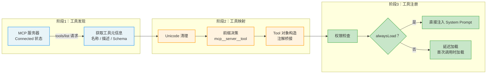
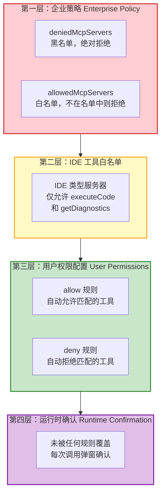

## 12.2 MCP 工具集成

MCP 工具集成是将外部服务器的能力无缝融入 Claude Code 内部工具系统的过程。这一过程涉及三个关键阶段：工具发现（Discovery）、工具映射（Mapping）和工具注册（Registration）。理解这个链路，就理解了 MCP 如何将"外部工具"变成"内部能力"。



### 12.2.1 工具发现与映射

**发现阶段**

MCP 服务器连接成功后（进入 Connected 状态），Claude Code 通过 `tools/list` 请求获取服务器提供的工具列表。这个请求是 MCP 协议标准的一部分，服务器必须返回其提供的所有工具的元信息——包括工具名称、描述、输入参数 Schema 和行为注解（hints）。

> **类比理解：** 工具发现就像你走进一家餐厅坐下后，服务员递给你菜单。菜单上列出了所有可用的菜品（工具名称）、食材说明（输入参数）、口味标签（行为注解）。你不需要去厨房看厨师怎么做菜，菜单就足够你做出选择了。

**映射阶段**

工具映射的核心逻辑包括几个关键步骤：

1. **Unicode 清理**：对返回的工具列表进行 Unicode 清理，移除控制字符和非法字符。这一步看似简单，却是防御性编程的典型体现——你不应该信任任何外部输入，包括工具名称中的字符。

2. **前缀决策**：根据配置决定是否为工具名添加服务器名前缀。在大多数模式下，前缀是必须的（确保跨服务器的工具名不冲突）；但在 SDK 模式下，当环境变量 `CLAUDE_AGENT_SDK_MCP_NO_PREFIX` 被设置时，工具使用原始名称注册，允许 MCP 工具按名称覆盖内置工具。

3. **工具对象构造**：将每个 MCP 工具映射为 Claude Code 内部的 `Tool` 对象。这个映射不是简单的字段复制，而是一次完整的"协议适配"——MCP 的语义被转换为 Claude Code 工具系统的语义。

每个 MCP 工具被映射为 Claude Code 内部的 `Tool` 对象后，包含以下关键属性：

| 属性 | 来源 | 作用 |
|------|------|------|
| `isMcp: true` | 固定标记 | 标识这是一个 MCP 工具，用于区分内置工具 |
| `mcpInfo` | 服务器配置 | 包含 `serverName` 和 `toolName` 的元信息，用于权限检查和 UI 显示 |
| `isConcurrencySafe()` | MCP 注解 `readOnlyHint` | 映射为并发安全性判断，影响调度策略 |
| `isDestructive()` | MCP 注解 `destructiveHint` | 映射为破坏性判断，影响权限提示级别 |
| `isOpenWorld()` | MCP 注解 `openWorldHint` | 映射为开放世界判断，影响权限范围检查 |
| `alwaysLoad` | `_meta.anthropic/alwaysLoad` | 当为 true 时跳过延迟加载，直接注入 system prompt |

**行为注解的桥接设计**

上表中的三个"Hint"映射值得特别关注。MCP 协议定义了工具行为注解（如 `readOnlyHint`、`destructiveHint`），而 Claude Code 的工具系统有自己的语义模型（如 `isConcurrencySafe()`、`isDestructive()`）。这两套语义系统之间的映射不是 1:1 的——MCP 的注解是"提示性"的（hint），而 Claude Code 的方法是"决定性"的（decision）。

这种桥接设计的精妙之处在于：它允许 MCP 服务器用标准化的语言描述自己的工具行为，而 Claude Code 可以根据自己的安全策略做出最终决策。如果 MCP 服务器的注解不准确（比如一个标为 `readOnlyHint` 的工具实际上会修改数据），Claude Code 的权限管线仍然会在运行时进行二次检查。

> **交叉引用：** 这里的并发安全性（`isConcurrencySafe()`）直接影响第3章中描述的并发分区策略。被标记为并发安全的 MCP 工具可以与其他安全工具并行执行，而不安全的工具必须串行等待。

**延迟加载机制**

`alwaysLoad` 属性控制工具的加载时机。在默认的延迟加载模式下，MCP 工具的描述不会立即出现在 system prompt 中（那会消耗大量 token），而是在模型首次需要使用该工具时才加载。但对于标记了 `alwaysLoad: true` 的工具（通常是高频使用的基础工具），系统会在启动时直接注入 system prompt，确保模型始终知道这些工具的存在。

### 12.2.2 工具名称前缀：mcp__server__tool

MCP 工具采用统一的三段式命名规则 `mcp__\{server\}__\{tool\}`。这个看似简单的命名规则背后，包含了几层重要的设计考量。

**为什么需要前缀？**

想象一个场景：你同时连接了两个 MCP 服务器——一个是 GitHub 工具，一个是 GitLab 工具，它们都提供了一个名为 `create_issue` 的工具。如果没有命名空间隔离，两个工具就会产生名称冲突，模型无法区分它们。三段式命名通过将服务器名作为命名空间，确保即使不同服务器提供同名工具，全局名称仍然是唯一的。

**命名规则的实现细节**

命名工具函数将服务器名和工具名拼接为全限定名，解析函数则执行反向操作，按双下划线拆分提取服务器名和工具名。

关键设计细节：

**双下划线分隔**：工具名格式为 `mcp__\{server\}__\{tool\}`。如果服务器名包含双下划线，解析可能不准确——但这在实践中极少发生。选择双下划线而非单下划线的理由也很直观：单下划线在变量名中太常见了（如 `read_file`），使用双下划线作为分隔符可以显著降低歧义。

**SDK 前缀跳过**：当环境变量 `CLAUDE_AGENT_SDK_MCP_NO_PREFIX` 设置且服务器类型为 `sdk` 时，工具使用原始名称注册。这个设计支持一种高级用法：允许 MCP 工具按名称覆盖内置工具。例如，一个 SDK 注册的 `Read` 工具可以覆盖 Claude Code 内置的 Read 工具，实现自定义行为。这是一种"后门"机制，通常用于 SDK 嵌入场景（如将 Claude Code 集成到另一个应用中，需要自定义文件读取行为）。

**权限检查使用全限定名**：`getToolNameForPermissionCheck` 函数确保权限规则匹配使用 `mcp__server__tool` 格式。这解决了一个微妙的安全问题：如果一个 MCP 服务器提供了一个名为 `Write` 的工具（不带前缀），它的权限检查不应该匹配到内置 `Write` 工具的规则——否则用户允许内置 Write 工具的操作可能被 MCP 的 Write 工具利用。

**名称解析的边界情况**

让我们分析几种边界情况：

```
mcp__github__create_issue     → server="github", tool="create_issue"  ✓ 清晰
mcp__my_server__read_file     → server="my_server", tool="read_file"  ✓ 清晰
mcp__my__special__tool        → server="my", tool="special__tool"     ⚠ 歧义
mcp__server__name__with__dupes → server="server", tool="name__with__dupes" ⚠ 歧义
```

解析函数按第一次出现的双下划线拆分——`mcp` 之后的部分中，第一个双下划线之前是服务器名，之后是工具名。这意味着如果服务器名本身包含双下划线，解析结果可能不符合预期。但正如前面提到的，这种情况在实践中极少发生。

> **最佳实践：** 为 MCP 服务器命名时，避免使用双下划线。推荐使用单下划线（如 `my_server`）或连字符（如 `my-server`）作为服务器名的分隔符。

> **与权限管线的关联：** 三段式命名确保 MCP 工具在权限检查时具有独立的命名空间。当用户在 `.claude/settings.local.json` 中配置 `allow: ["mcp__github__*"]` 时，这个规则只会匹配 GitHub 服务器提供的工具，不会影响其他服务器或内置工具。这是第4章权限管线中"按工具粒度授权"策略在 MCP 上下文中的具体体现。

### 12.2.3 MCP 工具的权限模型

MCP 工具的权限检查采用了"默认拒绝，显式允许"的安全原则。默认情况下，每次 MCP 工具调用都会返回 `passthrough` 行为，意味着每次调用都需要用户确认。这种"默认弹确认"的设计虽然增加了交互成本，但在安全上是正确的——你无法预知一个第三方 MCP 工具会做什么，应该让用户知情并同意。

但频繁的确认弹窗会严重影响使用体验。为此，系统提供了自动允许的路径，用户可以在 `.claude/settings.local.json` 中添加规则来预授权特定的 MCP 工具：

```json
{
  "permissions": {
    "allow": [
      "mcp__my_server__read_file",
      "mcp__github__*"
    ]
  }
}
```

**权限规则的匹配逻辑**

权限规则支持精确匹配和通配符匹配两种模式：

- `mcp__github__create_issue`：精确匹配，只允许名为 `create_issue` 的 GitHub 工具
- `mcp__github__*`：通配符匹配，允许 GitHub 服务器提供的所有工具
- `mcp__*`：允许所有 MCP 工具（谨慎使用）

**权限层级全景图**

将 MCP 工具的权限模型放入 Claude Code 整体权限体系中来看：



这个四层权限模型的设计遵循了"深度防御（Defense in Depth）"原则：即使某一层的检查被绕过或配置错误，其他层仍然提供保护。例如，即使用户在权限配置中允许了所有 MCP 工具（`mcp__*`），企业管理员仍然可以通过黑名单阻止危险的服务器。

> **与第4章的交叉引用：** 这个权限层级与第4章描述的权限管线（Permission Pipeline）紧密集成。MCP 工具的权限检查发生在权限管线的第二阶段（权限评估阶段），与内置工具共享相同的检查框架，但具有独立的默认行为（passthrough vs. 内置工具的可能自动允许）。

> **反模式警告：** 不要在全局配置中使用 `"mcp__*": "allow"` 来允许所有 MCP 工具。这种"一键全开"的做法虽然方便，但会绕过安全检查——任何新连接的 MCP 服务器提供的工具都会被自动允许执行，包括你可能不了解的工具。应该按服务器或按工具粒度授权。
