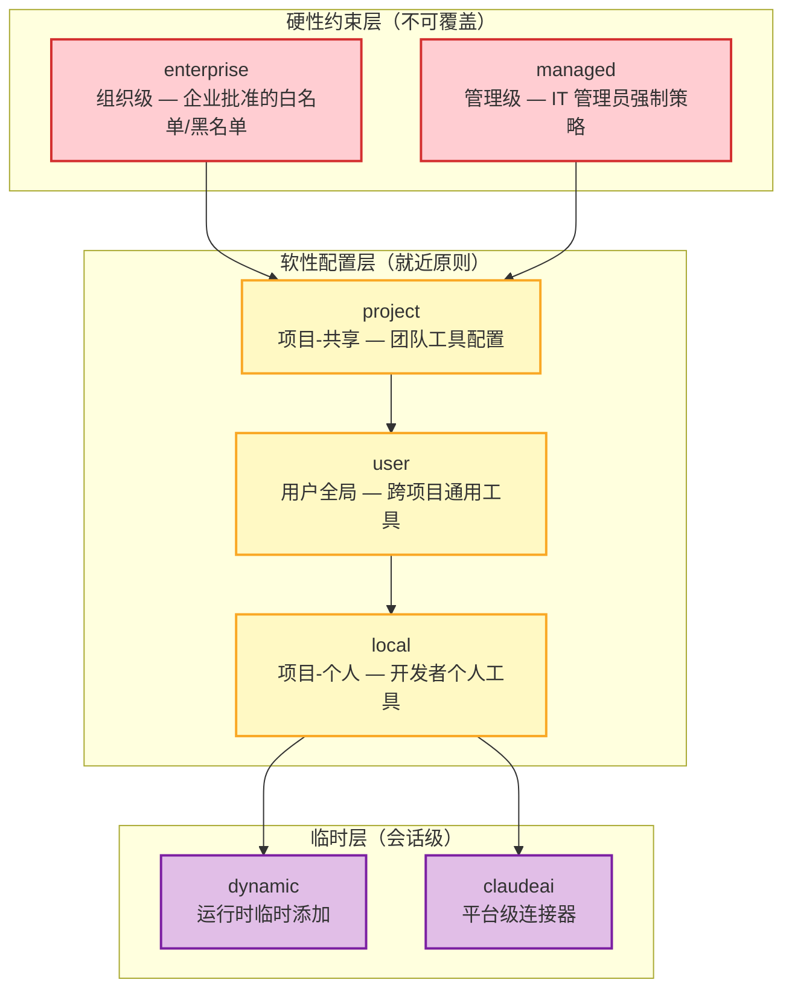
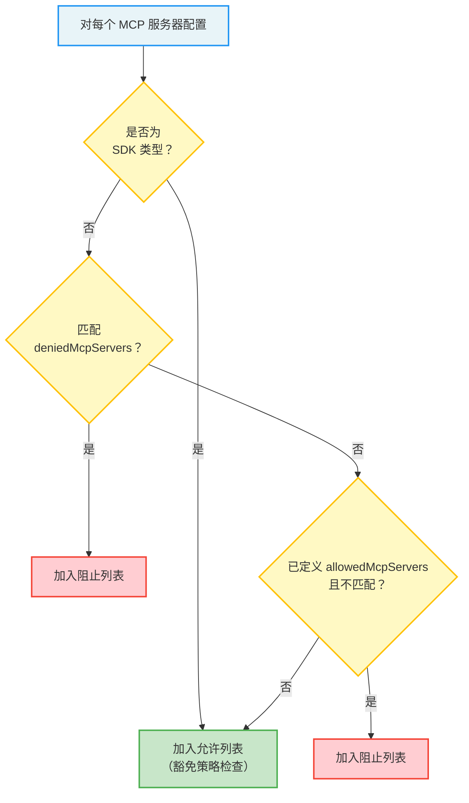
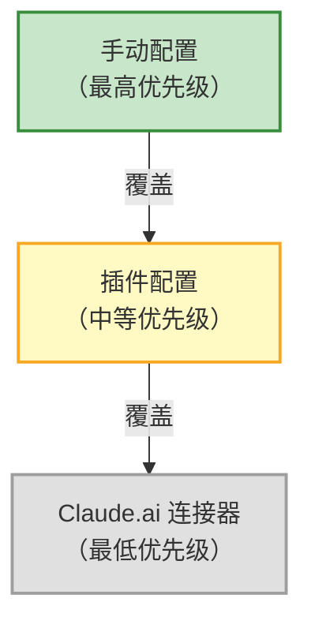

## 12.3 MCP 权限与安全

安全性是 MCP 集成中最关键的话题。与内置工具不同，MCP 工具来自外部第三方，其行为不可预测、不可控制。因此，Claude Code 为 MCP 构建了多层防御体系，从配置作用域到服务器审批，从工具白名单到插件去重，每一层都针对特定的安全威胁。

### 12.3.1 配置范围与作用域

MCP 服务器的配置有七个作用域，每个作用域对应不同的管理级别和信任边界：

| 作用域 | 配置来源 | 管理级别 | 典型用途 |
|--------|---------|---------|---------|
| `local` | `.claude/settings.local.json` | 项目-个人 | 开发者个人使用的工具，不提交到版本控制 |
| `project` | `.claude/settings.json` | 项目-共享 | 团队共享的工具配置，提交到版本控制 |
| `user` | `~/.claude/settings.json` | 用户全局 | 跨项目使用的通用工具（如 GitHub MCP） |
| `dynamic` | 运行时动态添加 | 会话级 | 临时添加的工具，会话结束后消失 |
| `enterprise` | 企业管理配置 | 组织级 | 企业批准的工具白名单和黑名单 |
| `claudeai` | Claude.ai 平台连接器 | 平台级 | Claude.ai 网页端的工具连接 |
| `managed` | 托管策略配置 | 管理级 | IT 管理员强制执行的策略 |



**作用域优先级与覆盖规则**

这七个作用域的优先级遵循"就近原则"：更具体的范围（如 local）优先于更宽泛的范围（如 user），而管理级别的范围（如 enterprise、managed）则作为硬性约束存在，无法被低级别的作用域覆盖。

这种设计在安全上意味着：

1. **企业管理员的决定是最终的**：如果 enterprise 配置禁止了某个 MCP 服务器，即使用户在 local 配置中添加了该服务器，也不会生效。
2. **项目配置优于个人配置**：如果项目级别的配置启用了特定工具，个人配置不能禁用它（但可以添加额外的工具）。
3. **运行时配置是临时的**：dynamic 作用域添加的服务器只在当前会话中有效，不会持久化。

> **类比理解：** 七个作用域就像一栋大楼的七层门禁。大楼入口是企业策略（只有员工能进入），楼层入口是托管策略（只能去自己部门所在的楼层），房间门是项目配置（只有项目成员能进入），个人储物柜是 local 配置（只有自己能打开）。每一层门禁都独立运作，但组合起来形成了完整的访问控制。

> **最佳实践：** 通用工具（如 GitHub、数据库客户端）配置在 user 作用域；项目特有工具（如项目特定的 API 测试工具）配置在 project 作用域；个人偏好或实验性工具配置在 local 作用域。

### 12.3.2 服务器审批与白名单

企业管理员可以通过 `allowedMcpServers` 和 `deniedMcpServers` 策略控制哪些 MCP 服务器可以使用。这是三层安全策略的核心，也是企业部署 Claude Code 时最重要的安全控制点。

**为什么需要审批机制？**

在企业环境中，MCP 服务器可能带来严重的安全风险：一个恶意的 MCP 服务器可以在工具调用时执行任意代码、窃取敏感数据、甚至通过工具的输入参数注入恶意指令。审批机制让企业管理员能够在服务器连接之前就进行拦截，将安全防线前移到"预防"阶段，而非"检测"阶段。

**黑名单（Denylist）：绝对优先级**

黑名单具有绝对优先级——被列入黑名单的服务器，无论出现在哪个作用域中，都不会被连接。支持三种匹配方式：

1. **按服务器名称匹配**：最简单直接，通过服务器在配置中注册的名称进行匹配。
2. **按命令数组匹配**：针对 stdio 服务器，通过完整的命令行参数（`command` + `args`）进行匹配。这可以防止用户通过换一个名称来绕过黑名单。
3. **按 URL 模式匹配**：针对远程服务器（SSE/HTTP/WS），支持通配符的 URL 匹配。

**白名单（Allowlist）：门控机制**

如果定义了白名单，则只有白名单中的服务器被允许。白名单同样支持名称、命令和 URL 三种匹配方式。白名单是一种更严格的安全策略——默认拒绝一切，只允许明确批准的。适合对安全性要求极高的环境（如金融机构、政府机构）。

**URL 通配符匹配详解**

URL 模式匹配支持 `*` 通配符，可以灵活地匹配一组相关的服务器：

```
精确匹配：
  "https://mcp.company.com/api"     只匹配这一个 URL

通配符匹配：
  "https://mcp.company.com/*"       匹配 mcp.company.com 下的所有路径
  "https://*.company.com/*"         匹配 company.com 的所有子域名和路径
  "https://mcp.company.com:*\/*"    匹配任意端口

实际匹配示例：
  模式："https://example.com/*"
  ✓ 匹配 "https://example.com/api/v1"
  ✓ 匹配 "https://example.com/tools/github"
  ✗ 不匹配 "https://api.example.com/tools"（子域名不同）

  模式："https://*.example.com/*"
  ✓ 匹配 "https://api.example.com/path"
  ✓ 匹配 "https://mcp.example.com/tools"
  ✗ 不匹配 "https://example.com/path"（没有子域名）
```

**策略过滤函数的设计**

`filterMcpServersByPolicy` 是所有配置入口的统一过滤器。它的执行逻辑可以概括为：



SDK 类型的服务器被豁免于策略检查是一个重要的设计决策。原因在于：SDK 服务器是 SDK 管理的传输占位符，CLI 不会为它们启动进程或打开网络连接。它们运行在与 Claude Code 相同的进程中，安全边界由宿主应用（即嵌入 Claude Code SDK 的应用）保证，因此不需要 CLI 层面的策略控制。

> **安全思考：** 审批机制体现了"安全左移（Shift Left Security）"的理念。与其在工具调用时检查权限（那时可能已经太晚了），不如在连接建立前就拦截不可信的服务器。这种预防性安全措施的成本很低（只是配置检查），但收益很高（完全杜绝了不可信服务器的接入）。

### 12.3.3 插件去重

当插件提供的 MCP 服务器与手动配置的服务器指向相同的底层进程/URL 时，系统会自动去重。去重看似是一个小功能，但在实际使用中极其重要——没有去重，同一个 MCP 服务器可能被连接多次，消耗双倍资源，暴露重复的工具列表（导致模型困惑），甚至引发并发冲突。

**去重的签名机制**

去重函数使用签名比较来识别"相同"的服务器。签名规则如下：

| 服务器类型 | 签名计算方式 | 示例 |
|-----------|-------------|------|
| `stdio` | `stdio:${JSON.stringify([command, ...args])}` | `stdio:["npx","-y","@mcp/server-filesystem","/tmp"]` |
| 远程服务器 | `url:${原始URL\}` | `url:https://mcp.example.com/api` |
| `sdk` | `null`（不做去重） | 不适用 |

**签名的深层含义**

stdio 服务器使用完整的命令数组作为签名，这意味着即使服务器名称不同、环境变量不同，只要最终启动的是同一个命令，就会被识别为重复。这是一个正确的安全决策——去重应该基于"实际效果"而非"表面配置"。如果两个配置最终运行的是同一个程序，那么它们就是重复的。

远程服务器以原始 URL 作为签名。特别值得注意的是，如果 URL 是 CCR（Claude Code Relay）代理路径，系统会先解包获取真实 URL 再计算签名。这避免了同一个远程服务器通过不同的代理路径逃过去重。

SDK 服务器签名为 null，不做去重。这是因为 SDK 服务器可能通过不同的代码路径注册，虽然类型相同但功能不同，去重会导致功能丢失。

**去重优先级：谁胜出？**

当检测到重复时，系统按以下优先级决定保留哪个配置：



这个优先级的设计逻辑是：用户的显式配置（手动配置）反映了用户的明确意图，应该始终被尊重。如果用户手动配置了一个 MCP 服务器并自定义了参数，那么插件自动注入的同名服务器不应该覆盖用户的选择。

> **实际案例：** 一个常见的场景是——团队通过 VS Code 扩展自动注入了 GitHub MCP 服务器配置（插件配置），但某个开发者已经在 `.claude/settings.local.json` 中手动配置了同一个服务器，但使用了不同的环境变量（如自定义的 GitHub Token）。去重机制确保手动配置胜出，开发者的自定义 Token 被使用，而不是扩展注入的默认配置。

### 12.3.4 IDE 工具白名单

对于 IDE 集成的 MCP 服务器，系统实施了一个额外的安全层——工具白名单限制。只有以下两个工具被允许从 IDE MCP 服务器加载：

| 工具名 | 功能 | 安全考虑 |
|--------|------|---------|
| `mcp__ide__executeCode` | 在 IDE 环境中执行代码 | 限制在 IDE 的沙箱上下文中运行 |
| `mcp__ide__getDiagnostics` | 获取 IDE 的诊断信息（错误、警告等） | 只读操作，不修改任何状态 |

**为什么需要这个限制？**

这个看似严格的设计背后是一个深思熟虑的安全决策。IDE 扩展是由第三方开发者编写的，它们可以通过 MCP 协议暴露任意工具。如果没有白名单限制，一个恶意的 VS Code 扩展可以暴露一个 `deleteFiles` 或 `executeCommand` 工具，当用户在 Claude Code 中使用该扩展时，这些危险工具就会被注册。

白名单的设计哲学是"最小权限原则"——IDE 集成只需要两个核心能力：执行代码（让 Claude Code 能在 IDE 上下文中运行代码片段）和获取诊断信息（让 Claude Code 能看到编译错误和代码问题）。任何超出这个范围的功能都不应该通过 IDE MCP 通道暴露。

**白名单的执行时机**

白名单检查发生在工具发现阶段——当 Claude Code 从 IDE 类型的 MCP 服务器获取工具列表后，会过滤掉不在白名单中的工具。这意味着不在白名单中的工具根本不会出现在 Claude Code 的工具注册表中，模型甚至不知道它们的存在。这比"注册但禁止调用"更安全，因为它消除了通过配置错误或权限绕过而意外调用这些工具的可能性。

> **与 Bridge 系统的关系：** IDE 工具白名单是 Bridge 系统（12.4节）安全模型的组成部分。IDE 通过 Bridge 通道与 Claude Code 通信，工具白名单确保即使 Bridge 通道被恶意扩展利用，暴露的攻击面也被严格限制在两个安全的工具范围内。
