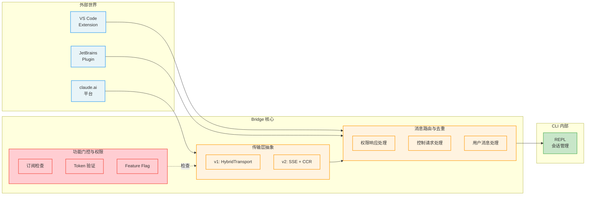
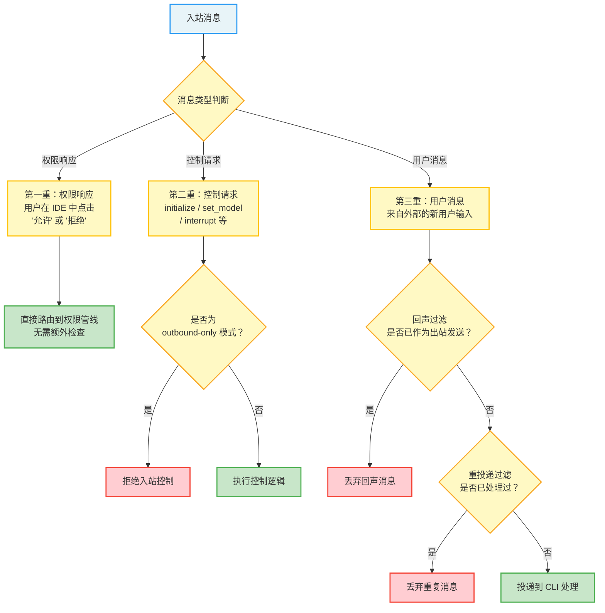
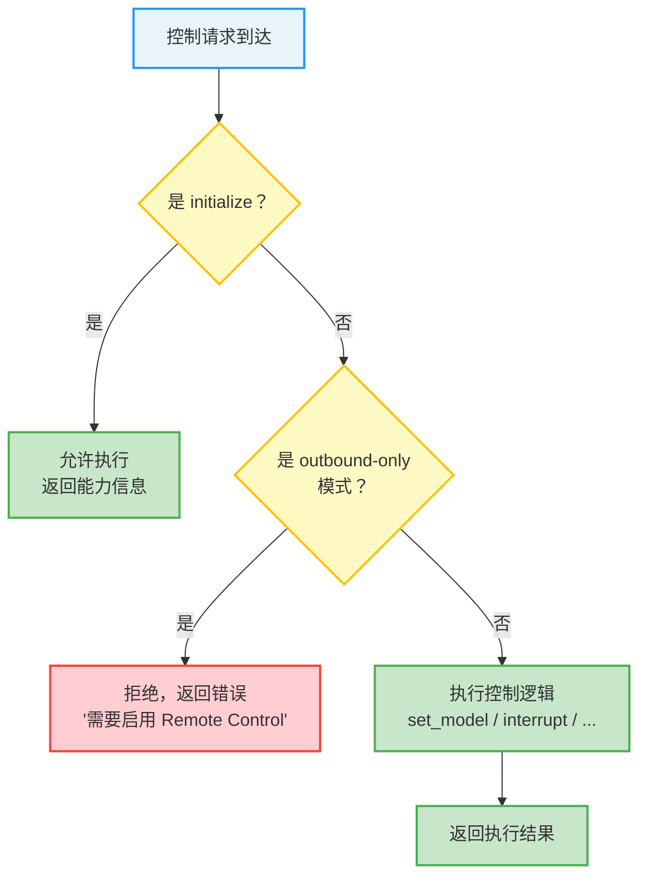
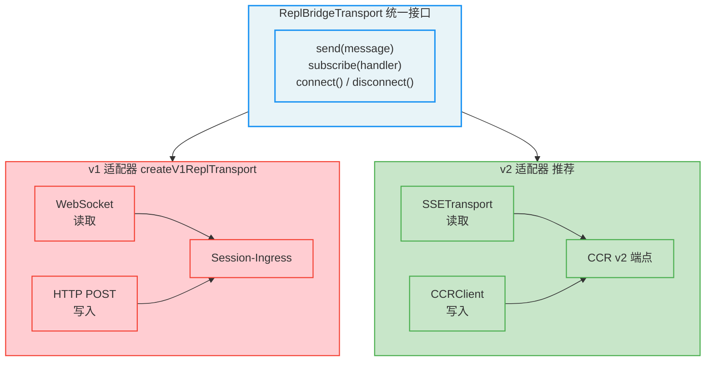
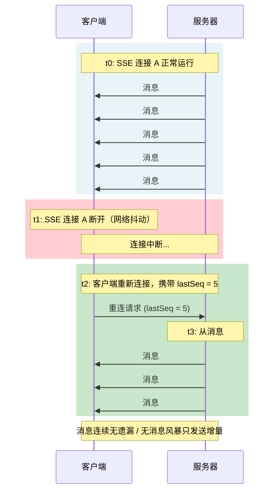
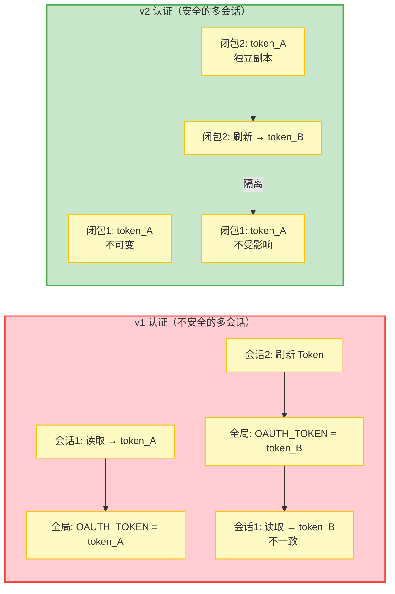
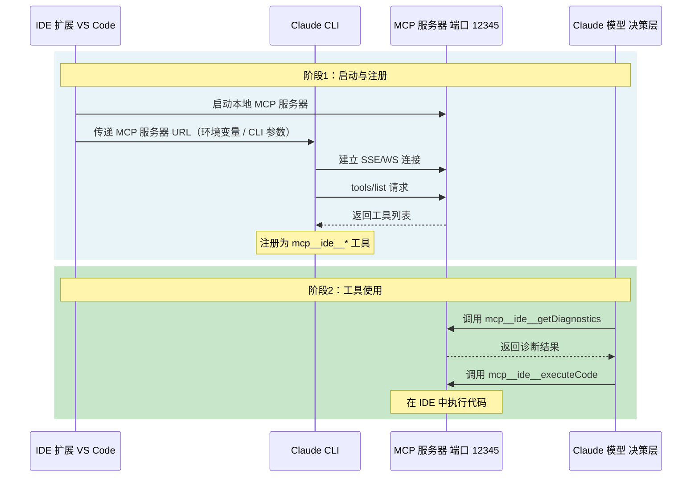
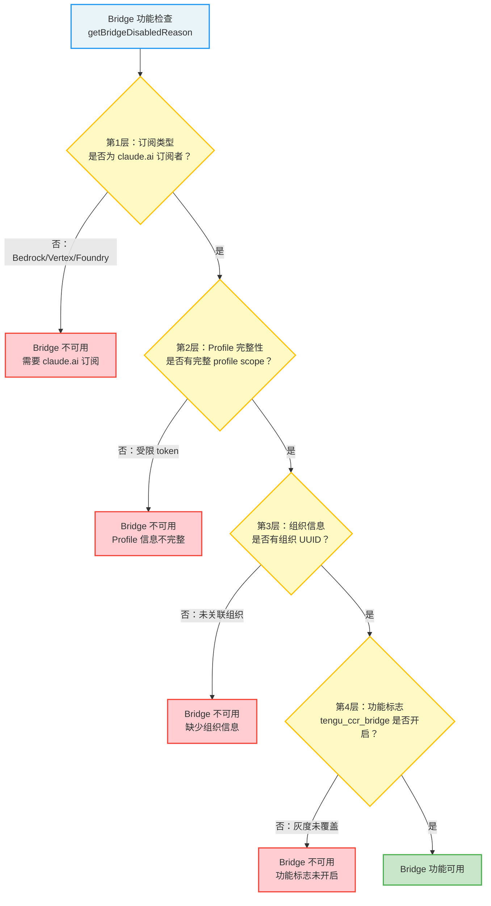
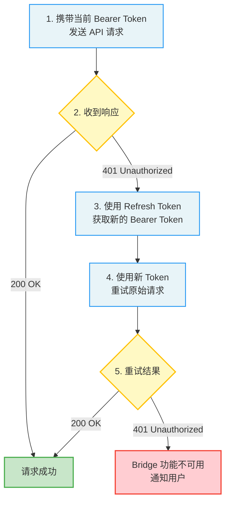

## 12.4 IDE 集成：Bridge 系统

Bridge 系统是 Claude Code 与外部世界双向通信的核心层。它实现了与 VS Code、JetBrains 等 IDE 的集成，以及 Claude.ai 平台的远程控制功能。如果 MCP 协议是 Claude Code 与工具服务器之间的"方言"，那么 Bridge 系统就是 Claude Code 与整个外部世界之间的"通用语言"。

> **类比理解：** 把 Bridge 想象成一个多语言翻译中心的调度系统。翻译中心（Bridge）同时处理来自不同国家的电话（IDE、claude.ai、远程终端），需要为每条线路选择正确的翻译协议（v1/v2 传输），确保消息不会串线（去重），并控制谁可以打入电话（权限门控）。

### 12.4.1 架构概览

Bridge 系统位于 bridge 通信目录中，包含超过 30 个模块文件，构成了一个完整的通信层。它的规模本身就说明了 IDE 集成和远程控制的复杂性——这不是简单的消息转发，而是一个包含路由、去重、认证、传输抽象和会话管理的完整通信中间件。

关键组件如下：

| 职责 | 说明 | 设计模式 |
|------|------|---------|
| REST API 客户端 | 与 claude.ai 后端通信 | 适配器模式 |
| 消息路由和去重 | 处理入站/出站消息 | 责任链模式 |
| 传输层抽象 | 封装 v1 (HybridTransport) 和 v2 (SSE + CCR) | 策略模式 |
| REPL 桥接核心 | 管理会话生命周期 | 观察者模式 |
| 远程控制核心逻辑 | 管理远程控制功能 | 命令模式 |
| Bridge 功能门控和权限检查 | 控制功能访问 | 装饰器模式 |
| 类型定义 | 定义通信类型 | 类型驱动设计 |
| 会话创建和子进程管理 | 管理会话生命周期 | 工厂模式 |
| JWT 工具 | 用于认证 | 工具类 |

**为什么需要这么多模块？**

Bridge 系统的复杂性来自它需要同时满足多个维度的需求：

1. **多传输协议兼容**：需要同时支持旧版（v1）和新版（v2）的传输协议，且在不影响现有集成的情况下平滑迁移。
2. **双向通信**：不仅是 CLI 向外推送消息，还需要接收外部控制命令（如切换模型、中断执行）。
3. **多会话并行**：同一个用户可能同时使用多个终端或 IDE 窗口，每个都需要独立的会话管理。
4. **安全隔离**：不同来源的消息需要不同的认证和权限检查策略。

这些需求叠加在一起，使得一个简单的消息转发模块演变成了一个完整的通信中间件。

### 12.4.2 双向通信层

Bridge 的通信架构是双向的，支持两类数据流。这种双向性是 Bridge 系统区别于简单"日志推送"的关键——它不仅仅把 CLI 的输出转发给外部，还能接收外部指令并执行。

**出站流（CLI -> 外部）**

CLI 中的对话消息、工具调用结果、状态更新等通过传输层发送到外部消费者（IDE、claude.ai 等）。出站消息包括：

- 对话消息（assistant 和 user 角色）
- 工具调用请求和结果
- 状态变更通知（如连接状态、模型切换）
- 错误和诊断信息

出站消息相对简单——它们是单向推送，不需要处理复杂的同步和冲突问题。

**入站流（外部 -> CLI）**

来自 IDE 或 claude.ai 的用户消息、权限响应、控制请求等通过传输层到达 CLI。入站消息的处理要复杂得多，因为它们可能改变 CLI 的状态，需要严格的过滤和验证。

消息路由的核心逻辑实现了三重过滤：

**BoundedUUIDSet：高效的重复检测**

`BoundedUUIDSet` 是一个 FIFO（先进先出）有界集合，使用环形缓冲区实现。它用于存储最近处理过的消息 UUID，内存占用恒定为 O(capacity)。当有新消息到达时，系统检查其 UUID 是否在集合中——如果在，说明是重复消息，直接丢弃。

为什么使用环形缓冲区而不是简单的 Set？考虑一个长时间运行的会话，可能处理数万条消息。如果使用普通 Set 存储所有历史 UUID，内存会持续增长。环形缓冲区通过固定容量，只保留最近 N 条消息的 UUID，在内存效率和重复检测准确性之间取得了平衡。N 的值设置得足够大，可以覆盖网络重传的时间窗口（通常几秒到几分钟），同时足够小，不会造成内存压力。

> **与第2章的关联：** Bridge 的双向通信发生在对话循环（第2章）的外层。对话循环管理的是用户-模型之间的交互，而 Bridge 管理的是 CLI-外部世界之间的交互。两者是并行的：Bridge 可以在对话循环执行期间接收和缓存入站消息，等待当前对话轮次结束后再处理。

### 12.4.3 控制协议

服务器可以发送控制请求来远程管理 CLI 会话。`handleServerControlRequest` 函数实现了一个轻量级的远程过程调用（RPC）协议，支持以下控制子类型：

| 子类型 | 用途 | 请求参数 | 响应 |
|--------|------|---------|------|
| `initialize` | 初始化握手，报告能力 | 客户端能力声明 | commands, output_style, models, account, pid |
| `set_model` | 远程切换模型 | 目标模型名称 | 成功/失败状态 |
| `set_max_thinking_tokens` | 调整思考 token 预算 | token 数量 | 成功/失败状态 |
| `set_permission_mode` | 切换权限模式 | 目标模式名称 | 策略裁决结果 |
| `interrupt` | 中断当前执行 | 无 | 立即中断 |

**控制协议的设计原则**

控制协议的设计体现了几个重要的原则：

1. **最小化控制面**：只有五个控制子类型，每个都有明确的语义和边界。这与"最小 API 表面"的设计哲学一致——控制命令越少，安全审计越容易，误用的可能性越低。

2. **显式能力协商**：`initialize` 是第一个也是必须的控制请求。它让双方交换能力声明，确保后续的控制请求只会发送对方支持的命令。这种"先协商、后操作"的模式是网络协议设计中的经典模式。

3. **单向中断**：`interrupt` 不等待响应，直接触发中断。这是唯一一个"发射后不管"的控制命令，设计上优先考虑响应速度而非可靠性——中断操作需要立即生效，等待响应会延迟中断的执行。

**outbound-only 模式的安全考量**

在 **outbound-only** 模式下，除 `initialize` 外的所有可变请求都被拒绝，返回错误信息告知需要本地启用 Remote Control 才能允许入站控制。

这是一个关键的安全边界。outbound-only 模式意味着 CLI 只向外部推送信息，不接受外部的控制命令。这对于 claude.ai 集成特别重要——用户可能只是想查看对话历史，而不希望网页端能够远程控制他们的 CLI 会话（比如切换模型或中断执行）。

为什么 `initialize` 在 outbound-only 模式下仍然被允许？因为 initialize 是一个只读操作——它不改变 CLI 的任何状态，只是返回当前的能力信息。禁止 initialize 会导致外部客户端无法了解 CLI 的能力，从而无法正确显示对话内容。

### 12.4.4 传输层抽象

传输层定义了统一的 `ReplBridgeTransport` 接口，将底层通信协议的复杂性封装在统一的抽象之下。这是经典的"策略模式"（Strategy Pattern）应用——上层代码通过统一接口与传输层交互，无需关心底层使用的是 WebSocket、SSE 还是其他协议。

**v1 适配器**（`createV1ReplTransport`）

v1 适配器封装了 `HybridTransport`，使用 WebSocket 读取 + HTTP POST 写入到 Session-Ingress 服务。这种混合模式的设计初衷是利用两种协议各自的优势：WebSocket 适合服务器推送（低延迟、实时性），HTTP POST 适合客户端发送（简单可靠、无需维护长连接）。

v1 适配器是历史遗留方案，虽然仍在运行，但已不推荐新功能基于它开发。

**v2 适配器**

v2 适配器封装了 SSETransport（读取）+ CCRClient（写入到 CCR v2 端点），代表了 Bridge 传输层的发展方向。v2 的关键改进包括：

**1. SSE 序列号延续（Sequence Number Continuation）**

这是 v2 最精妙的设计。在传统的 SSE 实现中，如果客户端断开连接后重新连接，服务器通常需要重放从连接开始以来的所有事件（因为客户端不知道自己错过了什么）。对于长时间运行的会话，这可能导致"消息风暴"——数千条历史消息被一次性重放，消耗大量带宽和处理时间。

v2 的解决方案是：在传输切换时携带上一个流的序列号高位标记。当客户端重新连接时，它告诉服务器"我已经处理到了序列号 N，请从 N+1 开始发送"。这样服务器只需发送增量消息，而非完整历史。

**2. Epoch 管理和心跳**

CCRClient 定期发送心跳维持租约。Epoch 是一个单调递增的逻辑时钟，每次传输切换时递增。通过 Epoch，系统能够区分"旧连接的延迟消息"和"新连接的新消息"，避免处理过期的消息。

心跳机制确保连接的活性检测——如果心跳超时，系统会认为连接已断开，触发重连流程。这与 12.1.4 节中描述的指数退避重试机制配合使用。

**3. 多会话安全的认证**

v2 通过闭包提供每实例认证，而非使用全局环境变量。这个改进解决了一个微妙但重要的并发问题：在多会话场景下，如果多个 Bridge 传输实例共享同一个环境变量中的认证 Token，当一个实例刷新 Token 时，其他实例可能读到不一致的状态。

闭包方案让每个传输实例拥有自己的认证上下文，互不干扰：

> **架构思考：** v1 到 v2 的演进是一个典型的"技术债清理"过程。v1 的混合模式（WebSocket + HTTP POST）在初期快速满足了需求，但随着会话数量增长和移动端集成的加入，其局限性逐渐显现。v2 通过引入序列号延续和闭包认证，从根本上解决了这些问题，但保留了相同的接口抽象，使得上层代码无需修改。

### 12.4.5 VS Code 和 JetBrains 扩展集成

IDE 扩展通过 `sse-ide` 和 `ws-ide` 类型的 MCP 服务器与 Claude CLI 通信。这些是内部专用类型，在标准 SSE/WebSocket 协议基础上增加了 IDE 标识信息（如 IDE 名称、是否在 Windows 上运行）。这种"协议变体"的设计让 Bridge 系统能够根据客户端类型提供差异化的服务。

**集成流程详解**

IDE 集成的完整流程涉及多个组件的协作：

**五个步骤的详细说明：**

1. **IDE 扩展启动 MCP 服务器**：当用户在 VS Code 中打开 Claude Code 扩展时，扩展会在本地启动一个 MCP 服务器进程，监听一个随机分配的本地端口。

2. **URL 传递**：IDE 扩展将服务器 URL 通过环境变量（如 `CLAUDE_CODE_IDE_MCP_URL`）或 CLI 参数传递给 Claude Code。这个 URL 通常形如 `http://127.0.0.1:12345/mcp`。

3. **建立连接**：Claude Code 启动后，读取 IDE 传递的 URL，使用 `sse-ide` 或 `ws-ide` 协议建立连接。连接建立后，Claude Code 就成为了这个 MCP 服务器的客户端。

4. **工具发现**：Claude Code 通过标准的 `tools/list` 请求获取 IDE 扩展提供的工具列表。由于 IDE 类型的服务器受到工具白名单限制，只有 `executeCode` 和 `getDiagnostics` 被注册。

5. **工具使用**：Claude 模型在处理用户请求时，可以调用这些 IDE 工具来获取实时诊断信息或在 IDE 上下文中执行代码。例如，当模型建议修复一个 TypeScript 类型错误时，可以通过 `executeCode` 在 IDE 中直接应用修复，然后通过 `getDiagnostics` 验证错误是否已消失。

**IDE 集成的实际价值**

IDE 集成的价值远超"在终端里使用 Claude Code"。通过 MCP 协议，Claude Code 获得了对 IDE 环境的"感知能力"：

- **实时诊断**：`getDiagnostics` 让 Claude Code 能看到 IDE 中实时的编译错误、类型错误和 lint 警告，而不需要用户手动复制粘贴错误信息。
- **上下文执行**：`executeCode` 让 Claude Code 的代码修复能在 IDE 的完整上下文中执行（包括项目的 TypeScript 配置、Node.js 版本、环境变量等），而不是在隔离的终端环境中。

> **与第8章钩子系统的关联：** IDE 集成的 MCP 工具调用同样会触发钩子系统。例如，当 Claude Code 通过 `mcp__ide__executeCode` 在 IDE 中执行代码时，PreToolUse 钩子可以拦截这个调用，检查要执行的代码是否安全。这为 IDE 集成增加了一层额外的安全保障。

### 12.4.6 Bridge 权限门控

Bridge（远程控制）功能不是对所有用户开放的——它需要 claude.ai 订阅，并通过多层门控。这种"层层设卡"的设计确保了远程控制功能只在受控的环境中使用。

**为什么需要多层门控？**

远程控制功能允许外部实体（IDE、claude.ai 网页端）控制 CLI 会话——切换模型、调整参数、甚至中断执行。这种能力如果被滥用（例如，恶意网站通过 XSS 攻击控制用户的 CLI），后果将是灾难性的。多层门控的设计遵循"纵深防御"原则——即使某一层的检查被绕过，其他层仍然提供保护。

完整的诊断函数 `getBridgeDisabledReason` 依次检查四层条件：

**API 认证与 Token 管理**

API 客户端的认证使用 OAuth Bearer Token，并支持 401 时的自动 Token 刷新和重试。这个机制处理了一个常见的分布式系统问题：Token 过期。

这种"自动刷新+重试"的模式是 OAuth 2.0 的标准实践。它的好处是用户无感知——Token 过期不会中断正在进行的 Bridge 会话，系统会在后台自动处理。

> **最佳实践：** 如果你需要在企业环境中使用 Bridge 功能，确保：(1) 团队成员使用 claude.ai 订阅账号登录，而非 API Key；(2) 组织 UUID 已正确配置；(3) 网络防火墙允许与 claude.ai 后端的 SSE/CCR 通信。
