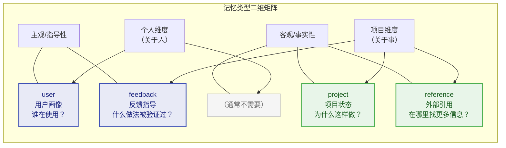

# 第6章：记忆系统 -- Agent 的长期记忆

> **学习目标：** 掌握四种记忆类型的设计意图和自动提取机制，理解基于 Fork 模式的缓存感知架构，学会设计持久化的 Agent 记忆系统。通过本章，你将理解如何利用记忆系统让 Agent 越用越懂你，以及如何在多项目环境中管理记忆的生命周期。

---

人类之所以能够在多次对话中保持连贯，是因为我们有记忆。同样，一个真正有用的 Agent 不能每次对话都从零开始——它需要记住用户是谁、项目在做什么、以及哪些做法被验证过。Claude Code 的记忆系统（memdir）正是为此而生：一个基于文件的、类型化的、跨会话持久的记忆架构。

将记忆系统比作"长期记忆"是生物学上的精确类比。人类的记忆分为感觉记忆（毫秒级）、工作记忆（秒级，对应第7章的上下文管理）和长期记忆（分钟到年，对应本章的记忆系统）。Claude Code 的设计同样遵循这种分层：上下文窗口是"工作记忆"，在一次会话中临时保存信息；而 memdir 是"长期记忆"，跨会话持久保存不可推导的关键知识。

## 6.1 四种记忆类型的分类学

### 6.1.1 闭合类型系统

Claude Code 的记忆被约束为一个闭合的四类型分类系统，定义在记忆类型常量中：user、feedback、project、reference。

这四种类型的设计哲学是：**只保存不可从当前项目状态推导的信息**。代码模式、架构、文件结构和 Git 历史都可以通过工具（grep、git log）实时获取，因此不属于记忆的范畴。

**为什么必须是闭合系统？**

开放类型系统（允许任意自定义类型）看起来更灵活，但在 Agent 场景下有致命缺陷：(1) 类型爆炸——不同用户、不同项目可能创建数十种类型，Agent 在读取时无法高效判断哪些记忆与当前对话相关；(2) 分类模糊——同一条信息可能属于多个自定义类型，导致重复存储；(3) 索引膨胀——MEMORY.md 索引需要为每种类型维护分类逻辑，增加不必要的复杂性。

闭合四类型的设计是一种"约束即自由"的哲学：约束了分类方式，但换来了高效的一致性推理和精确的相关性判断。

### 6.1.2 四种类型的详细解析

四种记忆类型之间的关系可以用一个二维矩阵来理解：



> **user** -- 用户画像

存储用户的角色、目标、知识背景。帮助 Agent 针对不同专业水平的用户调整协作方式——与资深工程师和初学者应该用不同的方式交流。

```
when_to_save: 当了解到用户的角色、偏好、知识背景时
how_to_use:  当需要根据用户画像调整解释深度和协作方式时
```

示例：用户说"我写了十年 Go，但这是第一次接触 React"，Agent 会保存一条 user 类型的记忆，在未来解释前端概念时使用后端类比。

**实际应用场景：**

场景一：跨项目的用户偏好。用户在项目 A 中表达偏好后，Agent 在项目 B 中也能应用相同的偏好。因为 user 类型记忆存储在用户全局目录下，天然支持跨项目共享。

场景二：渐进式了解用户。第一次对话中用户提到自己是数据科学家，Agent 记录为 user 记忆。第五次对话中用户展示了高级 Python 技巧，Agent 更新记忆补充"精通 Python，熟悉 pandas/numpy"。这种渐进式的用户画像构建让 Agent 的协作能力随时间提升。

**feedback -- 反馈指导**

记录用户对 Agent 行为的纠正和确认。这是最重要的记忆类型之一——它让 Agent 在未来的对话中保持行为一致性。

```
when_to_save: 用户纠正你的做法（"不要那样"）或确认非显而易见的做法成功时
body_structure: 规则本身 + Why: 原因 + How to apply: 适用场景
```

关键设计：不仅记录失败（纠正），也记录成功（确认）。如果只保存纠正，Agent 会变得过于谨慎，偏离已被验证的方法。

**实际应用场景：**

场景一：代码风格偏好。用户说"不要用 var，全部使用 const 和 let"，Agent 保存为 feedback 记忆。在后续所有对话中，Agent 生成的代码默认使用 const/let。

场景二：流程要求。用户说"提交代码前必须运行 lint"，Agent 保存为 feedback 记忆。在后续每次执行 git commit 前，Agent 会自动运行 lint 命令。

场景三：反面教训。用户说"上次你直接修改了 package.json 导致版本冲突，以后改依赖先跟我确认"，Agent 保存为 feedback 记忆，在后续修改依赖文件时主动请求确认。

**project -- 项目状态**

记录项目的非代码状态——决策、截止日期、正在进行的工作。代码和 Git 历史是可推导的，但"为什么要这样做"和"什么时候需要完成"这类信息不是。

```
when_to_save: 了解到谁在做什么、为什么做、何时完成时
body_structure: 事实或决策 + Why: 动机 + How to apply: 对建议的影响
```

特别注意：相对日期必须转换为绝对日期（"周四" -> "2026-03-05"），因为记忆是跨会话持久的，相对日期在未来的对话中会失去意义。

**实际应用场景：**

场景一：架构决策记录（ADR）。用户说"认证模块使用 JWT 而非 Session，因为需要支持移动端"，Agent 保存为 project 记忆。当未来需要修改认证相关代码时，Agent 能理解这个决策的背景。

场景二：进行中的工作。用户说"我正在把用户模块从 REST 迁移到 GraphQL，目前完成了查询部分，接下来要做变更部分"，Agent 保存为 project 记忆。在下一次对话中，Agent 能从正确的上下文继续工作。

场景三：团队约定。用户说"我们团队约定所有 API 响应使用 camelCase，但数据库字段使用 snake_case"，Agent 保存为 project 记忆，在生成代码时遵循这个约定。

**reference -- 外部引用**

指向外部系统的指针——Linear 项目、Grafana 仪表盘、Slack 频道。这些信息不在代码仓库中，但对理解项目上下文至关重要。

```
when_to_save: 了解到外部系统的资源和用途时
how_to_use:  当用户引用外部系统或需要查找外部信息时
```

**实际应用场景：**

场景一：监控仪表盘。用户说：“生产环境的 Grafana 仪表盘在 [https://grafana.company.com/d/abc123](https://grafana.company.com/d/abc123)”，Agent 保存为 reference 记忆。当用户问：“最近有什么异常”时，Agent 能提醒用户查看这个仪表盘。

场景二：文档链接。用户说：“API 文档在 Confluence 的 [https://confluence.company.com/pages/api-docs](https://confluence.company.com/pages/api-docs)”，Agent 保存为 reference 记忆。

场景三：通信渠道。用户说"后端团队的讨论在 #backend-dev Slack 频道"，Agent 保存为 reference 记忆，在需要跨团队协调时提醒用户。

### 6.1.3 明确排除的信息

记忆类型校验模块中明确列出了不应该保存为记忆的内容：

- 代码模式、惯例、架构、文件路径 -- 可以通过阅读代码推导
- Git 历史 -- `git log` / `git blame` 是权威来源
- 调试解决方案 -- 修复已经在代码中，上下文在 commit message 中
- CLAUDE.md 中已有的文档
- 临时任务细节 -- 当前对话的临时状态

甚至当用户**显式要求**保存这些信息时，系统也会引导到更有价值的方向："如果你想保存 PR 列表，请告诉我其中有什么**令人意外**或**非显而易见**的部分——那才是值得保存的。"

**这个排除原则的深层逻辑**

很多用户第一次使用记忆系统时，会试图让 Agent 记住"项目的文件结构"或"API 路由列表"。这种直觉是可以理解的——人类在接手新项目时确实需要了解这些信息。但 Agent 与人类有一个关键区别：Agent 可以在每次对话中实时读取文件系统。

```
信息获取成本对比：

人类开发者:
  记住文件结构 → 几小时的阅读和理解
  下次需要时回忆 → 几秒钟（如果有记忆）
  → 记忆的价值 = 节省的重新阅读时间

Agent:
  实时读取文件结构 → 几毫秒的工具调用
  每次重新获取的成本 → 几百个 token
  → 记忆的价值 ≈ 0（因为实时获取成本极低）
```

因此，记忆系统应该专注于保存"实时获取不到"的信息——人的偏好、决策的背景、外部的链接。这些信息的共同特征是：它们存在于人的大脑或外部系统中，无法通过读取代码仓库获得。

### 6.1.4 记忆使用的最佳实践

**应该保存的记忆（正面案例）：**

| 场景 | 记忆类型 | 保存内容 |
|------|---------|---------|
| 用户表达偏好 | feedback | "用户偏好使用 Vitest 而非 Jest" + Why: 更快的测试执行 |
| 用户纠正行为 | feedback | "不要修改 generated 文件夹中的代码" + Why: 它们由 protoc 自动生成 |
| 架构决策 | project | "使用事件驱动架构而非直接调用" + Why: 服务解耦的需要 |
| 外部系统链接 | reference | "监控告警在 PagerDuty 的 X 服务" |
| 用户背景 | user | "用户是全栈开发者，熟悉 TypeScript 和 Python" |

**不应该保存的记忆（反面案例）：**

| 场景 | 为什么不保存 | 正确做法 |
|------|------------|---------|
| 项目文件列表 | 可通过 `ls` 实时获取 | 无需记忆 |
| API 端点列表 | 可通过读取路由代码获取 | 如果有非显而易见的设计决策，只保存决策 |
| Bug 修复步骤 | 已记录在 commit message 中 | 如果修复涉及反直觉的原因，保存"为什么" |
| 第三方库版本号 | 可通过读取 package.json 获取 | 如果选型有特殊原因，保存原因 |

### 6.1.5 记忆管理的常见误区

**误区一：记忆越多越好**

这是最常见的误区。有些用户会让 Agent 记住所有对话中的细节，导致 MEMORY.md 索引膨胀，记忆目录中堆积大量低价值文件。过多的记忆不仅增加了每次对话的上下文负担，还可能导致 Agent 被"噪音"干扰，忽略真正重要的记忆。

**正确做法**：定期审查记忆目录，删除已过时或低价值的记忆。一个好的记忆应该经得起"如果删除这条记忆，Agent 的行为会有实质性的不同吗？"这个测试。

**误区二：把记忆当作文档系统**

有些用户试图用记忆系统替代项目文档，让 Agent 记住所有的技术规范和设计文档。这违背了"只保存不可推导信息"的原则——技术规范应该放在代码仓库的文档目录中，而非记忆系统中。

**正确做法**：技术文档放在 `docs/` 目录中，架构决策的"为什么"放在记忆中。

**误区三：忽略相对日期问题**

用户说"这个功能下周二上线"，Agent 保存了"下周二上线"。但两天后的下一次对话中，"下周二"变成了"这周二"，再过一周变成了"上周二"。这个记忆不仅无用，还可能误导。

**正确做法**：所有涉及时间的记忆必须使用绝对日期。Agent 应该将"下周二"转换为具体日期（如 2026-04-07）后再保存。

> **交叉引用提示：** 记忆的排除原则与第7章（上下文管理）的压缩策略共享同一种哲学——只保留不可重新获取的信息。上下文压缩会清除旧的工具结果（可以重新执行工具获取），记忆系统会排除代码模式（可以重新阅读代码获取）。

## 6.2 记忆文件格式

### 6.2.1 Frontmatter 格式

每条记忆是一个独立的 Markdown 文件，使用 YAML Frontmatter 声明元数据。格式要求包含 name（记忆名称）、description（一行描述，用于判断未来对话的相关性）和 type（四种类型之一）三个字段。`type` 字段必须是四种类型之一（严格校验），没有 type 字段的遗留文件可以继续工作，但无法被类型过滤。

**为什么使用 Markdown 文件而非数据库？**

这是一个值得分析的架构选择。使用文件系统而非数据库有以下优势：

1. **可读性**：开发者可以直接用文本编辑器查看和编辑记忆文件
2. **版本控制**：记忆文件天然支持 Git 追踪（如果放在项目目录下）
3. **可移植性**：文件系统是最低公共 denominator，无需额外依赖
4. **可调试性**：出现问题时，直接 `ls` 和 `cat` 即可诊断
5. **成本**：无需维护数据库连接、索引、备份

缺点是查询能力有限——无法进行复杂的关联查询或全文搜索。但对于 Agent 的记忆场景，查询模式是简单的"加载所有相关记忆"而非复杂的关联查询，文件系统的能力已经足够。

### 6.2.2 MEMORY.md 索引文件

`MEMORY.md` 是记忆系统的入口点——它不是记忆本身，而是一个索引文件。每次对话开始时，它被自动加载到上下文中，让 Agent 快速了解已有的记忆概况。

记忆目录模块的常量定义了索引的容量限制：索引文件名为 `MEMORY.md`，最多 200 行，最大 25KB。

索引条目的格式要求每条一行，不超过 150 字符：

```markdown
- [Title](file.md) -- 一行钩子描述
```

`truncateEntrypointContent` 函数实现了双重容量保护：先按行截断（200 行上限），再按字节截断（25KB 上限）。超限时，文件末尾会追加一条警告说明哪个上限被触发。

**双重容量保护的设计智慧**

为什么需要两层限制？行数限制和字节限制各有侧重：

- **行数限制（200行）**：保护的是 Agent 的理解效率。即使每行很短，200 行以上的索引也需要 Agent 花费更多 token 来理解和筛选。行数限制确保了索引始终是一个"快速浏览"的工具，而非一个需要"深度阅读"的文档。
- **字节限制（25KB）**：保护的是上下文预算。一条记忆的索引条目可能包含较长的描述（接近 150 字符上限），200 行这样的条目可能达到 30KB，对上下文窗口构成压力。字节限制提供了一个硬性的成本上限。

两层限制的顺序也有讲究——先按行截断再按字节截断。这意味着：当记忆条目较少但描述较长时，字节限制会先触发；当记忆条目较多但描述较短时，行数限制会先触发。无论哪种情况，都有对应的保护机制。

### 6.2.3 记忆文件的目录结构

记忆文件的存储路径由路径解析模块中的函数决定。默认路径为：

```
