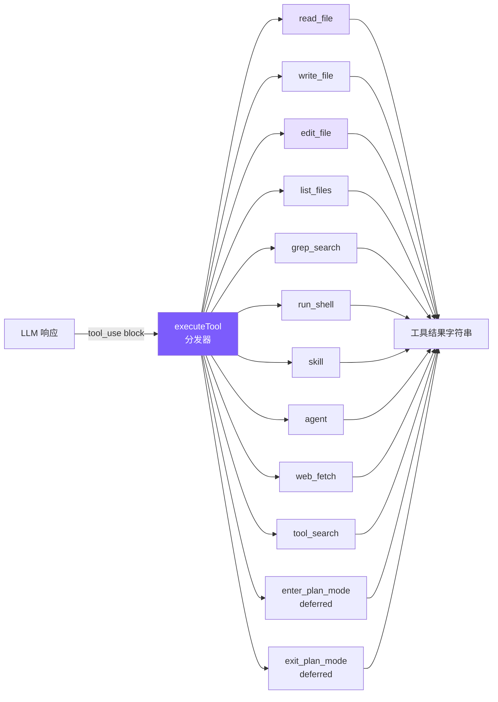
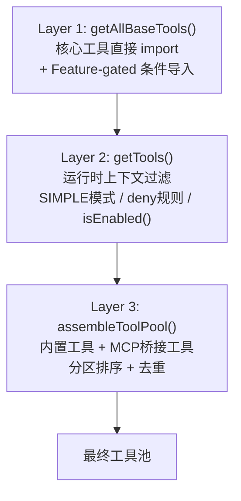
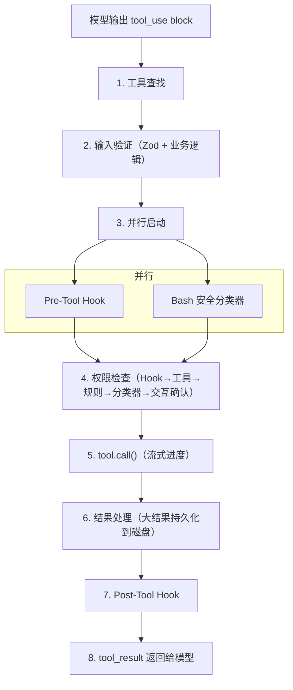

# 2. 工具系统

## 本章目标

上一章的循环已经能在模型要调工具时接住它、执行、把结果喂回去——可手上一个工具都还没有，模型想读文件也无处可读。这一章造工具。

一个工具其实只有三样东西：一个名字、一段给模型看的说明、一个真正干活的函数。先从最小的 `read_file` 开始，造出六个核心工具（读、写、编辑、列、搜、Shell），再补上 `web_fetch`、`skill`、`agent` 等扩展。中间会撞上 `edit_file` 的两个坑——改错地方、覆盖掉别人刚改的东西——用 read-before-edit 和 mtime 检查堵上。工具一多，还要用延迟加载（deferred tools）省下发给模型的 token。



> ▶ **跑这一章**：`node steps/run.mjs 2`（无需 API key，走本地 mock 模型）。加 `--py` 跑 Python 版；加 `--diff` 看它比上一章多了什么。想拿自己的 prompt 连真实模型，就加 `--live`（读 `.env` 里的 key，`--py` 跑 Python 版）。

## 我们的实现

一个工具三样东西：名字、给模型看的说明、干活的函数。前两样写在一个静态数组里（直接就是发给 API 的格式），第三样写成一个普通函数，再用一个 switch 把名字分派到函数。先看定义，再看执行，最后逐个工具过一遍——重点在 `edit_file`，它是这章唯一有坑的工具。

上一章的 agent 只有 `read_file`——想让它建个文件，手上却没有 `write_file`。这一章就给 `tools.ts` 补上另外五个（写、编辑、列、搜、Shell）。相对第 1 章，本章加的就是这些：

补上之后，同一个「建个文件」的请求走得通了：

```
$ node steps/run.mjs 2
▶ step 2 demo (no API key — local mock model)   sandbox: <sandbox>
  you: Create a file notes.txt containing the text remember-this.

I'll create the file.
  → write_file({"file_path":"notes.txt","content":"remember-this"})
Created notes.txt.

  ✓ verified: notes.txt contains "remember-this"
```

### 工具定义：静态数组

这些定义直接传给 Anthropic API 的 `tools` 参数，格式完全一致，不需要任何转换。

为什么用静态数组而非类？ Claude Code 用类体系是因为 66+ 工具需要继承、多态、独立测试。6 个工具用一个数组 + 一个 switch 就够了，简单性本身就是价值。

### 工具执行：switch 分发器

`default` 分支返回 `Unknown tool: ${name}` 而非抛异常——体现"错误是数据"的设计，让模型能自我纠正幻觉出的工具名。

### 逐个工具详解

#### read_file

加行号是为了让 LLM 定位代码位置，但 `edit_file` 匹配时用的是实际内容字符串，不是行号。

#### edit_file — 最关键的工具

唯一匹配检查是核心：出现 0 次说明模型对文件内容记忆有误（幻觉检测），出现 > 1 次则要求模型提供更多上下文来唯一标识修改点。"宁可失败也不猜测"——静默替换第一个匹配远比告知失败危险。

#### 引号容错 + Diff 输出

LLM 的 tokenization 可能将直引号映射为弯引号（`"` → `"`），没有容错机制这类编辑会 100% 失败。

关键细节：匹配成功后返回**文件中的原始字符串**而非标准化版本，替换时保持文件原始字符风格。

编辑成功后生成简易 diff，行号通过计算 `old_string` 前面有几个 `\n` 得出：

```
Successfully edited src/app.ts (matched via quote normalization)

@@ -15,1 +15,1 @@
- const msg = "hello";
+ const msg = "world";
```

#### write_file

自动创建父目录（`mkdir -p` 效果）避免模型还得额外调用 shell 命令。System Prompt 里告诉 LLM 优先用 `edit_file`，只对新文件用 `write_file`。

#### grep_search

`--color=never` 禁用 ANSI 颜色代码（输出给模型看的，不需要颜色）。Python 版本的 `--` 分隔符确保以 `-` 开头的 pattern 不被误解析为 grep 选项。

grep 退出码 1 表示"无匹配"不是错误，2+ 才是真正错误，需要分别处理。结果截断为前 100 条，附加 `... and N more matches` 提示。

Claude Code 用 ripgrep (`rg`)，我们用系统 `grep`——功能够用，少一个依赖。

#### run_shell

失败时同时返回 stdout 和 stderr——很多编译器在 stderr 输出错误的同时，stdout 可能有有用的部分输出。`"(no output)"` 避免模型在命令成功但无输出时（`mkdir`、`touch`）产生困惑。

Claude Code 的 BashTool 分布在 18 个源文件中，有 AST 解析命令、沙箱执行、23 个安全检查。我们只做 timeout 保护（安全机制在第 6 章详述）。

### 工具结果截断

保留头尾而非只保留头部，因为很多命令的关键输出在末尾（编译错误摘要、测试结果统计）。截断提示明确告知模型内容被截断，模型可据此决定是否用 `grep_search` 或 `read_file` 获取完整内容。

### WebFetch 工具

让 Agent 能访问 URL 获取内容——查文档、读 API 响应、抓取网页信息：

设计选择：
- **30 秒超时**：防止模型访问慢速或无响应的 URL 时阻塞整个循环
- **HTML 去标签**：LLM 不需要看 HTML 标签，纯文本更高效
- **50KB 上限**：避免网页内容挤占上下文窗口
- 标记为 `CONCURRENCY_SAFE_TOOLS`（只读、无副作用），可并行执行

### Read-before-edit + mtime 防护

Claude Code 的一个重要安全机制：**编辑文件前必须先读取**。这防止模型在不了解文件当前内容的情况下盲目修改，同时检测外部修改避免覆盖用户的手动编辑。

三个关键点：
- **readFileState Map** 在 Agent 实例中维护，key 是绝对路径，value 是上次读取时的 `mtimeMs`
- **新文件跳过检查**：`existsSync(absPath)` 为 false 时不强制先读——创建新文件不需要先读
- **mtime 比较**：读取时记录 mtime，写入前比较。如果不一致，说明文件在 Agent 读取后被用户或其他进程修改了，返回警告而非静默覆盖

这与 Claude Code 的 `readFileTimestamps` 机制对齐——编辑必须基于已知状态，不能"盲写"。

### ToolSearch 延迟加载

当工具数量增多时（66+ 工具），把所有工具的 schema 都发给 API 会浪费大量 token。Claude Code 的做法是**延迟加载**：不常用的工具只发名称，模型需要时通过 `ToolSearch` 按需激活。

工作流程：
1. API 调用时，`getActiveToolDefinitions()` 过滤掉未激活的 deferred 工具（只发名称，不发 schema）
2. System prompt 中通过 `getDeferredToolNames()` 告知模型哪些工具可以通过 `tool_search` 激活
3. 模型需要时调用 `tool_search`，匹配的工具被加入 `activatedTools` Set
4. 下一次 API 调用自动包含已激活工具的完整 schema

我们只有 2 个 deferred 工具（plan mode），但这个机制对扩展到 20+ 工具时至关重要。

## 真实 Claude Code 比这多做了什么

刚才那套工具，一条数组定义加一个函数就够了。真实 Claude Code 的每个工具是一整套行为契约、一条八阶段的执行流水线、一个并发调度器——多出来的部分，正是一个玩具工具系统和一个跑在生产环境里的工具系统之间的距离。

### Tool 接口 — 每个工具的完整契约

Claude Code 的每个工具都遵循统一的 `Tool` 泛型接口，不是简单函数签名，而是完整的行为契约：

```typescript
type Tool<Input, Output, P extends ToolProgressData> = {
  name: string
  aliases?: string[]              // 废弃别名，平滑迁移
  maxResultSizeChars: number      // 超过则持久化到磁盘

  call(args, context, canUseTool, parentMessage, onProgress?): Promise<ToolResult<Output>>

  description(input, options): Promise<string>  // 发给 API 的工具描述
  prompt(options): Promise<string>              // 注入 system prompt 的使用指南

  inputSchema: Input              // Zod Schema（运行时验证 + 类型推导）
  inputJSONSchema?: ToolInputJSONSchema

  isConcurrencySafe(input): boolean   // 接收 input：同一工具不同参数可有不同安全语义
  isReadOnly(input): boolean
  isDestructive?(input): boolean
  checkPermissions(input, context): Promise<PermissionResult>

  renderToolUseMessage(input, options): React.ReactNode  // 每个工具自带渲染
  renderToolResultMessage?(content, progress, options): React.ReactNode
}
```

几个设计要点：

`isConcurrencySafe(input)` 接收参数——这意味着同一工具对不同输入可以有不同安全语义。BashTool 对 `ls` 返回 `isReadOnly: true`，对 `rm` 返回 `false`。比给整个工具打标签精确得多。

`prompt()` 方法——每个工具可以向 system prompt 注入自己的使用指南。FileEditTool 注入"精确匹配"规则，BashTool 注入安全执行提醒。工具行为指引和工具定义紧密关联，而非散落在全局 prompt 文件里。

渲染方法——每个工具自带渲染逻辑，新增工具不需要修改全局渲染代码。

### buildTool 工厂 — Fail-Closed 默认值

```typescript
const TOOL_DEFAULTS = {
  isConcurrencySafe: () => false,    // 默认不可并发
  isReadOnly: () => false,           // 默认有写入副作用
  isDestructive: () => false,
  checkPermissions: () => ({ behavior: 'allow', updatedInput }),
}
```

这是 **fail-closed** 设计：错误标记"只读"工具为"非只读"后果是不必要的权限弹窗（烦人但安全）；反向错误——错误标记"写入"工具为"只读"——可能让它在没有权限检查的情况下并发执行（危险且隐蔽）。默认值只能选安全的方向。

### 工具注册 — 三层流水线



Layer 1 的 Feature-gated 工具通过条件 `require()` 加载：

```typescript
const SleepTool = feature('PROACTIVE') || feature('KAIROS')
  ? require('./tools/SleepTool/SleepTool.js').SleepTool
  : null
```

`feature()` 是 Bun 打包器的编译时宏。外部构建时求值为 `false`，整个 `require()` 被死代码消除——内部工具在外部二进制中物理上不存在。

Layer 3 的分区排序：内置工具按字母序在前，MCP 工具追加在后，不做全局排序。原因是 API 服务器在最后一个内置工具之后设置了缓存断点，分区确保添加 MCP 工具不影响内置工具的缓存命中。

### 工具执行生命周期 — 8 个阶段



几个值得关注的阶段：

Stage 2 两阶段验证：Phase 1 是 Zod Schema（字段类型），Phase 2 是业务逻辑（如 FileEditTool 检查 old_string 是否唯一）。分离确保低成本检查先执行，减少不必要的磁盘 I/O。

Stage 3 并行启动：Pre-Tool Hook 和 Bash 分类器同时启动，各需数十到数百毫秒，并行化降低权限检查总延迟。

Stage 6 大结果处理：结果超过 `maxResultSizeChars` 时，完整内容保存到 `~/claude-code/tool-results/`，模型收到文件路径 + 截断指示符，需要时通过 FileReadTool 主动拉取。

> **核心设计哲学：错误是数据，不是异常。** 任何阶段的错误都转换为带 `is_error: true` 的 `tool_result` 返回给模型，让模型自我纠正。

### 并发控制

```typescript
private canExecuteTool(isConcurrencySafe: boolean): boolean {
  const executingTools = this.tools.filter(t => t.status === 'executing')
  return (
    executingTools.length === 0 ||
    (isConcurrencySafe && executingTools.every(t => t.isConcurrencySafe))
  )
}
```

规则很简单：非并发安全的工具必须独占执行；多个并发安全工具可以同时跑。`StreamingToolExecutor` 不等模型输出完所有 tool_use blocks，一旦检测到完整 block 就立即启动执行——工具执行延迟约 1 秒，模型流式输出持续 5-30 秒，大部分工具可以完全隐藏在流式窗口内。

并发上限 `MAX_TOOL_USE_CONCURRENCY = 10`。

### edit_file 的核心设计

FileEditTool 执行前有 14 步验证（按 I/O 成本排序：先检查内存状态，再访问磁盘），其中最关键的三个：

读取前置检查：代码层面的强制约束，不只是 prompt 建议。未先读取文件则拒绝执行，确保模型基于文件当前状态编辑而非过时记忆。

外部修改检测：通过 mtime 检测文件在读取后是否被外部修改（比如用户在 IDE 中编辑了同一个文件），解决真实竞争条件。

配置文件保护：对 `.claude/settings.json` 等，验证会模拟执行编辑后做 JSON Schema 校验，防止看似合理的编辑损坏配置格式。

### 为什么用 search-and-replace

在确定 search-and-replace 之前，有几种备选方案：

| 方案 | 致命缺陷 |
|------|---------|
| 行号编辑 | 位置相关：第一次插入 3 行后，后续所有行号偏移，多步编辑需要复杂重算 |
| AST 编辑 | 语法错误的文件恰恰最需要编辑，而 AST 解析器遇到语法错误会直接报错 |
| Unified diff | LLM 生成严格格式时表现很差：hunk header 行号、`+`/`-`/空格前缀任一出错则 patch 无法应用 |
| 全文件重写 | 大文件浪费 Token；模型可能遗漏未修改代码；用户无法快速 review |
| **字符串替换** | ✅ 无上述缺陷 |

search-and-replace 最被低估的优势是**幻觉安全**：模型提供了一个文件中不存在的字符串，工具直接失败，模型重新读取文件纠正记忆。全文件重写则可能静默地把错误的内容写入文件。

## 我们的简化决策

| Claude Code 的设计 | 我们的简化 | 简化理由 |
|-------------------|-----------|---------|
| 66+ 工具类，每个独立目录 | 1 个 `tools.ts` + switch 分发（6 核心函数 + 扩展工具，`skill`/`agent` 在 agent 层处理） | 教程不需要工业级模块化 |
| 8 阶段生命周期 | 直接 switch 分发 + 执行 | 省略 Hook、权限检查、分类器 |
| StreamingToolExecutor 并发 | 串行逐个执行 | 避免并发复杂度 |
| 14 步验证流水线 | 唯一性检查 + 引号容错 | 保留最关键的 2 个验证 |
| 三级大结果限制 | 单层 50K 截断 | 足够防止上下文爆炸 |
| MCP 7 种传输 + OAuth | 不支持 MCP | 教程聚焦核心概念 |

核心理念：**保留设计哲学，砍掉工程复杂度**。

## 简化对比

| 维度 | Claude Code | mini-claude |
|------|------------|-------------|
| **工具数量** | 66+ | 12 个常驻（6 核心 + web_fetch + tool_search + skill + agent + 2 plan mode），`/loop` dynamic 期间另临时挂 `schedule_wakeup` |
| **执行模式** | 并发执行 + streaming 早期启动 | 并行执行（concurrencySafe）+ streaming 早期启动 |
| **搜索引擎** | ripgrep（rg） | 系统 grep |
| **编辑验证** | 14 步流水线 + readFileTimestamps | 引号容错 + 唯一性 + diff + read-before-edit + mtime |
| **Shell 安全** | AST 解析 + 沙箱 | 正则匹配 + 确认 |
| **结果截断** | 选择性裁剪 + 磁盘持久化 | 保留头尾 50K + 30KB 磁盘持久化 |
| **延迟加载** | deferred tools + ToolSearch | deferred 标记 + tool_search |
| **网络访问** | WebFetch（去标签 + 超时） | web_fetch（去标签 + 30s 超时 + 50KB 上限） |

---

> **下一章**：工具定义了 agent 的能力，但 System Prompt 定义了它的行为——怎么用这些工具、什么时候该小心。
