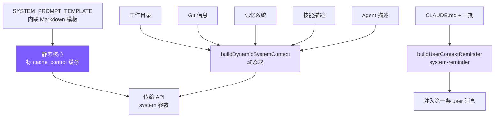

# 3. System Prompt 工程

## 本章目标

上一章 agent 有了一手工具，可它还不知道自己是谁、在什么环境里干活、什么时候该谨慎——这些都写在 System Prompt 里，也就是每次调模型前拼进去的第一段话。这一章造它。

拆成两半：一半是静态核心，写身份、规则、工具偏好，跨会话逐字不变（正好能被缓存，第 7 章会用上这点）；另一半每次动态拼，塞进当下的环境事实——操作系统、当前目录、Git 状态、项目自己的 `CLAUDE.md`。



> ▶ **跑这一章**：`node steps/run.mjs 3`（无需 API key）。加 `--diff` 看它比上一章多了什么。想拿自己的 prompt 连真实模型，就加 `--live`（读 `.env` 里的 key，`--py` 跑 Python 版）。

## 我们的实现

上一章的 agent 用的还是一句写死的 system prompt。这一章造 `prompt.ts`，给它一份真正的静态核心（身份、规则、工具偏好）加一段动态环境。相对上一章，`agent.ts` 里就换了一行——把写死的那句换成 `buildSystemPrompt()`：

跑一下，它现在带着完整的 system prompt 干活：

```
$ node steps/run.mjs 3
▶ step 3 demo (no API key — local mock model)   sandbox: <sandbox>
  you: Read the file greeting.txt and tell me what it says.

  → read_file({"file_path":"greeting.txt"})
greeting.txt says: hello from step one.
```

### SYSTEM_PROMPT_TEMPLATE

模板内联在 `prompt.ts` 中。它就是静态核心本身——不含任何插值，跨会话逐字节不变，这正是它能被缓存的前提：
