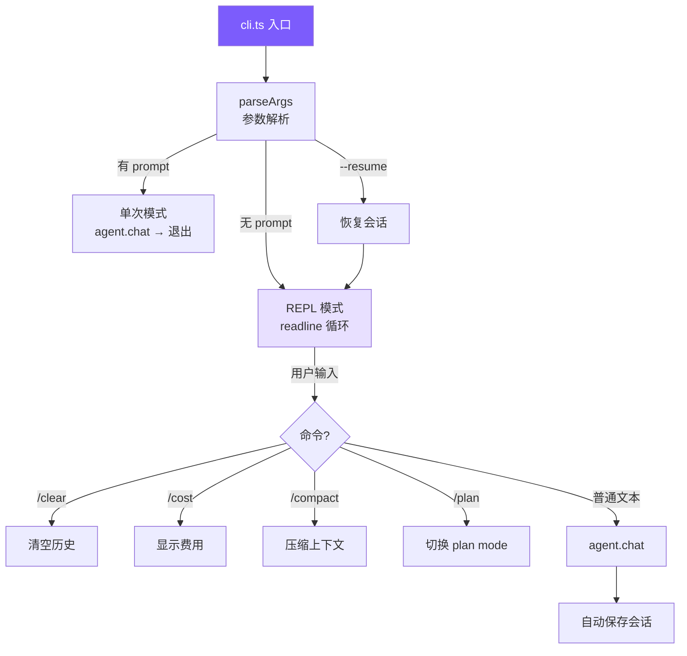

# 4. CLI 与会话

## 本章目标

到上一章为止，agent 的内核已经齐了——循环、工具、System Prompt——可它还没有一张能跟人对话的脸。这一章造用户接口。

一个命令行入口负责解析参数（`--yolo`、`--resume` 这些开关），一个 REPL 让人一句一句地聊，Ctrl+C 能中途打断当前这轮，聊完的对话写到磁盘、下次 `--resume` 接着聊。



> ▶ **跑这一章**：`node steps/run.mjs 4`（无需 API key）。它会存一次会话、再 `--resume` 接着聊。加 `--diff` 看它比上一章多了什么。想拿自己的 prompt 连真实模型，就加 `--live`（读 `.env` 里的 key，`--py` 跑 Python 版）。

## 我们的实现

上一章的 agent 每次都从空白开始——进程一关，聊过的全忘了。这一章给它加上会话：每轮把消息数组存到磁盘，`--resume` 时读回来接着聊。相对上一章，新增了一个 `session.ts`，`cli.ts` 也长出了 `--resume` 和 `/clear`：

会话本身很朴素——整段对话本来就是个消息数组，存盘就是把它写成 JSON：

跑一下：先记住一件事，关掉，再 `--resume`，它还记得：

```
$ node steps/run.mjs 4
▶ step 4 demo (no API key — local mock model)   sandbox: <sandbox>
  $ mini-claude Remember that my favorite color is blue.
  $ mini-claude --resume What is my favorite color?

Got it — your favorite color is blue.
(resumed 2 messages)
Your favorite color is blue.
```

### 参数解析

TypeScript 版手写循环而不用 commander.js，因为只有 11 个参数，零依赖更轻。用 `for` 而不是 `forEach` 是因为带值参数（`--model claude-sonnet`）需要 `++i` 跳到下一个元素。Python 直接用标准库 `argparse`。

### 两种运行模式

### REPL 实现

**Ctrl+C 的双重语义**：处理中按下 → 中断当前操作，回到输入提示；空闲时按下 → 第一次提醒，第二次退出。这避免了两种意外：手滑 Ctrl+C 导致整个会话丢失，以及 Agent 跑偏时只能眼睁睁等它跑完。

**`rl.once` vs `rl.on`**：`rl.on` 注册的 handler 不会等 `await agent.chat()` 完成就响应下一行输入，导致多个 chat 并发修改消息历史。`rl.once` 每次只监听一行，处理完再递归注册，天然串行。Python 的 `while + input() + await` 没有这个问题。

### 会话持久化

每次 `agent.chat()` 完成后自动保存，保存失败静默忽略（不能因为磁盘满让整个对话崩溃）。恢复时直接把消息数组加载回 Agent：

### 终端 UI — ui.ts

所有输出通过 `ui.ts` 统一格式化：

工具结果在 UI 层截断到 500 字符——这是给人看的显示，完整结果已在消息历史中。

## 真实 Claude Code 比这多做了什么

我们的界面是一个 readline 加几行打印。Claude Code 的界面是一整套跑在终端里的 UI 框架——差距全在「让它在真实终端里稳、好用、崩不坏」这些地方。

Claude Code 的入口是 `src/entrypoints/cli.tsx`——用 React/Ink 把组件模型搬进终端，支持流式 Markdown 渲染、Vim 模式、多 Tab、键盘自定义。会话用 JSONL 格式追加写入，崩溃安全。

### 终端原生 vs GUI

这是一个主动选择。开发者的工作流在终端里，打开浏览器意味着上下文切换。终端原生就是另一个命令行工具，跟 `git`、`grep` 一样嵌入到已有工作流。具体好处：SSH 环境可用、可接管道 (`echo "fix" | claude`)、支持 tmux 多实例并行、内存开销接近零。

React/Ink 的作用是弥补终端的交互限制——有了组件模型，流式输出、diff 视图这类复杂 UI 才变得可维护。

### 可观察的自主性

Claude Code UX 的核心理念：**Agent 自由行动，但让用户实时看到每一步**。

```
📖 read_file src/app.ts
  1 | import express from ...
  ... (1234 chars total)

✏️ edit_file src/app.ts
  - const port = 3000
  + const port = process.env.PORT
```

中断成本远低于撤销成本。用户在 Agent 走错方向前 3 秒就能按 Ctrl+C，而不是等 20 秒执行完再花更多时间撤销。每个工具有 4 种渲染方法（开始/完成/被拒/报错），长时间运行的工具实时流式输出 stdout，而不是等完成才展示。

### JSONL 会话存储

整体 JSON 覆盖写入有两个问题：写入中途崩溃会损坏整个文件；对话越长每次保存越慢。

JSONL 每轮追加一行，O(1) 写入，崩溃最多丢最后一行。文件系统的 append 操作通常是原子的。恢复时逐行解析，跳过末尾不完整的行即可。

---

> **下一章**：让 agent 的输出实时显示——流式输出与双后端支持。
