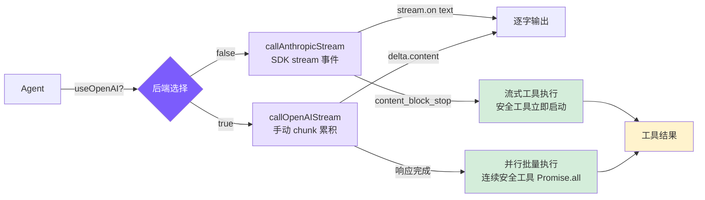

# 5. 流式输出与双后端

## 本章目标

到这里 agent 已经能跑完整轮对话了，但有个体验上的坎：模型想半天，然后「啪」地把一大段答案一次性吐出来，中间那几秒只能干等。这一章让输出逐字显示——模型每生成一小块就立刻打印。

顺带把后端做成两套：除了 Anthropic，也接上任何 OpenAI 兼容的接口，换个模型只要换个 base URL。两套后端的流式协议不一样，正好一起讲。



> ▶ **跑这一章**：`node steps/run.mjs 5`（无需 API key）。加 `--diff` 看它比上一章多了什么。想拿自己的 prompt 连真实模型，就加 `--live`（读 `.env` 里的 key，`--py` 跑 Python 版）。

## 我们的实现

上一章 agent 调模型是一次性等完（`messages.create`），答案会「啪」地一次全出现。这一章把那**一处**调用换成流式（`messages.stream`），文字边生成边显示。相对上一章，agent 循环里就换了这一处：

跑一下，行为一样、只是输出边生成边来：

```
$ node steps/run.mjs 5
▶ step 5 demo (no API key — local mock model)   sandbox: <sandbox>
  you: Read the file greeting.txt and tell me what it says.

  → read_file({"file_path":"greeting.txt"})
greeting.txt says: hello from step one.
```

### Anthropic 后端：SDK 内置 stream

Anthropic SDK 封装了全部 SSE 解析细节：`stream.on("text")` 直接给文本增量，`stream.finalMessage()` 返回和非流式完全一样的 `Message` 对象。`{ signal }` 把 AbortController 传进去，Ctrl+C 可以中断网络请求。

### OpenAI 兼容后端：手动 chunk 累积

OpenAI streaming 的 tool_calls 参数是分 chunk 到达的，需要手动累积重建。

OpenAI tool_calls 的 `id` 和 `name` 只在第一个 chunk 出现，后续 chunk 只有 `arguments` 的增量片段。多个 tool_call 的 chunk 会交错到达，用 `index` 字段区分，累积结束后才能 `JSON.parse()`。

### 工具格式转换

两个 API 的工具定义几乎相同，只是字段名不一样：

Anthropic 用 `input_schema`，OpenAI 用 `parameters`，内容完全一样。

### 重试机制

延迟公式 `min(1000 * 2^attempt, 30000) + random(0, 1000)`：指数部分控制退避速度，30 秒上限防止等待过久，随机抖动防止多个客户端同步重试形成"重试风暴"。

### Extended Thinking

Extended Thinking 让模型在输出前有一个私有"草稿纸"做推理规划，对需要多步决策的 coding 任务有明显帮助。

三种模式：
- **adaptive**：claude-4.x 模型自动开启，budget 10000 tokens，模型自行决定是否使用
- **enabled**：`--thinking` flag 显式开启，budget 最大化
- **disabled**：不支持 thinking 的模型（Claude 3.x 及 OpenAI）

thinking blocks 可能长达数千 token，对后续对话没有参考价值，过滤掉是避免上下文窗口被无效内容占满的直接手段。

### 流式工具执行

当 Anthropic 流式响应中某个 `tool_use` block 完整接收（`content_block_stop` 事件触发）时，如果该工具是并发安全的（`read_file`、`list_files`、`grep_search`、`web_fetch`），立即开始执行——不必等待整个 API 响应完成。这样可以把工具执行时间"藏"进模型生成后续内容的流式窗口中。

`callAnthropicStream` 内部通过回调机制实现：

设计要点：

- **`content_block_stop` 是 block 级别事件**：当单个 `tool_use` block 的 JSON 完整接收时触发，并非整个响应结束。模型可能在一次响应中返回多个工具调用，第一个 block 完整时第二个可能还在流式传输中
- **仅并发安全工具提前执行**：只有只读工具（`read_file`、`list_files`、`grep_search`、`web_fetch`）会被提前执行，写操作和命令执行不会
- **权限检查仍然生效**：只有 `checkPermission` 返回 `"allow"` 的工具才会提前执行，需要用户确认的工具（`"confirm"`）不会被提前触发
- **Promise/Task 存储，后续直接 await**：`earlyExecutions` Map 存储的是 Promise（TS）或 Task（Python），后续工具处理循环检查到已有提前执行的结果时，直接 await 即可——通常此时已经完成
- **核心收益**：5-30 秒的流式窗口期内，工具执行与模型生成并行进行，文件读取等快速操作在流结束时往往已经就绪

### 并行工具执行

并行执行的前提是标记哪些工具是并发安全的——只读工具不会产生副作用，可以安全地同时运行：

对于 Anthropic 后端，流式工具执行天然处理了并行——每个工具 block 完整时就启动执行，多个工具自然重叠运行。

对于 OpenAI 后端（不支持流式工具 block 事件），采用显式批量并行：将连续的安全工具分组，用 `Promise.all` / `asyncio.gather` 一次性执行：

两种后端的并行策略对比：

- **Anthropic 后端**：流式执行自动处理并行——工具 block 完整时立即启动，多个工具的执行时间自然重叠
- **OpenAI 后端**：响应完成后显式分批——将连续的安全工具归入同一批次，用 `Promise.all` 并行执行
- **混合序列保持安全**：`[read, read, write, read]` 会被分为 `[read||read]`、`[write]`、`[read]` 三个批次，写操作前后的工具各自独立，不会跨越写操作并行
- **典型加速效果**：当模型在一次响应中读取 3-5 个文件时，并行执行通常带来 2-3 倍的速度提升

## 真实 Claude Code 比这多做了什么

我们的流式做到「逐字打印」就收工了。真实 Claude Code 的流式管线还在这上面做了不少：流还没结束就提前把工具跑起来、token 边算边计费、断流了自动重连。

### 为什么需要流式输出？

模型生成速度大约每秒 30-80 个 token，稍长的回答需要 10-30 秒。用户面对空白等待的容忍极限约 2-3 秒。流式输出让第一个字在几百毫秒内出现，把"等待 30 秒"变成"看着内容逐渐写出来"——主观等待感接近零，并且用户能在方向错误时提前中断。

底层用的是 SSE（Server-Sent Events）：服务端用一条持久 HTTP 连接持续推送 `data:` 行，每几个 token 就推一个 `content_block_delta` 事件。比 WebSocket 简单，对 LLM 应用来说单向推送已经够用。

### 流式处理与并行工具执行

Claude Code 的一个关键优化：`StreamingToolExecutor` 在模型还在生成后续内容时，已解析完成的 tool_use block 就立即开始执行。串行方式下工具执行只能等 API 完整响应后开始；流式并行下，第一个 tool_use 解析完毕时直接分发，不等第二个。

在典型的 5-30 秒 API 流窗口内，文件读取（< 100ms）几乎能全部覆盖进去——流结束时工具结果往往已全部就绪。

### 错误重试

不是所有错误都值得重试：429/503/529 和网络瞬断（ECONNRESET）可以重试；400/401/404 反映代码或配置问题，重试没有意义。

指数退避（而不是固定间隔）的原因：服务过载时，大量客户端固定 1 秒后同时重试会形成"重试风暴"，反而加剧过载。指数退避让间隔逐轮翻倍（1s → 2s → 4s），加上随机抖动打破多客户端同步，是标准的分布式容错做法。

## 简化对比

| 维度 | Claude Code | mini-claude |
|------|------------|-------------|
| **后端支持** | 仅 Anthropic | Anthropic + OpenAI 兼容 |
| **重试策略** | 类似指数退避 | 指数退避 + 随机抖动 |
| **Thinking 处理** | 深度集成，独立展示与折叠 | 基础支持，过滤 thinking blocks |
| **流式工具执行** | StreamingToolExecutor 独立模块，全量事件处理 | 回调 + earlyExecutions Map，精简实现 |
| **并行工具执行** | 完整的并发调度器 | Anthropic 流式提前执行 + OpenAI 批量 Promise.all |
---

> **下一章**：Agent 能操作文件和执行命令了，但我们需要防止它做危险的事——权限系统保护你的系统。
