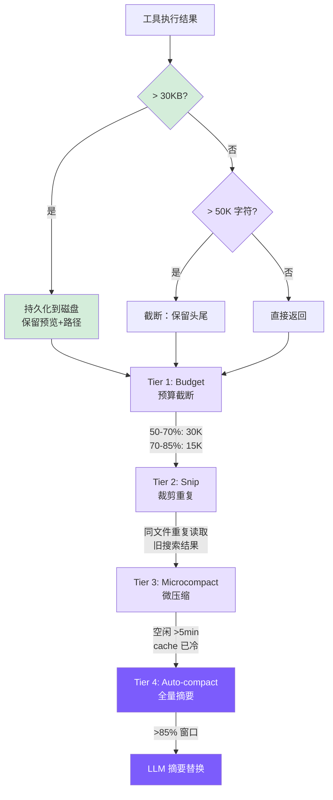

# 7. 上下文管理

## 本章目标

到上一章为止，agent 已经能安全地读写、跑命令了，可还有个绕不过去的问题——第 1 章就埋下了：消息数组每一轮都在变长。跑上几十轮，它迟早撑爆模型的上下文窗口，一旦超了，API 直接报错，整轮对话就断了。这一章造上下文压缩，让 agent 能一直跑下去。

压缩做成四层，从最轻的「裁掉大块工具输出」到最重的「让模型把整段对话总结成一段摘要」，逐级加码，能用轻的就不上重的。章末还会顺手接上前缀缓存——第 3 章切出来的那个静态核心，正好在这里省钱。



> ▶ **跑这一章**：`node steps/run.mjs 7`（无需 API key）——看它在对话变长时把旧消息压成摘要。加 `--diff` 看它比上一章多了什么。想拿自己的 prompt 连真实模型，就加 `--live`（读 `.env` 里的 key，`--py` 跑 Python 版）。

## 我们的实现

第 1 章说过，消息数组每一轮都在变长。跑久了它迟早撑爆模型的上下文窗口。这一章加压缩：消息一多，就用一次额外的模型调用把旧消息总结成一段摘要，替换掉原文，只留最近几条。相对上一章，新增了一个 `context.ts`，agent 每次调模型前先过一遍压缩：

压缩本身就是「超过阈值就摘要旧消息」：

跑一下，读几个文件把历史撑长，压缩就触发了（看那行 `compacted ... into a summary`）：

```
$ node steps/run.mjs 7
▶ step 7 demo (no API key — local mock model)   sandbox: <sandbox>
  you: Read a.txt, then b.txt, then c.txt, then summarize.

  → read_file({"file_path":"a.txt"})

  → read_file({"file_path":"b.txt"})

  → read_file({"file_path":"c.txt"})
  (compacted 5 messages into a summary)
All three read: alpha, beta, gamma.
```

> 到这里，本章能跑的那段最小实现就讲完了——上面这些就是 `node steps/run.mjs` 这一章实际执行的**全部**代码。下面是仓库里 production 版 mini-claude 对同一件事的完整做法：边界情况、工程细节更多，当**选读扩展**看，跟这一章跑起来的那段不是同一份代码。

分层来做：执行时截断（Tier 0）打底兜住单次超大输出，上面叠 4 个压缩 tier——Budget、Snip、Microcompact、Auto-compact——从轻到重，前三个每次 API 调用前顺序跑，最重的 Auto-compact 在 turn 边界触发。

### 第 0 层：执行时截断（truncateResult）

保留头尾而非只保留头部：文件开头有 imports、类定义等结构信息，命令输出的错误摘要通常在最后。

与 Claude Code 的区别：Claude Code 持久化到磁盘，模型后续可用 Read 工具取回完整内容。我们现在也实现了持久化——见下方 persistLargeResult。两层配合、顺序关键：工具层返回**完整**结果，agent 层先用 persistLargeResult 把 >30KB 的结果全量落盘（上下文只留预览），truncateResult 移到 persist **之后**作兜底——只对极端情况（如单行超长的预览消息）生效。注意 truncateResult 不能在工具层先执行：那样落盘的就已经是截断品，信息在持久化前就丢了（这正是 issue #6 修复的 bug）。

### 第 0.5 层：大结果持久化（persistLargeResult）

当工具返回结果超过 30KB 时，将完整内容写入磁盘，上下文中只保留预览和文件路径。模型后续可以用 `read_file` 按需取回完整输出。

```typescript
// agent.ts — persistLargeResult

private persistLargeResult(toolName: string, result: string): string {
  const THRESHOLD = 30 * 1024; // 30 KB
  if (Buffer.byteLength(result) <= THRESHOLD) return result;

  const dir = join(homedir(), ".mini-claude", "tool-results");
  mkdirSync(dir, { recursive: true });
  const filename = `${Date.now()}-${toolName}.txt`;
  const filepath = join(dir, filename);
  writeFileSync(filepath, result);

  const lines = result.split("\n");
  const preview = lines.slice(0, 200).join("\n");
  const sizeKB = (Buffer.byteLength(result) / 1024).toFixed(1);

  return `[Result too large (${sizeKB} KB, ${lines.length} lines). Full output saved to ${filepath}. You can use read_file to see the full result.]\n\nPreview (first 200 lines):\n${preview}`;
}
```

这一层的设计要点：

- **30KB 阈值低于 truncateResult 的 50K 限制**：在截断发生之前先拦截大结果，避免不可逆的信息丢失。如果一个结果有 80KB，persistLargeResult 会先将完整内容保存到磁盘，返回预览；而不是等 truncateResult 把中间部分永久丢弃。
- **200 行预览**：给模型足够的上下文来判断是否需要读取完整输出。大多数情况下，前 200 行已经包含了关键信息（文件列表的开头、搜索结果的前几个匹配、命令输出的主要内容）。
- **可恢复 vs 不可恢复**：这是与 truncateResult 的根本区别。truncateResult 是不可逆的——被截掉的内容永远消失了。persistLargeResult 把数据保存到 `~/.mini-claude/tool-results/{timestamp}-{toolName}.txt`，模型随时可以用 `read_file` 取回。
- **调用时机**：在主循环中每次工具执行完成后、结果添加到消息之前调用。这意味着它在 truncateResult 之前生效——先尝试保存，保存后返回的预览文本通常远小于 50K，不会再触发截断。
- **与 Claude Code 的对齐**：这一设计直接对应 Claude Code 的 Level 1 策略（持久化到磁盘，上下文中只保留引用）。区别在于 Claude Code 用 2KB 预览，我们用 200 行——思路相同，实现简化。

### 第 1 层：Budget — 动态缩减工具结果

随上下文压力动态收紧历史中工具结果的大小：

第 0 层是一次性的 50K 硬限制；Budget 是每次 API 调用前重算，预算随利用率自动收紧。用双阈值（50%/70%）而非单阈值，是为了在上下文还宽裕时多保留细节。

### 第 2 层：Snip — 替换过时的工具结果

Snip 策略（利用率 > 60% 时触发）：
- 同一文件被 `read_file` 多次读取 → 只保留最新一次，旧的 snip
- 同类搜索结果超过 3 个 → snip 最旧的
- 最近 3 个 `tool_result` 永远保留

关键点：**只清 `tool_result` 的 content，保留 `tool_use` block 不变**。模型仍能看到"我之前读了 /src/main.ts"，只是看不到内容了——如果需要，可以重新调用 `read_file`。保留元数据比保留数据更重要。

### 第 3 层：Microcompact — 缓存冷启动时激进清理

用时间触发的原因：prompt cache 有 TTL，空闲超过 5 分钟后缓存大概率已过期，继续保留旧消息内容没有成本优势，不如激进清理。

Snip 是选择性的（只替换"过时"结果），Microcompact 是无差别的（除最新 3 个外全清）——更激进，但触发条件更严格。

我们只实现了基于时间的路径。Claude Code 的缓存编辑路径依赖 `cache_edits` API 机制，对教学实现过于复杂。

### 第 4 层：Auto-compact — 全量摘要压缩

#### 触发条件

`effectiveWindow = 模型上下文窗口 - 20000`，预留给新一轮输入/输出。对 Claude（200K 窗口），触发点约在 76.5% 总利用率。

> ⚠️ **调用方契约**：`checkAndCompact` 只能在 turn boundary 调用（用户输入 push 进消息数组之后、API 调用之前）。下面的 `compactAnthropic` / `compactOpenAI` 会把消息数组的最后一条当成"已被处理的纯文本 user 消息"——它会先 `slice(0, -1)` 去生成摘要，再在最后把这条消息 append 回来。一旦在 tool 循环中段调用，最后一条会是 `tool_result`（Anthropic）或 `tool` role（OpenAI），slice 后前面 `assistant` 的 `tool_use` / `tool_calls` 失去配对，API 会直接报错。

#### Anthropic 后端压缩

与 Claude Code 的主要差异：Claude Code 用"分析-摘要"两阶段提示词生成更高质量的摘要，压缩后恢复最近 5 个文件和活跃技能，有熔断器防无限循环。我们是简化版——单段摘要、无恢复机制、无熔断。

#### OpenAI 后端压缩

OpenAI 的 system prompt 在消息数组中（`role: "system"`），压缩时需要额外保留：

守卫条件是 `< 5` 而非 `< 4`，因为 OpenAI 消息数组最少包含 system + 2 轮对话 + 最新用户消息 = 5 条。

### 手动压缩

```
> /compact
  ℹ Conversation compacted.
```

调用链：`cli.ts` → `agent.compact()` → `compactConversation()` → `compactAnthropic()` / `compactOpenAI()`

### Token 统计与管道编排

每次 API 调用后更新：

开了缓存后 `input_tokens` 只剩未命中的那点，所以 `lastInputTokenCount`（用来判断是否接近窗口上限）得把三类输入 token 加回来，再带上本轮 output——它下一轮会变成 prompt 的一部分。`totalInputTokens` 与 cache read/write 分开累计，费用估算见「前缀缓存」一节。

4 层在每次 API 调用前顺序执行：

Tier 1-3 在每次 API 调用**前**运行（零 API 成本），Tier 4 在 **turn boundary 触发**——即每次用户输入 push 进消息数组后、`while` 主循环开始前。**不要**把 Tier 4 放在 tool 循环末尾：那时最后一条消息是 `{role: "user", content: [tool_result, ...]}`，`compactAnthropic` 内部的 `slice(0, -1)` 会切断它与前一条 `assistant` 消息里 `tool_use` 的配对，Anthropic API 会以 *"tool_use ids were found without tool_result blocks immediately after"* 拒绝那次 summarize 请求。`lastInputTokenCount` 在新位置仍然有效——它反映上一轮最后一次 API call 的状态，足以判断是否触发。顺序也有意义：Budget 先压缩大结果，让 Snip 的去重判断更准确，Microcompact 最后在时间条件满足时无差别清理。

## 前缀缓存

前面几层管的是"上下文太大怎么缩"，这一节管的是另一件事：同样一段前缀，怎么让服务端别每轮都重新算一遍。早期版本没做缓存，每轮都把完整的系统提示词、工具定义和不断增长的历史当全新输入发出去、全价计费——一次请求光前缀就有五千多个 token 被反复重算。补上缓存后，多轮对话里第二轮起这部分基本免费。

Claude Code 的完整做法在[第 3 章](https://windy3f3f3f3f.github.io/how-claude-code-works/#/docs/03-context-engineering)讲得很细，这里说我们照着搬了哪些、哪些搬不动。

### 两个缓存断点

Anthropic 的缓存不会凭空发生——请求里没有任何 `cache_control`，就一点都不缓存、全价计费。开启方式有两种：像 Claude Code 一样显式打块级断点，或用 2026 年初上线的顶层 automatic caching（请求顶层放一个 `cache_control` 字段，系统自动放置并推进断点）。我们照 Claude Code 的做法走显式断点，打两个：

第一个在系统提示词上。`buildAnthropicSystem` 把 `system` 从一个字符串拆成两个 text block——静态核心（所有会话都一样的角色、规则、工具说明）标 `cache_control`，动态尾巴（环境、git、技能列表）跟在后面不标。工具数组不用单独打断点：API 的渲染顺序是 `tools → system → messages`，标在静态 system 块上，前面的工具定义就一并缓存了。

第二个断点滚动地打在最后一条消息上。`withCacheBreakpoints` 每次请求前给消息数组末条的最后一个内容块标 `cache_control`，这样上一轮及更早的消息全部落在缓存前缀里，只有本轮新增的部分需要重新处理。它是个纯函数，返回一份改过的副本、不动原始历史——否则 `cache_control` 这种请求元数据会被写进会话存档和摘要请求。跳过 `thinking` 块是因为它们内容不稳定，标在上面反而降低命中率。
