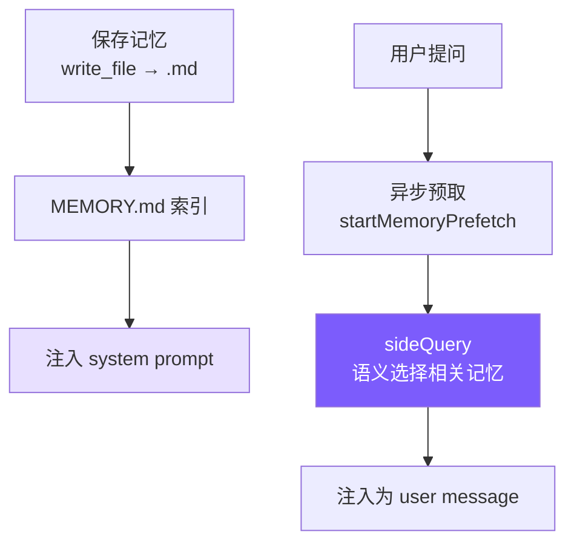

# 8. 记忆系统

## 本章目标

到现在，agent 的「记忆」还只是那个消息数组——会话一关就全忘了，下次得从头再来。这一章给它造跨会话的长期记忆。

把用户偏好、项目事实这些写进磁盘上的小文件，一份记忆一个文件；下次开会话时，按当前话题的相关度自动捞回相关的几条塞进 System Prompt，而不是把整段历史都背回来。



> ▶ **跑这一章**：`node steps/run.mjs 8`（无需 API key）——看它从磁盘里的记忆认出「部署去 staging」。加 `--diff` 看它比上一章多了什么。想拿自己的 prompt 连真实模型，就加 `--live`（读 `.env` 里的 key，`--py` 跑 Python 版）。

---

## 我们的实现

到现在，agent 的「记忆」还只是那个消息数组——会话一关就全忘了。这一章给它跨会话的长期记忆：事实写成磁盘上的小文件，每次对话前按当前问题的相关度捞回几条、拼进 System Prompt。相对上一章，新增了一个 `memory.ts`，agent 调模型前把召回的记忆追加到系统提示里：

召回就是「跟当前问题词有重叠的记忆，取相关度最高的几条」——确定性、不额外调模型：

跑一下，磁盘里存着一条「部署去 staging」，问到部署时它就被召回、agent 于是知道：

```
$ node steps/run.mjs 8
▶ step 8 demo (no API key — local mock model)   sandbox: <sandbox>
  you: Where should I deploy my changes to test them?

Deploy to https://staging.example.com (staging).
```

> 到这里，本章能跑的那段最小实现就讲完了——上面这些就是 `node steps/run.mjs` 这一章实际执行的**全部**代码。下面是仓库里 production 版 mini-claude 对同一件事的完整做法：边界情况、工程细节更多，当**选读扩展**看，跟这一章跑起来的那段不是同一份代码。

### 存储结构

```
~/.mini-claude/projects/{sha256-hash}/memory/
├── MEMORY.md                          # 索引文件
├── user_prefers_concise_output.md
├── feedback_no_summary_at_end.md
├── project_auth_migration_q2.md
└── reference_ci_dashboard_url.md
```

路径中的哈希是 `process.cwd()` 的 sha256 前 16 位——同一项目目录始终映射到同一记忆空间。

### 记忆文件格式

```markdown
---
name: 不要在回复末尾总结
description: 用户明确要求省略总结段落
type: feedback
---
用户说"不要在响应末尾总结"，因为他们能自己看 diff 和代码变更。

**Why:** 用户觉得总结浪费时间，更喜欢直接给出结果。
**How to apply:** 完成任务后直接结束，不要加 "总结" 或 "以上是..." 段落。
```

### Frontmatter 解析（共享模块）

记忆和技能都要解析 YAML frontmatter，抽出 `frontmatter.ts`：

没有用 `js-yaml` 之类的库——我们的 frontmatter 只是简单的 `key: value`，20 行手写解析器够用且零依赖。

### 保存与索引

文件名格式 `{type}_{slugified_name}.md` 让文件系统排序时自动按类型分组，人眼扫描也一目了然。每次写入后立即重建索引，保持 MEMORY.md 与文件系统同步。

### 索引截断

两层截断各有用途：行截断（200 行）是正常防护，按完整条目截断；字节截断（25KB）是异常防御，捕捉行数不多但单行极长的情况——Claude Code 团队在生产中见过 197KB 塞在 200 行内的案例。

### System Prompt 注入

`buildMemoryPromptSection()` 生成注入到 system prompt 的文本，告诉模型记忆系统的存在和用法：

这段 prompt 做了三件事：教模型分类（四种类型）、教模型操作（用 `write_file`、存到哪里、什么格式）、教模型克制（"What NOT to Save"）。"让模型使用记忆"不只是给它一个工具，还要在 prompt 中描述完整的类型体系和边界，模型才能做出好的决策。

最后在 `prompt.ts` 中通过占位符注入：

### CLI 交互

用户在 REPL 中输入 `/memory` 可以列出所有记忆：

---

### 语义召回（sideQuery）

早期版本用关键词匹配做记忆召回——把查询拆成词，统计每条记忆的命中数排序。这很简单但能力有限：用户问"部署流程"时，标题为"CI/CD 注意事项"的记忆完全匹配不上，因为没有共同关键词。

新版本用 `sideQuery` 做语义召回：把所有记忆的文件名和描述发给模型，让模型判断哪些与当前查询相关。

```typescript
// memory.ts — selectRelevantMemories

const SELECT_MEMORIES_PROMPT = `You are selecting memories that will be useful to an AI coding assistant as it processes a user's query. You will be given the user's query and a list of available memory files with their filenames and descriptions.

Return a JSON object with a "selected_memories" array of filenames for the memories that will clearly be useful (up to 5). Only include memories that you are certain will be helpful based on their name and description.
- If you are unsure if a memory will be useful, do not include it.
- If no memories would clearly be useful, return an empty array.`;

export async function selectRelevantMemories(
  query: string,
  sideQuery: SideQueryFn,
  alreadySurfaced: Set<string>,
  signal?: AbortSignal,
): Promise<RelevantMemory[]> {
  const headers = scanMemoryHeaders();
  if (headers.length === 0) return [];

  // 过滤已经在本会话中展示过的记忆
  const candidates = headers.filter((h) => !alreadySurfaced.has(h.filePath));
  if (candidates.length === 0) return [];

  const manifest = formatMemoryManifest(candidates);

  try {
    const text = await sideQuery(
      SELECT_MEMORIES_PROMPT,
      `Query: ${query}\n\nAvailable memories:\n${manifest}`,
      signal,
    );

    // 从响应中提取 JSON（模型可能用 markdown 代码块包裹）
    const jsonMatch = text.match(/\{[\s\S]*\}/);
    if (!jsonMatch) return [];

    const parsed = JSON.parse(jsonMatch[0]);
    const selectedFilenames: string[] = parsed.selected_memories || [];

    // 文件名映射回 header，读取完整内容
    const filenameSet = new Set(selectedFilenames);
    const selected = candidates.filter((h) => filenameSet.has(h.filename));

    return selected.slice(0, 5).map((h) => {
      let content = readFileSync(h.filePath, "utf-8");
      // 单文件截断（4KB）
      if (Buffer.byteLength(content) > MAX_MEMORY_BYTES_PER_FILE) {
        content = content.slice(0, MAX_MEMORY_BYTES_PER_FILE) +
          "\n\n[... truncated, memory file too large ...]";
      }
      const freshness = memoryFreshnessWarning(h.mtimeMs);
      const headerText = freshness
        ? `${freshness}\n\nMemory: ${h.filePath}:`
        : `Memory (saved ${memoryAge(h.mtimeMs)}): ${h.filePath}:`;

      return { path: h.filePath, content, mtimeMs: h.mtimeMs, header: headerText };
    });
  } catch (err: any) {
    // 静默失败——记忆召回永远不应阻塞主循环
    if (signal?.aborted) return [];
    console.error(`[memory] semantic recall failed: ${err.message}`);
    return [];
  }
}
```

几个关键设计点：

**sideQuery 用的是同一个模型，不是单独的小模型。** Claude Code 用 Sonnet 做 sideQuery，我们简化为直接复用用户配置的模型。sideQuery 只发送记忆清单（文件名 + 描述），不发送完整内容，所以输入 token 很少。

**模型做语义选择，比关键词匹配强得多。** "部署流程"能匹配到"CI/CD 注意事项"，"数据库性能"能匹配到"PostgreSQL 索引优化经验"——因为模型理解语义关联，不只是字面重叠。

**`alreadySurfaced` Set 防止重复召回。** 同一会话中已经展示过的记忆不会再次出现，避免用户每次提问都看到相同的记忆。这个 Set 在整个会话生命周期内持续增长。

**单文件 4KB 截断 + 会话总预算 60KB。** 防止单条巨大记忆或累积过多召回挤占上下文。预算是字节级控制，不是 token 级——字节计算更快，且对多语言文本更公平。

> **对比旧版关键词匹配（已替换）：** 旧实现把查询拆词后逐条匹配，零 API 调用但准确度低。新版每次召回消耗 1 次 API 调用，但语义理解能力质的飞跃。对于教程项目记忆量少的场景，这个 API 成本完全可以接受。

### 异步预取（startMemoryPrefetch）

语义召回需要一次 API 调用，如果同步执行会增加用户等待时间。解决方案：**在用户提交输入的瞬间就启动召回，与第一次模型 API 调用并行执行。**

```typescript
// memory.ts — startMemoryPrefetch

export function startMemoryPrefetch(
  query: string,
  sideQuery: SideQueryFn,
  alreadySurfaced: Set<string>,
  sessionMemoryBytes: number,
  signal?: AbortSignal,
): MemoryPrefetch | null {
  // 门控 1: 单词查询跳过（太短，无法语义匹配）
  if (!/\s/.test(query.trim())) return null;

  // 门控 2: 会话预算已满
  if (sessionMemoryBytes >= MAX_SESSION_MEMORY_BYTES) return null;

  // 门控 3: 没有记忆文件
  const dir = getMemoryDir();
  const hasMemories = readdirSync(dir).some(
    (f) => f.endsWith(".md") && f !== "MEMORY.md"
  );
  if (!hasMemories) return null;

  const handle: MemoryPrefetch = {
    promise: selectRelevantMemories(query, sideQuery, alreadySurfaced, signal),
    settled: false,
    consumed: false,
  };
  handle.promise.then(() => { handle.settled = true; }).catch(() => { handle.settled = true; });
  return handle;
}
```

在 `agent.ts` 中的使用：

```typescript
// agent.ts — 预取启动与消费

// 用户消息进入后立即启动预取
this.anthropicMessages.push({ role: "user", content: userMessage });
let memoryPrefetch: MemoryPrefetch | null = null;
if (!this.isSubAgent) {
  const sq = this.buildSideQuery();
  if (sq) {
    memoryPrefetch = startMemoryPrefetch(
      userMessage, sq,
      this.alreadySurfacedMemories, this.sessionMemoryBytes,
      this.abortController?.signal,
    );
  }
}

// while 循环中，每次 API 调用前做非阻塞轮询
if (memoryPrefetch && memoryPrefetch.settled && !memoryPrefetch.consumed) {
  memoryPrefetch.consumed = true;
  const memories = await memoryPrefetch.promise;
  if (memories.length > 0) {
    const injectionText = formatMemoriesForInjection(memories);
    this.anthropicMessages.push({ role: "user", content: injectionText });
    // 跟踪已展示的记忆和会话预算
    for (const m of memories) {
      this.alreadySurfacedMemories.add(m.path);
      this.sessionMemoryBytes += Buffer.byteLength(m.content);
    }
  }
}
```

这个设计的关键在于**非阻塞轮询**：

1. **预取在用户输入时启动**——与第一次模型 API 调用并行，用户感知不到额外延迟
2. **每次循环迭代都检查**——如果预取还没完成，不等待，直接跳过；下一次迭代再检查
3. **`settled` 标志用 `.then()` 设置**——不用 `await`，只在确认完成后才读取结果
4. **消费后标记 `consumed = true`**——确保同一次预取只注入一次

三个门控条件避免浪费 API 调用：
- **有效查询**：中文/日文/韩文至少 2 个字符，或英文这类空格分词语言至少两个词；单个词（如 "hi"）太短，语义匹配无意义
- **会话预算**：累积超过 60KB 后停止召回，防止上下文过载
- **记忆存在性**：没有记忆文件时跳过，省一次 API 调用
