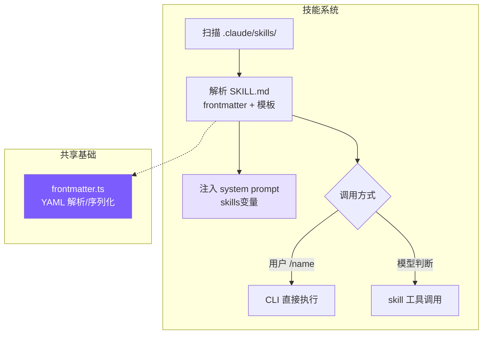
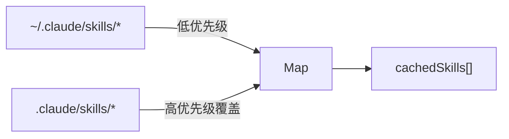
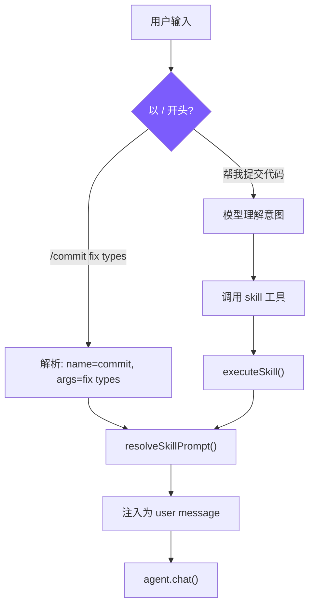

# 9. 技能系统

## 本章目标

有些提示词会反复用到——「读 diff、写 commit message、提交」这一套，每次手打一遍很烦。这一章给 agent 造技能系统，把这类 prompt 打包成随用随调的模块。

一个技能就是一个文件：一段 prompt 加几行元信息（名字、什么时候用、允许哪些工具）。`/commit` 一声就调起来，像 shell 脚本一样即装即用。调用还分两种：inline 把 prompt 直接拼进当前对话，fork 丢给一个干净的子 agent 单独跑。



> ▶ **跑这一章**：`node steps/run.mjs 9`（无需 API key）——看 `/commit` 调起一个技能。加 `--diff` 看它比上一章多了什么。想拿自己的 prompt 连真实模型，就加 `--live`（读 `.env` 里的 key，`--py` 跑 Python 版）。

---

## 我们的实现

有些提示词会反复用到——「读 diff、写 commit message」这套，每次手打一遍很烦。这一章给 agent 造技能：把这类 prompt 存成文件，`/commit` 一声就调起来，像 shell 脚本一样即装即用。相对上一章，新增了一个 `skills.ts`，CLI 收到 `/name` 就把它换成那个技能的 prompt：

一个技能就是一个文件；解析就是「以 `/` 开头就去 `.mini-skills/` 找同名文件，读出它的 prompt」：

跑一下，`.mini-skills/commit.md` 里存着一段写 commit 的提示词，`/commit` 就把它调起来：

```
$ node steps/run.mjs 9
▶ step 9 demo (no API key — local mock model)   sandbox: <sandbox>
  $ mini-claude /commit

feat: add the new thing
```

> 到这里，本章能跑的那段最小实现就讲完了——上面这些就是 `node steps/run.mjs` 这一章实际执行的**全部**代码。下面是仓库里 production 版 mini-claude 对同一件事的完整做法：边界情况、工程细节更多，当**选读扩展**看，跟这一章跑起来的那段不是同一份代码。

### SKILL.md 格式

```markdown
---
name: commit
description: Create a git commit with a descriptive message
when_to_use: When the user asks to commit changes or says "commit"
allowed-tools: run_shell, read_file
user-invocable: true
---
Look at the current git diff and staged changes. Write a clear, concise
commit message following conventional commits format.

The user's request: $ARGUMENTS

Project skill directory: ${CLAUDE_SKILL_DIR}
```

- `when_to_use`：给模型看的触发条件，模型根据此判断是否自动调用
- `allowed-tools`：安全边界，限制技能可使用的工具
- `user-invocable`：`false` 的技能只能被模型自动触发

### 发现与加载



用 Map 去重自然实现"项目级覆盖用户级"——先加载 user，再加载 project，同名 key 被后者覆盖。Claude Code 有 6 个来源是因为要支持企业和 MCP 场景，project + user 覆盖了个人开发者的核心需求。

### 技能解析

`allowed-tools` 同时支持逗号分隔和 JSON 数组两种写法，先尝试 JSON.parse，失败就按逗号拆——用户写 YAML 时两种格式都很自然，容错解析避免因格式问题导致技能加载失败。`when_to_use` 同时兼容下划线和连字符两种 key 名，同理。

### Prompt 模板替换

`$ARGUMENTS` 替换用户传入的参数，`${CLAUDE_SKILL_DIR}` 替换技能目录路径（技能可以在目录里放模板文件，在 prompt 中用 `read_file` 引用）。Claude Code 还支持 `` !`shell_command` `` 内联执行，我们没有实现——它增加了安全风险，教程场景不需要。

### 双重调用路径



**路径 1：用户手动调用**（cli.ts）

**路径 2：模型程序化调用**（tools.ts）

模型调用 `skill` 工具后得到的是展开后的 prompt 文本，在接下来的回合中按这个 prompt 执行任务。本质上是**元工具**——工具的返回值不是数据，而是指令。

### 执行模式：inline vs fork

fork 时子 Agent 工具受 `allowedTools` 白名单约束，没指定则排除 `agent` 工具防止递归。技能需要多轮工具调用（如代码审查读多个文件）时选 fork，保持主对话干净。

### System Prompt 描述

技能分两组展示：用户可调用的加 `/` 前缀，仅模型可调用的不加。`whenToUse` 是给模型看的判断条件，决定是否主动触发。Claude Code 还做了 token 预算控制（`formatCommandsWithinBudget()`），我们跳过——教程场景技能数量有限。

---

## 真实 Claude Code 比这多做了什么

我们的技能就是两种加载模式加一个文件解析器。Claude Code 在「从哪儿发现技能、怎么懒加载、fork 出去怎么隔离」上做得更全——先看它怎么定位技能这件事。

技能是 Claude Code 的"AI Shell 脚本"——把 AI 工作流模板化，一次定义，反复复用。一个 `/commit` 技能封装了"读 diff → 分析变更 → 撰写 commit message → 提交"的完整 prompt。

技能从 6 个来源加载，优先级从高到低：企业策略（managed）> 项目级 > 用户级 > 插件 > 内置（bundled）> MCP。规律很简单：越接近用户控制的来源优先级越高，MCP 来自远程不受信任的服务端所以垫底。每个技能必须是目录格式 `skill-name/SKILL.md`，允许技能附带资源文件并通过 `${CLAUDE_SKILL_DIR}` 引用。

启动时只预加载 frontmatter（name/description/whenToUse），完整 prompt 在调用时才读取。几十个技能全量加载会挤占大量上下文，懒加载把成本推迟到真正需要的时刻。即使只是 frontmatter，技能列表也需要 token 空间——`formatCommandsWithinBudget()` 用三阶段算法控制：预算充足时全量展示；超出时内置技能（`/commit`、`/review`）始终保留完整描述，其余按剩余预算均分；每个技能不足 20 字符时降级为仅显示名称。

技能 prompt 执行前经过多层替换：`$ARGUMENTS` 替换用户参数，`${CLAUDE_SKILL_DIR}` 替换技能目录路径，`` !`command` `` 内联 Shell 执行（MCP 技能禁用此特性，防止远程提示词注入执行任意命令）。

执行模式有两种：**inline**（默认）直接注入当前对话，**fork** 创建独立子 Agent 执行后返回结果。fork 适合需要大量工具调用的技能——比如代码审查要读多个文件，这些调用会污染主对话上下文，fork 后只有最终结果回到主线。

---

## 关键设计决策

**为什么技能用 Markdown 而非 JSON/YAML？** 技能的本体是大段自然语言 prompt。Markdown 的 body 直接就是 prompt 本身，frontmatter 提供结构化元数据。JSON 存储的话 prompt 需要转义换行符和引号，可读性很差。

**为什么需要双重调用路径？** 只支持 `/commit` 手动调用不够——用户可能说"帮我提交代码"而不知道有这个技能；只支持模型自动调用也不够——用户有时想精确控制触发时机。两条路径最终汇合到同一个 `resolveSkillPrompt()`，逻辑不重复。

### 简化对比总览

| 维度 | Claude Code | mini-claude |
|------|------------|-------------|
| **技能来源** | 6 个（managed/project/user/plugin/bundled/MCP） | 2 个（project + user） |
| **技能加载** | 懒加载 + token 预算控制 | 启动时全量加载 + 缓存 |
| **Prompt 替换** | `$ARGUMENTS` + `${CLAUDE_SKILL_DIR}` + `` !`shell` `` | `$ARGUMENTS` + `${CLAUDE_SKILL_DIR}` |

---

> **下一章**：让 Agent 先想清楚再动手——Plan Mode，只读规划模式。
