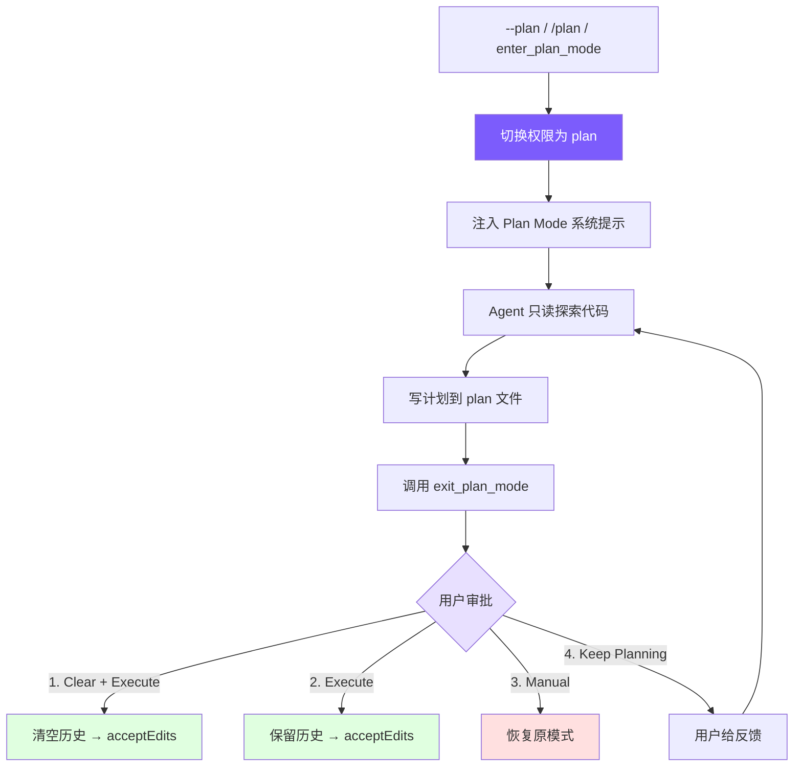

# 10. Plan Mode：只读规划模式

## 本章目标

工具、技能都齐了，agent 越来越会动手——可有时候并不想让它一上来就改代码，想先看看它打算怎么干、批准了再动手。这一章造 Plan Mode。

它是一个只读的规划模式：agent 只能读和想，不能写文件、不能跑 shell，把方案写进一个 plan 文件交上来。审批界面给四个选项——照做、改改再做、手动执行、继续规划。「只读」这条靠第 6 章的权限系统在代码层面强制，不是提示词求它别乱动。



> ▶ **跑这一章**：`node steps/run.mjs 10`（无需 API key）——看 `--plan` 下写文件被拦。加 `--diff` 看它比上一章多了什么。想拿自己的 prompt 连真实模型，就加 `--live`（读 `.env` 里的 key，`--py` 跑 Python 版）。

## 我们的实现

有时候不想让 agent 一上来就改代码，想先看看它打算怎么干、批准了再动手。这一章造 Plan Mode：一个只读模式，`--plan` 下 agent 能读能想，但写文件、跑 shell 全被拦下——靠的正是第 6 章那道权限闸，多加一条「plan 模式禁写」。相对上一章，agent 多了个 `mode`，执行工具前多判一次：

跑一下，`--plan` 下模型想写 `report.txt`，闸门以「plan mode」为由拦下，什么都没写：

```
$ node steps/run.mjs 10
▶ step 10 demo (no API key — local mock model)   sandbox: <sandbox>
  $ mini-claude --plan Create a file report.txt with the plan.

(plan mode: read-only)
I'll write the plan.
  → write_file({"file_path":"report.txt","content":"the plan"})
That was blocked because we're in plan (read-only) mode.
```

> 到这里，本章能跑的那段最小实现就讲完了——上面这些就是 `node steps/run.mjs` 这一章实际执行的**全部**代码。下面是仓库里 production 版 mini-claude 对同一件事的完整做法：边界情况、工程细节更多，当**选读扩展**看，跟这一章跑起来的那段不是同一份代码。

### 工具定义

Plan Mode 需要两个工具，标记为 `deferred`（延迟加载，详见[第 2 章](https://github.com/Windy3f3f3f3f/claude-code-from-scratch/blob/0b452360866433fde0dc77cd37ada9d303546592/docs/docs/02-tools.md)）：

两个工具都没有参数——进入和退出是纯状态切换，所有数据（plan 文件路径、审批结果）都在 Agent 内部管理。标记为 `deferred` 是因为大多数会话不需要 Plan Mode，延迟加载避免占用提示词空间。

### 模式切换

Plan Mode 涉及 4 个状态变量：

`prePlanMode` 是关键——它记住进入 Plan Mode 之前的权限模式，这样退出时可以精确恢复。如果用户之前是 `acceptEdits` 模式，退出 Plan Mode 后应该回到 `acceptEdits`，而不是变成 `default`。

切换逻辑是对称的进入/退出：

注意系统提示词的更新方式：进入时在 `baseSystemPrompt` 后追加 plan 提示，退出时恢复为 `baseSystemPrompt`。对于 OpenAI 格式，需要直接修改消息数组的第一条（系统消息）。

### Plan 文件与系统提示

Plan 文件路径按会话 ID 生成，确保每个会话有独立的 plan 文件：

Plan 系统提示注入了严格的 read-only 约束和工作流指引：

这个提示词做了三件事：
1. **约束行为**：明确禁止编辑和 shell（配合权限检查双重保障）
2. **声明 plan 文件**：告诉模型唯一可写的文件路径
3. **规定工作流**：Explore → Design → Write → Exit，确保模型不会跳步

最后一句"Do NOT ask the user to approve"很重要——没有这句，模型经常会在写完计划后问"这个计划可以吗？"而不是调用 `exit_plan_mode`，导致审批流程无法触发。

### 权限集成

Plan Mode 的 read-only 约束通过 `checkPermission()` 强制执行（详见[第 6 章](https://github.com/Windy3f3f3f3f/claude-code-from-scratch/blob/0b452360866433fde0dc77cd37ada9d303546592/docs/docs/06-permissions.md)）：

这里有一个精巧的设计：**plan 文件路径作为参数传入 `checkPermission()`**。当 Agent 试图写文件时，权限检查会比对目标路径和 plan 文件路径——只有完全匹配才放行。这意味着系统提示词说"只能写 plan 文件"不只是建议，而是代码强制执行的约束。

双重保障：
- **系统提示词**：引导模型不要尝试写其他文件（减少无效 API 调用）
- **权限检查**：即使模型无视提示词，写操作也会被拦截并返回错误

### 工具执行逻辑

`executePlanModeTool()` 处理 `enter_plan_mode` 和 `exit_plan_mode` 的执行：

核心逻辑分三层：

1. **enter_plan_mode**：状态切换 + plan 文件创建 + 提示词注入。幂等设计——已在 plan 模式时返回提示而不是报错。

2. **exit_plan_mode（有审批函数）**：读取 plan 文件 → 调用审批回调 → 根据用户选择处理：
   - `keep-planning`：不退出 plan 模式，把用户反馈作为工具结果返回给模型
   - `clear-and-execute`：清空消息历史（释放上下文）→ 切换到 `acceptEdits`
   - `execute`：保留历史 → 切换到 `acceptEdits`
   - `manual-execute`：恢复进入前的模式（用户手动审批每次编辑）

3. **exit_plan_mode（无审批函数）**：直接退出恢复原模式。这个分支用于子 Agent 场景——子 Agent 不需要用户交互式审批。

### 审批工作流

审批通过回调函数注入，解耦了 Agent 和 UI 层：

UI 部分显示计划内容和 4 个选项：

```typescript
// ui.ts — Plan 审批 UI

export function printPlanForApproval(planContent: string) {
  console.log(chalk.cyan("\n  ━━━ Plan for Approval ━━━"));
  const lines = planContent.split("\n");
  const maxLines = 60;
  const display = lines.slice(0, maxLines);
  for (const line of display) {
    console.log(chalk.white("  " + line));
  }
  if (lines.length > maxLines) {
    console.log(chalk.gray(`  ... (${lines.length - maxLines} more lines)`));
  }
  console.log(chalk.cyan("  ━━━━━━━━━━━━━━━━━━━━━━━━\n"));
}

export function printPlanApprovalOptions() {
  console.log(chalk.yellow("  Choose an option:"));
  console.log("    1) Yes, clear context and execute — fresh start with auto-accept edits");
  console.log("    2) Yes, and execute — keep context, auto-accept edits");
  console.log("    3) Yes, manually approve edits — keep context, confirm each edit");
  console.log("    4) No, keep planning — provide feedback to revise");
}
```

四个选项的设计背后是不同的使用场景：

| 选项 | 权限切换 | 上下文 | 适用场景 |
|------|---------|--------|---------|
| 1. Clear + Execute | → acceptEdits | 清空 | 计划完善，上下文已很长，从零执行最高效 |
| 2. Execute | → acceptEdits | 保留 | 计划完善，Agent 已有足够上下文直接执行 |
| 3. Manual | → 恢复原模式 | 保留 | 计划大致可以，但想逐步审批每个修改 |
| 4. Keep Planning | 不变 | 保留 | 计划需要修改，给反馈让 Agent 继续调整 |

### CLI 入口

Plan Mode 有三个入口：

三个入口的区别：
- `--plan`：启动时就进入 Plan Mode，整个会话从规划开始
- `/plan`：会话中途切换，适合"先聊后规划"的工作流
- `enter_plan_mode` 工具：Agent 自己判断需要先规划再执行（需要通过 ToolSearch 激活）

## 真实 Claude Code 比这多做了什么

我们的 Plan Mode 是一个只读开关加一个四选一的审批框。Claude Code 把它做成了一对完整的工具，进出计划态、如何交接方案都更讲究。

Claude Code 的 Plan Mode 是完整的 EnterPlanMode / ExitPlanMode 工具对：

1. **进入**：切换到 read-only 模式，生成 plan 文件（`~/.claude/plans/` 目录），注入 plan 系统提示约束 Agent 行为
2. **规划**：Agent 用只读工具探索代码，将实现计划写入 plan 文件
3. **退出**：Agent 调用 ExitPlanMode，用户看到计划后选择执行方式
4. **审批**：用户选择清空上下文执行、保留上下文执行、手动审批执行、或继续修改

关键设计：**Plan Mode 不是"不让 Agent 做事"，而是让 Agent 先想清楚再做**。plan 文件持久化到磁盘意味着即使清空上下文，计划也不会丢失——Agent 可以从零开始执行一个经过审批的方案。

## 设计决策

### 为什么 Plan 文件写磁盘？

Plan 文件持久化到 `~/.claude/plans/` 有两个原因：

1. **Clear-and-execute 选项需要**：清空上下文后，对话历史中的 plan 内容会丢失。但 plan 文件在磁盘上，Agent 可以重新读取。
2. **跨会话可用**：用户可以 `--resume` 恢复会话时看到之前的 plan，或者手动查看历史 plan 文件。

### 为什么审批是回调而不是直接实现？

`planApprovalFn` 是外部注入的回调，而不是 Agent 内部直接实现。这让 Agent 类不依赖具体的 UI 实现——CLI 用 readline，IDE 集成可以用 GUI 对话框，测试时可以注入模拟函数。子 Agent 没有审批函数时直接退出，不需要特殊处理。

### 为什么 clear-and-execute 切换到 acceptEdits？

用户既然审批了计划并选择了自动执行，说明他们信任 Agent 的修改方向。切换到 `acceptEdits` 让 Agent 无需反复确认每次文件编辑，大幅提升执行效率。如果用户想逐步审批，有专门的选项 3。

## 简化对比

| 维度 | Claude Code | mini-claude | 差异 |
|------|------------|-------------|------|
| Plan 文件 | 全局 plans 目录 + 语义文件名 | `~/.claude/plans/plan-\{sessionId\}.md` | 简化命名 |
| 审批选项 | 多种执行模式 + 权限提示 | 4 种选项（clear/execute/manual/revise） | 核心对齐 |
| 权限联动 | 深度集成（7 层权限体系） | checkPermission 特殊分支 + plan 文件白名单 | 简化但等效 |
| 工具加载 | 始终可用 | deferred 延迟加载 | 节省提示词空间 |
| 子 Agent | Plan Agent 类型 | Fallback 直接退出 | 简化分支 |

---

> **下一章**：当单个 Agent 的上下文不够用时——多 Agent 架构，分而治之。
