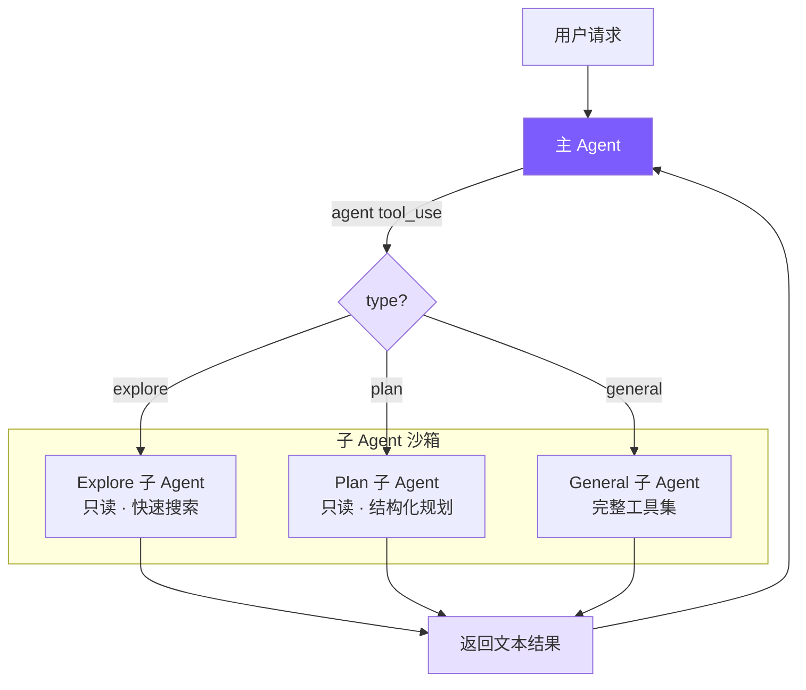

# 11. 多 Agent 架构

## 本章目标

Plan Mode 让 agent 先规划再动手，可再好的规划也扛不住一件事：一个大任务全塞进一个 agent，上下文很快就满了。这一章造子 agent，让主 agent 能把活分出去。

主 agent 派生一个独立的子 agent 去啃某个子任务——探索代码、做规划、跑通用活。子 agent 有自己干净的上下文，啃完只把结果带回来，不把一路的中间过程都灌回主对话。这就是「分而治之」，也是主 agent 上下文不够用时的出路。



> ▶ **跑这一章**：`node steps/run.mjs 11`（无需 API key）——看主 agent 派一个子 agent 去查文件。加 `--diff` 看它比上一章多了什么。想拿自己的 prompt 连真实模型，就加 `--live`（读 `.env` 里的 key，`--py` 跑 Python 版）。

## 我们的实现

一个大任务全塞进一个 agent，上下文很快就满了。这一章造子 agent：主 agent 通过一个 `agent` 工具派生出一个独立的子 agent 去啃某个子任务——子 agent 有自己干净的上下文，进程内递归地跑一个只读的小循环，啃完只把结果带回来。相对上一章，新增了一个 `subagent.ts`，agent 循环里 `agent` 工具单独拦一下：

子 agent 就是一个只读的迷你循环——只给它读工具，跑完把最后那段文本回报：

跑一下，主 agent 派子 agent 去读 `greeting.txt`，子 agent 查完回报，主 agent 于是作答：

```
$ node steps/run.mjs 11
▶ step 11 demo (no API key — local mock model)   sandbox: <sandbox>
  you: Use a sub-agent to find out what greeting.txt says.

  → agent({"task":"Read greeting.txt and report its contents."})
The sub-agent reports greeting.txt says: hello from the subagent demo.
```

> 到这里，本章能跑的那段最小实现就讲完了——上面这些就是 `node steps/run.mjs` 这一章实际执行的**全部**代码。下面是仓库里 production 版 mini-claude 对同一件事的完整做法：边界情况、工程细节更多，当**选读扩展**看，跟这一章跑起来的那段不是同一份代码。

用 **~199 行** 的 `subagent.ts` + Agent 类的少量改动，实现 Sub-Agent 模式的核心。

| Claude Code | 我们的实现 | 简化原因 |
|-------------|-----------|---------|
| 5 阶段执行流程 | 直接 new Agent + runOnce | 不需要 fork 进程、缓存共享 |
| 4 层工具过滤管道 | 1 个 Set + filter | 只有 3 种固定类型 |
| Haiku 模型给 Explore | 统一用主模型 | 减少配置复杂度 |
| deny-by-default 上下文隔离 | 天然隔离（独立 Agent 实例） | new Agent 自带独立消息历史 |

## 关键代码

### 1. Agent 类型配置 — `subagent.ts`

为什么连 shell 都不给？Explore 只做代码探索，`read_file`、`list_files`、`grep_search` 三个足够，索性不放 `run_shell`——从工具层面就断掉任何跑出破坏性命令的可能，比靠 prompt 提醒它"只跑只读命令"更稳。system prompt 也把这条读-only 契约再讲一遍：

Plan Agent 同样只读，但 prompt 引导它输出结构化方案：

General Agent 拿到除 `agent` 外的全部工具：

### 2. Agent 工具定义 — `tools.ts`

`agent` 作为一个普通工具注册，`type` 不是 required——LLM 不确定时可以省略，默认回退到 `general`：

### 3. Agent 类改造 — `agent.ts`

只需 4 处改动，让同一个 Agent 类同时服务于主 Agent 和子 Agent。

#### 3a. 构造函数：接受自定义配置

`customTools` 为 `None` 时回退到全量工具列表，对主 Agent 零侵入。

#### 3b. 输出捕获：emitText + outputBuffer

子 Agent 的文本输出不能直接打印，需要收集后返回给主 Agent：

`outputBuffer` 的三态：`null` = 主 Agent 模式（直接打印），`[]` = 子 Agent 模式（开始收集），`[...]` = 正在积累。流式回调只需调 `emitText`，完全不感知自己在哪个模式下运行。

#### 3c. runOnce：一次性执行入口

Token 用增量计算（运行后 - 运行前），因为 Agent 实例的计数器是累积的。`chat()` 完全复用，它不关心自己在主 Agent 还是子 Agent 中——工具集和输出去向已经在构造函数里配置好了。

#### 3d. executeAgentTool：执行子 Agent

子 Agent 出错时返回错误字符串，不会让父 Agent 崩溃——父 Agent 的 LLM 看到错误信息后可以自行决定重试或换策略。

权限继承：子 Agent 默认 `bypassPermissions`（主 Agent 已授权，子 Agent 不必再询问用户），但 Plan Mode 必须继承——否则子 Agent 可以绕过只读限制，是个安全漏洞。

`agent` 工具需要特殊分发，因为它需要访问当前 Agent 实例状态（model、permissionMode、token 计数器），无法走无状态的通用分发函数：

### 4. isSubAgent 标志

子 Agent 跳过三个只对主 Agent 有意义的操作：

- 分隔线：子 Agent 输出已被 buffer 捕获，不会显示在终端
- 会话保存：子 Agent 是一次性任务，保存其会话无意义，且可能覆盖主 Agent 的文件
- 费用打印：token 已汇总到父 Agent，子 Agent 自己打印会造成重复计费的错觉

### 5. 终端 UI — `ui.ts`

### 6. 自定义 Agent 类型：`.claude/agents/*.md`

与 Claude Code 的 `.claude/agents/` 完全一致的扩展方式：

```markdown

---
name: reviewer
description: Reviews code for bugs and style issues
allowed-tools: read_file, list_files, grep_search, run_shell
---
You are a code reviewer. Analyze the code thoroughly and report:
1. Bugs and potential issues
2. Style inconsistencies
3. Performance concerns
```

发现机制：项目级（`.claude/agents/`）优先级高于用户级（`~/.claude/agents/`），同名覆盖。frontmatter 复用 `parseFrontmatter()`，与 Memory 和 Skills 共享同一套解析器。

## 真实 Claude Code 比这多做了什么

我们的子 agent 只有 fork-return 一种玩法：派出去、拿回结果。Claude Code 的多 agent 体系还有协调者、蜂群这些模式，agent 之间能对等通信、并行探索。

Claude Code 的多 Agent 体系在 `src/tools/AgentTool/` 中实现，支持三种协作模式：

| 模式 | 特点 |
|------|------|
| **Sub-Agent**（fork-return） | 分叉独立执行，完成后返回结果 |
| **Coordinator** | 一个协调者分配任务给多个 Worker |
| **Swarm Team** | 多 Agent 对等协作，通过信箱通信 |

我们实现的是 Sub-Agent 模式，也是最常用的。

### 内置 Agent 类型

- **Explore**：用 Haiku 模型（更便宜），只读工具集，专门用于代码搜索
- **Plan**：只读 + 结构化输出，设计实现方案
- **General**：完整工具集（除了不能递归创建子 Agent）
- **Custom**：通过 `.claude/agents/*.md` 文件定义

### Coordinator 模式的关键设计

Coordinator 将主 Agent 变为**纯编排者**——工具集被硬限制为只有 `Agent`（派生 Worker）和 `SendMessage`（续传 Worker），完全无法执行文件操作。这个硬约束防止协调器"懒得委托、自己动手"而退化成普通单 Agent。

标准工作流分四阶段：**研究（并行只读）→ 综合（协调器串行理解）→ 实施（按文件集串行）→ 验证**。

其中综合阶段有个反直觉的约束：提示词里明确禁止写 "based on your findings"。这强制协调器真正理解并具体化研究结果（包含文件路径、行号），而不是把理解工作转包给下一个 Worker。

每个 Worker 都是从零开始的独立 Agent，看不到协调器与用户的对话，所以协调器写给 Worker 的 prompt 必须自包含——这是 Coordinator 模式中最容易踩坑的地方。

### 工具过滤：4 层管道

子 Agent 的工具访问经过 4 层过滤，实现纵深防御：

1. 移除元工具（`TaskOutput`、`EnterPlanMode`、`AskUserQuestion` 等）——子 Agent 不应控制 Agent 执行流程
2. 对自定义 Agent 额外限制——用户定义的类型不与内建类型同级信任
3. 异步 Agent 用白名单模式——后台运行无法展示交互 UI，必须严格限制
4. Agent 类型级 `disallowedTools`——如 Explore 显式排除写入工具

前三层是全局策略，第四层是类型策略。即使自定义 Agent 设置了 `disallowedTools: []`，前三层仍然有效。

### 上下文隔离

子 Agent 采用 deny-by-default：消息历史完全独立，`abortController` 单向传播（父中断→子中断，反之不行），子 Agent 的状态变更默认不传播到父级 UI。只有一个例外：Bash 启动的后台进程必须注册到根 store，否则成为僵尸进程。

### Worktree 隔离

多 Agent 并行写文件时，Claude Code 给每个写操作 Agent 分配独立的 Git Worktree——共享 `.git` 目录但有独立工作目录，完全无冲突，开销比 `git clone` 小得多。

## 关键设计决策

### Fork-return 为什么比 Coordinator 更适合作为起点？

Fork-return 的优势很简单：无共享状态（不可能污染主 Agent 上下文）、控制流确定（发请求等结果）、容错简单（子 Agent 出错主 Agent 继续工作）。Coordinator 在任务并行化上更强，但需要处理 Worker 之间的信息共享、冲突，复杂度高一个数量级。

### 为什么子 Agent 不能创建子 Agent？

General Agent 工具列表里过滤掉了 `agent`。不限制的话，A 创建 B、B 创建 C 的递归嵌套会指数级消耗 token——每层都有自己的系统提示词和消息历史。Claude Code 做了同样的限制，实践中 1 层已覆盖绝大多数场景。

### 为什么 explore/plan 只给三个只读工具，连 shell 都不给？

`read_file`、`list_files`、`grep_search` 已经覆盖了代码探索的绝大多数需要。索性不放 `run_shell`，从工具层面彻底断掉跑出破坏性命令的可能——教学版选了这条更稳的路。真实 Claude Code 的 Explore Agent 会放开只读 shell（`git log`、`find`、`wc` 这些对探索确实有用），靠 system prompt 约束只跑只读命令；两种做法各有取舍。

### 为什么用 buffer 收集输出而不是回调？

回调方案需要把 `onText` 传入构造函数，然后在 agent loop 里到处判断。Buffer 方案只改 `emitText` 一处，`runOnce` 开启、`chat` 写入、`runOnce` 收集并关闭，生命周期边界清晰，对现有代码零侵入。

---

整个实现的核心洞察：**子 Agent 本质上就是一个配置不同的 Agent 实例**。通过给 Agent 类添加少量可选参数（`customTools`、`customSystemPrompt`、`isSubAgent`），同一套 agent loop 同时服务于主 Agent 和子 Agent，避免了代码重复。

> **下一章**：让 Agent 连接外部工具服务器——MCP 集成。
