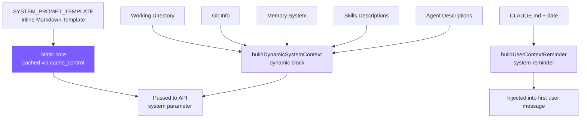

# 3. System Prompt Engineering

## Chapter Goals

Last chapter the agent got a set of tools, but it still doesn't know who it is, what environment it's working in, or when to be careful — all of which lives in the System Prompt, the first block of text assembled before every model call. This chapter builds it.

Split in two: a static core with identity, rules, and tool preferences, byte-identical across sessions (which makes it cacheable — Chapter 7 leans on that); and a dynamic half assembled each time with the current environment facts — OS, working directory, Git state, and the project's own `CLAUDE.md`.



> ▶ **Run this chapter**: `node steps/run.mjs 3` (no API key). Add `--diff` to see what it added over the previous chapter. To run your own prompt against a real model, add `--live` (it reads the key from `.env`; `--py` runs the Python version).

## Our Implementation

Last chapter's agent still used a hard-coded one-line system prompt. This chapter builds `prompt.ts`, giving it a real static core (identity, rules, tool preferences) plus a dynamic environment block. Relative to last chapter, `agent.ts` changes just one line — the hard-coded string becomes `buildSystemPrompt()`:

Run it, and it now works with the full system prompt in place:

```
$ node steps/run.mjs 3
▶ step 3 demo (no API key — local mock model)   sandbox: <sandbox>
  you: Read the file greeting.txt and tell me what it says.

  → read_file({"file_path":"greeting.txt"})
greeting.txt says: hello from step one.
```

### SYSTEM_PROMPT_TEMPLATE

The template is inline in `prompt.ts`. It IS the static core — no interpolation at all, byte-identical across sessions, which is exactly what makes it cacheable:
