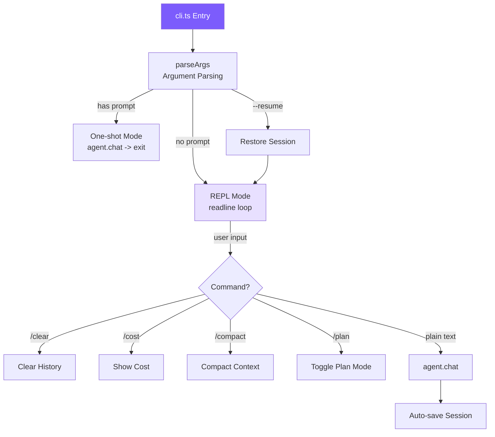

# 4. CLI and Sessions

## Chapter Goals

By the end of last chapter the agent's core is complete — loop, tools, System Prompt — but it still has no face to talk to a person through. This chapter builds the user interface.

A command-line entry point parses the arguments (switches like `--yolo`, `--resume`), a REPL lets a person chat a line at a time, Ctrl+C interrupts the current turn midway, and finished conversations are written to disk so `--resume` can pick them back up next time.



> ▶ **Run this chapter**: `node steps/run.mjs 4` (no API key). It saves a session, then `--resume`s it. Add `--diff` to see what it added over the previous chapter. To run your own prompt against a real model, add `--live` (it reads the key from `.env`; `--py` runs the Python version).

## Our Implementation

Last chapter's agent started blank every time — close the process and everything you said was gone. This chapter gives it a session: save the message array to disk after every turn, read it back on `--resume`. Relative to last chapter, it adds a `session.ts`, and `cli.ts` grows `--resume` and `/clear`:

The session itself is plain — the whole conversation is already a message array, so saving it is just writing JSON:

Run it: remember something, close, `--resume`, and it still knows:

```
$ node steps/run.mjs 4
▶ step 4 demo (no API key — local mock model)   sandbox: <sandbox>
  $ mini-claude Remember that my favorite color is blue.
  $ mini-claude --resume What is my favorite color?

Got it — your favorite color is blue.
(resumed 2 messages)
Your favorite color is blue.
```

### Argument Parsing

The TypeScript version uses a hand-written loop instead of commander.js, since there are only 11 arguments -- zero dependencies is lighter. It uses `for` instead of `forEach` because value-taking arguments (`--model claude-sonnet`) need `++i` to skip to the next element. The Python version uses the standard library `argparse` directly.

### Two Execution Modes

### REPL Implementation

**Dual semantics of Ctrl+C**: While processing, pressing it -> interrupts the current operation and returns to the input prompt; while idle, pressing it -> first time shows a reminder, second time exits. This avoids two undesirable scenarios: accidentally pressing Ctrl+C and losing the entire session, and watching helplessly while the Agent runs off track.

**`rl.once` vs `rl.on`**: A handler registered with `rl.on` responds to the next line of input without waiting for `await agent.chat()` to complete, causing multiple chats to concurrently modify message history. `rl.once` listens for only one line at a time, recursively re-registering after processing -- naturally serial. Python's `while + input() + await` doesn't have this problem.

### Session Persistence

Auto-saves after each `agent.chat()` completes; save failures are silently ignored (a full disk shouldn't crash the entire conversation). Recovery simply loads the message array back into the Agent:

### Terminal UI -- ui.ts

All output is uniformly formatted through `ui.ts`:

Tool results are truncated to 500 characters at the UI layer -- this display is for humans; the complete result is already in the message history.

## What the Real Claude Code Does Beyond This

Our interface is a readline plus a few print calls. Claude Code's is a whole UI framework running in the terminal — the gap is all in making it stable, pleasant, and crash-proof in a real terminal.

Claude Code's entry point is `src/entrypoints/cli.tsx` -- using React/Ink to bring the component model into the terminal, supporting streaming Markdown rendering, Vim mode, multi-tab, keyboard customization. Sessions use JSONL format with append-only writes, making them crash-safe.

### Terminal-Native vs GUI

This is a deliberate choice. Developers' workflows live in the terminal -- opening a browser means a context switch. Being terminal-native makes it just another command-line tool, embedded into existing workflows alongside `git`, `grep`, etc. Specific benefits: works over SSH, can accept pipes (`echo "fix" | claude`), supports tmux multi-instance parallelism, near-zero memory overhead.

React/Ink's role is to compensate for the terminal's interaction limitations -- with the component model, complex UIs like streaming output and diff views become maintainable.

### Observable Autonomy

The core UX principle of Claude Code: **the Agent acts freely, but lets the user see every step in real time**.

```
read_file src/app.ts
  1 | import express from ...
  ... (1234 chars total)

edit_file src/app.ts
  - const port = 3000
  + const port = process.env.PORT
```

The cost of interrupting is far lower than the cost of undoing. Users can hit Ctrl+C within 3 seconds of the Agent going in the wrong direction, rather than waiting 20 seconds for it to finish and then spending even more time undoing. Each tool has 4 rendering methods (start/complete/denied/error), long-running tools stream stdout in real time rather than waiting until completion to display.

### JSONL Session Storage

Whole-JSON overwrite has two problems: a crash mid-write corrupts the entire file; the longer the conversation, the slower each save.

JSONL appends one line per turn, O(1) writes, and a crash loses at most the last line. The filesystem's append operation is typically atomic. Recovery parses line by line, skipping any incomplete line at the end.

---

> **Next chapter**: Making the agent's output appear in real time -- streaming output and dual-backend support.
