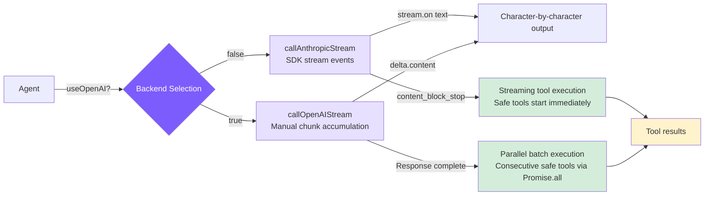

# 5. Streaming Output and Dual Backend

## Chapter Goals

By now the agent can run a full turn, but there's a rough edge: the model thinks for a while, then dumps a whole answer at once, leaving you staring at nothing for those seconds. This chapter makes the output appear character by character — print each small chunk the moment the model generates it.

Along the way the backend becomes two: besides Anthropic, it connects to any OpenAI-compatible endpoint, so switching models is just switching a base URL. The two backends stream over different protocols, which is exactly why they're worth covering together.



> ▶ **Run this chapter**: `node steps/run.mjs 5` (no API key). Add `--diff` to see what it added over the previous chapter. To run your own prompt against a real model, add `--live` (it reads the key from `.env`; `--py` runs the Python version).

## Our Implementation

Last chapter the agent called the model and waited for the whole reply (`messages.create`), so the answer appeared all at once. This chapter swaps that **one** call for a streaming one (`messages.stream`), so text shows up as it's generated. Relative to last chapter, it's just this one spot in the agent loop:

Run it — same behavior, but the output arrives as it is generated:

```
$ node steps/run.mjs 5
▶ step 5 demo (no API key — local mock model)   sandbox: <sandbox>
  you: Read the file greeting.txt and tell me what it says.

  → read_file({"file_path":"greeting.txt"})
greeting.txt says: hello from step one.
```

### Anthropic Backend: SDK Built-in Stream

The Anthropic SDK encapsulates all SSE parsing details: `stream.on("text")` directly delivers text deltas, and `stream.finalMessage()` returns a `Message` object identical to the non-streaming version. `\{ signal \}` passes in an AbortController, allowing Ctrl+C to abort the network request.

### OpenAI Compatible Backend: Manual Chunk Accumulation

OpenAI streaming delivers tool_calls parameters across multiple chunks, requiring manual accumulation and reconstruction.

For OpenAI tool_calls, the `id` and `name` only appear in the first chunk, and subsequent chunks only contain incremental `arguments` fragments. Chunks for multiple tool_calls arrive interleaved, distinguished by the `index` field -- you can only `JSON.parse()` after accumulation is complete.

### Tool Format Conversion

The two APIs have nearly identical tool definitions, just with different field names:

Anthropic uses `input_schema`, OpenAI uses `parameters` -- the content is identical.

### Retry Mechanism

The delay formula `min(1000 * 2^attempt, 30000) + random(0, 1000)`: the exponential part controls backoff speed, the 30-second cap prevents excessively long waits, and random jitter prevents multiple clients from retrying in sync and creating a "retry storm."

### Extended Thinking

Extended Thinking gives the model a private "scratchpad" for reasoning and planning before output, which noticeably helps with coding tasks requiring multi-step decisions.

Three modes:
- **adaptive**: Automatically enabled for claude-4.x models, budget of 10000 tokens, model decides whether to use it
- **enabled**: Explicitly enabled via `--thinking` flag, budget maximized
- **disabled**: For models that don't support thinking (Claude 3.x and OpenAI)

Thinking blocks can be thousands of tokens long and have no reference value for subsequent conversation. Filtering them out is the most direct way to prevent the context window from being filled with useless content.

### Streaming Tool Execution

When a `tool_use` block in the Anthropic streaming response is fully received (triggered by a `content_block_stop` event), if the tool is concurrency-safe (`read_file`, `list_files`, `grep_search`, `web_fetch`), execution starts immediately -- without waiting for the entire API response to complete. This "hides" tool execution time within the streaming window while the model generates subsequent content.

`callAnthropicStream` implements this internally through a callback mechanism:

Key design points:

- **`content_block_stop` is a block-level event**: It fires when a single `tool_use` block's JSON is fully received, not when the entire response ends. The model may return multiple tool calls in one response -- the first block may complete while the second is still streaming
- **Only concurrency-safe tools execute early**: Only read-only tools (`read_file`, `list_files`, `grep_search`, `web_fetch`) are executed early; write operations and command execution are not
- **Permission checks still apply**: Only tools where `checkPermission` returns `"allow"` execute early; tools requiring user confirmation (`"confirm"`) are not triggered early
- **Promises/Tasks are stored, awaited later**: The `earlyExecutions` Map stores Promises (TS) or Tasks (Python). When the subsequent tool processing loop finds an early execution result, it simply awaits it -- typically already complete by then
- **Core benefit**: During the 5-30 second streaming window, tool execution runs in parallel with model generation. Fast operations like file reads are often already complete by the time the stream ends

### Parallel Tool Execution

The prerequisite for parallel execution is marking which tools are concurrency-safe -- read-only tools have no side effects and can safely run simultaneously:

For the Anthropic backend, streaming tool execution naturally handles parallelism -- each tool block starts executing upon completion, and multiple tools naturally overlap in execution.

For the OpenAI backend (which doesn't support streaming tool block events), explicit batch parallelism is used: consecutive safe tools are grouped and executed all at once with `Promise.all` / `asyncio.gather`:

Comparison of parallel strategies between the two backends:

- **Anthropic backend**: Streaming execution handles parallelism automatically -- tools start upon block completion, and multiple tool executions naturally overlap
- **OpenAI backend**: Explicit batching after response completion -- consecutive safe tools are grouped into the same batch and executed in parallel with `Promise.all`
- **Mixed sequences maintain safety**: `[read, read, write, read]` gets split into `[read||read]`, `[write]`, `[read]` -- three batches. Tools before and after write operations are independent and don't parallelize across write operations
- **Typical speedup**: When the model reads 3-5 files in a single response, parallel execution usually brings a 2-3x speed improvement

## What the Real Claude Code Does Beyond This

Our streaming stopped at "print character by character." Claude Code's streaming pipeline does more on top: it starts running tools before the stream ends, meters tokens as they arrive, and reconnects automatically when the stream drops.

### Why Streaming Output?

Models generate at roughly 30-80 tokens per second, so longer responses take 10-30 seconds. Users can tolerate staring at a blank screen for about 2-3 seconds at most. Streaming output makes the first character appear within a few hundred milliseconds, turning "wait 30 seconds" into "watch content gradually being written" -- the perceived wait drops to near zero, and users can interrupt early if things go off track.

Under the hood, it uses SSE (Server-Sent Events): the server pushes `data:` lines over a single persistent HTTP connection, sending a `content_block_delta` event every few tokens. Simpler than WebSocket, and one-way push is sufficient for LLM applications.

### Streaming Processing and Parallel Tool Execution

A key optimization in Claude Code: the `StreamingToolExecutor` starts executing fully-parsed tool_use blocks while the model is still generating subsequent content. In a serial approach, tool execution can only begin after the full API response arrives; with streaming parallelism, the first tool_use block is dispatched the moment it's fully parsed, without waiting for the second.

Within a typical 5-30 second API stream window, file reads (< 100ms) can almost entirely fit in -- by the time the stream ends, tool results are often already ready.

### Error Retry

Not all errors are worth retrying: 429/503/529 and transient network failures (ECONNRESET) are retryable; 400/401/404 reflect code or configuration issues, so retrying is pointless.

The rationale for exponential backoff (rather than fixed intervals): when a service is overloaded, many clients retrying simultaneously after a fixed 1-second delay creates a "retry storm" that makes the overload worse. Exponential backoff doubles the interval each round (1s -> 2s -> 4s), and adding random jitter breaks client synchronization -- this is standard distributed fault tolerance practice.

## Comparison

| Dimension | Claude Code | mini-claude |
|-----------|------------|-------------|
| **Backend support** | Anthropic only | Anthropic + OpenAI compatible |
| **Retry strategy** | Similar exponential backoff | Exponential backoff + random jitter |
| **Thinking handling** | Deep integration, independent display and folding | Basic support, filter thinking blocks |
| **Streaming tool execution** | StreamingToolExecutor as standalone module, full event handling | Callback + earlyExecutions Map, streamlined implementation |
| **Parallel tool execution** | Full concurrency scheduler | Anthropic streaming early execution + OpenAI batch Promise.all |
---

> **Next chapter**: The Agent can now manipulate files and execute commands, but we need to prevent it from doing dangerous things -- the permission system protects your system.
