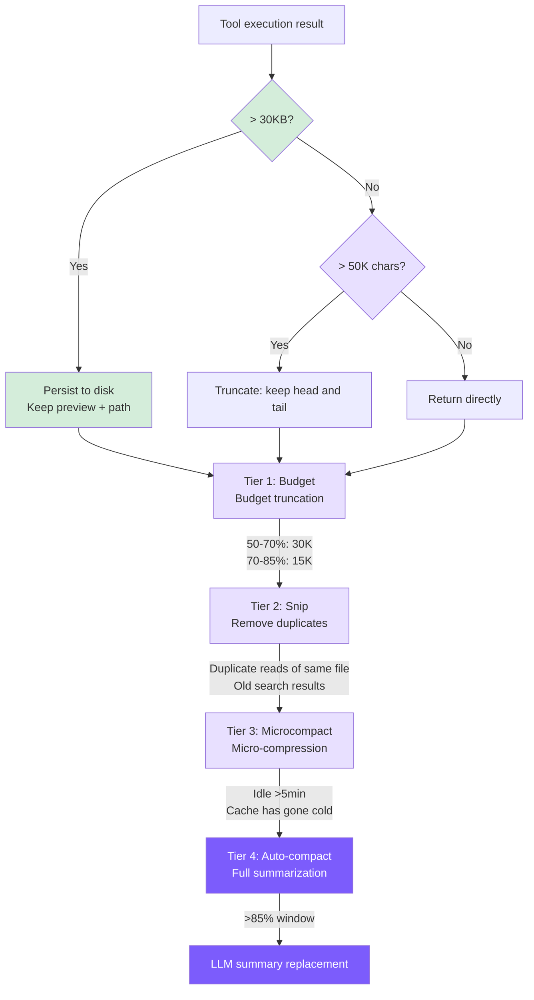

# 7. Context Management

## Chapter Goals

By the end of last chapter the agent can read, write, and run commands safely — but one problem still can't be dodged, one that Chapter 1 already planted: the message array grows every turn. Run a few dozen turns and it eventually overflows the model's context window, and once it does, the API errors out and the whole turn breaks. This chapter builds context compression so the agent can keep going.

Compression comes in four tiers, escalating from the lightest ("trim large tool outputs") to the heaviest ("have the model summarize the whole conversation into one paragraph"), reaching for the heavy one only when the light ones aren't enough. At the end it also wires up prefix caching — that static core split out in Chapter 3 is exactly what saves money here.



> ▶ **Run this chapter**: `node steps/run.mjs 7` (no API key) — watch it summarize older messages once the conversation grows. Add `--diff` to see what it added over the previous chapter. To run your own prompt against a real model, add `--live` (it reads the key from `.env`; `--py` runs the Python version).

## Our Implementation

Chapter 1 noted that the message array grows every turn. Run long enough and it overflows the model's context window. This chapter adds compaction: when the history gets long, one extra model call summarizes the older messages into a paragraph, replacing them and keeping only the recent few. Relative to last chapter, it adds a `context.ts`, and the agent compacts before each model call:

Compaction itself is just "summarize the older messages once past a threshold":

Run it: reading a few files grows the history until compaction fires (see the `compacted ... into a summary` line):

```
$ node steps/run.mjs 7
▶ step 7 demo (no API key — local mock model)   sandbox: <sandbox>
  you: Read a.txt, then b.txt, then c.txt, then summarize.

  → read_file({"file_path":"a.txt"})

  → read_file({"file_path":"b.txt"})

  → read_file({"file_path":"c.txt"})
  (compacted 5 messages into a summary)
All three read: alpha, beta, gamma.
```

> That is the whole runnable step for this chapter — everything `node steps/run.mjs` actually executes here is above. Below is how the repo's production mini-claude does the same thing in full: more edge cases and engineering detail. Read it as an **optional deep-dive**; it is not the code the runnable step runs.

Built in layers: execution-time truncation (Tier 0) as the floor catching a single oversized output, with 4 compression tiers on top — Budget, Snip, Microcompact, Auto-compact — from lightest to heaviest; the first three run in order before each API call, and the heaviest, Auto-compact, fires at the turn boundary.

### Tier 0: Execution-Time Truncation (truncateResult)

Keeping both head and tail rather than just the head: the beginning of files contains imports, class definitions, and other structural information, while command output error summaries are typically at the end.

Difference from Claude Code: Claude Code persists to disk, and the model can retrieve full content later with the Read tool. We now also implement persistence -- see persistLargeResult below. The two tiers work together, and the order is critical: the tool layer returns the **full** result, the agent layer first persists anything >30KB to disk in full via persistLargeResult (keeping only a preview in context), and truncateResult runs **after** persistence as a safety net -- it only fires in pathological cases (e.g. a preview message dominated by one enormous line). truncateResult must NOT run at the tool layer first: that would put an already-truncated result on disk, losing information before persistence (exactly the bug fixed in issue #6).

### Tier 0.5: Large Result Persistence (persistLargeResult)

When a tool returns a result exceeding 30KB, the full content is written to disk, and only a preview and file path are kept in context. The model can later use `read_file` to retrieve the full output on demand.

```typescript
// agent.ts -- persistLargeResult

private persistLargeResult(toolName: string, result: string): string {
  const THRESHOLD = 30 * 1024; // 30 KB
  if (Buffer.byteLength(result) <= THRESHOLD) return result;

  const dir = join(homedir(), ".mini-claude", "tool-results");
  mkdirSync(dir, { recursive: true });
  const filename = `${Date.now()}-${toolName}.txt`;
  const filepath = join(dir, filename);
  writeFileSync(filepath, result);

  const lines = result.split("\n");
  const preview = lines.slice(0, 200).join("\n");
  const sizeKB = (Buffer.byteLength(result) / 1024).toFixed(1);

  return `[Result too large (${sizeKB} KB, ${lines.length} lines). Full output saved to ${filepath}. You can use read_file to see the full result.]\n\nPreview (first 200 lines):\n${preview}`;
}
```

Key design points for this tier:

- **30KB threshold is lower than truncateResult's 50K limit**: Intercepts large results before truncation occurs, avoiding irreversible information loss. If a result is 80KB, persistLargeResult saves the full content to disk and returns a preview, rather than letting truncateResult permanently discard the middle portion.
- **200-line preview**: Gives the model enough context to decide whether it needs to read the full output. In most cases, the first 200 lines already contain the key information (beginning of file listings, first few matches of search results, main content of command output).
- **Recoverable vs irrecoverable**: This is the fundamental difference from truncateResult. truncateResult is irreversible -- truncated content is gone forever. persistLargeResult saves data to `~/.mini-claude/tool-results/\{timestamp\}-\{toolName\}.txt`, and the model can retrieve it at any time with `read_file`.
- **Invocation timing**: Called after each tool execution completes and before results are added to messages in the main loop. This means it takes effect before truncateResult -- the preview text returned after saving is usually well under 50K, so truncation won't be triggered.
- **Alignment with Claude Code**: This design directly corresponds to Claude Code's Level 1 strategy (persist to disk, keep only references in context). The difference is that Claude Code uses a 2KB preview while we use 200 lines -- same concept, simplified implementation.

### Tier 1: Budget -- Dynamic Tool Result Reduction

Dynamically tightens the size of tool results in history based on context pressure:

Tier 0 is a one-time 50K hard limit; Budget recalculates before every API call, with the budget automatically tightening as utilization increases. Using dual thresholds (50%/70%) rather than a single threshold preserves more detail when context space is still ample.

### Tier 2: Snip -- Replace Stale Tool Results

Snip strategy (triggered when utilization > 60%):
- Same file read multiple times by `read_file` -> keep only the latest, snip older ones
- More than 3 search results of the same type -> snip the oldest
- The 3 most recent `tool_result` entries are always preserved

Key point: **Only the `tool_result` content is cleared; the `tool_use` block is kept intact**. The model can still see "I previously read /src/main.ts" -- it just can't see the content anymore. If needed, it can call `read_file` again. Preserving metadata matters more than preserving data.

### Tier 3: Microcompact -- Aggressive Cleanup When Cache Goes Cold

The reason for using a time-based trigger: prompt cache has a TTL, and after 5+ minutes of idleness the cache has most likely expired. Continuing to retain old message content has no cost advantage, so aggressive cleanup is preferable.

Snip is selective (only replaces "stale" results); Microcompact is indiscriminate (clears everything except the newest 3) -- more aggressive, but with stricter trigger conditions.

We only implemented the time-based path. Claude Code's cache-edit path relies on the `cache_edits` API mechanism, which is too complex for a teaching implementation.

### Tier 4: Auto-compact -- Full Summary Compression

#### Trigger Condition

`effectiveWindow = model context window - 20000`, reserving space for new input/output. For Claude (200K window), the trigger point is at approximately 76.5% total utilization.

> ⚠️ **Caller contract**: `checkAndCompact` must only be called at a turn boundary — after the user message is pushed into the message array and before the API call. The `compactAnthropic` / `compactOpenAI` functions below assume the last message is a plain user-text message: they `slice(0, -1)` it off when building the summarization request and re-append it after the summary lands. If you call them mid-tool-loop, the last message will be a `tool_result` (Anthropic) or a `tool`-role message (OpenAI); slicing it off orphans the preceding `assistant`'s `tool_use` / `tool_calls`, and the API will reject the summarize request.

#### Anthropic Backend Compression

Key differences from Claude Code: Claude Code uses a two-stage "analyze-summarize" prompt for higher quality summaries, restores the 5 most recent files and active skills after compression, and has a circuit breaker to prevent infinite loops. Ours is a simplified version -- single-paragraph summary, no restoration mechanism, no circuit breaker.

#### OpenAI Backend Compression

OpenAI's system prompt lives in the message array (`role: "system"`), so it needs to be preserved separately during compression:

The guard condition is `< 5` rather than `< 4`, because the OpenAI message array contains at minimum system + 2 conversation turns + latest user message = 5 entries.

### Manual Compaction

```
> /compact
  ℹ Conversation compacted.
```

Call chain: `cli.ts` -> `agent.compact()` -> `compactConversation()` -> `compactAnthropic()` / `compactOpenAI()`

### Token Statistics and Pipeline Orchestration

Updated after each API call:

With caching enabled, `input_tokens` only counts the uncached (missed) portion, so `lastInputTokenCount` (used to decide whether we're approaching the window limit) has to add all three categories of input tokens back in, plus this turn's output -- which becomes part of the prompt on the next turn. `totalInputTokens` accumulates separately from cache read/write; for cost estimation see the "Prefix Caching" section.

The 4 tiers execute sequentially before each API call:

Tiers 1-3 run **before** every API call (zero API cost). Tier 4 runs at the **turn boundary** — after the user message is pushed into the array and before the `while` loop starts. **Do not** place Tier 4 at the end of the tool loop: at that point the last message is `\{role: "user", content: [tool_result, ...]\}`, and `compactAnthropic`'s `slice(0, -1)` would sever its pairing with the preceding `assistant` message's `tool_use`, causing the Anthropic API to reject the summarize call with *"tool_use ids were found without tool_result blocks immediately after"*. `lastInputTokenCount` is still usable in the new location — it reflects the state of the previous turn's final API call, which is enough to decide whether to trigger. The intra-pipeline order is also intentional: Budget compresses large results first, making Snip's deduplication judgments more accurate, and Microcompact performs indiscriminate cleanup last when the time condition is met.

## Prefix Caching

The tiers above are about "how to shrink context when it gets too big"; this section is about a different thing: given the same prefix, how do we keep the server from recomputing it every turn. Early versions did no caching -- every turn re-sent the full system prompt, tool definitions, and the ever-growing history as brand-new input, billed at full price -- with over five thousand tokens of prefix alone recomputed on every request. Once caching was added, from the second turn onward this part of a multi-turn conversation is essentially free.

Claude Code's full approach is covered in detail in [Chapter 3](https://windy3f3f3f3f.github.io/how-claude-code-works/#/docs/03-context-engineering); here we describe which parts we copied and which we can't.

### Two cache breakpoints

Anthropic's caching never happens on its own -- with no `cache_control` anywhere in the request, nothing is cached and everything is billed at full price. There are two ways to opt in: explicit block-level breakpoints, the way Claude Code does it, or the top-level automatic caching launched in early 2026 (a single top-level `cache_control` field, and the system places and advances the breakpoint automatically). We follow Claude Code's explicit-breakpoint approach and set two:

The first is on the system prompt. `buildAnthropicSystem` splits `system` from a single string into two text blocks -- the static core (the role, rules, and tool descriptions that are identical for every session) is marked `cache_control`, and the dynamic tail (environment, git, skill list) follows without a marker. The tools array doesn't need its own breakpoint: the API's render order is `tools -> system -> messages`, so marking the static system block also caches the tool definitions that come before it.

The second breakpoint rolls onto the last message. Before each request, `withCacheBreakpoints` marks `cache_control` on the last content block of the final message in the array, so that the previous turn and everything earlier all fall within the cached prefix, and only the newly added part of the current turn needs to be reprocessed. It's a pure function that returns a modified copy without touching the original history -- otherwise request metadata like `cache_control` would get written into the session archive and summarization requests. It skips `thinking` blocks because their content is unstable, and marking them would actually lower the hit rate.
