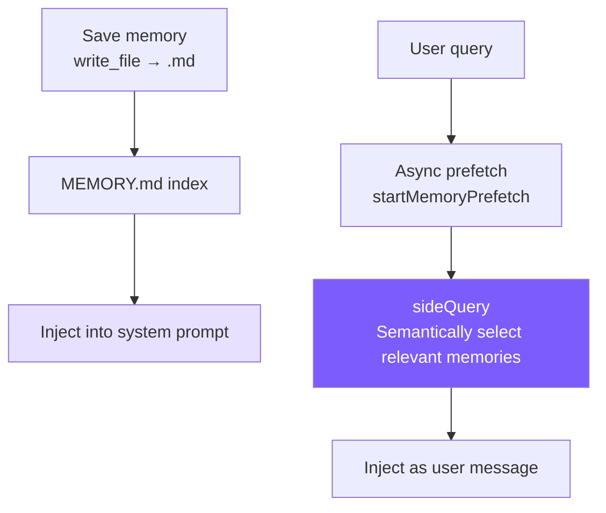

# 8. Memory System

## Chapter Goals

So far the agent's "memory" is just that message array — close the session and it forgets everything, starting over next time. This chapter builds it long-term memory that survives across sessions.

User preferences, project facts, and the like get written to small files on disk, one memory per file; next session, the ones relevant to the current topic are pulled back into the System Prompt by relevance, instead of hauling the whole history back.



> ▶ **Run this chapter**: `node steps/run.mjs 8` (no API key) — watch it recall "deploy to staging" from a memory file. Add `--diff` to see what it added over the previous chapter. To run your own prompt against a real model, add `--live` (it reads the key from `.env`; `--py` runs the Python version).

---

## Our Implementation

So far the agent's "memory" is just that message array — close the session and it forgets everything. This chapter gives it long-term memory across sessions: facts saved as small files on disk, and before each turn the ones relevant to the current question are pulled into the System Prompt. Relative to last chapter, it adds a `memory.ts`, and the agent appends recalled memories to the system prompt before calling the model:

Recall is just "the memories whose words overlap the question, top few by relevance" — deterministic, no extra model call:

Run it: a "deploy to staging" fact sits on disk, and when you ask about deploying it gets recalled, so the agent knows:

```
$ node steps/run.mjs 8
▶ step 8 demo (no API key — local mock model)   sandbox: <sandbox>
  you: Where should I deploy my changes to test them?

Deploy to https://staging.example.com (staging).
```

> That is the whole runnable step for this chapter — everything `node steps/run.mjs` actually executes here is above. Below is how the repo's production mini-claude does the same thing in full: more edge cases and engineering detail. Read it as an **optional deep-dive**; it is not the code the runnable step runs.

### Storage Structure

```
~/.mini-claude/projects/{sha256-hash}/memory/
├── MEMORY.md                          # Index file
├── user_prefers_concise_output.md
├── feedback_no_summary_at_end.md
├── project_auth_migration_q2.md
└── reference_ci_dashboard_url.md
```

The hash in the path is the first 16 characters of the sha256 of `process.cwd()` -- the same project directory always maps to the same memory space.

### Memory File Format

```markdown
---
name: Don't summarize at the end of responses
description: User explicitly asked to skip summary paragraphs
type: feedback
---
User said "don't summarize at the end of responses" because they can review diffs and code changes themselves.

**Why:** User finds summaries a waste of time and prefers getting results directly.
**How to apply:** After completing a task, end immediately without adding "Summary" or "In summary..." paragraphs.
```

### Frontmatter Parsing (Shared Module)

Both memory and skills need to parse YAML frontmatter, so it's extracted into `frontmatter.ts`:

No library like `js-yaml` is used -- our frontmatter is just simple `key: value` pairs, and a 20-line hand-written parser is sufficient with zero dependencies.

### Saving and Indexing

The filename format `\{type\}_\{slugified_name\}.md` makes files automatically group by type when sorted in the filesystem, and is easy to scan visually. The index is rebuilt immediately after each write to keep MEMORY.md in sync with the filesystem.

### Index Truncation

The two truncation layers serve different purposes: line truncation (200 lines) is normal protection, cutting at complete entry boundaries; byte truncation (25KB) is abnormal defense, catching cases where line count is low but individual lines are extremely long -- the Claude Code team has seen cases in production with 197KB crammed into 200 lines.

### System Prompt Injection

`buildMemoryPromptSection()` generates text injected into the system prompt, telling the model about the memory system's existence and usage:

This prompt does three things: teaches the model classification (four types), teaches it operations (use `write_file`, where to save, what format), and teaches it restraint ("What NOT to Save"). "Making the model use memory" isn't just about giving it a tool -- you also need to describe the complete type system and boundaries in the prompt so the model can make good decisions.

Finally, it's injected in `prompt.ts` via a placeholder:

### CLI Interaction

Users can type `/memory` in the REPL to list all memories:

---

### Semantic Recall (sideQuery)

The early version used keyword matching for memory recall -- splitting the query into words and counting hits per memory entry for ranking. This was simple but limited: when a user asks about "deployment process," a memory titled "CI/CD Considerations" gets zero matches because there are no common keywords.

The new version uses `sideQuery` for semantic recall: it sends all memory filenames and descriptions to the model and lets the model determine which ones are relevant to the current query.

```typescript
// memory.ts -- selectRelevantMemories

const SELECT_MEMORIES_PROMPT = `You are selecting memories that will be useful to an AI coding assistant as it processes a user's query. You will be given the user's query and a list of available memory files with their filenames and descriptions.

Return a JSON object with a "selected_memories" array of filenames for the memories that will clearly be useful (up to 5). Only include memories that you are certain will be helpful based on their name and description.
- If you are unsure if a memory will be useful, do not include it.
- If no memories would clearly be useful, return an empty array.`;

export async function selectRelevantMemories(
  query: string,
  sideQuery: SideQueryFn,
  alreadySurfaced: Set<string>,
  signal?: AbortSignal,
): Promise<RelevantMemory[]> {
  const headers = scanMemoryHeaders();
  if (headers.length === 0) return [];

  // Filter out memories already surfaced in this session
  const candidates = headers.filter((h) => !alreadySurfaced.has(h.filePath));
  if (candidates.length === 0) return [];

  const manifest = formatMemoryManifest(candidates);

  try {
    const text = await sideQuery(
      SELECT_MEMORIES_PROMPT,
      `Query: ${query}\n\nAvailable memories:\n${manifest}`,
      signal,
    );

    // Extract JSON from response (model may wrap in markdown code blocks)
    const jsonMatch = text.match(/\{[\s\S]*\}/);
    if (!jsonMatch) return [];

    const parsed = JSON.parse(jsonMatch[0]);
    const selectedFilenames: string[] = parsed.selected_memories || [];

    // Map filenames back to headers, read full content
    const filenameSet = new Set(selectedFilenames);
    const selected = candidates.filter((h) => filenameSet.has(h.filename));

    return selected.slice(0, 5).map((h) => {
      let content = readFileSync(h.filePath, "utf-8");
      // Per-file truncation (4KB)
      if (Buffer.byteLength(content) > MAX_MEMORY_BYTES_PER_FILE) {
        content = content.slice(0, MAX_MEMORY_BYTES_PER_FILE) +
          "\n\n[... truncated, memory file too large ...]";
      }
      const freshness = memoryFreshnessWarning(h.mtimeMs);
      const headerText = freshness
        ? `${freshness}\n\nMemory: ${h.filePath}:`
        : `Memory (saved ${memoryAge(h.mtimeMs)}): ${h.filePath}:`;

      return { path: h.filePath, content, mtimeMs: h.mtimeMs, header: headerText };
    });
  } catch (err: any) {
    // Silent failure -- memory recall should never block the main loop
    if (signal?.aborted) return [];
    console.error(`[memory] semantic recall failed: ${err.message}`);
    return [];
  }
}
```

Several key design points:

**sideQuery uses the same model, not a separate smaller model.** Claude Code uses Sonnet for sideQuery; we simplify by reusing the user's configured model. sideQuery only sends the memory manifest (filenames + descriptions), not full content, so input tokens are minimal.

**The model does semantic selection, which is far more powerful than keyword matching.** "Deployment process" can match "CI/CD Considerations," "database performance" can match "PostgreSQL Index Optimization Experience" -- because the model understands semantic relationships, not just literal overlap.

**The `alreadySurfaced` Set prevents duplicate recalls.** Memories already shown in the current session won't appear again, avoiding the user seeing the same memories with every question. This Set grows throughout the session lifetime.

**Per-file 4KB truncation + 60KB session budget.** Prevents a single large memory or accumulated recalls from crowding out context. The budget uses byte-level control, not token-level -- byte calculation is faster and more fair for multilingual text.

> **Comparison with old keyword matching (now replaced):** The old implementation split queries into words and matched them one by one -- zero API calls but low accuracy. The new version consumes 1 API call per recall, but the semantic understanding capability is a qualitative leap. For tutorial projects with few memories, this API cost is entirely acceptable.

### Async Prefetch (startMemoryPrefetch)

Semantic recall requires an API call, and executing it synchronously would add to user wait time. The solution: **start recall the instant the user submits input, running in parallel with the first model API call.**

```typescript
// memory.ts -- startMemoryPrefetch

export function startMemoryPrefetch(
  query: string,
  sideQuery: SideQueryFn,
  alreadySurfaced: Set<string>,
  sessionMemoryBytes: number,
  signal?: AbortSignal,
): MemoryPrefetch | null {
  // Gate 1: Skip single-word queries (too short for semantic matching)
  if (!/\s/.test(query.trim())) return null;

  // Gate 2: Session budget is full
  if (sessionMemoryBytes >= MAX_SESSION_MEMORY_BYTES) return null;

  // Gate 3: No memory files exist
  const dir = getMemoryDir();
  const hasMemories = readdirSync(dir).some(
    (f) => f.endsWith(".md") && f !== "MEMORY.md"
  );
  if (!hasMemories) return null;

  const handle: MemoryPrefetch = {
    promise: selectRelevantMemories(query, sideQuery, alreadySurfaced, signal),
    settled: false,
    consumed: false,
  };
  handle.promise.then(() => { handle.settled = true; }).catch(() => { handle.settled = true; });
  return handle;
}
```

Usage in `agent.ts`:

```typescript
// agent.ts -- Prefetch launch and consumption

// Start prefetch immediately after user message arrives
this.anthropicMessages.push({ role: "user", content: userMessage });
let memoryPrefetch: MemoryPrefetch | null = null;
if (!this.isSubAgent) {
  const sq = this.buildSideQuery();
  if (sq) {
    memoryPrefetch = startMemoryPrefetch(
      userMessage, sq,
      this.alreadySurfacedMemories, this.sessionMemoryBytes,
      this.abortController?.signal,
    );
  }
}

// Non-blocking poll in the while loop, before each API call
if (memoryPrefetch && memoryPrefetch.settled && !memoryPrefetch.consumed) {
  memoryPrefetch.consumed = true;
  const memories = await memoryPrefetch.promise;
  if (memories.length > 0) {
    const injectionText = formatMemoriesForInjection(memories);
    this.anthropicMessages.push({ role: "user", content: injectionText });
    // Track surfaced memories and session budget
    for (const m of memories) {
      this.alreadySurfacedMemories.add(m.path);
      this.sessionMemoryBytes += Buffer.byteLength(m.content);
    }
  }
}
```

The key to this design is **non-blocking polling**:

1. **Prefetch starts at user input time** -- runs in parallel with the first model API call, so the user perceives no extra delay
2. **Checked every loop iteration** -- if prefetch hasn't completed, it's skipped without waiting; checked again next iteration
3. **`settled` flag is set via `.then()`** -- no `await`, results are only read after confirmed completion
4. **Marked `consumed = true` after use** -- ensures the same prefetch is only injected once

Three gating conditions avoid wasting API calls:
- **Substantial query**: at least 2 CJK (Chinese/Japanese/Korean) characters, or multiple words for space-separated languages; a single word (like "hi") is too short for meaningful semantic matching
- **Session budget**: Stops recall after exceeding 60KB cumulative, preventing context overload
- **Memory existence**: Skips when no memory files exist, saving an API call
