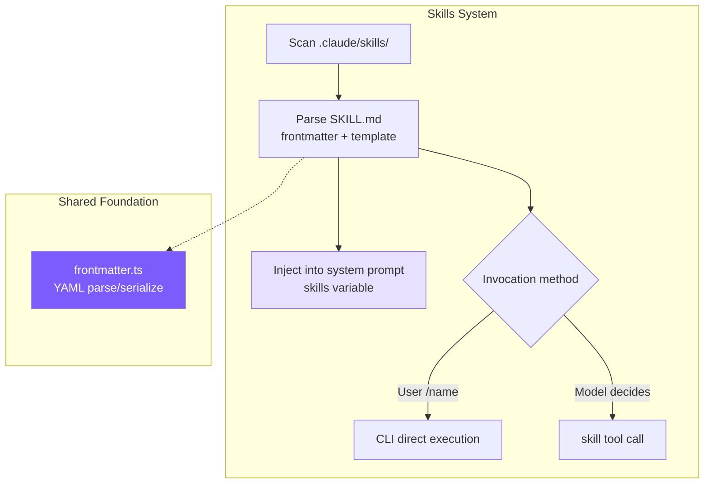
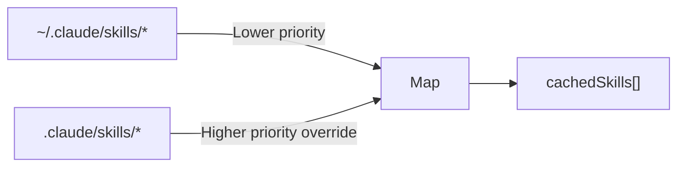
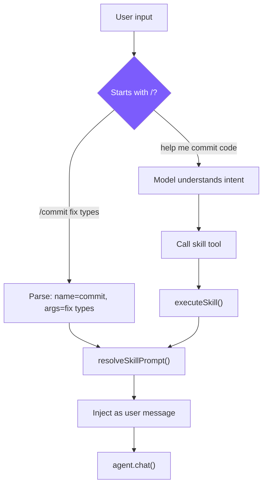

# 9. Skills System

## Chapter Goals

Some prompts get reused constantly — the "read the diff, write a commit message, commit" routine is tedious to retype every time. This chapter builds the agent a skills system that packages such prompts into modules you can invoke on demand.

A skill is a file: a prompt plus a few lines of metadata (name, when to use it, which tools it may use). One `/commit` invokes it, install-and-use like a shell script. Invocation comes in two flavors: inline splices the prompt into the current conversation, and fork hands it to a clean sub-agent to run on its own.



> ▶ **Run this chapter**: `node steps/run.mjs 9` (no API key) — watch `/commit` invoke a skill. Add `--diff` to see what it added over the previous chapter. To run your own prompt against a real model, add `--live` (it reads the key from `.env`; `--py` runs the Python version).

---

## Our Implementation

Some prompts get reused constantly — the "read the diff, write a commit message" routine is tedious to retype. This chapter gives the agent skills: save such a prompt as a file and invoke it with `/commit`, install-and-use like a shell script. Relative to last chapter, it adds a `skills.ts`, and the CLI turns a `/name` into that skill's prompt:

A skill is just a file; resolving one is "if it starts with `/`, find the same-named file under `.mini-skills/` and read its prompt":

Run it: `.mini-skills/commit.md` holds a commit-writing prompt, and `/commit` invokes it:

```
$ node steps/run.mjs 9
▶ step 9 demo (no API key — local mock model)   sandbox: <sandbox>
  $ mini-claude /commit

feat: add the new thing
```

> That is the whole runnable step for this chapter — everything `node steps/run.mjs` actually executes here is above. Below is how the repo's production mini-claude does the same thing in full: more edge cases and engineering detail. Read it as an **optional deep-dive**; it is not the code the runnable step runs.

### SKILL.md Format

```markdown
---
name: commit
description: Create a git commit with a descriptive message
when_to_use: When the user asks to commit changes or says "commit"
allowed-tools: run_shell, read_file
user-invocable: true
---
Look at the current git diff and staged changes. Write a clear, concise
commit message following conventional commits format.

The user's request: $ARGUMENTS

Project skill directory: ${CLAUDE_SKILL_DIR}
```

- `when_to_use`: Trigger condition shown to the model, which decides whether to auto-invoke based on this
- `allowed-tools`: Security boundary, limiting which tools the skill can use
- `user-invocable`: Skills with `false` can only be triggered automatically by the model

### Discovery and Loading



Using a Map for deduplication naturally implements "project-level overrides user-level" -- load user first, then project; same-name keys get overwritten by the latter. Claude Code has 6 sources because it needs to support enterprise and MCP scenarios; project + user covers the core needs of individual developers.

### Skill Parsing

`allowed-tools` supports both comma-separated and JSON array formats, trying JSON.parse first and falling back to comma splitting on failure -- both formats are natural when writing YAML, and fault-tolerant parsing prevents skill loading failures due to formatting issues. `when_to_use` accepts both underscore and hyphen key names for the same reason.

### Prompt Template Substitution

`$ARGUMENTS` is replaced with user-provided arguments, and `${CLAUDE_SKILL_DIR\}` is replaced with the skill directory path (skills can place template files in their directory and reference them with `read_file` in the prompt). Claude Code also supports `` !`shell_command` `` inline execution, which we haven't implemented -- it adds security risk and isn't needed for tutorial scenarios.

### Dual Invocation Paths



**Path 1: User manual invocation** (cli.ts)

**Path 2: Model programmatic invocation** (tools.ts)

After the model calls the `skill` tool, it receives the expanded prompt text and executes the task according to that prompt in subsequent turns. This is essentially a **meta-tool** -- the tool's return value isn't data, but instructions.

### Execution Modes: inline vs fork

When forking, the sub-Agent's tools are constrained by the `allowedTools` whitelist; if unspecified, the `agent` tool is excluded to prevent recursion. Use fork when a skill needs multiple rounds of tool calls (like code review reading multiple files) to keep the main conversation clean.

### System Prompt Description

Skills are displayed in two groups: user-invocable ones get the `/` prefix, model-only ones don't. `whenToUse` is the judgment condition shown to the model for deciding whether to trigger proactively. Claude Code also implements token budget control (`formatCommandsWithinBudget()`), which we skip -- tutorial scenarios have limited skill counts.

---

## What the Real Claude Code Does Beyond This

Our skills are two load modes plus a file parser. Claude Code is more complete on where skills are discovered, how they lazy-load, and how a fork is isolated — starting with how it locates a skill.

Skills are Claude Code's "AI Shell Scripts" -- templatizing AI workflows for one-time definition and repeated reuse. A `/commit` skill encapsulates the complete prompt for "read diff -> analyze changes -> write commit message -> commit."

Skills are loaded from 6 sources, with priority from high to low: enterprise policy (managed) > project-level > user-level > plugin > built-in (bundled) > MCP. The pattern is simple: sources closer to user control have higher priority, while MCP sits at the bottom since it comes from untrusted remote servers. Each skill must be in directory format `skill-name/SKILL.md`, allowing skills to bundle resource files referenced via `${CLAUDE_SKILL_DIR}`.

At startup, only frontmatter is preloaded (name/description/whenToUse); the full prompt is read only when invoked. Loading all skills fully with dozens of them would consume significant context space, so lazy loading defers the cost to the moment it's actually needed. Even just frontmatter requires token space -- `formatCommandsWithinBudget()` uses a three-stage algorithm: when budget is ample, show everything; when exceeded, built-in skills (`/commit`, `/review`) always keep full descriptions while others split the remaining budget equally; when each skill gets fewer than 20 characters, degrade to showing names only.

Skill prompts undergo multi-layer substitution before execution: `$ARGUMENTS` replaces user arguments, `${CLAUDE_SKILL_DIR}` replaces the skill directory path, and `` !`command` `` executes inline shell commands (disabled for MCP skills to prevent remote prompt injection from executing arbitrary commands).

There are two execution modes: **inline** (default) injects directly into the current conversation, and **fork** creates an independent sub-Agent that executes and returns results. Fork is suitable for skills requiring many tool calls -- for example, code review needs to read multiple files, and those calls would pollute the main conversation context. With fork, only the final result returns to the main thread.

---

## Key Design Decisions

**Why Markdown instead of JSON/YAML for skills?** The essence of a skill is a large block of natural language prompt. Markdown's body is directly the prompt itself, with frontmatter providing structured metadata. Storing in JSON would require escaping newlines and quotes in the prompt, resulting in poor readability.

**Why dual invocation paths?** Supporting only `/commit` for manual invocation isn't enough -- users might say "help me commit code" without knowing the skill exists. Supporting only model auto-invocation isn't enough either -- users sometimes want precise control over trigger timing. Both paths ultimately converge at the same `resolveSkillPrompt()`, so logic isn't duplicated.

### Comparison Overview

| Dimension | Claude Code | mini-claude |
|-----------|------------|-------------|
| **Skill sources** | 6 (managed/project/user/plugin/bundled/MCP) | 2 (project + user) |
| **Skill loading** | Lazy loading + token budget control | Full loading at startup + caching |
| **Prompt substitution** | `$ARGUMENTS` + `${CLAUDE_SKILL_DIR}` + `` !`shell` `` | `$ARGUMENTS` + `$\{CLAUDE_SKILL_DIR\}` |

---

> **Next chapter**: Let the Agent think before acting -- Plan Mode, read-only planning mode.
