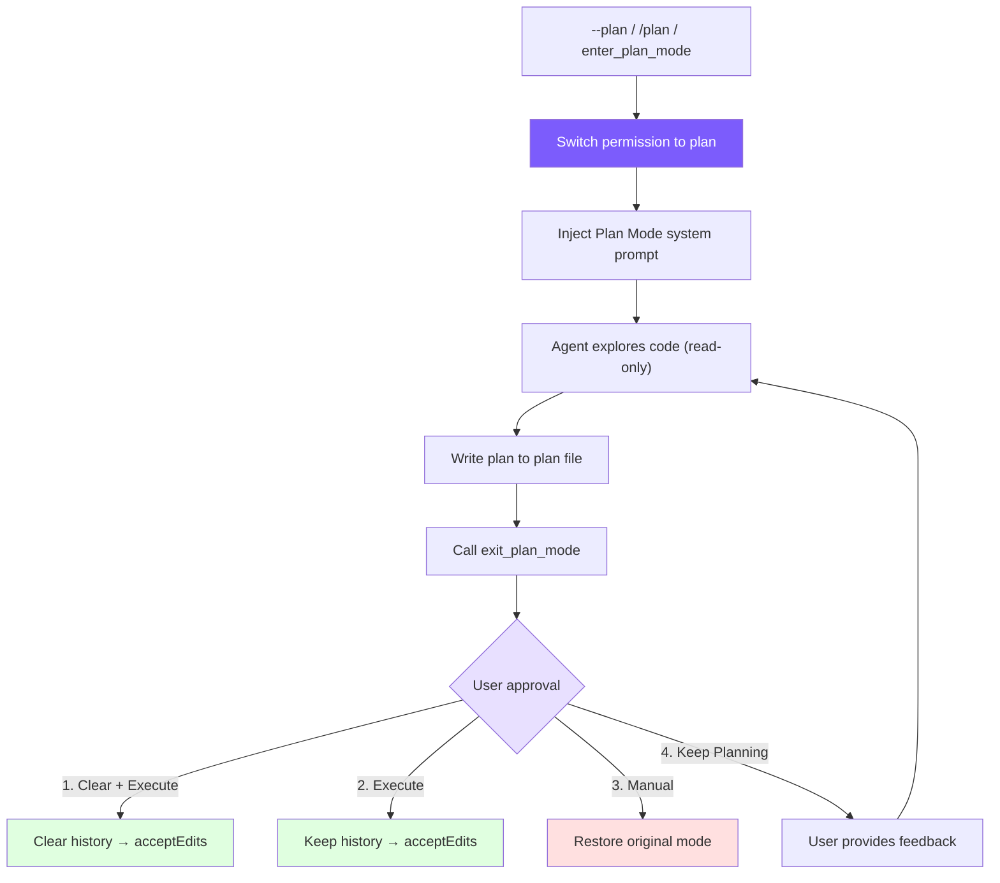

# 10. Plan Mode: Read-Only Planning Mode

## Chapter Goals

With tools and skills in place, the agent is increasingly eager to act — but sometimes you don't want it touching code right away; you want to see how it plans to proceed and approve first. This chapter builds Plan Mode.

It's a read-only planning mode: the agent can only read and think, not write files or run shells, and it hands its plan up in a plan file. The approval UI then offers four choices — do it, tweak-then-do, do it manually, or keep planning. The "read-only" part is enforced in code by the permission system from Chapter 6, not a prompt begging the model to behave.



> ▶ **Run this chapter**: `node steps/run.mjs 10` (no API key) — watch a write get blocked under `--plan`. Add `--diff` to see what it added over the previous chapter. To run your own prompt against a real model, add `--live` (it reads the key from `.env`; `--py` runs the Python version).

## Our Implementation

Sometimes you don't want the agent touching code right away — you want to see the plan and approve first. This chapter builds Plan Mode: a read-only mode where, under `--plan`, the agent can read and think but every write or shell call is blocked — enforced by the same permission gate from Chapter 6, plus one rule "no writes in plan mode". Relative to last chapter, the agent gains a `mode` and one extra check before running a tool:

Run it: under `--plan` the model wants to write `report.txt`, but the gate blocks it as "plan mode", so nothing is written:

```
$ node steps/run.mjs 10
▶ step 10 demo (no API key — local mock model)   sandbox: <sandbox>
  $ mini-claude --plan Create a file report.txt with the plan.

(plan mode: read-only)
I'll write the plan.
  → write_file({"file_path":"report.txt","content":"the plan"})
That was blocked because we're in plan (read-only) mode.
```

> That is the whole runnable step for this chapter — everything `node steps/run.mjs` actually executes here is above. Below is how the repo's production mini-claude does the same thing in full: more edge cases and engineering detail. Read it as an **optional deep-dive**; it is not the code the runnable step runs.

### Tool Definitions

Plan Mode requires two tools, marked as `deferred` (lazy-loaded, see [Chapter 2](/lib/09-harness/claude-code-from-scratch/en-docs-02-tools)):

Neither tool takes parameters -- entering and exiting are pure state transitions, and all data (plan file path, approval result) is managed internally by the Agent. They're marked `deferred` because most sessions don't need Plan Mode, and lazy loading avoids consuming prompt space.

### Mode Switching

Plan Mode involves 4 state variables:

`prePlanMode` is critical -- it remembers the permission mode before entering Plan Mode so it can be precisely restored on exit. If the user was in `acceptEdits` mode, exiting Plan Mode should return to `acceptEdits`, not `default`.

The switching logic is a symmetric enter/exit:

Note how the system prompt is updated: on entry, the plan prompt is appended after `baseSystemPrompt`; on exit, it's restored to `baseSystemPrompt`. For the OpenAI format, the first message in the message array (the system message) needs to be directly modified.

### Plan File and System Prompt

The plan file path is generated based on the session ID, ensuring each session has its own independent plan file:

The plan system prompt injects strict read-only constraints and workflow guidance:

This prompt accomplishes three things:
1. **Constrains behavior**: Explicitly prohibits editing and shell access (dual safeguard with permission checks)
2. **Declares the plan file**: Tells the model the only writable file path
3. **Defines the workflow**: Explore -> Design -> Write -> Exit, ensuring the model doesn't skip steps

The last sentence "Do NOT ask the user to approve" is crucial -- without it, the model frequently asks "Is this plan okay?" after writing the plan instead of calling `exit_plan_mode`, preventing the approval workflow from triggering.

### Permission Integration

Plan Mode's read-only constraint is enforced through `checkPermission()` (see [Chapter 6](/lib/09-harness/claude-code-from-scratch/en-docs-06-permissions) for details):

There's an elegant design here: **the plan file path is passed as a parameter to `checkPermission()`**. When the Agent tries to write a file, the permission check compares the target path against the plan file path -- only an exact match is allowed through. This means the system prompt's instruction to "only write the plan file" isn't just a suggestion -- it's a code-enforced constraint.

Dual safeguard:
- **System prompt**: Guides the model not to attempt writing other files (reduces wasted API calls)
- **Permission check**: Even if the model ignores the prompt, write operations are intercepted and return an error

### Tool Execution Logic

`executePlanModeTool()` handles the execution of `enter_plan_mode` and `exit_plan_mode`:

The core logic has three layers:

1. **enter_plan_mode**: State switch + plan file creation + prompt injection. Idempotent design -- returns a hint rather than an error when already in plan mode.

2. **exit_plan_mode (with approval function)**: Read plan file -> call approval callback -> handle based on user's choice:
   - `keep-planning`: Don't exit plan mode; return user feedback as the tool result to the model
   - `clear-and-execute`: Clear message history (free up context) -> switch to `acceptEdits`
   - `execute`: Keep history -> switch to `acceptEdits`
   - `manual-execute`: Restore the mode from before entering (user manually approves each edit)

3. **exit_plan_mode (without approval function)**: Exit directly and restore the original mode. This branch is for the sub-agent scenario -- sub-agents don't need interactive user approval.

### Approval Workflow

Approval is injected via a callback function, decoupling the Agent from the UI layer:

The UI portion displays the plan content and 4 options:

```typescript
// ui.ts — Plan approval UI

export function printPlanForApproval(planContent: string) {
  console.log(chalk.cyan("\n  ━━━ Plan for Approval ━━━"));
  const lines = planContent.split("\n");
  const maxLines = 60;
  const display = lines.slice(0, maxLines);
  for (const line of display) {
    console.log(chalk.white("  " + line));
  }
  if (lines.length > maxLines) {
    console.log(chalk.gray(`  ... (${lines.length - maxLines} more lines)`));
  }
  console.log(chalk.cyan("  ━━━━━━━━━━━━━━━━━━━━━━━━\n"));
}

export function printPlanApprovalOptions() {
  console.log(chalk.yellow("  Choose an option:"));
  console.log("    1) Yes, clear context and execute — fresh start with auto-accept edits");
  console.log("    2) Yes, and execute — keep context, auto-accept edits");
  console.log("    3) Yes, manually approve edits — keep context, confirm each edit");
  console.log("    4) No, keep planning — provide feedback to revise");
}
```

The four options are designed for different use cases:

| Option | Permission Switch | Context | Use Case |
|--------|------------------|---------|----------|
| 1. Clear + Execute | -> acceptEdits | Cleared | Plan is solid, context is long, starting fresh is most efficient |
| 2. Execute | -> acceptEdits | Kept | Plan is solid, Agent already has enough context to execute directly |
| 3. Manual | -> Restore original mode | Kept | Plan is roughly okay, but want to approve each modification step by step |
| 4. Keep Planning | Unchanged | Kept | Plan needs revision, provide feedback for the Agent to continue adjusting |

### CLI Entry Points

Plan Mode has three entry points:

The difference between the three entry points:
- `--plan`: Enter Plan Mode at startup; the entire session starts with planning
- `/plan`: Switch mid-session, suitable for a "chat first, plan later" workflow
- `enter_plan_mode` tool: The Agent decides on its own that it needs to plan before executing (requires activation via ToolSearch)

## What the Real Claude Code Does Beyond This

Our Plan Mode is a read-only switch plus a four-option approval box. Claude Code makes it a complete pair of tools, more deliberate about entering and leaving the planning state and how the plan is handed off.

Claude Code's Plan Mode is a complete EnterPlanMode / ExitPlanMode tool pair:

1. **Enter**: Switch to read-only mode, generate a plan file (in the `~/.claude/plans/` directory), inject a plan system prompt to constrain Agent behavior
2. **Plan**: The Agent uses read-only tools to explore the code and writes the implementation plan to the plan file
3. **Exit**: The Agent calls ExitPlanMode, and the user sees the plan and chooses how to execute
4. **Approve**: The user chooses to clear context and execute, keep context and execute, manually approve each edit, or continue revising

Key design insight: **Plan Mode isn't about "preventing the Agent from doing things" -- it's about making the Agent think before acting**. Persisting the plan file to disk means that even if context is cleared, the plan won't be lost -- the Agent can start fresh executing an approved plan.

## Design Decisions

### Why Write Plan Files to Disk?

Plan file persistence to `~/.claude/plans/` serves two purposes:

1. **Required for the clear-and-execute option**: After clearing context, the plan content in conversation history is lost. But the plan file remains on disk, so the Agent can re-read it.
2. **Available across sessions**: Users can see previous plans when restoring a session with `--resume`, or manually browse historical plan files.

### Why Is Approval a Callback Instead of a Direct Implementation?

`planApprovalFn` is an externally injected callback rather than a direct implementation inside the Agent. This keeps the Agent class independent of any specific UI implementation -- the CLI uses readline, an IDE integration could use a GUI dialog, and tests can inject mock functions. When a sub-agent has no approval function, it simply exits directly with no special handling needed.

### Why Does Clear-and-Execute Switch to acceptEdits?

Since the user has approved the plan and chosen automatic execution, they trust the Agent's direction of changes. Switching to `acceptEdits` lets the Agent proceed without repeatedly confirming each file edit, dramatically improving execution efficiency. If the user wants step-by-step approval, option 3 is specifically for that.

## Simplification Comparison

| Dimension | Claude Code | mini-claude | Difference |
|-----------|------------|-------------|------------|
| Plan file | Global plans directory + semantic filenames | `~/.claude/plans/plan-\{sessionId\}.md` | Simplified naming |
| Approval options | Multiple execution modes + permission prompts | 4 options (clear/execute/manual/revise) | Core alignment |
| Permission integration | Deep integration (7-layer permission system) | checkPermission special branch + plan file whitelist | Simplified but equivalent |
| Tool loading | Always available | deferred lazy loading | Saves prompt space |
| Sub-agent | Plan Agent type | Fallback direct exit | Simplified branch |

---

> **Next chapter**: When a single Agent's context isn't enough -- multi-agent architecture, divide and conquer.
