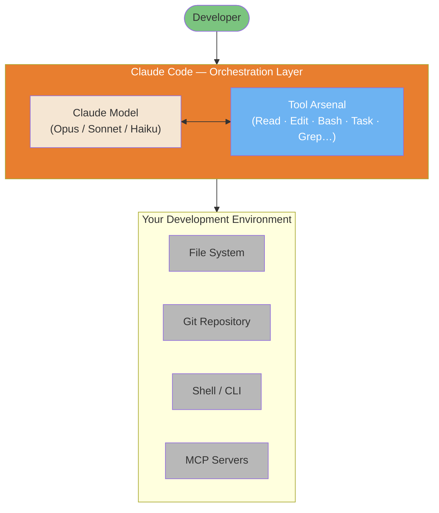

## Visual Overview

Claude Code is not a new AI model. It's an orchestration layer that wraps Claude (Opus/Sonnet/Haiku) with the ability to read files, run shell commands, navigate repositories, and spawn sub-agents, all in a continuous loop until the task is done.

*Inspired by [Mohamed Ali Ben Salem's architecture diagram](https://www.linkedin.com/posts/mohamed-ali-ben-salem-2b777b9a_en-ce-moment-je-vois-passer-des-posts-du-activity-7420592149110362112-eY5a). See [Architecture Internals diagrams](/lib/09-harness/claude-code-ultimate-guide/guide-diagrams-04-architecture-internals) for a deeper breakdown.*
