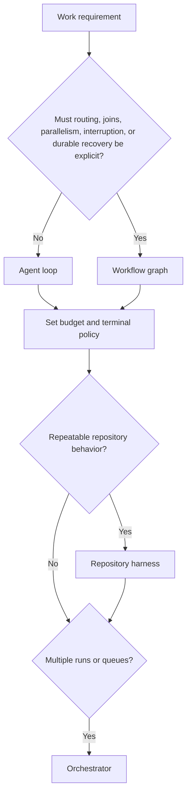

# Loop & Graph Engineering

> **Status:** Loop engineering is practitioner vocabulary, not a formal standard. Graph engineering is an emerging research label, not a settled discipline. The underlying mechanisms, such as state machines, workflow graphs, checkpoints, and review gates, are mature engineering techniques.
>
> **Use this page for:** designing the feedback and topology of an agent system. For runtime-harness components, security controls, and optimizer research, see [Agent Harness Engineering](/lib/09-harness/claude-code-ultimate-guide/guide-core-agent-harness/index). For product classification, see the [Agent Harness Landscape](/lib/09-harness/claude-code-ultimate-guide/guide-ecosystem-agent-harness-landscape/index).

Explicit contracts make feedback, stopping, routing, and acceptance testable; a longer prompt alone does not define those controls. A **loop** specifies feedback and stopping. A **graph** specifies the executable topology. A graph can contain a loop, but neither term establishes that an acceptance decision is correct.

[Agent Harness Engineering](/lib/09-harness/claude-code-ultimate-guide/guide-core-agent-harness/index) owns the distinctions between a model, a runtime harness, a repository harness, and an orchestrator. Use it to identify which layer owns context, tools, permissions, verification, recovery, or coordination. This page focuses on the loop and graph contracts that make feedback and routing inspectable.

## Contents

1. [Choose the smallest control structure](#1-choose-the-smallest-control-structure)
2. [Write a loop contract](#2-write-a-loop-contract)
3. [Write a graph contract](#3-write-a-graph-contract)
4. [Static and dynamic graphs](#4-static-and-dynamic-graphs)
5. [Allocate judgment explicitly](#5-allocate-judgment-explicitly)
6. [Make execution durable](#6-make-execution-durable)
7. [Observe and evaluate the system](#7-observe-and-evaluate-the-system)
8. [Three implementation cases](#8-three-implementation-cases)
9. [Anti-patterns](#9-anti-patterns)
10. [Selection checklist](#10-selection-checklist)

---

## 1. Choose the smallest control structure

Start with the simplest structure that can make the required decision safely.

| Need | Smallest suitable loop or graph structure | What must still be specified |
|---|---|---|
| One bounded task with local tool feedback | Agent loop | stopping rule, tool policy, local verifier |
| Known branches, retries, parallel work, or human interruption | Explicit workflow graph | state schema, routes, joins, checkpoint and recovery policy |



The diagram selects a control structure; [Agent Harness Engineering](/lib/09-harness/claude-code-ultimate-guide/guide-core-agent-harness/index) defines the ownership boundary between a runtime harness, repository harness, and orchestrator.

Do not turn a single bounded task into a multi-agent graph just because a framework makes it easy. Every added component introduces state, overhead, and failure modes. Every verifier, reviewer, or release gate introduces an acceptance boundary to test.

The labels are intentionally narrow. [Addy Osmani's practitioner account](https://addyosmani.com/blog/loop-engineering/) is useful experience-based framing for replacing repeated prompting with a system that finds, dispatches, checks, and records work. It is not a standard or a performance study. The two recent preprints, [Graph Engineering in the Era of LLM Agents](https://arxiv.org/abs/2608.21156) and [What Makes Prompts a Graph](https://arxiv.org/abs/2607.27578), propose graph-engineering vocabularies. Treat their definitions as research proposals, not proof that graphs improve every agent system.

## 2. Write a loop contract

A loop contract makes "keep going until it works" testable. It names the unit of work, its permitted actions, the evidence that counts as progress, and every allowed exit.

| Field | Questions the contract must answer |
|---|---|
| Goal and input | What requirement, repository revision, and expected artifact define this run? |
| State | What facts persist outside the context window? Who may update them? |
| Actions | Which tools, credentials, files, and external effects are permitted? |
| Observation | Which tool outputs, tests, traces, and human feedback enter the next iteration? |
| Verification | Which deterministic checks, independent reviews, or human decisions can accept the work? |
| Stop and escalation | What ends success, ends failure, consumes budget, times out, or requires a person? |
| Evidence | Which commands, outputs, trace IDs, and versions prove the final claim? |

### Apply the feedback horizons

[Agent Harness Engineering](/lib/09-harness/claude-code-ultimate-guide/guide-core-agent-harness/index#21-while-loop-engine) defines the inner, outer, and meta horizons and their owning layers. Apply the loop contract at each boundary: an inner-loop contract records tool evidence and a local stop; an outer-loop contract names the delivery verifier and acceptance authority; a meta-loop contract versions the graph or harness change and evaluates it against held-out evidence. A model statement that it has finished is an observation, not acceptance evidence.

## 3. Write a graph contract

Use an explicit graph when routing itself is material. The [LangGraph Graph API](https://docs.langchain.com/oss/python/langgraph/graph-api) is a concrete primary-source example: it represents shared state, nodes, fixed and conditional edges, and parallel execution. Nodes can contain LLM calls or conventional code. This is why a graph is not synonymous with a multi-agent system.

A graph contract should be reviewable without running the graph.

| Element | Minimum contract |
|---|---|
| Graph identity | graph and policy versions, owner, compatible state schema |
| State | typed fields, confidentiality, writer, reducer or conflict rule, retention |
| Node | purpose, input and output, idempotency boundary, timeout, side effects |
| Edge | source, destination, condition, routing evidence, forbidden transitions |
| Join | expected inputs, timeout, missing-input behavior, merge rule |
| Retry | retryable failures, cap, backoff, compensation or escalation |
| Checkpoint | persistence boundary, resume semantics, migration compatibility |
| Completion | legal terminal states and the authority that can mark each one |

The graph contract must distinguish a valid route from a correct result. A state machine can reject an illegal transition while still carrying an incorrect requirement or a flawed review verdict forward.

### Practical example: a bounded change-review graph

This contract adds state, routing, budget, and terminal policies that a topology-only diagram omits:

```yaml
graph: change-review
version: 1
state:
  requirement: { writer: human, immutable_after: triage }
  patch_ref: { writer: implement, validator: commit_exists }
  test_evidence: { writer: verify, validator: command_and_exit_status }
  remaining_rework_budget:
    type: integer
    writer: retry_router
    initial: 2
    minimum: 0
    maximum: 2
    decrement: { when: verification_failed_and_value_gt_0, by: 1 }
nodes:
  triage: { timeout: 10m, output: approved_plan }
  implement: { side_effect: git_worktree }
  verify: { input: patch_ref, output: test_evidence }
  retry_router:
    input: [test_evidence, remaining_rework_budget]
    behavior: decrement_if_budget_remains_then_route
  review: { input: [patch_ref, test_evidence], authority: accept_or_escalate }
terminals:
  done: { condition: accepted_with_evidence }
  failed: { conditions: [rework_budget_exhausted, policy_violation] }
  escalated: { condition: human_escalation }
edges:
  - triage -> implement: approved_plan
  - triage -> failed: policy_violation
  - implement -> verify: patch_ref_exists
  - implement -> failed: policy_violation
  - verify -> retry_router: verification_failed
  - verify -> failed: policy_violation
  - retry_router -> implement: rework_budget_decremented
  - retry_router -> failed: rework_budget_exhausted
  - verify -> review: verification_passed
  - review -> done: accepted_with_evidence
  - review -> failed: policy_violation
  - review -> escalated: ambiguous_or_high_impact
```

The `retry_router` is the only writer allowed to decrement the counter. It decrements only while budget remains, then routes to `implement`; once the budget reaches zero, the next failed verification reaches the `failed` terminal. The example does not give a reviewer authority to accept an untested patch. In a production design, add the exact test command, budget unit, trace fields, and rules for side effects.

## 4. Static and dynamic graphs

A **static graph** fixes its topology in reviewed configuration or code. A **dynamic graph** creates or changes tasks, dependencies, routes, or workers during execution.

| Aspect | Static graph | Dynamic graph |
|---|---|---|
| Best for | stable roles, approved transitions, review gates, known workflow | discovered tasks, work queues, dependency expansion, adaptive routing |
| Main benefit | inspectable before execution | can respond to new evidence |
| Main risk | brittleness when the task does not fit | unreviewed routes, unbounded work, topology drift |
| Required control | version review and route tests | creation policy, budget, provenance, validation, audit log, revocation |

Dynamic does not mean that an LLM may write arbitrary workflow code and execute it. Keep the control plane static where consequences are high: allowed node types, permissions, transitions, concurrency, budgets, and release authority. Let dynamic execution create only bounded data within that policy.

This distinction is visible in the pinned [Liza](https://github.com/liza-mas/liza/tree/a22c12381c5d884d2586a48aaaa517bca184f9cf) source evidence. Its `pipeline.yaml` defines a stable organization graph of roles, transitions, and quorums. Task dependencies evolve at runtime as a work graph. Liza is therefore a domain-specific executable graph and control plane, not evidence of a general-purpose graph runtime. See the [Liza evidence record](/lib/09-harness/claude-code-ultimate-guide/docs-resource-evaluations-liza-mas-framework) for the exact boundary.

## 5. Allocate judgment explicitly

Automation moves judgment. It does not erase it. Write down who owns the quality bar, decomposition, tool permission, exception, acceptance verdict, and release decision. This is **judgment allocation**.

### Separate execution from governance

Removing a person from repetitive execution does not remove human accountability. Treat three loops as separate contracts:

| Loop | Primary responsibility | Human role |
|---|---|---|
| Execution loop | plan, act, observe, verify, retry within a budget | handle exceptions and escalations that exceed policy |
| Governance loop | define goals, permissions, budgets, acceptance policy, and release authority | remain accountable for risk and irreversible effects |
| Improvement loop | inspect traces and failures, propose a changed prompt, graph, policy, or harness | approve the versioned change against held-out evidence |

This resolves an ambiguity in practitioner discussions of loop engineering. Pavan Belagatti describes removing the operator who repeatedly prompts the agent, then describes software-factory workflows that retain human gates for sensitive transitions. The coherent interpretation is that the person leaves the repetitive execution loop while remaining in the governance loop. See [Loop Engineering Explained](https://www.youtube.com/watch?v=RvG7R0Ue1k4) and the [human review gate in Build Your Own Software Factory](https://www.youtube.com/watch?v=pE1S1egMrAI&t=908s). These videos are practitioner and vendor-oriented demonstrations, not comparative reliability studies.

OpenAI's [Harness Engineering](https://openai.com/index/harness-engineering/) account uses the related framing "Humans steer. Agents execute." Its reported throughput and time savings describe one internal greenfield experiment. They do not establish a universal autonomy level or productivity baseline.

| Decision | Prefer | Why |
|---|---|---|
| schema, required command, prohibited transition | deterministic validator or policy engine | exact, repeatable, auditable |
| ambiguous requirement, risk trade-off, business priority | accountable human | requires authority and context outside the run |
| exploratory analysis or qualitative ranking | agent or LLM judge, with sampled adjudication | useful signal, not a sole production gate |
| release or irreversible external effect | named human or pre-authorized policy | establishes accountability and exception handling |

Creator-verifier separation is a treatment to test, not proof of independence. A reviewer can have a fresh context yet still share the same flawed specification, model, provider, tools, or incentives. Compare self-review, fresh-context review, different-model review, deterministic checks, and human adjudication against the same sampled defects. Record false accepts, false rejects, rescues, misses, disagreements, and the evidence each verdict used.

For Liza specifically, its deterministic supervisor can reject illegal workflow states, stale leases, and unmet quorums. The pinned source and its own issues ledger do not establish semantic correctness of a legal verdict. The [third-party practitioner REX from Ippon](https://blog.ippon.fr/2026/04/29/premier-rex-multi-agent-liza/) is explicitly bounded to one small project and reports continued human checkpoints. It is a useful operational account, not a comparative benchmark.

## 6. Make execution durable

Durable execution means that an interruption does not silently lose, duplicate, or invent work. It is not merely saving chat history.

| Requirement | Design question |
|---|---|
| Persisted state | Can another process reconstruct the run from a durable record? |
| Idempotency | What happens if a node or tool call runs again after a resume? |
| Checkpointing | At which safe boundaries can the system resume? |
| External effects | Which idempotency key, receipt, compensation, or read-before-write rule protects each effect? |
| Recovery | Who retries, who resolves conflicts, and when does recovery escalate? |
| Versioning | Can an old checkpoint be resumed under a changed graph or policy? |

The [LangGraph persistence documentation](https://docs.langchain.com/oss/python/langgraph/persistence) classifies `InMemorySaver` as an experimentation implementation and lists persistent checkpointers for production; use a durable backend when state must survive a process restart. With a dynamic [`interrupt()`](https://docs.langchain.com/oss/python/langgraph/interrupts#rules-of-interrupts), resuming restarts the containing node from its beginning, so code before the interrupt can run again. Replay and incomplete attempts have their own re-execution semantics. Make side effects idempotent at each applicable boundary instead of assuming every resumed node behaves identically. [Temporal's workflow documentation](https://docs.temporal.io/workflow-execution) is a second primary-source reference for durable workflow execution, replay, and event history.

Do not claim crash recovery unless it has been exercised. Interrupt a run at a defined point, resume it in a clean process, and inspect the state transition, external effect, evidence record, and duplicate-work behavior.

## 7. Observe and evaluate the system

An agent trace needs enough evidence to answer four questions: what ran, why it routed, what state changed, and who accepted the result. Capture data at the layer that made the decision.

| Layer | Minimum evidence |
|---|---|
| Runtime loop | model and harness version, tool calls, permissions, context policy, retry, stop reason |
| Graph | graph and policy version, node, edge, route reason, state before and after, join wait, checkpoint, resume |
| Repository harness | setup command, changed artifact, verifier command, output, exit status |
| Orchestrator | dispatch, ownership, queue wait, handoff, lease, escalation, human checkpoint |
| Judgment | evaluator identity and provenance, evidence references, verdict, overturn, exception authority |

Use stable event names and redact sensitive prompt text, tool arguments, tool results, paths, and identifiers before exporting telemetry. The [OpenTelemetry GenAI semantic-conventions repository](https://github.com/open-telemetry/semantic-conventions-genai/blob/main/docs/gen-ai/README.md) defines agent, model, request, response, token, and tool telemetry, but its status is **Development**. Keep an adapter between those conventions and your telemetry backend, and version local graph and judgment fields such as `graph.version` and `verdict.overturned`, because the upstream vocabulary can change.

Evaluate the exact model-harness pair, repository revision, permission set, graph version, tool set, budget, and task distribution. A green graph test shows that the control flow followed its contract. It does not prove that the delivered patch meets the requirement. Pair workflow tests with requirement-level verification, recovery drills, and repeated representative tasks. [Agent Evaluation](/lib/09-harness/claude-code-ultimate-guide/guide-roles-agent-evaluation#evaluate-judgment-allocation-and-reviewer-independence) defines useful graph-level and reviewer-independence measures.

### Limit admission to verification capacity

Bound the shared queue as well as each agent run. A task with a finite retry budget can still add work faster than reviewers can accept it. In [IFTTD episode 362](https://www.ifttd.io/episodes/le-lean-a-l-ere-de-l-ia), Yacine Hmito describes this as a flow problem: faster implementation moves pressure to quality control, and recurring defects should change the upstream production process. Bruno Soulez's [season conclusion](https://bilan.ifttd.io/conclusion/) goes further by proposing validation before expanding generation; that ordering is his interpretation, not a demonstrated universal sequence.

Before dispatch, reserve capacity for the change's required verification. Pause new authoring when the owner-approved queue or age limit is reached, a required reviewer is unavailable, or queue telemetry is stale. Allow in-flight reviews and agreed corrections to finish. Resume below a distinct threshold with fresh telemetry and available capacity; otherwise the scheduler can oscillate between pause and resume.

The [review admission worksheet](/lib/09-harness/claude-code-ultimate-guide/examples-workflows-review-admission) defines ownership, atomic reservations, exceptions, and a tabletop exercise. Its illustrative thresholds are not production defaults. Use [queue measurements](/lib/09-harness/claude-code-ultimate-guide/guide-ops-team-metrics#measure-the-shared-verification-queue) to calibrate them. This complements the per-feature WIP limit in [Spec-First Development](/lib/09-harness/claude-code-ultimate-guide/guide-workflows-spec-first); it does not grant merge or deployment authority.

## 8. Three implementation cases

### Claude Code: inner loop plus repository harness

Claude Code owns the interactive model-and-tool loop. The repository harness provides the project contract through `CLAUDE.md`, optionally importing or symlinking an existing `AGENTS.md`, plus setup, task state, tests, hooks, and delivery gates. A practical Claude Code design should make the stop rule explicit: for example, a targeted test passes, the change is reviewed against the requirement, and no policy or budget exit has fired. Do not infer a general explicit graph runtime from subagents, teams, or hooks alone. See [Agent Harness Engineering](/lib/09-harness/claude-code-ultimate-guide/guide-core-agent-harness/index) for the runtime boundary, [the official explanation of the Claude Code agentic loop](https://code.claude.com/docs/en/how-claude-code-works) for product behavior, and [the `AGENTS.md` compatibility section](https://code.claude.com/docs/en/memory#agentsmd) for the supported instruction-file pattern.

#### Compose recurring triage with bounded work

A scheduled check discovers work; admission decides whether a candidate may start. A bounded task then pursues a finish condition, while the review policy decides whether the resulting change is acceptable. [Practical Loop Engineering](https://addyo.substack.com/p/practical-loop-engineering) describes this combination from Addy Osmani's practice. Treat it as a workflow proposal, not evidence that a nested command runs successfully.

| Stage | Required evidence or decision |
|---|---|
| Detect | Identify an eligible issue and the repository revision being examined |
| Admit | Check whether the same issue, repository revision and criteria version are already handled or owned by an active run; reserve verification capacity |
| Work | Freeze the task, allowed changes, acceptance criteria and total attempt budget |
| Verify | Reproduce the defect before the fix and retain the relevant checks on the candidate revision |
| Accept or stop | Record the review decision, or the failure, exhausted-budget or escalation reason |

For an illustrative issue-triage run, admit one reproducible bug, keep its identifier across scheduled checks, and produce a candidate patch with test evidence. A later check must not create a second worker for that same active task or reset its consumed budget. Reserve queue capacity before dispatch; the [bounded loop contract](/lib/09-harness/claude-code-ultimate-guide/examples-workflows-bounded-loop-contract) owns per-task execution. This scenario has not been executed as a Claude Code integration test.

Use [the goal reference](/lib/09-harness/claude-code-ultimate-guide/guide-ultimate-guide/index#goal-autonomous-completion-mode-v21139) for completion behavior and [the scheduling reference](/lib/09-harness/claude-code-ultimate-guide/guide-ultimate-guide/index#the-loop-command) for triggers. Scheduled prompts do not execute built-in commands merely because their names appear in the text. Therefore an example saying “use /goal” inside `/loop` still needs an explicit, tested invocation boundary. Do not present it as copy-ready orchestration.

#### Distinguish requested limits from enforced budgets

A limit written into a `/goal` condition is judged by the evaluator from the conversation. A controller-enforced budget checks a counter before dispatching another action. The [runnable bounded-loop example](https://github.com/FlorianBruniaux/claude-code-ultimate-guide/blob/af05b84fb6e32432dae2114ee2a72c44ef3d29b1/examples/workflows/bounded-loop-example.py) demonstrates the latter with synthetic actions and a verifier; it does not establish Claude Code behavior. For work that spans sessions, keep total consumption outside the session counters, which reset when an active goal resumes according to the [goal documentation](https://code.claude.com/docs/en/goal).

Completion evaluation also has a narrower role than review. Claude Code's goal evaluator reads evidence already surfaced in the conversation; it does not independently inspect the patch or rerun commands. A separate reviewer still needs the original requirement, the candidate revision and access to the checks. Passing those checks does not decide whether the change is worth its product cost; that decision belongs to the named acceptance authority.

### LangGraph: explicit workflow runtime

LangGraph is appropriate when state, routing, conditional branches, parallel work, interrupts, or persistence must be first-class artifacts. Its official graph API represents state, nodes, and edges explicitly, and its persistence API supplies checkpoints and stores. The engineering work remains in the contracts: state reducers, route conditions, side-effect idempotency, checkpoint selection, and observability.

### Liza: repository harness plus control plane

Liza coordinates external coding-agent CLIs through a persistent task state, worktrees, leases, doer/reviewer roles, recovery, and merge gates. The selected CLI retains its inner tool loop. Its stable pipeline configuration and changing task dependencies make it a useful case for separating organization and work graphs. Its worktree isolation is not a substitute for filesystem, credential, or network sandboxing. The [Liza evaluation](/lib/09-harness/claude-code-ultimate-guide/docs-resource-evaluations-liza-mas-framework) records the pinned commit and the security boundary.

## 9. Anti-patterns

| Anti-pattern | Why it fails | Corrective action |
|---|---|---|
| "Keep trying until done" | no termination, cost, or escalation boundary | write explicit success, failure, budget, timeout, and human exits |
| A diagram without executable semantics | reviewers cannot test routing, joins, or recovery | define state, node contracts, edge conditions, and checkpoint behavior |
| Dynamic topology without policy | an LLM can create hidden loops or unapproved effects | constrain allowed mutations, budget them, log provenance, and validate every route |
| One agent both creates and accepts | self-review can mistake confidence for evidence | separate deterministic checks and sample independent or human review |
| Checkpoints without idempotency | resume can duplicate writes or corrupt state | use effect receipts, idempotency keys, upserts, or compensation |
| Token-only observability | cost cannot explain a bad route, stale state, or incorrect verdict | trace topology, state transitions, evidence, and judgment |
| Calling a scheduler a runtime harness | obscures who owns tool policy and recovery | identify the owner of the actual model-tool-observation loop |
| Treating an REX as a benchmark | one project cannot establish general performance | label REX scope, retain artifacts, and avoid comparative claims |

## 10. Selection checklist

Before adding a loop, graph, or orchestrator, answer yes to each relevant question.

- [ ] The selected structure is the smallest one that meets the routing, durability, and authority requirements.
- [ ] The loop has explicit success, failure, timeout, budget, and escalation exits.
- [ ] State, side effects, evidence, and retention are defined outside the model context.
- [ ] Every graph node, edge, join, retry, and checkpoint has a reviewed contract.
- [ ] Static policy constrains dynamic task and route creation.
- [ ] Deterministic checks own what they can decide deterministically.
- [ ] Human authority is named for ambiguity, exceptions, release, and irreversible effects.
- [ ] Reviewer independence is measured rather than assumed from role names.
- [ ] Resume behavior and side-effect idempotency have been tested under interruption.
- [ ] Traces reconstruct routing, state changes, evidence, and verdicts without exporting sensitive payloads.
- [ ] Evaluation records the exact model-harness pair, graph version, budget, task set, and failure modes.

Resolve every applicable unchecked contract before increasing the system's routing scope, side effects, or release authority.
