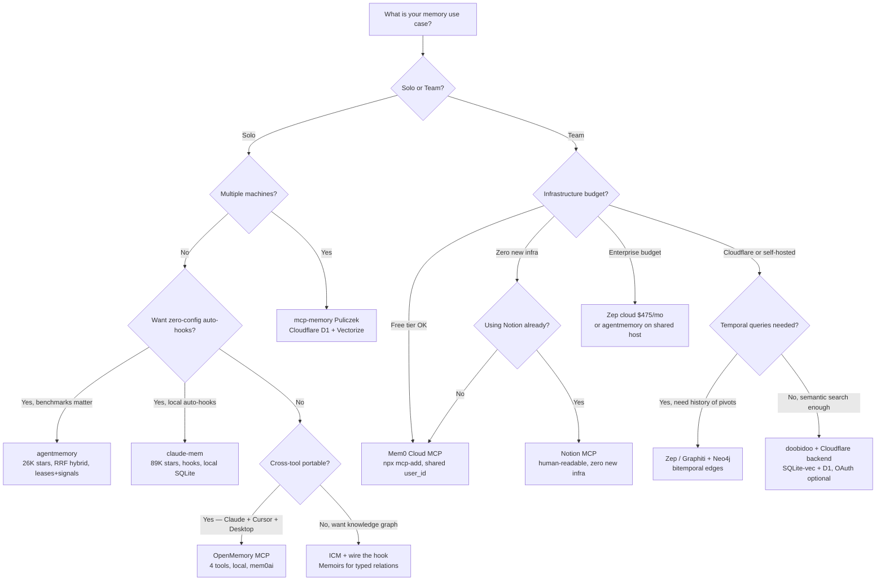

## 8. Decision Frameworks

### 8.1 Decision Flowchart



---

### 8.2 Decision Matrix

| Scenario | Recommended tool | Notes |
|----------|-----------------|-------|
| Solo, cross-session recall, auto-hooks | agentmemory | 26K stars, 12 hooks auto-wired, 0 external deps |
| Solo, cross-session recall, local hooks | claude-mem | ~89K stars, hooks-based; verify scope, indexing, backlog, version, cost routing, and retention |
| Solo, want human-readable KB | claude-memory-compiler | Daily logs + concept articles |
| Solo, portable cross-tool memory | OpenMemory MCP | mem0ai, local dashboard, 4 tools |
| Solo, cross-tool + knowledge graph | ICM (+ wire the hook) | 17 tools, local SQLite, typed relations |
| Solo, code structure memory | codebase-memory-mcp | AST tree-sitter, 155 languages |
| Solo, capture everything everywhere | Pieces | 9-month rolling context, individual-only |
| Team, shared rules and standards | CLAUDE.md + .mcp.json + /skills | Versioned in repo, zero infra |
| Team, simplest shared memory | Mem0 cloud MCP | 1 command, free tier, no infra |
| Team, shared memory + existing Notion | Notion MCP | Already collaborative, no new infra |
| Team, semantic memory, full control | mcp-memory-service + Cloudflare | Paid infra, most capable, SQLite issues with concurrent writes |
| Team, temporal knowledge graph | Zep / Graphiti | Neo4j, $25-475/mo cloud or self-hosted |
| Multi-agent, shared state | shared-memory-mcp or Mem0 cloud | Tag-based or semantic retrieval |
| Multi-agent, coordination (leases+signals) | agentmemory on shared host | Port 3111, no external deps |
| Multi-agent, reasoning traces | Neo4j Agent Memory | 3-layer graph, Python, open-source |
| Multi-agent, inter-agent graph | ICM Memoirs or Zep/Graphiti | Permanent typed relations |
| Enterprise, compliance, security | SAMEP + Zep cloud | AES-256-GCM, audit trails [SAMEP UNVERIFIED] |
| Long-term memory framework | Letta or LangMem | Memory-first architectures |

---

### 8.3 Implementation Patterns

**Pattern A: Solo Developer, Local Only**

```
~/.claude/CLAUDE.md          # global preferences
<repo>/CLAUDE.md             # project-specific
<repo>/MEMORY.md             # auto-written by Claude (maintained by Auto Dream)
+ claude-mem plugin          # hooks-based compression and injection
```

Covers 95% of cross-session recall needs. Zero external infrastructure.

**Pattern B: Team, Shared Rules + Shared Memory**

Static layer (versioned in repo):
```
<repo>/CLAUDE.md             # team coding standards + guardrails
<repo>/.mcp.json             # MCP server configs (shared, versioned)
<repo>/.claude/skills/       # shared workflow skills
```

Dynamic layer, three options by increasing infrastructure cost:
- *Notion MCP*: zero new infra if team already uses Notion. Human-readable pages.
- *Mem0 Cloud MCP*: one line per developer in `.mcp.json`. Free tier. Data lives on Mem0's servers.
- *doobidoo + Cloudflare*: full semantic search + cloud persistence. Requires Cloudflare Vectorize, D1, and Workers AI. Add `MCP_MEMORY_SQLITE_PRAGMAS=busy_timeout=15000` if multiple clients hit the same DB.

**Pattern C: Multi-Agent, Shared Knowledge Base**

```
Shared MCP memory server (agentmemory on shared host, or Mem0 cloud)
+ Agent team lead assigns tasks with memory keys in task descriptions
+ Sub-agents query memory at task start via semantic search
+ Neo4j Agent Memory for reasoning traces (tool call audit trail)
```

**Pattern D: Cross-Tool Portable Memory (Individual)**

```
OpenMemory MCP (local dashboard at localhost:3000)
Compatible: Claude Code + Claude Desktop + Cursor + Windsurf + Cline
4-tool standard API, user-owned, never leaves the machine
```

**Pattern E: Cross-Tool Memory with Knowledge Graph**

```
ICM (icm serve or hook mode)
- Memories: episodic, importance-weighted decay
- Memoirs: permanent typed relations (depends_on, contradicts, superseded_by)
- Transcripts: verbatim session replay for search
- 17 tools share the same local SQLite
```

Activate hook mode by adding `~/.claude/hooks/icm-post-tool.sh` to `PostToolUse` in `~/.claude/settings.json`. This enables automatic extraction every 15 tool calls at zero token cost.
