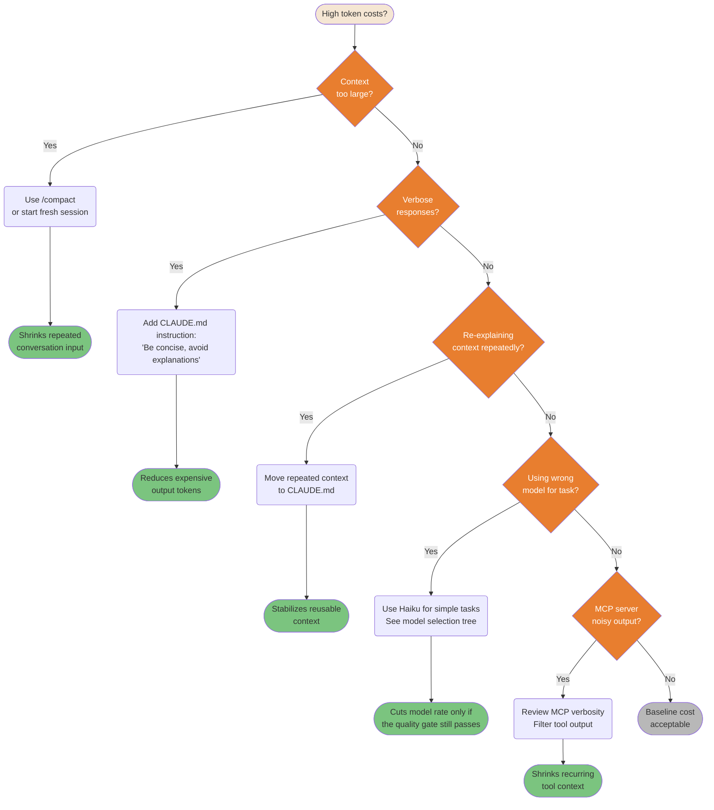
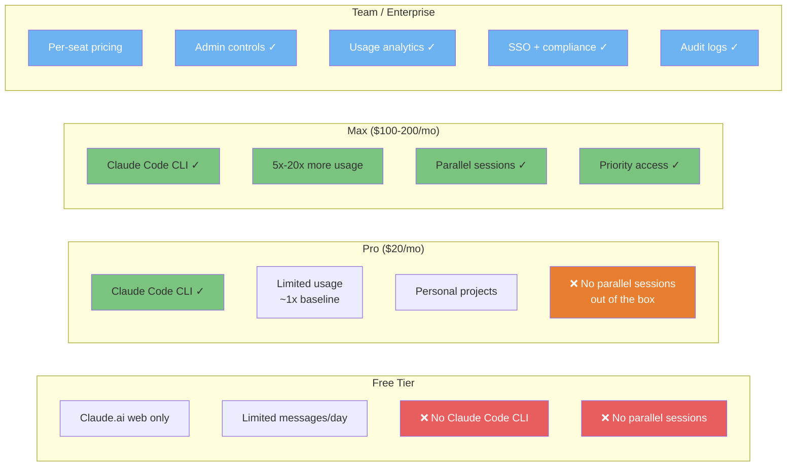

# Cost & Optimization

How to get maximum value from Claude Code while controlling token consumption and costs.

---

### Model Selection Decision Flow

Not all tasks need the most powerful model. A lower-cost model saves money only when it passes the same task acceptance gate without increasing retries, review, or rework.

> **This diagram assumes an unconstrained budget (Max/API).** On tighter plans (Pro, Teams Standard), apply the budget modifier below.

```mermaid
flowchart TD
    A([Task to complete]) --> B{Task complexity?}

    B -->|Simple| C["Simple tasks:<br/>typo fixes, renames,<br/>formatting, translations"]
    C --> D([Haiku 4.5<br/>💰 Lower public token rate<br/>~2x cheaper than Sonnet 5])

    B -->|Standard| E["Standard tasks:<br/>feature implementation,<br/>bug fixes, refactoring"]
    E --> F([Sonnet 5<br/>💰💰 Balanced candidate<br/>Validate on your task set])

    B -->|Complex| G{Needs deep<br/>reasoning?}
    G -->|Yes| H["Complex tasks:<br/>architecture decisions,<br/>security review,<br/>multi-file analysis"]
    H --> I([Opus 5: Maximum capability<br/>Opus 4.8: Deep analysis (prev. gen)<br/>💰💰💰 Higher public token rate<br/>~2.5x Sonnet 5])

    G -->|No: just large| J["Large but clear tasks:<br/>big refactors,<br/>doc generation"]
    J --> F

    style A fill:#F5E6D3,color:#333
    style B fill:#E87E2F,color:#fff
    style G fill:#E87E2F,color:#fff
    style D fill:#7BC47F,color:#333
    style F fill:#6DB3F2,color:#fff
    style I fill:#E87E2F,color:#fff
    style C fill:#B8B8B8,color:#333
    style E fill:#B8B8B8,color:#333
    style H fill:#B8B8B8,color:#333
    style J fill:#B8B8B8,color:#333

    click A href "https://github.com/FlorianBruniaux/claude-code-ultimate-guide/blob/main/guide/ultimate-guide.md#25-model-selection--thinking-guide" "Task to complete"
    click B href "https://github.com/FlorianBruniaux/claude-code-ultimate-guide/blob/main/guide/ultimate-guide.md#25-model-selection--thinking-guide" "Task complexity?"
    click C href "https://github.com/FlorianBruniaux/claude-code-ultimate-guide/blob/main/guide/ultimate-guide.md#25-model-selection--thinking-guide" "Simple tasks"
    click D href "https://github.com/FlorianBruniaux/claude-code-ultimate-guide/blob/main/guide/ultimate-guide.md#25-model-selection--thinking-guide" "Haiku 4.5"
    click E href "https://github.com/FlorianBruniaux/claude-code-ultimate-guide/blob/main/guide/ultimate-guide.md#25-model-selection--thinking-guide" "Standard tasks"
    click F href "https://github.com/FlorianBruniaux/claude-code-ultimate-guide/blob/main/guide/ultimate-guide.md#25-model-selection--thinking-guide" "Sonnet 5"
    click G href "https://github.com/FlorianBruniaux/claude-code-ultimate-guide/blob/main/guide/ultimate-guide.md#25-model-selection--thinking-guide" "Needs deep reasoning?"
    click H href "https://github.com/FlorianBruniaux/claude-code-ultimate-guide/blob/main/guide/ultimate-guide.md#25-model-selection--thinking-guide" "Complex tasks"
    click I href "https://github.com/FlorianBruniaux/claude-code-ultimate-guide/blob/main/guide/ultimate-guide.md#25-model-selection--thinking-guide" "Opus 5 / Sonnet + --think-hard"
    click J href "https://github.com/FlorianBruniaux/claude-code-ultimate-guide/blob/main/guide/ultimate-guide.md#25-model-selection--thinking-guide" "Large but clear tasks"
```

> **Pricing**: Ratios use the public API token rates recorded in [AI Unit Economics](/lib/09-harness/claude-code-ultimate-guide/guide-ops-ai-unit-economics#2-building-a-cost-per-accepted-task), verified 2026-08-31. Recheck [Anthropic pricing](https://www.anthropic.com/pricing) before a purchasing decision.

**Budget modifier** (on constrained plans, downgrade one tier per phase):

| Plan | Planning phase | Implementation phase |
|------|---------------|---------------------|
| **Max / API unconstrained (xhigh)** | Opus 5 | Sonnet |
| **Max / API unconstrained** | Opus 5 | Sonnet |
| **Pro / Teams Standard** | Sonnet | Haiku (mechanical tasks) |
| **API tight budget** | Sonnet | Haiku |

> *Community pattern (Teams Standard $25/mo): Sonnet for planning, then Haiku for mechanical implementation. Validate this split on repeated internal tasks before treating quality as equivalent.*


<summary>ASCII version</summary>

```
Task complexity?
├─ Simple (typos, format, rename) → Haiku 4.5     ($  ~2x cheaper than Sonnet 5)
├─ Standard (features, bugs)      → Sonnet 5      ($$ validate on your task set)
└─ Complex (architecture, sec.)
   ├─ Needs deep reasoning?        → Opus 5 (xhigh)  ($$$ ~2.5x Sonnet 5)
   └─ Just large/clear?            → Sonnet 5         ($$ handles it)

Budget modifier (downgrade one tier on constrained plans):
  Max/API (xhigh)  → Opus 5 plan, Sonnet impl
  Max/API          → Opus 5 plan, Sonnet impl
  Pro/Teams        → Sonnet plan, Haiku impl (mechanical tasks)
```


> **Source**: [Model Selection](/lib/09-harness/claude-code-ultimate-guide/guide-ultimate-guide/index#model-selection) (Line ~2634)

---

### Cost Optimization Decision Tree

High token costs are usually fixable. This systematic tree identifies the root cause and points to the right fix for each waste pattern.




<summary>ASCII version</summary>

```
High costs?
├─ Context too large?      → /compact or new session    (less repeated input)
├─ Verbose responses?      → CLAUDE.md: be concise      (less output)
├─ Repeating context?      → Move to CLAUDE.md          (stable reusable prefix)
├─ Wrong model?            → Test a cheaper model       (same acceptance gate)
├─ Noisy MCP output?       → Filter tool output         (less recurring context)
└─ None of the above?      → Baseline cost, acceptable
```


> **Effort slider**: `/effort xlow/low/default/high/xhigh` (v2.1.111) lets you tune thinking depth per task. Lower effort = fewer tokens consumed on thinking. Combine with model selection for fine-grained cost control.

> **Source**: [Cost Optimization](/lib/09-harness/claude-code-ultimate-guide/guide-ultimate-guide/index#cost-optimization) (Line ~8878)

---

### Subscription Tiers: What Each Unlocks

Different tiers unlock different Claude Code capabilities. Knowing the limits helps you plan usage and justify upgrades.




<summary>ASCII version</summary>

```
FREE         PRO ($20)        MAX ($100-200)   TEAM/Enterprise
────         ─────────        ──────────────   ───────────────
Web only     CLI ✓            CLI ✓            Per-seat
Limited msgs Limited usage    5-20x usage      Admin controls
No CLI       Personal use     Parallel ✓       Analytics
             No parallel      Priority ✓       SSO + compliance
```


> **Source**: [Subscription Tiers](/lib/09-harness/claude-code-ultimate-guide/guide-ultimate-guide/index#subscription-tiers) (Line ~1933)

---

### Token Reduction Strategies Pipeline

Multiple strategies can reduce the same token classes, so their advertised percentages cannot be multiplied. Apply them one at a time, measure the interaction, and retain only the changes that reduce cost per accepted task.

```mermaid
flowchart LR
    BASE([Baseline:<br/>100% tokens]) --> RTK

    subgraph RTK["Strategy 1: RTK Proxy"]
        R1[Raw CLI output<br/>→ filtered output]
        R2["git status, cargo test,<br/>pnpm list → compressed"]
        R3[Reported reduction on<br/>supported CLI output]
    end

    RTK --> COMP

    subgraph COMP["Strategy 2: /compact"]
        C1[Long conversation<br/>→ summarized]
        C2[Keep decisions,<br/>drop verbose reasoning]
        C3[Reduces future<br/>history input]
    end

    COMP --> CLAUDE_MD

    subgraph CLAUDE_MD["Strategy 3: CLAUDE.md"]
        CM1[Repeated context<br/>→ persistent instructions]
        CM2[No re-explaining<br/>project conventions]
        CM3[Creates a stable<br/>reusable prefix]
    end

    CLAUDE_MD --> MODEL

    subgraph MODEL["Strategy 4: Model Selection"]
        MO1[Haiku for simple tasks<br/>instead of Sonnet]
        MO2[Compare on the same<br/>acceptance gate]
        MO3[Lower model rate<br/>after validation]
    end

    MODEL --> RESULT([Measure:<br/>cost per accepted task<br/>before and after])

    style BASE fill:#E85D5D,color:#fff
    style R3 fill:#7BC47F,color:#333
    style C3 fill:#7BC47F,color:#333
    style CM3 fill:#7BC47F,color:#333
    style MO3 fill:#7BC47F,color:#333
    style RESULT fill:#7BC47F,color:#333

    click BASE href "https://github.com/FlorianBruniaux/claude-code-ultimate-guide/blob/main/guide/ultimate-guide.md#913-cost-optimization-strategies" "Baseline: 100% tokens"
    click R1 href "https://github.com/FlorianBruniaux/claude-code-ultimate-guide/blob/main/guide/ultimate-guide.md#913-cost-optimization-strategies" "Raw CLI output filtered"
    click R2 href "https://github.com/FlorianBruniaux/claude-code-ultimate-guide/blob/main/guide/ultimate-guide.md#913-cost-optimization-strategies" "RTK commands"
    click R3 href "https://github.com/FlorianBruniaux/claude-code-ultimate-guide/blob/main/guide/ultimate-guide.md#913-cost-optimization-strategies" "Reported reduction on supported CLI output"
    click C1 href "https://github.com/FlorianBruniaux/claude-code-ultimate-guide/blob/main/guide/ultimate-guide.md#913-cost-optimization-strategies" "Long conversation summarized"
    click C2 href "https://github.com/FlorianBruniaux/claude-code-ultimate-guide/blob/main/guide/ultimate-guide.md#913-cost-optimization-strategies" "Keep decisions"
    click C3 href "https://github.com/FlorianBruniaux/claude-code-ultimate-guide/blob/main/guide/ultimate-guide.md#913-cost-optimization-strategies" "Reduce future history input"
    click CM1 href "https://github.com/FlorianBruniaux/claude-code-ultimate-guide/blob/main/guide/ultimate-guide.md#31-memory-files-claudemd" "Repeated context persistent"
    click CM2 href "https://github.com/FlorianBruniaux/claude-code-ultimate-guide/blob/main/guide/ultimate-guide.md#31-memory-files-claudemd" "No re-explaining conventions"
    click CM3 href "https://github.com/FlorianBruniaux/claude-code-ultimate-guide/blob/main/guide/ultimate-guide.md#913-cost-optimization-strategies" "Create a stable reusable prefix"
    click MO1 href "https://github.com/FlorianBruniaux/claude-code-ultimate-guide/blob/main/guide/ultimate-guide.md#25-model-selection--thinking-guide" "Haiku for simple tasks"
    click MO2 href "https://github.com/FlorianBruniaux/claude-code-ultimate-guide/blob/main/guide/ultimate-guide.md#25-model-selection--thinking-guide" "Compare on the same acceptance gate"
    click MO3 href "https://github.com/FlorianBruniaux/claude-code-ultimate-guide/blob/main/guide/ultimate-guide.md#25-model-selection--thinking-guide" "Lower model rate after validation"
    click RESULT href "https://github.com/FlorianBruniaux/claude-code-ultimate-guide/blob/main/guide/ultimate-guide.md#913-cost-optimization-strategies" "Measure cost per accepted task"
```




<summary>ASCII version</summary>

```
100% baseline
    │
RTK proxy (CLI output compression)  → smaller supported command output
    │
/compact (conversation summarization) → less history in later turns
    │
CLAUDE.md (stable project context)    → reusable prompt prefix
    │
Model selection (cheaper candidate)   → keep only if acceptance stays stable
    │
Measure total cost per accepted task before and after
```


> **Track usage**: Use `/usage` to monitor token consumption and costs (replaces `/cost` as of v2.1.118; `/cost` remains a valid alias).

> **Source**: [Token Optimization](/lib/09-harness/claude-code-ultimate-guide/guide-ultimate-guide/index#token-optimization) (Line ~13355)
