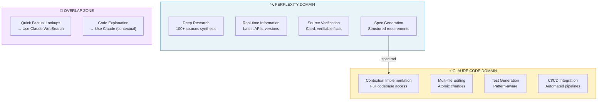
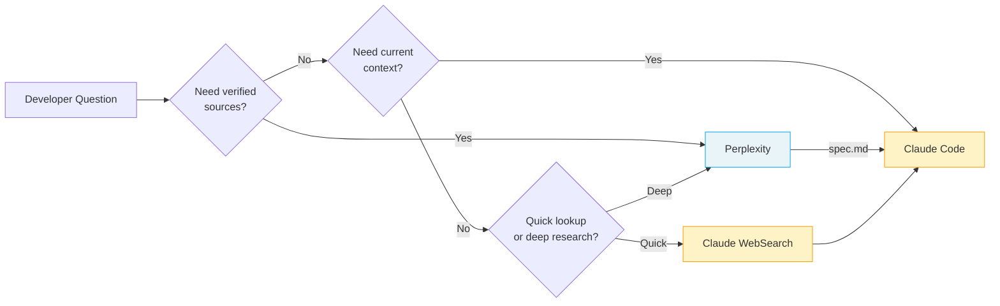

## 1. Perplexity AI (Research & Sourcing)

### Complementarity Diagram

The following diagram illustrates how Perplexity and Claude Code complement each other across the development workflow:



**Key Insight**: Perplexity answers "What should we build?" → Claude Code answers "How do we build it here?"

### Decision Flow



### When to Use Perplexity Over Claude

| Scenario | Use Perplexity | Use Claude |
|----------|---------------|------------|
| "What's the latest API for X?" | ✅ | ⚠️ Knowledge cutoff |
| "Compare 5 libraries for auth" | ✅ Sources | ⚠️ May hallucinate |
| "Explain this error message" | ⚠️ Generic | ✅ Contextual |
| "Implement auth in my codebase" | ❌ No files | ✅ Full access |

### Perplexity Pro Features for Developers

**Deep Research Mode**
- Synthesizes 100+ sources into structured output
- Takes 3-5 minutes but produces comprehensive specs
- Export as markdown → Feed to Claude Code

**Model Selection**
- Claude Sonnet 4: Best for technical prose and documentation
- GPT-4o: Good for code snippets
- Sonar Pro: Fast factual lookups

**Labs Features**
- Spaces: Persistent project contexts
- Code blocks: Syntax-highlighted exports
- Charts: Auto-generated from data

### Integration Workflow

#### Pattern 1: Research → Spec → Code

```
┌─────────────────────────────────────────────────────────┐
│ 1. PERPLEXITY (Deep Research)                           │
│    "Research best practices for JWT refresh tokens      │
│     in Next.js 15. Include security considerations,     │
│     common pitfalls, and library recommendations."      │
│                                                         │
│    → Output: 2000-word spec with sources               │
└───────────────────────────┬─────────────────────────────┘
                            ↓ Export as spec.md
┌─────────────────────────────────────────────────────────┐
│ 2. CLAUDE CODE                                          │
│    > claude                                             │
│    "Implement JWT refresh tokens following spec.md.     │
│     Use the jose library as recommended."               │
│                                                         │
│    → Output: Working implementation with tests         │
└─────────────────────────────────────────────────────────┘
```

#### Pattern 2: Parallel Pane Workflow

Using tmux or terminal split:

```bash
# Left pane: Perplexity (browser or CLI)
perplexity "Best practices for rate limiting in Express"

# Right pane: Claude Code (implementing)
claude "Add rate limiting to API. Check spec.md for approach."
```

### Comparison: Claude WebSearch vs Perplexity

| Feature | Claude WebSearch | Perplexity Pro |
|---------|-----------------|----------------|
| Source count | ~5-10 | 100+ (Deep Research) |
| Source verification | Basic | Full citations |
| Real-time data | Yes | Yes |
| Export format | Text in context | Markdown, code blocks |
| Best for | Quick lookups | Comprehensive research |
| Cost | Included | $20/month Pro |

**Recommendation**: Use Claude WebSearch for quick factual checks. Use Perplexity Deep Research before any significant implementation that requires understanding the ecosystem.
