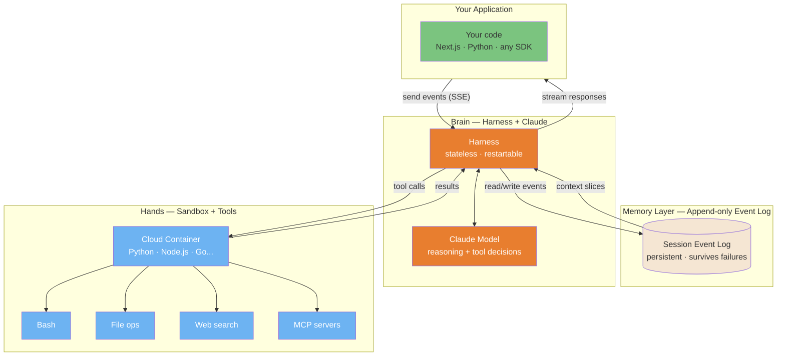
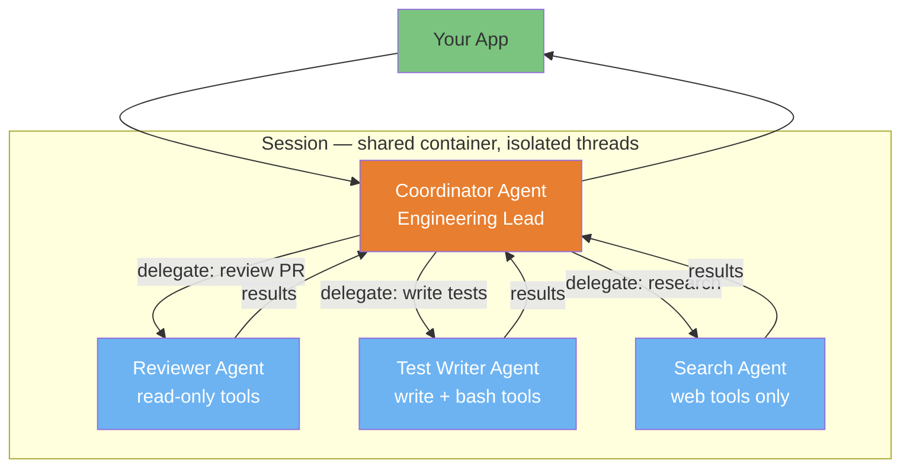

## 14. Claude Managed Agents (Cloud-Hosted Platform)

> **Launched**: April 8, 2026 (public beta, enabled by default for all Anthropic API accounts).

Claude Managed Agents is Anthropic's cloud-hosted agent platform. Where Claude Code is a tool *you* use to write software, Managed Agents is infrastructure *you ship* to your users: an autonomous agent running in the cloud on your behalf.

The key mental model: **Claude Code is a harness built on top of the same infrastructure**. Managed Agents is the underlying platform, now available directly to any developer.

---

### The Three-Way Decision

Anthropic offers three distinct ways to build with Claude. Picking the wrong layer costs weeks.

| | Messages API | Claude Managed Agents | Claude Code |
|---|---|---|---|
| **What it is** | Direct model prompting | Managed cloud agent harness | CLI/IDE coding assistant |
| **Who operates it** | You build the loop | Anthropic handles infra | You (the developer) |
| **Best for** | Custom agent loops, fine-grained control | Long-running autonomous tasks in your product | Writing software interactively |
| **Infrastructure** | Your servers | Anthropic's cloud | Your machine |
| **Session persistence** | You manage state | Built-in, survives disconnections | Per-session |
| **Multi-agent** | Manual coordination | Built-in threads (research preview) | Sub-agents via Task tool |
| **Access** | API key | API key (same pricing model) | Max/Pro subscription or API |
| **Typical use** | Chatbots, pipelines, fine-grained apps | Product features, background workers | Developer workflow |

**Rule of thumb**: if your users trigger the agent (not you), reach for Managed Agents. If you are the agent's user, reach for Claude Code.

---

### Architecture: Brain, Hands, Memory

The platform decouples three components that older agent architectures bundled together in one fragile container.



**Why this matters in practice**:

- **Old architecture**: one container = brain + hands + memory. Container crash = lost session.
- **New architecture**: each layer is independent. Harness restarts don't lose the session log. Container crashes don't lose the reasoning chain. Measured impact: p50 TTFT dropped ~60%, p95 dropped >90%.
- **Security**: credentials never reach generated code. Git tokens are used during sandbox init, then discarded. OAuth tokens stay in vaults outside the sandbox, accessed via dedicated proxies.

---

### Core Concepts (API)

Four objects, in order of creation:

| Concept | What it is | Created once or per-task |
|---------|-----------|--------------------------|
| **Agent** | Model + system prompt + tools + MCP servers | Once, reused across sessions |
| **Environment** | Container template (packages, network rules) | Once, reused across sessions |
| **Session** | Running agent instance for one task | Per task |
| **Events** | Messages between your app and the agent (SSE) | Continuous during session |

**Beta header required on every request**: `anthropic-beta: managed-agents-2026-04-01`

---

### Multi-Agent Coordination (Research Preview)

One agent (coordinator) delegates to specialized sub-agents running in parallel threads. Each thread has its own isolated context. Tools and conversation history are not shared.



**Current constraints** (research preview): one level of delegation only, sub-agents cannot spawn further agents. All agents share the same container filesystem but run in separate session threads.

---

### Real-World Use Cases

| Use case | Why Managed Agents fits |
|----------|------------------------|
| **Code review bot in your product** | Long-running, triggered by users, needs file access and bash |
| **Background data pipeline** | Runs for hours, survives connection drops, no babysitting required |
| **AI-powered onboarding assistant** | Persistent state across sessions, web search + file generation |
| **Document generation workflow** | Multi-agent: researcher + writer + formatter in parallel |
| **Automated QA agent** | Write tests, run them, fix failures: autonomous loop with self-evaluation (research preview) |

**Enterprise validation** (from the launch announcement): Notion deploys parallel task execution agents, Rakuten ships specialist agents in under a week each, Asana runs collaborative AI teammates, Sentry pairs a debugging agent with patch-writing.

---

### Next.js Integration Pattern

The most common pattern: a Next.js API route that creates a session, sends a task, and streams the agent's progress back to the frontend via Server-Sent Events.

**Install**:

```bash
npm install @anthropic-ai/sdk
```

**API route** (`app/api/agent/route.ts`):

```typescript
import Anthropic from "@anthropic-ai/sdk";

const client = new Anthropic({ apiKey: process.env.ANTHROPIC_API_KEY });

// Agent and environment are created once (e.g., at app startup or in a setup script)
// Store these IDs in environment variables: AGENT_ID, ENVIRONMENT_ID

export async function POST(req: Request) {
  const { task } = await req.json();

  // 1. Create a session for this task
  const session = await client.beta.sessions.create({
    agent: process.env.AGENT_ID!,
    environment_id: process.env.ENVIRONMENT_ID!,
    title: task,
  });

  // 2. Return a streaming response (SSE) to the browser
  const encoder = new TextEncoder();
  const stream = new ReadableStream({
    async start(controller) {
      // Open the agent event stream
      const agentStream = await client.beta.sessions.events.stream(session.id);

      // Send the user task
      await client.beta.sessions.events.send(session.id, {
        events: [{ type: "user.message", content: [{ type: "text", text: task }] }],
      });

      // Forward agent events to the browser
      for await (const event of agentStream) {
        if (event.type === "agent.message") {
          for (const block of event.content) {
            controller.enqueue(
              encoder.encode(`data: ${JSON.stringify({ text: block.text })}\n\n`)
            );
          }
        } else if (event.type === "agent.tool_use") {
          controller.enqueue(
            encoder.encode(`data: ${JSON.stringify({ tool: event.name })}\n\n`)
          );
        } else if (event.type === "session.status_idle") {
          controller.enqueue(encoder.encode(`data: ${JSON.stringify({ done: true })}\n\n`));
          break;
        }
      }
      controller.close();
    },
  });

  return new Response(stream, {
    headers: {
      "Content-Type": "text/event-stream",
      "Cache-Control": "no-cache",
      Connection: "keep-alive",
    },
  });
}
```

**Frontend hook** (`hooks/useAgent.ts`):

```typescript
import { useState } from "react";

export function useAgent() {
  const [output, setOutput] = useState<string[]>([]);
  const [tools, setTools] = useState<string[]>([]);
  const [running, setRunning] = useState(false);

  async function run(task: string) {
    setRunning(true);
    setOutput([]);
    setTools([]);

    const res = await fetch("/api/agent", {
      method: "POST",
      headers: { "Content-Type": "application/json" },
      body: JSON.stringify({ task }),
    });

    const reader = res.body!.getReader();
    const decoder = new TextDecoder();

    while (true) {
      const { done, value } = await reader.read();
      if (done) break;

      for (const line of decoder.decode(value).split("\n")) {
        if (!line.startsWith("data: ")) continue;
        const data = JSON.parse(line.slice(6));
        if (data.text) setOutput((prev) => [...prev, data.text]);
        if (data.tool) setTools((prev) => [...prev, data.tool]);
        if (data.done) setRunning(false);
      }
    }
  }

  return { run, output, tools, running };
}
```

**Environment variables** (`.env.local`):

```
ANTHROPIC_API_KEY=your-api-key
AGENT_ID=agt_...         # from client.beta.agents.create()
ENVIRONMENT_ID=env_...   # from client.beta.environments.create()
```

> **Note on agent/environment creation**: create these once (in a setup script or on first deploy) and store the IDs. They are reusable across all sessions, no need to recreate on every request.

---

### When to Reach for Managed Agents (Decision Checklist)

Use Managed Agents when **two or more** of these apply:

- [ ] The task runs longer than a single HTTP request (minutes, not seconds)
- [ ] Your *users* trigger the agent (not you, the developer)
- [ ] You need the agent to survive connection drops or server restarts
- [ ] The agent needs to execute code, read/write files, or search the web in a container
- [ ] You want observability without building it (the Console traces every tool call)
- [ ] You're building a product feature, not a development workflow

Stay on the **Messages API** when you need full control over the agent loop, custom retry logic, or non-standard tool routing.

Stay on **Claude Code** when you are the user: writing software, reviewing PRs, running analysis on your own machine.

---

### Research Preview Features

Three features behind a separate access request, functional but not yet stable API contracts.

#### Outcomes (Self-Evaluation Loop)

The agent evaluates its own output against criteria you define, then iterates until it meets them. No manual retry loop on your side.

```typescript
const agent = await client.beta.agents.create({
  name: "Report Writer",
  model: "claude-sonnet-5",
  system: "You write concise executive summaries.",
  tools: [{ type: "agent_toolset_20260401" }],
  outcomes: [
    { description: "Summary is under 300 words" },
    { description: "Key metrics are cited with sources" },
    { description: "No jargon — readable by a non-technical executive" },
  ],
});
```

Measured impact on internal tests: up to 10-point improvement in task success on structured file generation, with the largest gains on the hardest problems.

#### Memory (Cross-Session Persistence)

The agent remembers facts across sessions. Stored in a vector index managed by Anthropic. No external database required.

Useful for: user preference tracking, project context that builds over time, personal assistants that learn.

#### Multi-Agent (Coordination)

Documented above. One coordinator, N specialists in parallel threads, one level of delegation.

**Request access**: [claude.com/form/claude-managed-agents](https://claude.com/form/claude-managed-agents)

---

### Cost Model & Optimization

**Billing**: standard Anthropic API token pricing. No session fee, no compute surcharge beyond tokens. Prompt caching and compaction are applied automatically. You pay for the reduced token count.

**Model selection is the main cost lever**:

| Model | Input | Output | When to use |
|-------|-------|--------|-------------|
| Haiku 4.5 | ~$0.80/MTok | ~$4/MTok | Classification, routing, simple extraction |
| Sonnet 5 | $2/MTok (promo through 2026-08-31) | $10/MTok (promo through 2026-08-31) | Most tasks, the current default |
| Opus 4.8 | previous-gen top tier | previous-gen top tier | Complex reasoning, superseded by Opus 5 |
| Opus 5 | fast mode $10/MTok | fast mode $50/MTok | Complex reasoning, multi-step ambiguous tasks only |

**Typical session cost** (Sonnet 5, with built-in caching):

| Task complexity | Tokens consumed | Estimated cost |
|----------------|----------------|----------------|
| Simple (1-2 tool calls) | ~20-50K | ~$0.05-0.15 |
| Medium (5-15 tool calls) | ~100-300K | ~$0.30-1.00 |
| Complex (30+ tool calls, 1h+ runtime) | ~500K-2M | ~$1.50-8.00 |

**Cost control patterns**:

1. **Tiered routing**: use Haiku to classify the task, then route to Sonnet or Opus based on complexity score.
2. **Scope the system prompt**: every token in your system prompt is cached after the first call, but a bloated prompt still adds up across many sessions.
3. **Set outcome criteria** (research preview): the agent self-corrects instead of you running multiple full sessions to get the right output.
4. **Rate-limit by user**: the API enforces 60 session creations per minute org-wide. Build per-user queuing before you hit that.

---

### The `ant` CLI

Anthropic ships a dedicated CLI for managing agents, environments, and sessions from the terminal, useful for setup scripts and debugging.

**Install** (macOS):

```bash
brew install anthropics/tap/ant
xattr -d com.apple.quarantine "$(brew --prefix)/bin/ant"  # unquarantine on macOS
```

**Install** (Linux/WSL):

```bash
VERSION=1.0.0
OS=$(uname -s | tr '[:upper:]' '[:lower:]')
ARCH=$(uname -m | sed -e 's/x86_64/amd64/' -e 's/aarch64/arm64/')
curl -fsSL "https://github.com/anthropics/anthropic-cli/releases/download/v${VERSION}/ant_${VERSION}_${OS}_${ARCH}.tar.gz" \
  | sudo tar -xz -C /usr/local/bin ant
```

**Common commands**:

```bash
# Create an agent (interactive YAML)
ant beta:agents create \
  --name "My Agent" \
  --model claude-sonnet-5 \
  --system "You are a helpful assistant." \
  --tool '{type: agent_toolset_20260401}'

# List agents
ant beta:agents list

# Start a session interactively
ant beta:sessions create --agent $AGENT_ID --environment $ENVIRONMENT_ID

# Stream a session live
ant beta:sessions stream --session-id $SESSION_ID

# Inspect session threads (multi-agent)
ant beta:sessions:threads list --session-id $SESSION_ID
```

The CLI sets all required beta headers automatically. Useful for one-off agent setup, debugging a stuck session, or scripting environment provisioning in CI.

---

### SDK Support Matrix

The Managed Agents API is available in 8 SDKs out of beta. All set the `managed-agents-2026-04-01` beta header automatically.

| Language | Package | Install |
|----------|---------|---------|
| TypeScript / Node.js | `@anthropic-ai/sdk` | `npm install @anthropic-ai/sdk` |
| Python | `anthropic` | `pip install anthropic` |
| Go | `anthropic-sdk-go` | `go get github.com/anthropics/anthropic-sdk-go` |
| Java | `anthropic-java` | Gradle: `com.anthropic:anthropic-java:2.20.0` |
| C# | `Anthropic` | `dotnet add package Anthropic` |
| Ruby | `anthropic` | `bundle add anthropic` |
| PHP | `anthropic-ai/sdk` | `composer require anthropic-ai/sdk` |
| CLI | `ant` | `brew install anthropics/tap/ant` |

---

### Engineering Background: Why the Architecture Changed

From the [Anthropic engineering blog](https://www.anthropic.com/engineering/managed-agents), useful context for understanding the design decisions.

**The "pets vs cattle" problem**: the original single-container architecture created what infrastructure teams call a "pet" (a hand-maintained individual you cannot afford to lose). One crash meant losing the entire session. The new decoupled model treats each component as "cattle": stateless, interchangeable, and replaceable.

**Assumption decay**: the original harness was built around model limitations: workarounds for "context anxiety" in Sonnet 4.5, explicit recovery logic for behaviors Claude Opus 4.5 no longer exhibits. Every model generation, these workarounds became dead weight. The interface-first redesign solves this: harness implementations swap underneath stable interfaces, so model improvements are captured without architectural surgery.

**Interface stability**: each component communicates through minimal contracts: `execute(name, input) → string` for containers, `wake(sessionId)` / `getSession(id)` for harness recovery. This mirrors OS virtualization: `read()` stays stable across hardware generations. The implication for builders: your application code talks to stable session and event APIs, regardless of what Anthropic does internally.

---

### Resources

- [Official docs](https://platform.claude.com/docs/en/managed-agents/overview)
- [Quickstart](https://platform.claude.com/docs/en/managed-agents/quickstart)
- [API Reference](https://platform.claude.com/docs/en/api/beta/sessions)
- [Engineering blog: Decoupling the brain from the hands](https://www.anthropic.com/engineering/managed-agents)
- [Multi-agent coordination docs](https://platform.claude.com/docs/en/managed-agents/multi-agent)
- [Request research preview access](https://claude.com/form/claude-managed-agents) (multi-agent, self-evaluation, memory)
- [`ant` CLI releases](https://github.com/anthropics/anthropic-cli/releases)
