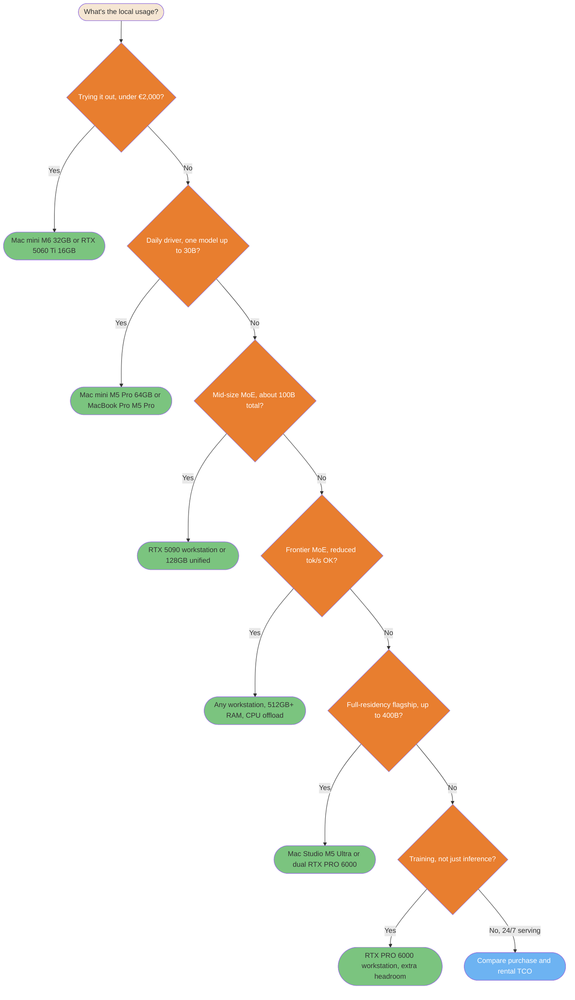

## Which Local Machine for Which Usage

The two tables above answer "what fits where." This section answers a different, more common question: given what you actually want to do, which of the fourteen configurations is the right one to buy. Same underlying data, organized by use case instead of by price.


| Usage | Recommended configuration(s) | Model class this targets | Why |
|---|---|---|---|
| Trying local inference cheaply, side project, budget under €2,000 | Mac mini M6 (32 GB) or RTX 5060 Ti 16 GB workstation | `gpt-oss-20b`, `Qwen3.8-27B` at a heavier quant | Cheapest entry point that runs a real current-generation model, not a toy fine-tune |
| Daily coding assistant, one model up to ≈30B, real context window | Mac mini M5 Pro (64 GB) or MacBook Pro M5 Pro (48 GB) | `Qwen3.8-27B` comfortable; `Llama-4-Scout` too tight | 48-64 GB gives one model room plus enough context to be useful, not just a benchmark pass |
| Mid-size MoE (≈100B total, ≈17B active) at good throughput | Dual RTX 5090 workstation (64 GB aggregate, with a backend that supports tensor splitting) or a 96-128 GB unified config (DGX Spark, Ryzen AI Halo, MacBook Pro M5 Max) | `Llama-4-Scout-17B-16E` | 55.6 GB of weights does not fit one 32 GB RTX 5090; 64 GB leaves limited runtime and context headroom, while 96-128 GB is safer |
| Frontier MoE (GLM-5.2, DeepSeek-V4-Pro), reduced but usable throughput accepted | Any workstation on this page with 512 GB+ system RAM added, running `llama.cpp --n-cpu-moe` or [FreeToken](https://github.com/FlashML-org/FreeToken) | `GLM-5.2`, `DeepSeek-V4-Pro-0813` | Full expert set stays resident in system RAM; only the per-token active experts stream to GPU, so VRAM stops being the hard limit |
| Largest model this page supports at full-accelerator-memory residency, no offload tricks | Mac Studio M5 Ultra (256 GB) or dual RTX PRO 6000 Blackwell (192 GB combined) | `DeepSeek-V4-Flash-0731` fits within the available third-party weight estimates on both; `Llama-4-Maverick-17B-128E` fits only on the 256 GB config | ≈100-170 GB (third-party quantized estimates, no official figure) for DeepSeek-V4-Flash-0731; the upper estimate leaves limited runtime headroom on 192 GB. Llama-4-Maverick needs 205.7 GB and does not fit 192 GB |
| Local fine-tuning or training, not inference-only | RTX PRO 6000 Blackwell workstation (single or dual) | Depends on target model | Training needs VRAM headroom beyond weight residency for optimizer states and gradients, a cost this page's inference-only figures don't model |
| Sustained heavy or 24/7 production serving | Compare purchase, dedicated rental, and elastic rental | Exact production model and service level | Utilization, power, maintenance, availability, and the required GPU class determine the result; the hourly price alone does not |




<summary>ASCII version</summary>

```
What's the local usage?
└─ Trying it out, under €2,000?
   ├─ Yes → Mac mini M6 32GB or RTX 5060 Ti 16GB
   └─ No  → Daily driver, one model up to 30B?
            ├─ Yes → Mac mini M5 Pro 64GB or MacBook Pro M5 Pro
            └─ No  → Mid-size MoE, about 100B total?
                     ├─ Yes → RTX 5090 workstation or 128GB unified
                     └─ No  → Frontier MoE, reduced tok/s OK?
                              ├─ Yes → Any workstation, 512GB+ RAM, CPU offload
                              └─ No  → Full-residency flagship, up to 400B?
                                       ├─ Yes → Mac Studio M5 Ultra or dual RTX PRO 6000
                                       └─ No  → Training, not just inference?
                                                ├─ Yes             → RTX PRO 6000 workstation, extra VRAM headroom
                                                └─ No, 24/7 serving → Compare purchase and rental TCO
```


