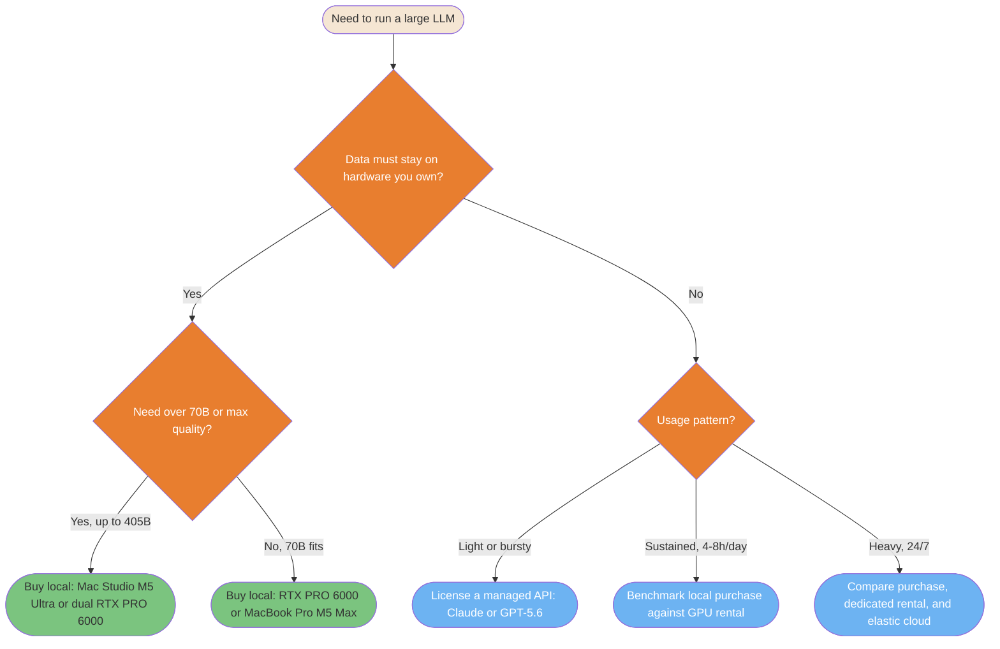

## Decision Diagram




<summary>ASCII version</summary>

```
Need to run a large LLM
└─ Data must stay on hardware you own?
   ├─ Yes → Need over 70B or max quality?
   │        ├─ Yes, up to 405B → BUY: Mac Studio M5 Ultra or dual RTX PRO 6000
   │        └─ No, 70B fits    → BUY: RTX PRO 6000 or MacBook Pro M5 Max
   └─ No  → Usage pattern?
            ├─ Light or bursty     → LICENSE: managed API (Claude or GPT-5.6)
            ├─ Sustained, 4-8h/day → BENCHMARK: local purchase against GPU rental
            └─ Heavy, 24/7         → COMPARE: purchase, dedicated rental, elastic cloud
```


