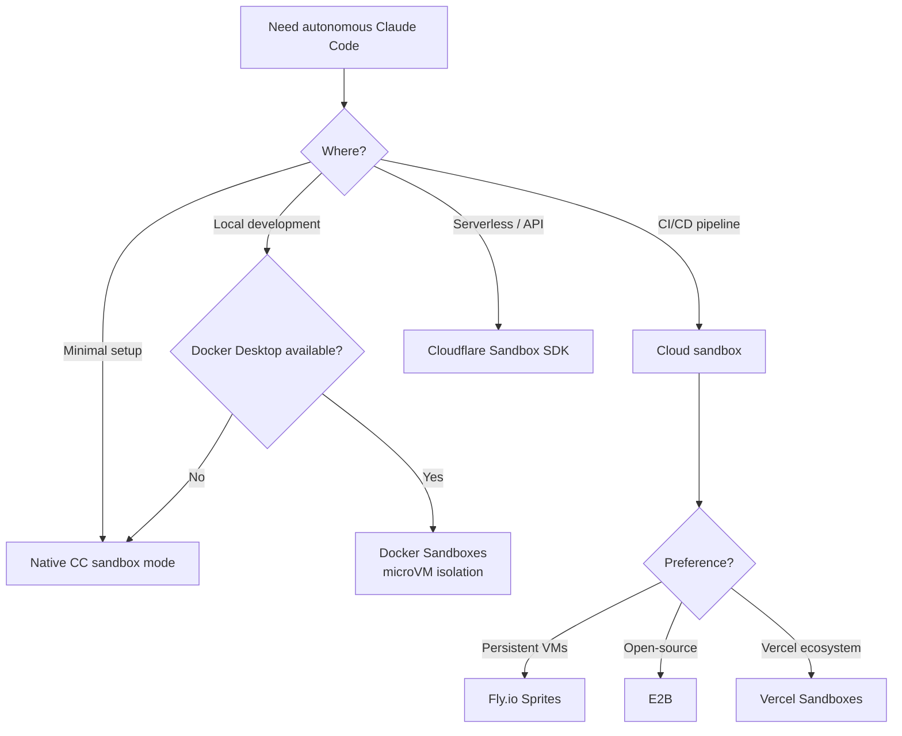

# Sandbox Isolation for Coding Agents

> **Confidence**: Tier 2 (Official Docker docs + verified vendor documentation)
> **Reading time**: ~10 minutes
> **Scope**: Running Claude Code safely in isolated environments
> **Further reading**: [why isolation, not permissions, is the real security boundary](https://florian.bruniaux.com/guides/claude-code-attack-surface/) digs deeper into this exact tradeoff.

---

## TL;DR

| Solution | Isolation | Local/Cloud | Best For |
|----------|-----------|-------------|----------|
| **Docker Sandboxes** | microVM (hypervisor) | Local | Max security, Docker-in-Docker needed |
| **Native CC sandbox** | Process (Seatbelt/bubblewrap) | Local | Lightweight daily dev, trusted code |
| **Fly.io Sprites** | Firecracker microVM | Cloud | API-driven agent workflows |
| **E2B** | Firecracker microVM | Cloud | Multi-framework AI apps |
| **Vercel Sandboxes** | Firecracker microVM | Cloud | Next.js / Vercel ecosystem |
| **Cloudflare Sandbox SDK** | Container | Cloud | Workers-based serverless |
| **agentOS** (Rivet) | V8 isolate + WASM sandbox, no hypervisor | In-process, no cloud account | Node-embedded agents, no provider dependency |
| **just-bash** (Vercel) | None (simulated shell, no VM at all) | In-process, no cloud account | Embedded bash tool, dev/test, demo terminals |

Quick start:

```bash
docker sandbox run claude ~/my-project
```

---

## 1. The Problem: Safe Autonomy

Claude Code's permission system protects you from unintended actions. But it creates a tension:

- **`--dangerously-skip-permissions`** removes all guardrails: Claude can `rm -rf`, `git push --force`, or `DROP TABLE` without asking. On a bare host, this is dangerous.
- **Permission fatigue**: approving every file edit and shell command slows down autonomous workflows. For large refactors or CI pipelines, interactive approval is impractical.
- **The gap**: How do you run Claude Code autonomously AND safely?

**Answer**: Isolate the execution environment. Let the agent run free inside a sandbox where the blast radius is contained. The sandbox is the security boundary, not the permission system.

---

## 2. Isolation Approaches



---

## 3. Docker Sandboxes

> **Source**: [docs.docker.com/ai/sandboxes/](https://docs.docker.com/ai/sandboxes/)
> **Requires**: Docker Desktop 4.58+ (macOS or Windows)

Docker Sandboxes run AI coding agents in microVM-based isolation on your local machine. Each sandbox gets its own private Docker daemon and filesystem. Sandboxes do NOT appear in `docker ps` since they are VMs, not containers.

### Quick Start

```bash
# Create and run a sandbox with your project
docker sandbox run claude ~/my-project

# Run with autonomous mode (safe inside sandbox)
docker sandbox run claude ~/my-project -- --dangerously-skip-permissions

# Pass a prompt directly
docker sandbox run claude ~/my-project -- "Refactor auth module to use JWT"

# Continue a previous session
docker sandbox run my-sandbox -- --continue
```

### Architecture

```
┌──────────────────────────────────────────────────────────┐
│                     HOST MACHINE                          │
│                                                          │
│  ┌────────────────────────────────────────────────────┐  │
│  │              DOCKER SANDBOX (microVM)               │  │
│  │                                                    │  │
│  │  ┌──────────────┐  ┌───────────────────────────┐  │  │
│  │  │ Claude Code   │  │ Private Docker daemon     │  │  │
│  │  │ (--dsp mode)  │  │ (isolated from host)      │  │  │
│  │  └──────────────┘  └───────────────────────────┘  │  │
│  │                                                    │  │
│  │  ┌──────────────────────────────────────────────┐  │  │
│  │  │ Workspace: ~/my-project (synced with host)   │  │  │
│  │  │ Same absolute path as host                   │  │  │
│  │  └──────────────────────────────────────────────┘  │  │
│  │                                                    │  │
│  │  Base: Ubuntu, Node.js, Python 3, Go, Git,        │  │
│  │        Docker CLI, GitHub CLI, ripgrep, jq         │  │
│  │  User: non-root 'agent' with sudo                 │  │
│  └────────────────────────────────────────────────────┘  │
│                                                          │
│  Host Docker daemon: NOT accessible from sandbox          │
│  Host filesystem: NOT accessible (except workspace)       │
└──────────────────────────────────────────────────────────┘
```

Key properties:
- **Workspace sync**: Host directory mounts at the same absolute path inside the sandbox
- **Full isolation**: Agent cannot access host Docker daemon, host containers, or files outside workspace
- **Private Docker**: Each sandbox has its own Docker daemon for building/running containers
- **Claude runs with `--dangerously-skip-permissions`**: intentional, since the sandbox is the security boundary

### Network Policies

Control what the sandbox can access on the network.

```bash
# View network activity
docker sandbox network log my-sandbox

# Set up denylist mode (block all, allow specific)
docker sandbox network proxy my-sandbox \
  --policy deny \
  --allow-host api.anthropic.com \
  --allow-host "*.npmjs.org" \
  --allow-host "*.pypi.org" \
  --allow-host github.com

# Set up allowlist mode (allow all, block specific)
docker sandbox network proxy my-sandbox \
  --policy allow \
  --block-host "*.malicious-domain.com" \
  --block-cidr "192.168.0.0/16"
```

| Mode | Default behavior | Use case |
|------|-----------------|----------|
| **Allowlist** (default) | Permits most traffic, blocks specific destinations | General development |
| **Denylist** | Blocks all traffic, allows only specified destinations | High-security environments |

**Default blocked ranges**: Private CIDRs (`10.0.0.0/8`, `127.0.0.0/8`, `172.16.0.0/12`, `192.168.0.0/16`, `169.254.0.0/16`) and IPv6 equivalents.

**Pattern matching**: Exact (`example.com`), port-specific (`example.com:443`), wildcards (`*.example.com` matches subdomains only). Most specific pattern wins.

**Security caveat**: Domain filtering does not inspect traffic content. Broad allowances (e.g., `github.com`) permit access to user-generated content. HTTPS inspection is not performed in bypass mode.

**Config storage**: Per-sandbox at `~/.docker/sandboxes/vm/[name]/proxy-config.json`. Policies persist across restarts.

### Custom Templates

For teams needing reproducible environments with specific tooling:

```dockerfile
FROM docker/sandbox-templates:claude-code

USER root

# Install project-specific dependencies
RUN apt-get update && apt-get install -y \
    postgresql-client \
    redis-tools

# Install global npm packages
RUN npm install -g pnpm turbo

USER agent
```

Build and use:

```bash
# Build the template
docker build -t my-team-sandbox:v1 .

# Create sandbox with custom template
docker sandbox create my-sandbox \
  --template my-team-sandbox:v1 \
  --load-local-template ~/my-project
```

Use custom templates when: team environments, specific tool versions, repeated setups, complex configurations. For simple one-off work, use the defaults and let the agent install what it needs.

### Commands Reference

| Command | Description |
|---------|-------------|
| `docker sandbox run <agent> <path>` | Create and start a sandbox |
| `docker sandbox create <name>` | Create without starting |
| `docker sandbox ls` | List all sandboxes |
| `docker sandbox run <name> -- "prompt"` | Pass a prompt |
| `docker sandbox run <name> -- --continue` | Continue previous session |
| `docker sandbox run <name> -- --dsp` | Short for --dangerously-skip-permissions |
| `docker sandbox network proxy <name>` | Configure network policies |
| `docker sandbox network log <name>` | View network activity |

### Authentication

**Option 1: API key (recommended for headless)**

Set `ANTHROPIC_API_KEY` in `~/.bashrc` or `~/.zshrc`. The sandbox daemon reads from these files, not the current shell session. Restart the daemon after changes. Persists across sandbox recreation.

**Option 2: Interactive login (per-session)**

Triggered automatically if no credentials found. Use `/login` inside Claude Code to trigger manually. Authentication does NOT persist when the sandbox is destroyed.

### Supported Agents

| Agent | Provider | Status |
|-------|----------|--------|
| Claude Code | Anthropic | Full support |
| Codex CLI | OpenAI | Supported |
| Gemini CLI | Google | Supported |
| cagent | Docker | Supported |
| Kiro | AWS | Supported |

### Limitations

- **macOS and Windows only** for microVM mode. Linux uses legacy container-based sandboxes (Docker Desktop 4.57+).
- **Docker Desktop required**: not available with standalone Docker Engine. Community alternatives like [dclaude](https://github.com/jedi4ever/dclaude) (Patrick Debois) wrap Claude Code in standard Docker containers for Docker Engine-only environments, but use container isolation (not microVM) and mount the host Docker socket, a weaker security boundary.
- **MCP Gateway not yet supported** inside sandboxes.
- **No GPU passthrough**: not suitable for ML training workloads.
- **Workspace sync is one-way**: changes inside the sandbox propagate to the host, but concurrent host edits may conflict.

---

## 4. Native Claude Code Sandbox

> **Source**: [code.claude.com/docs/en/sandboxing](https://code.claude.com/docs/en/sandboxing)
> **Requires**: macOS (built-in) or Linux/WSL2 (bubblewrap + socat)
> **Feature**: Claude Code v2.1.0+

Claude Code includes built-in **native sandboxing** using OS-level primitives for process-level isolation. No Docker required.

### Architecture

```
┌──────────────────────────────────────────────────────┐
│                    HOST MACHINE                      │
│                                                      │
│  Claude Code (main process)                          │
│       │                                              │
│       ├─ spawn bash command                          │
│       │                                              │
│       ▼                                              │
│  Sandbox wrapper (Seatbelt/bubblewrap)               │
│       │                                              │
│       ├─ Filesystem: read all, write CWD only        │
│       ├─ Network: SOCKS5 proxy, domain filtering     │
│       ├─ Process: isolated environment               │
│       │                                              │
│       ▼                                              │
│  Command executes with restrictions                  │
│       │                                              │
│       └─ Violations blocked at OS level              │
│                                                      │
└──────────────────────────────────────────────────────┘
```

**Key differences from Docker Sandboxes**:

| Aspect | Native Sandbox | Docker Sandboxes |
|--------|---------------|------------------|
| **Isolation level** | Process (Seatbelt/bubblewrap) | microVM (hypervisor) |
| **Kernel** | Shared with host | Separate kernel per sandbox |
| **Setup** | 0 dependencies (macOS), 2 packages (Linux) | Docker Desktop 4.58+ |
| **Overhead** | Minimal (~1-3% CPU) | Moderate (~5-10% CPU, +200MB RAM) |
| **Docker-in-Docker** | ❌ Not supported | ✅ Private Docker daemon |
| **Use case** | Daily dev, trusted code | Untrusted code, max isolation |

### OS Primitives

**macOS**: Uses Seatbelt (TrustedBSD Mandatory Access Control)
- Built-in, works out of the box
- Kernel-level system call filtering

**Linux/WSL2**: Uses bubblewrap (Linux namespaces + seccomp)
- Requires installation: `sudo apt-get install bubblewrap socat`
- Creates isolated namespace per command

**WSL1**: ❌ Not supported (bubblewrap needs kernel features unavailable)

**Windows native**: ⏳ Planned (not yet available)

### Quick Start

```bash
# Enable sandboxing (interactive menu)
/sandbox

# Linux/WSL2 only: install prerequisites first
sudo apt-get install bubblewrap socat  # Ubuntu/Debian
sudo dnf install bubblewrap socat      # Fedora
```

**Two modes**:

1. **Auto-allow mode**: Bash commands auto-approved if sandboxed (recommended for daily dev)
2. **Regular permissions mode**: All commands require approval (for high-security)

### Configuration Example

```json
{
  "sandbox": {
    "autoAllowBashIfSandboxed": true,
    "network": {
      "policy": "deny",
      "allowedDomains": [
        "api.anthropic.com",
        "registry.npmjs.com",
        "github.com"
      ]
    }
  },
  "permissions": {
    "deny": [
      "Read(~/.ssh/**)", "Read(~/.aws/**)",
      "Edit(~/.ssh/**)", "Edit(~/.aws/**)"
    ]
  }
}
```

### When to Use Native vs Docker

**Use Native Sandbox when**:
- ✅ Daily development with trusted team
- ✅ Lightweight setup (no Docker Desktop)
- ✅ Minimal overhead priority
- ✅ Code is mostly trusted
- ✅ Don't need Docker-in-Docker

**Use Docker Sandboxes when**:
- ✅ Running untrusted code
- ✅ Maximum security isolation (kernel exploits protection)
- ✅ Need private Docker daemon inside sandbox
- ✅ Testing AI-generated scripts
- ✅ Production CI/CD with sensitive workloads

**Decision tree**:

```
Daily development?
├─ Trusted code + team → Native Sandbox (lightweight)
└─ Untrusted scripts → Docker Sandboxes (max isolation)

Need Docker inside?
├─ Yes → Docker Sandboxes (only option)
└─ No → Either works, prefer Native for simplicity

Maximum security?
├─ Yes (kernel exploit protection) → Docker Sandboxes
└─ Standard (process isolation OK) → Native Sandbox
```

### Security Limitations

**⚠️ Native Sandbox limitations** (see [guide/security/sandbox-native.md](/lib/09-harness/claude-code-ultimate-guide/guide-security-sandbox-native) for details):

1. **Shared kernel**: Vulnerable to kernel exploits (Docker microVM protects against this)
2. **Domain fronting**: CDN-based bypass possible (Cloudflare, Akamai)
3. **Unix sockets**: Can grant unexpected privileges if misconfigured
4. **Filesystem**: Overly broad write permissions enable privilege escalation

**For untrusted code**, Docker Sandboxes provide stronger isolation.

### Open-Source Runtime

The sandbox implementation is available as an open-source npm package:

```bash
# Use sandbox runtime directly
