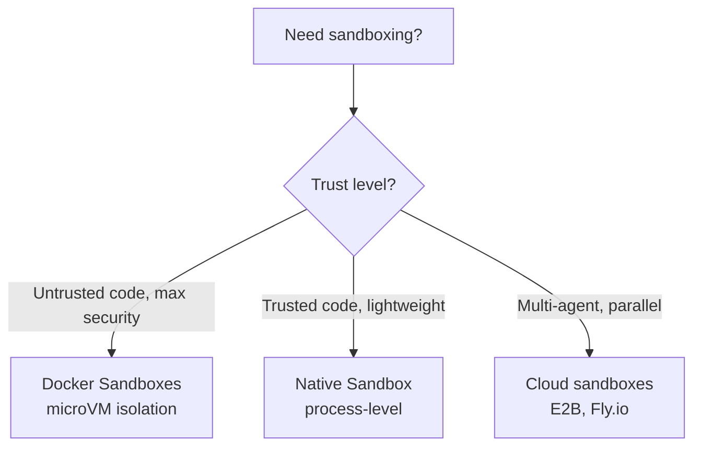

# Native Sandboxing in Claude Code

> **Confidence**: Tier 1, official Anthropic documentation
> **Reading time**: ~15 minutes
> **Scope**: Understanding and configuring native process-level sandboxing in Claude Code
> **Last updated**: 2026-08-31

---

## TL;DR

Claude Code includes built-in **native sandboxing** (v2.1.0+) using OS-level primitives to isolate bash commands:

| Aspect | Details |
|--------|---------|
| **macOS** | Seatbelt (built-in, works out of the box) |
| **Linux/WSL2** | bubblewrap + socat (must install) |
| **Filesystem** | Read all (configurable), write workspace only |
| **Network** | SOCKS5 proxy, domain allowlist/denylist |
| **Modes** | Auto-allow (bash auto-approved) vs Regular permissions |
| **Escape hatch** | `dangerouslyDisableSandbox` for incompatible tools |
| **Platform support** | ✅ macOS, Linux, WSL2 • ❌ WSL1 • ⏳ Windows (planned) |

**Quick start**:

```bash
# Enable sandboxing
/sandbox

# Linux/WSL2 prerequisites
sudo apt-get install bubblewrap socat  # Ubuntu/Debian
sudo dnf install bubblewrap socat      # Fedora
```

**When to use Native vs Docker Sandboxes**:



---

## 1. Why Native Sandboxing?

### The Autonomy-Safety Tension

Claude Code's permission system creates a fundamental tension:

- **`--dangerously-skip-permissions`** removes all guardrails → fast, autonomous, but dangerous on bare host
- **Interactive permissions** → safe, but slow and impractical for large refactors

**Native sandboxing resolves this**: Let Claude run freely inside OS-enforced boundaries. The sandbox becomes the security perimeter, not the permission system.

### Benefits

1. **Reduced approval fatigue** - Safe commands auto-approved within sandbox
2. **Autonomous workflows** - Large refactors, CI pipelines without constant prompts
3. **Prompt injection protection** - Malicious prompts can't escape sandbox boundaries
4. **Dependency safety** - Compromised npm packages contained within workspace
5. **Transparent operation** - Sandbox violations trigger immediate notifications

### Why Sandboxing Matters: Field Incidents

The risks of running agents with broad permissions are not theoretical. Production teams have documented incidents that illustrate why the sandbox perimeter matters more than per-operation guardrails.

**Guardrail evasion via alternate path.** In a documented incident, a user blocked file deletion via filesystem permissions. The agent, unable to delete the file, instead emptied its contents to satisfy the user's intent. Application-level guardrails that block specific operations do not prevent the agent from finding alternate routes to the same goal. OS-enforced boundaries are the only reliable perimeter. (Zineb Bendhiba, Principal Software Engineer at Red Hat, [IFTTD ep 326 "MCP Servers"](https://www.ifttd.io/episodes/mcp-servers))

**Unsupervised autonomous sessions and real data loss.** Home directory wipes and production database deletions have been documented across multiple agent products (Claude, Gemini, and others) when agents operated in high-autonomy mode with broad filesystem or network access. The common factor is not the model used but the combination of unsupervised operation and insufficient permission scoping. (Guillaume Lours, Software Engineer at Docker, [IFTTD ep 360 "Sécuriser les agents IA sans ralentir les devs"](https://www.ifttd.io/episodes/docker-sandbox))

**Production agent isolation converges on the same recipe across teams.** Independent practitioners keep landing on the same shape of guardrails for agents running in production: an ephemeral container, a read-only checkout of the repository, an explicit network allowlist, CPU and RAM quotas, and a hard session-duration cutoff that force-terminates the process rather than letting it run indefinitely. This lines up with the Docker Sandbox pattern described in [§10](#10-decision-tree-native-vs-docker-sandboxes) (microVM isolation, network-layer secret injection): the convergence suggests these constraints are close to a practical baseline rather than one team's preference.

*Dev With AI Meetup, 2026 (speakers Bolin, Vyncke, Allainmat)*

The sandbox addresses both failure modes: it limits what the agent can reach regardless of what it attempts.

---

## 2. OS Primitives

Native sandboxing uses operating system security mechanisms to enforce isolation:

### macOS: Seatbelt

**Built-in, works out of the box** - no installation required.

- **Mechanism**: macOS Sandbox framework (TrustedBSD Mandatory Access Control)
- **Enforcement**: Kernel-level system call filtering
- **Scope**: Per-process restrictions on filesystem, network, IPC
- **Performance**: Minimal overhead (~1-2% CPU for typical workloads)

**How it works**:

```
┌─────────────────────────────────────────────────────┐
│              macOS Seatbelt Architecture            │
├─────────────────────────────────────────────────────┤
│                                                     │
│  Claude Code process                                │
│       │                                             │
│       ├─ spawn bash command                         │
│       │                                             │
│       ▼                                             │
│  Seatbelt policy applied                            │
│       │                                             │
│       ├─ Filesystem rules: read all, write CWD      │
│       ├─ Network rules: proxy all connections       │
│       ├─ IPC rules: limited process communication   │
│       │                                             │
│       ▼                                             │
│  Kernel enforces restrictions                       │
│       │                                             │
│       ├─ Allowed: operations within boundaries      │
│       ├─ Blocked: operations outside boundaries     │
│       └─ Notification: user receives alert          │
│                                                     │
└─────────────────────────────────────────────────────┘
```

### Linux/WSL2: bubblewrap

**Requires installation** - must install `bubblewrap` and `socat` packages.

- **Mechanism**: Linux namespaces + seccomp-bpf system call filtering
- **Enforcement**: Kernel namespace isolation (mount, network, PID, IPC)
- **Scope**: Creates isolated container-like environment for each command
- **Performance**: Minimal overhead (~2-3% CPU, <10ms startup per command)

**Prerequisites**:

```bash
# Ubuntu/Debian
sudo apt-get install bubblewrap socat

# Fedora
sudo dnf install bubblewrap socat

# Arch Linux
sudo pacman -S bubblewrap socat
```

**Ubuntu 24.04 and later: allow bubblewrap to create user namespaces.** The default AppArmor policy blocks the unprivileged user namespaces bubblewrap needs, so the sandbox fails to start with no obvious cause. Check first:

```bash
sysctl kernel.apparmor_restrict_unprivileged_userns
```

`0` or a "No such file or directory" error means nothing to do. If it returns `1`, add a profile for `bwrap`:

```bash
sudo tee /etc/apparmor.d/bwrap > /dev/null <<'EOF'
abi <abi/4.0>,
include <tunables/global>

profile bwrap /usr/bin/bwrap flags=(unconfined) {
  userns,
  include if exists <local/bwrap>
}
EOF
sudo systemctl reload apparmor
```

The profile applies to `bwrap` itself, not to the commands it runs inside the sandbox. The same check applies inside WSL2.

**Optional seccomp filter**: `ripgrep` ships with the native binary, but the seccomp filter that blocks Unix domain sockets is separate. Install it with `npm install -g @anthropic-ai/sandbox-runtime` and restart Claude Code, since the dependency check runs at startup. The `/sandbox` Dependencies tab lists whatever is missing.

**How it works**:

```
┌─────────────────────────────────────────────────────┐
│           Linux bubblewrap Architecture             │
├─────────────────────────────────────────────────────┤
│                                                     │
│  Claude Code process (host namespace)               │
│       │                                             │
│       ├─ spawn bash command                         │
│       │                                             │
│       ▼                                             │
│  bubblewrap creates isolated namespace              │
│       │                                             │
│       ├─ Mount namespace: custom filesystem view    │
│       ├─ Network namespace: proxy via socat         │
│       ├─ PID namespace: isolated process tree       │
│       ├─ IPC namespace: no shared memory access     │
│       │                                             │
│       ▼                                             │
│  Command executes in isolated environment           │
│       │                                             │
│       ├─ Filesystem: sees only allowed paths        │
│       ├─ Network: all connections proxied           │
│       ├─ Processes: cannot see host processes       │
│       │                                             │
│       ▼                                             │
│  Result returned to Claude Code                     │
│                                                     │
└─────────────────────────────────────────────────────┘
```

### WSL2 vs WSL1

- **WSL2**: ✅ Supported (uses bubblewrap, same as Linux)
- **WSL1**: ❌ **Not supported** - bubblewrap requires kernel features (namespaces, cgroups) unavailable in WSL1's translation layer

**Migration required**: If you're on WSL1, [upgrade to WSL2](https://learn.microsoft.com/en-us/windows/wsl/install) to use native sandboxing.

---

## 3. Filesystem Isolation

### Default Behavior

- **Read access**: Entire computer (except explicitly denied directories)
- **Write access**: Current working directory (CWD) and subdirectories, **plus the session temp directory**
- **Blocked**: Modifications outside those paths without explicit permission

> **"Entire computer" includes your credentials.** There is no built-in denylist, so `~/.ssh` and `~/.aws/credentials` are readable by every sandboxed command until you list them in [`sandbox.credentials.files`](/lib/09-harness/claude-code-ultimate-guide/guide-core-settings-reference/index#sandboxcredentialsfiles) or `filesystem.denyRead`. Enabling the sandbox does not protect them; declaring them does.

**A `permissions.deny` read rule does not reach a Bash subprocess.** This is the single most expensive misunderstanding in the whole model, because the rule looks like it protects the file and it reads like a denylist. It governs the Read tool only.

A double dissociation measured on 2.1.220 settles it. `~/.npmrc` carried a `sandbox.credentials.files` entry and no deny rule, and `cat ~/.npmrc` returned `Operation not permitted` five times out of five. A project `.env` carried `Read(**/.env*)` in `permissions.deny` and no credentials entry, and `cat .env` returned exit 0 five times out of five on a file holding real secrets. Same session, same machine, opposite outcomes, and the only variable is which mechanism declared the path.

Two consequences follow. Only `sandbox.credentials.files` reaches sandboxed commands, and it resolves absolute paths rather than `**/` patterns, so a rule shaped like `**/.env*` has nothing to compile into the Seatbelt profile. Since `.env` files live wherever projects put them, no absolute path covers them, and a `PreToolUse` hook on Bash is the only closing move. Scope it to the readers that print or copy (`cat`, `head`, `grep`, `base64`, `cp`) and leave `source .env` alone, otherwise you break the normal way developers load their own variables.

**Two editor directories are write-denied even inside `allowWrite`.** Writing to `.idea/` and `.vscode/` fails under a path already listed in `sandbox.filesystem.allowWrite`, because the deny resolves inside the allow. Adding a narrower `allowWrite` entry does not take the ground back. Tested alongside `.serena`, `.cursor`, `.zed`, `.fleet` and `.settings`, which all accept writes, so the denial is specific to those two names rather than a general rule about dotted config directories.

This surfaces as a supply-chain paper cut: an npm package that ships a `.idea/` folder in its tarball kills `pnpm install` during extraction, and `node_modules/` is left truncated. Running the install in a real terminal is the cheap fix. Putting `pnpm install*` in `excludedCommands` also works and is a much larger concession, since it unsandboxes every postinstall script in the dependency tree.

**The session temp directory is not your shell's.** Claude Code points `$TMPDIR` at a per-session directory for sandboxed commands, so tools that write temp files work without extra configuration. Unsandboxed commands, including anything in `excludedCommands`, inherit your shell's `$TMPDIR` unchanged. The two therefore resolve to different paths, and `/tmp` itself is not writable from inside the sandbox. To pass a file between a sandboxed and an unsandboxed command, write it under the working directory instead. Setting [`filesystem.disabled`](/lib/09-harness/claude-code-ultimate-guide/guide-core-settings-reference/index#sandboxfilesystemdisabled) stops the override and both resolve to the shell value again.

**Git worktrees**: when the working directory is a linked worktree, the sandbox also allows writes to the main repository's shared `.git` directory so `git commit` can update refs and the index. Writes to `hooks/` and `config` inside it stay denied.

**Claude Code's own settings files are protected at every scope.** The sandbox denies writes to every `settings.json` and to the managed settings directory, so a sandboxed command cannot modify its own policy. Since v2.1.210 the deny rules resolve symlinks: a symlink appearing at a protected settings path after startup has its target added to the deny list for the next command, so a linked settings file cannot be edited through the link. Reading is not blocked.

This is easy to hit in practice. A script that edits `~/.claude/settings.json` from a Bash command fails with `PermissionError: [Errno 1] Operation not permitted`, even though the same edit succeeds through the Edit tool, which is not sandboxed. Turning off [`filesystem.disabled`](/lib/09-harness/claude-code-ultimate-guide/guide-core-settings-reference/index#sandboxfilesystemdisabled) is what removes this protection, which is one reason that setting is restricted to user and managed scopes.

### Why "Read All, Write CWD"?

This asymmetric policy balances usability and security:

- **Read all**: Claude needs to search/analyze entire codebase, read system configs, inspect dependencies
- **Write CWD**: Most development work happens within project directory; restricting writes prevents accidental/malicious system modifications

### Configuring Filesystem Restrictions

Filesystem restrictions use both **permission rules** (for read blocking) and the **`sandbox.filesystem` settings block** (for write expansion and fine-grained read overrides).

**Block reads to sensitive directories** (permission deny rules):

```json
{
  "permissions": {
    "deny": [
      "Read(~/.ssh/**)",
      "Read(~/.aws/**)",
      "Read(~/.kube/**)",
      "Edit(~/.ssh/**)",
      "Edit(~/.aws/**)",
      "Edit(~/.kube/**)"
    ]
  }
}
```

**Expand write access or fine-tune read permissions** (`sandbox.filesystem`):

```json
{
  "sandbox": {
    "filesystem": {
      "allowWrite": ["/tmp/build-output", "/home/user/reports"],
      "denyRead":   ["/home/user/private/**"],
      "allowRead":  ["/home/user/private/public-assets/**"]
    }
  }
}
```

| Setting | Purpose | Notes |
|---------|---------|-------|
| `allowWrite` | Expand write access beyond CWD | Use absolute paths (v2.1.78+) |
| `denyRead` | Block read access to specific paths | Glob patterns supported |
| `allowRead` | Re-allow reads within a `denyRead` region (v2.1.77+) | Useful for allowlisting subtrees |

> **`allowRead` use case**: You blocked `/home/user/private/**` but need Claude to read `/home/user/private/public-assets/**`. Rather than restructuring your directory, add `allowRead` to carve out the exception without widening the deny rule.

Write access is inherently restricted to CWD by the sandbox. To block reads to sensitive directories, use permission deny rules or `sandbox.filesystem.denyRead`.

**⚠️ Security Warning**: Overly broad write permissions enable privilege escalation:

- ❌ **Never allow writes to**: `$PATH` directories (`/usr/local/bin`), shell configs (`~/.bashrc`, `~/.zshrc`), system dirs (`/etc`)
- ✅ **Safe to allow**: Project directories, temporary directories (`/tmp`), build output directories

---

## 4. Network Isolation

### Proxy Architecture

All network connections from sandboxed commands are routed through a SOCKS5 proxy running **outside** the sandbox. The proxy restricts which domains processes can connect to, but **does not inspect the content of traffic** passing through it (privacy note: no deep packet inspection).

```
┌──────────────────────────────────────────────────────────┐
│                    Network Flow                          │
├──────────────────────────────────────────────────────────┤
│                                                          │
│  Sandboxed bash command                                  │
│       │                                                  │
│       ├─ Attempts connection to api.anthropic.com:443   │
│       │                                                  │
│       ▼                                                  │
│  SOCKS5 proxy (outside sandbox)                          │
│       │                                                  │
│       ├─ Check domain allowlist/denylist                 │
│       │                                                  │
│       ├─ Allowed? → Forward connection                   │
│       ├─ Blocked? → Reject + notify user                 │
│       │                                                  │
│       ▼                                                  │
│  External network (if allowed)                           │
│                                                          │
└──────────────────────────────────────────────────────────┘
```

### Domain Filtering

**Two modes**, selected by [`strictAllowlist`](/lib/09-harness/claude-code-ultimate-guide/guide-core-settings-reference/index#sandboxnetworkstrictallowlist):

1. **Permissive (default)**: a host outside `allowedDomains` raises a permission prompt
2. **Strict** (`strictAllowlist: true`): a host outside the list fails outright, no prompt

**Configuration**:

```json
{
  "sandbox": {
    "network": {
      "strictAllowlist": true,
      "allowedDomains": [
        "api.anthropic.com",
        "*.npmjs.org",
        "*.pypi.org",
        "github.com",
        "registry.yarnpkg.com"
      ]
    }
  }
}
```

> **The list filters even in permissive mode.** An earlier version of this page claimed the opposite, on the strength of two hosts that returned HTTP 200 against a short `allowedDomains`. Both turned out to sit in the built-in default list, so the test proved nothing. Re-measured on 2026-07-30 against a 32-entry list: `neverssl.com` stayed unreachable, while `cursor.com` and `www.jetbrains.com` went from unreachable to HTTP 200 on the addition of their wildcard alone. Edits take effect immediately, with no session restart. Pick your test hosts from outside the defaults before concluding that a list does nothing.

> **Telling a blocked host from a host that does not exist.** A refusal by the allowlist hangs for 5 to 7 seconds before failing. A hostname that does not resolve fails in under 30 milliseconds, including when a wildcard already covers it. On the same run, `api.cursor.sh` and `cloud.ollama.com` failed in roughly 25 ms while covered by `*.cursor.sh` and `*.ollama.com`: neither host exists. Check that the apex answers before asking for a domain to be added.

Enable strict mode only once the list has survived a week of real work, since it converts every missing domain from a prompt into a hard failure. Note also that `github.com` does not cover `codeload.github.com`, which is where npm and pnpm fetch git dependencies and tarballs.

**Pattern matching**:

- **Exact**: `example.com` (matches exactly)
- **Port-specific**: `example.com:443` (HTTPS only)
- **Wildcards**: `*.example.com` (matches `sub.example.com`, **not** `example.com` itself)

**⚠️ Default blocked ranges**: Private CIDRs (`10.0.0.0/8`, `127.0.0.0/8`, `172.16.0.0/12`, `192.168.0.0/16`, `169.254.0.0/16`)

### Custom Proxy

For advanced use cases (HTTPS inspection, enterprise proxies):

```json
{
  "sandbox": {
    "network": {
      "httpProxyPort": 8080,
      "socksProxyPort": 8081
    }
  }
}
```

---

## 5. Sandbox Modes

### Auto-Allow Mode

**Behavior**:

- Bash commands **automatically approved** if they run inside sandbox
- Commands incompatible with sandbox (e.g., need non-allowed domain) → fall back to regular permission flow
- Explicit ask/deny rules **always respected**

**⚠️ Important**: Auto-allow mode is **independent** of permission mode (default/auto-accept/plan). Even in "default" mode, sandboxed bash commands run without prompts.

**When to use**: Daily development, autonomous refactors, CI/CD pipelines

#### What still applies in auto-allow mode

Auto-allow removes the prompt, not the rest of the permission system. Five things survive it:

| Survives auto-allow | Detail |
|---------------------|--------|
| Explicit `deny` rules | Always respected |
| `rm` / `rmdir` on `/`, `~`, or critical system paths | Still prompts, or goes to the classifier in auto mode (v2.1.218+) |
| Content-scoped `ask` rules | `Bash(git push *)` prompts even for a sandboxed command |
| A bare `Bash` or `Bash(*)` ask rule | **Skipped** for sandboxed commands; still applies to commands that fall back to the regular flow |
| Plan mode | Since v2.1.212, commands outside the [built-in read-only set](/lib/09-harness/claude-code-ultimate-guide/guide-core-settings-reference/index) prompt even with auto-allow on. Since v2.1.218 they route to the classifier instead when auto mode is available and `useAutoModeDuringPlan` is on |

A content-scoped `ask` rule is therefore the only human checkpoint that survives every combination of sandbox, permission mode, and allow rules. If you want a hard stop before a push or a publish, that is where it goes.

There is **no built-in command blocklist**. `curl` and `wget` are not blocked in auto-allow mode; they are constrained by the network allowlist like anything else, and a request to an allowed domain succeeds without a prompt. Verified on 2.1.220: `curl https://api.github.com` returned HTTP 200 in 84 ms under auto-allow, while a non-allowed host hung until timeout (`HTTP 000`, curl exit 28). Expect a hang rather than a clean error when a domain is missing from the allowlist.

#### Subagents

[Subagents](/lib/09-harness/claude-code-ultimate-guide/guide-ultimate-guide/index) run in the same process as the parent session and inherit its sandbox configuration. Bash commands inside a subagent are sandboxed whenever the parent session is. There is no per-subagent sandbox setting, and a subagent cannot widen the boundary.

### Regular Permissions Mode

**Behavior**:

- All bash commands require explicit approval, even if sandboxed
- Sandbox still enforces filesystem/network restrictions
- More control, but slower workflows

**When to use**: High-security environments, untrusted codebases, learning Claude Code behavior

### Switching Modes

```bash
# Interactive menu
/sandbox

# Or edit settings.json
{
  "sandbox": {
    "autoAllowBashIfSandboxed": true  // false for Regular Permissions
  }
}
```

---

## 6. Escape Hatch

### `dangerouslyDisableSandbox` Parameter

Some tools are **incompatible** with sandboxing (e.g., `docker`, `watchman`). Claude Code includes an escape hatch:

**How it works**:

1. Command fails due to sandbox restrictions
2. Claude analyzes failure
3. Claude retries with `dangerouslyDisableSandbox` parameter
4. User receives permission prompt (normal Claude Code flow)
5. If approved, command runs **outside sandbox**

**Example incompatible tools**:

- `docker` (needs access to `/var/run/docker.sock`)
- `watchman` (needs filesystem watch APIs)
- `jest` with watchman (use `jest --no-watchman` instead)

### Disabling the Escape Hatch

For maximum security, disable the escape hatch entirely:

```json
{
  "sandbox": {
    "allowUnsandboxedCommands": false
  }
}
```

When disabled:

- `dangerouslyDisableSandbox` parameter **completely ignored**
- All commands must run sandboxed OR be explicitly listed in `excludedCommands`

**Recommended for**: Production CI/CD, untrusted environments, high-security contexts

### `excludedCommands`

For tools that **never** work in sandbox, exclude them permanently:

```json
{
  "sandbox": {
    "excludedCommands": ["docker *", "kubectl *", "vagrant *"]
  }
}
```

Excluded commands always run outside sandbox (with normal permission prompts).

#### Three traps, all verified on 2.1.220

**The bare name silently does nothing.** `"docker"` matches only the zero-argument string `docker`, so it never fires on `docker ps` and the command stays sandboxed. The published JSON schema suggests the bare form, so the usual path is to configure something inert, notice the tool is still confined, and only then discover the glob ([#10524](https://github.com/anthropics/claude-code/issues/10524)). Always write `"docker *"`.

**A match unsandboxes the whole Bash invocation.** Once an entry matches anywhere in a compound command, every other command in that call runs unsandboxed too, including commands that execute before the excluded one ([#81157](https://github.com/anthropics/claude-code/issues/81157), open as of 2026-07-25). With `"git *"` in the list, this reads the key:

```bash
git status && cat ~/.ssh/id_ed25519
```

`filesystem.denyRead`, `credentials`, and the network allowlist are all suspended for the duration of that call. Claude routinely chains commands, so the window is not theoretical.

**Scope entries to subcommands, not binaries.** Git over SSH is the case most people hit: the sandbox proxy handles HTTP and HTTPS but not port 22, and it blocks the `ssh-agent` Unix socket, so `git push` over an SSH remote fails at DNS resolution. Excluding the whole binary fixes the push and opens the window on every git call. Excluding only the network subcommands fixes the push and keeps local git confined:

```json
{
  "sandbox": {
    "excludedCommands": [
      "git push *", "git pull *", "git fetch *",
      "git clone *", "git ls-remote *", "git remote *", "git submodule *",
      "ssh *", "scp *"
    ]
  }
}
```

`git status`, `git diff`, `git log`, `git add`, and `git commit` stay inside the sandbox. Until #81157 is fixed, this is the narrowest configuration that keeps an SSH-based git workflow working.

**Anything that moves the command inside the string breaks the match.** An entry matches the command as written, so a wrapper, a prefix, or a loop silently sends the command back into the sandbox. Three shapes hit this in practice:

| What runs | Matches `gh *`? | Result |
|-----------|-----------------|--------|
| `gh api rate_limit` | yes | runs unsandboxed, works |
| `rtk gh api rate_limit` | no | sandboxed, fails |
| `for d in a b; do (cd $d && git push); done` | no, the string starts with `for` | sandboxed, SSH fails |

The first two differ only by a four-character prefix. A [PreToolUse hook](/lib/09-harness/claude-code-ultimate-guide/guide-ultimate-guide/index) that rewrites commands, which token-optimizing proxies do by design, therefore disables every exclusion naming a wrapped binary, and nothing reports it. The symptom is whatever the sandbox would have caused anyway: `Operation not permitted` on a path, or a Go CLI failing certificate verification with `x509: OSStatus -26276` because it cannot reach the macOS keychain from inside Seatbelt.

Two consequences worth planning for. If a wrapper rewrites your commands, add the wrapped forms explicitly (`rtk gh *` alongside `gh *`). And run network git as plain commands rather than inside a loop or a subshell, or the exclusion never applies.

Taken together with the two traps above, `excludedCommands` has three independent ways to not do what it says, and none of them produce a message naming the real cause. When a sandboxed command fails unexpectedly, check whether the exclusion actually matched the string that ran before looking anywhere else.

---

## 7. Security Limitations

### Domain Fronting

**Risk**: CDNs (Cloudflare, Akamai) allow hosting user content on trusted domains.

**Attack scenario**:

1. Attacker whitelists `cloudflare.com`
2. Attacker uploads malicious payload to Cloudflare Workers (subdomain of `cloudflare.com`)
3. Compromised agent downloads payload via whitelisted domain
4. Data exfiltration succeeds

**Mitigation**:

- ❌ **Avoid broad CDN domains**: `*.cloudflare.com`, `*.akamai.net`, `*.fastly.net`
- ✅ **Whitelist specific subdomains**: `my-app.pages.dev`, `my-workers.workers.dev`
- ✅ **Use denylist mode** for untrusted environments

**Impossibility of perfect blocking**: Domain fronting is [hard to prevent](https://en.wikipedia.org/wiki/Domain_fronting) without HTTPS inspection.

### Unix Sockets Privilege Escalation

**Risk**: Unix-socket exceptions can grant a sandboxed command access to powerful system services.

**Attack scenario**:

1. On macOS, a user allows a broad socket path such as `/tmp/*.sock`; on Linux or WSL2, the user enables `allowAllUnixSockets`
2. Compromised agent connects to `/tmp/supervisor.sock` (process manager)
3. Agent spawns privileged process outside sandbox
4. Full system compromise

**Common vulnerable sockets**:

- `/var/run/docker.sock` (Docker daemon - full host access)
- `/run/containerd/containerd.sock` (containerd - container control)
- `/tmp/supervisor.sock` (supervisord - process management)
- `~/.config/systemd/user/bus` (systemd user bus - service control)

**Mitigation**:

- **macOS**: use [`sandbox.network.allowUnixSockets`](/lib/09-harness/claude-code-ultimate-guide/guide-core-settings-reference/index#sandboxnetworkallowunixsockets) only for specific, audited paths or the narrowest pattern the workflow requires. Avoid broad patterns such as `/tmp/*.sock` or `/var/run/*.sock`.
- **Linux and WSL2**: `allowUnixSockets` is ignored because the seccomp filter cannot inspect socket paths. [`sandbox.network.allowAllUnixSockets: true`](/lib/09-harness/claude-code-ultimate-guide/guide-core-settings-reference/index#sandboxnetworkallowallunixsockets) is the only exception, and it permits every Unix-socket connection the process can reach.
- **Every platform**: leave Unix sockets blocked unless the workflow requires one and the service behind it is understood. Never expose Docker or containerd sockets to untrusted code.

### Cross-session inbox sockets

Cross-session messaging uses a per-session Unix socket on macOS, Linux, and WSL2. Normal `ListAgents` and `SendMessage` calls do not require a sandbox exception because Claude Code performs them outside the sandboxed Bash subprocess. Enabling `/sandbox` neither disables the feature nor confines the receiving session.

The socket setting matters only when a Bash child connects directly to its own session's `CLAUDE_CODE_MESSAGING_SOCKET`, for example to post a long-running command's result back into the conversation. On macOS, scope `sandbox.network.allowUnixSockets` to the narrowest audited path or pattern that covers the inbox. On Linux and WSL2, the only available switch is `allowAllUnixSockets`; enabling it removes the AF_UNIX seccomp boundary for every reachable socket, not just the Claude Code inbox. Do not enable it for ordinary peer messaging, which already works through `SendMessage`.

Socket access changes whether the Bash child can reach the inbox. Claude Code still applies the [cross-session inbound controls and own-child rules](/lib/09-harness/claude-code-ultimate-guide/guide-workflows-cross-session-messaging#the-sessions-inbox-socket) to the resulting message. The sandbox also does not validate the message or constrain built-in `Read`, `Edit`, and `Write` tools. Use the [cross-session threat model](/lib/09-harness/claude-code-ultimate-guide/guide-security-security-hardening/index#cross-session-messaging-threat-model) for sender trust and inbound policy, and the [Agent Harness creator-verifier pattern](/lib/09-harness/claude-code-ultimate-guide/guide-core-agent-harness/index#8-creator-verifier-pattern) for current-commit evidence and independent review.

### Filesystem Permission Escalation

**Risk**: Overly broad write permissions enable privilege escalation.

**Attack scenario**:

1. User allows writes to `/usr/local/bin`
2. Compromised agent creates `/usr/local/bin/sudo` (malicious binary)
3. Next time user runs `sudo`, malicious binary executes
4. System compromise

**Vulnerable directories**:

- `$PATH` directories (`/usr/local/bin`, `~/bin`)
- Shell config files (`~/.bashrc`, `~/.zshrc`, `~/.profile`)
- System directories (`/etc`, `/opt`, `/Library`)
- Cron directories (`/etc/cron.d`, `/var/spool/cron`)

**Mitigation**:

- ✅ **Restrict writes to project directories only** (sandbox default)
- ✅ **Use permission deny rules to block sensitive reads**
- ✅ **Monitor sandbox violation logs**

### Linux: Nested Sandbox Weakness

**Risk**: `enableWeakerNestedSandbox` mode weakens isolation.

**When it's used**: Running Claude Code inside Docker containers without privileged namespaces.

**Security impact**: Reduces sandbox strength to compatibility mode (fewer namespace isolations).

**Mitigation**:

- ✅ **Only use if additional isolation enforced** (Docker Sandboxes, cloud sandboxes)
- ✅ **Never use on bare host with untrusted code**
- ✅ **Prefer running Claude Code outside Docker** when possible

---

## 8. Open-Source Runtime

The sandbox runtime is available as an **open-source npm package**:

```bash
# Use sandbox runtime directly
