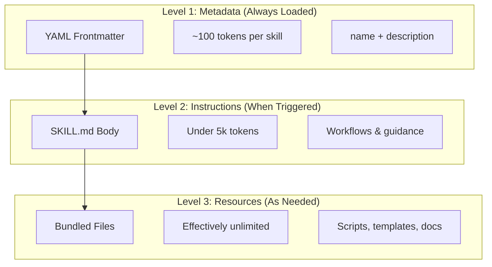
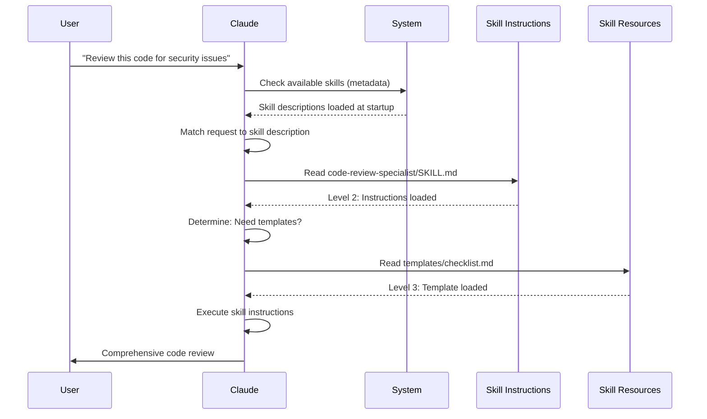

# Agent Skills Guide

Agent Skills are reusable, filesystem-based capabilities that extend Claude's functionality. They package domain-specific expertise, workflows, and best practices into discoverable components that Claude automatically uses when relevant.

## Overview

**Agent Skills** are modular capabilities that transform general-purpose agents into specialists. Unlike prompts (conversation-level instructions for one-off tasks), Skills load on-demand and eliminate the need to repeatedly provide the same guidance across multiple conversations.

### Key Benefits

- **Specialize Claude**: Tailor capabilities for domain-specific tasks
- **Reduce repetition**: Create once, use automatically across conversations
- **Compose capabilities**: Combine Skills to build complex workflows
- **Scale workflows**: Reuse skills across multiple projects and teams
- **Maintain quality**: Embed best practices directly into your workflow

Skills follow the [Agent Skills](https://agentskills.io) open standard, which works across multiple AI tools. Claude Code extends the standard with additional features like invocation control, subagent execution, and dynamic context injection.

> **Note**: Custom slash commands have been merged into skills. `.claude/commands/` files still work and support the same frontmatter fields. Skills are recommended for new development. When both exist at the same path (e.g., `.claude/commands/review.md` and `.claude/skills/review/SKILL.md`), the skill takes precedence.

## How Skills Work: Progressive Disclosure

Skills leverage a **progressive disclosure** architecture—Claude loads information in stages as needed, rather than consuming context upfront. This enables efficient context management while maintaining unlimited scalability.

### Three Levels of Loading

| Level | When Loaded | Token Cost | Content |
|-------|------------|------------|---------|
| **Level 1: Metadata** | Always (at startup) | ~100 tokens per Skill | `name` and `description` from YAML frontmatter |
| **Level 2: Instructions** | When Skill is triggered | Under 5k tokens | SKILL.md body with instructions and guidance |
| **Level 3+: Resources** | As needed | Effectively unlimited | Bundled files executed via bash without loading contents into context |

This means you can install many Skills without context penalty—Claude only knows each Skill exists and when to use it until actually triggered.

## Skill Loading Process

## Skill Types & Locations

| Type | Location | Scope | Shared | Best For |
|------|----------|-------|--------|----------|
| **Enterprise** | Managed settings | All org users | Yes | Organization-wide standards |
