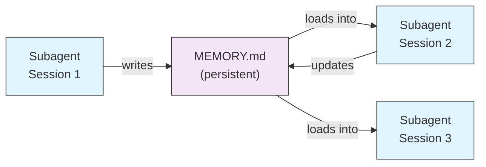
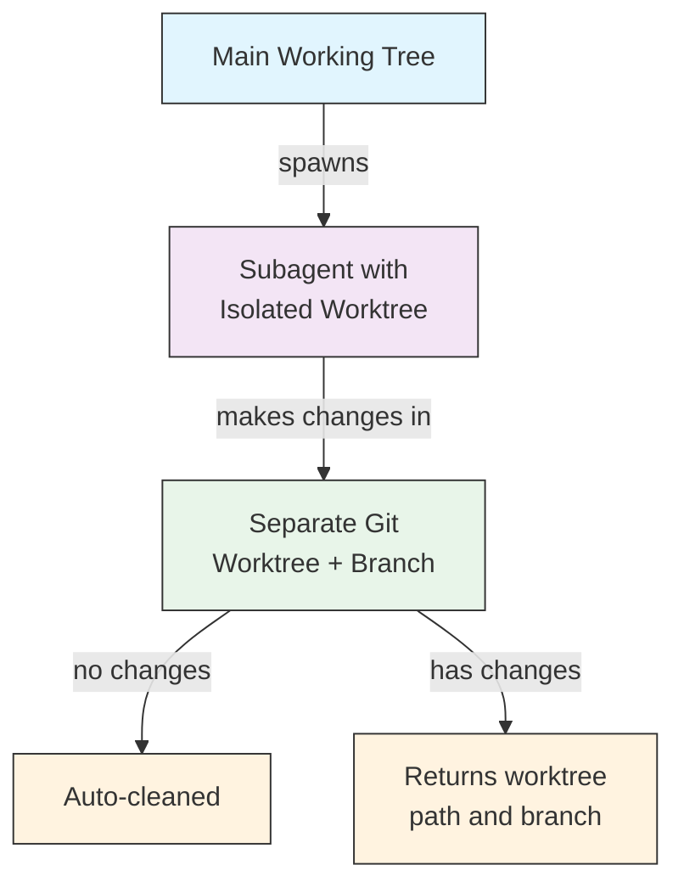
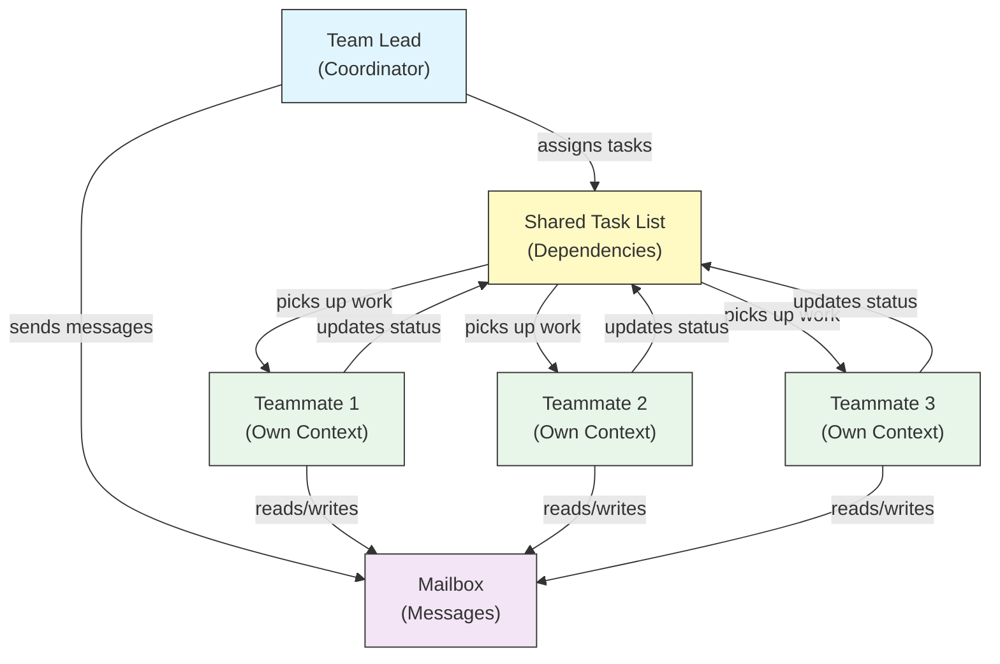

# Subagents - Complete Reference Guide

Subagents are specialized AI assistants that Claude Code can delegate tasks to. Each subagent has a specific purpose, uses its own context window separate from the main conversation, and can be configured with specific tools and a custom system prompt.

## Table of Contents

1. [Overview](#overview)
2. [Key Benefits](#key-benefits)
3. [File Locations](#file-locations)
4. [Configuration](#configuration)
5. [Built-in Subagents](#built-in-subagents)
6. [Managing Subagents](#managing-subagents)
7. [Using Subagents](#using-subagents)
8. [Resumable Agents](#resumable-agents)
9. [Chaining Subagents](#chaining-subagents)
10. [Persistent Memory for Subagents](#persistent-memory-for-subagents)
11. [Background Subagents](#background-subagents)
12. [Worktree Isolation](#worktree-isolation)
13. [Forked Subagents](#forked-subagents)
14. [Restrict Spawnable Subagents](#restrict-spawnable-subagents)
15. [`claude agents` CLI Command](#claude-agents-cli-command)
16. [Agent Teams (Experimental)](#agent-teams-experimental)
17. [Plugin Subagent Security](#plugin-subagent-security)
18. [Architecture](#architecture)
19. [Context Management](#context-management)
20. [When to Use Subagents](#when-to-use-subagents)
21. [Best Practices](#best-practices)
22. [Example Subagents in This Folder](#example-subagents-in-this-folder)
23. [Installation Instructions](#installation-instructions)
24. [File Structure](#file-structure)
25. [Related Concepts](#related-concepts)
26. [Observability](#observability)
27. [Additional Resources](#additional-resources)

---

## Overview

Subagents enable delegated task execution in Claude Code by:

- Creating **isolated AI assistants** with separate context windows
- Providing **customized system prompts** for specialized expertise
- Enforcing **tool access control** to limit capabilities
- Preventing **context pollution** from complex tasks
- Enabling **parallel execution** of multiple specialized tasks

Each subagent operates independently with a clean slate, receiving only the specific context necessary for their task, then returning results to the main agent for synthesis.

**Quick Start**: Ask Claude to create a subagent for you ("create a subagent that reviews security"), or add a `.claude/agents/<name>.md` file directly — see [Managing Subagents](#managing-subagents) below.

> **Note**: As of v2.1.198, the `/agents` command no longer opens an interactive creation wizard. Create and manage subagents by asking Claude or editing `.claude/agents/` files directly.

---

## Key Benefits

| Benefit | Description |
|---------|-------------|
| **Context preservation** | Operates in separate context, preventing pollution of main conversation |
| **Specialized expertise** | Fine-tuned for specific domains with higher success rates |
| **Reusability** | Use across different projects and share with teams |
| **Flexible permissions** | Different tool access levels for different subagent types |
| **Scalability** | Multiple agents work on different aspects simultaneously |

---

## File Locations

Subagent files can be stored in multiple locations with different scopes:

| Priority | Type | Location | Scope |
|----------|------|----------|-------|
| 1 (highest) | **CLI-defined** | Via `--agents` flag (JSON) | Session only |
| 2 | **Project subagents** | `.claude/agents/` | Current project |
| 3 | **User subagents** | `~/.claude/agents/` | All projects |
| 4 (lowest) | **Plugin agents** | Plugin `agents/` directory | Via plugins |

When duplicate names exist, higher-priority sources take precedence.

> **Nested `.claude/` precedence (v2.1.178)**: When the same agent name is defined in multiple nested `.claude/agents/` directories (for example, a monorepo with package-level `.claude/` folders), the definition **closest to your current working directory wins**. The same closest-wins rule applies to nested workflow and output-style definitions.

---

## Configuration

### File Format

Subagents are defined in YAML frontmatter followed by the system prompt in markdown:

```yaml
---
name: your-sub-agent-name
description: Description of when this subagent should be invoked
tools: tool1, tool2, tool3  # Optional - inherits all tools if omitted
disallowedTools: tool4  # Optional - explicitly disallowed tools
model: sonnet  # Optional - sonnet, opus, haiku, or inherit
permissionMode: default  # Optional - permission mode
maxTurns: 20  # Optional - limit agentic turns
skills: skill1, skill2  # Optional - skills to preload into context
mcpServers: server1  # Optional - MCP servers to make available
memory: user  # Optional - persistent memory scope (user, project, local)
background: false  # Optional - run as background task
effort: high  # Optional - reasoning effort (low, medium, high, xhigh, max)
isolation: worktree  # Optional - git worktree isolation
initialPrompt: "Start by analyzing the codebase"  # Optional - auto-submitted first turn
experimental:  # Optional - experimental settings block
  cacheTtl: "1h"  # Cache TTL for this subagent: "5m" or "1h" (v2.1.248+)
hooks:  # Optional - component-scoped hooks
  PreToolUse:
    - matcher: "Bash"
      hooks:
        - type: command
          command: "./scripts/security-check.sh"
---

Your subagent's system prompt goes here. This can be multiple paragraphs
and should clearly define the subagent's role, capabilities, and approach
to solving problems.
```

### Configuration Fields

| Field | Required | Description |
|-------|----------|-------------|
| `name` | Yes | Unique identifier (lowercase letters and hyphens). Lookup is normalized (case- and separator-insensitive — see below), but a name containing `:` is **rejected** as of v2.1.218: `:` is reserved for plugin namespacing |
| `description` | Yes | Natural language description of purpose. Include "use PROACTIVELY" to encourage automatic invocation |
| `tools` | No | Comma-separated list of specific tools. Omit to inherit all tools. Supports `Agent(agent_name)` syntax to restrict spawnable subagents |
| `disallowedTools` | No | Comma-separated list of tools the subagent must not use |
| `model` | No | Model to use: `sonnet`, `opus`, `haiku`, full model ID, or `inherit`. Defaults to configured subagent model |
| `permissionMode` | No | `manual` (renamed from `default` in v2.1.200 — `default` is still accepted as the older name), `acceptEdits`, `dontAsk`, `bypassPermissions`, `plan`, `auto`. As of v2.1.212, the Task tool's `mode` invocation parameter is deprecated and ignored — subagents inherit the parent session's permission mode by default unless overridden here |
| `maxTurns` | No | Maximum number of agentic turns the subagent can take |
| `skills` | No | Comma-separated list of skills to preload. Injects full skill content into the subagent's context at startup. **v2.1.133+:** subagents also discover project, user, and plugin skills via the Skill tool — same catalog as the main session, no longer limited to their own embedded set. |
| `mcpServers` | No | MCP servers to make available to the subagent |
| `hooks` | No | Component-scoped hooks (PreToolUse, PostToolUse, Stop) |
| `memory` | No | Persistent memory directory scope: `user`, `project`, or `local` |
| `background` | No | Subagents already run in the background by default (v2.1.198). Set to `true` to *force* background always and prevent inline execution |
| `effort` | No | Reasoning effort level: `low`, `medium`, `high`, `xhigh`, or `max`. Overrides the session effort level; available levels depend on the model |
| `isolation` | No | Set to `worktree` to give the subagent its own git worktree |
| `initialPrompt` | No | Auto-submitted first turn when the subagent runs as the main agent |
| `color` | No | Display color for the subagent in the task list and transcript. Accepts `red`, `blue`, `green`, `yellow`, `purple`, `orange`, `pink`, or `cyan` |
| `experimental` | No | Experimental settings block (v2.1.248+). `experimental.cacheTtl` sets the cache TTL for this subagent — `"5m"` or `"1h"` |

#### Subagent Model Environment Variables

Two environment variables affect which model a subagent runs on:

| Variable | Version | Description |
|----------|---------|-------------|
| `CLAUDE_CODE_SUBAGENT_MODEL` | — | Sets the model used for subagents |
| `CLAUDE_CODE_SUBAGENT_MODEL_FORCE` | v2.1.257+ | Set to `1` to force the subagent model over a subagent's frontmatter `model:` |

> **Precedence changed in v2.1.251**: before that release, `CLAUDE_CODE_SUBAGENT_MODEL` came first and overrode agent frontmatter — including `model: inherit`. From v2.1.251 on, a subagent's own `model:` frontmatter wins. Set `CLAUDE_CODE_SUBAGENT_MODEL_FORCE=1` (v2.1.257+) when you want the environment variable to override frontmatter again, for example to pin an entire evaluation run to one model.

### Main-Thread Agent Frontmatter Honoring (v2.1.117+/v2.1.119+)

When an agent is invoked as the main-thread agent (via `claude --agent <name>` or `--print` mode), these frontmatter fields are honored:

| Field | Version | Notes |
|-------|---------|-------|
| `mcpServers` | v2.1.117+ | Loaded when agent is invoked as main-thread agent via `claude --agent <name>` |
| `permissionMode` | v2.1.119+ | Honored for built-in agents via `--agent <name>` |
| `tools` / `disallowedTools` | v2.1.119+ | Honored in `--print` mode (non-interactive/scripted usage) |

**Example — agent with `mcpServers` and `permissionMode`:**

```yaml
---
name: secure-researcher
description: Research agent with scoped MCP access and restricted permissions
permissionMode: acceptEdits
mcpServers:
  notion:
    type: http
    url: https://mcp.notion.com/mcp
  github:
    type: http
    url: https://api.github.com/mcp
tools: Read, Grep, Glob
---

You are a research agent. You may query Notion and GitHub through the
configured MCP servers, and read local files, but you cannot write or
execute commands outside of accepted edits.
```

Run with:

```bash
claude --agent secure-researcher
```

### Tool Configuration Options

**Option 1: Inherit All Tools (omit the field)**
```yaml
---
name: full-access-agent
description: Agent with all available tools
---
```

**Option 2: Specify Individual Tools**
```yaml
---
name: limited-agent
description: Agent with specific tools only
tools: Read, Grep, Glob, Bash
---
```

> **Note on Glob/Grep (v2.1.113+):** On native macOS/Linux builds, Glob and Grep are provided as `bfs`/`ugrep` through the Bash tool rather than as separate tools. Windows and npm-JS builds still expose them as standalone tools. Authors can still reference Glob/Grep in `allowedTools`; the backend substitution is transparent.

**Option 3: Conditional Tool Access**
```yaml
---
name: conditional-agent
description: Agent with filtered tool access
tools: Read, Bash(npm:*), Bash(test:*)
---
```

### CLI-Based Configuration

Define subagents for a single session using the `--agents` flag with JSON format:

```bash
claude --agents '{
  "code-reviewer": {
    "description": "Expert code reviewer. Use proactively after code changes.",
    "prompt": "You are a senior code reviewer. Focus on code quality, security, and best practices.",
    "tools": ["Read", "Grep", "Glob", "Bash"],
    "model": "sonnet"
  }
}'
```

**JSON Format for `--agents` flag:**

```json
{
  "agent-name": {
    "description": "Required: when to invoke this agent",
    "prompt": "Required: system prompt for the agent",
    "tools": ["Optional", "array", "of", "tools"],
    "model": "optional: sonnet|opus|haiku"
  }
}
```

> **Note**: Since v2.1.243, `--agents` no longer silently ignores invalid JSON or invalid agent definitions — Claude Code exits with a clear error, matching the behavior of `--mcp-config`.

**Priority of Agent Definitions:**

Agent definitions are loaded with this priority order (first match wins):
1. **CLI-defined** - `--agents` flag (session only, JSON)
2. **Project-level** - `.claude/agents/` (current project)
3. **User-level** - `~/.claude/agents/` (all projects)
4. **Plugin-level** - Plugin `agents/` directory

This allows CLI definitions to override all other sources for a single session.

---

## Built-in Subagents

Claude Code includes several built-in subagents that are always available:

| Agent | Model | Purpose |
|-------|-------|---------|
| **general-purpose** | Inherits | Complex, multi-step tasks |
| **Plan** | Inherits | Research for plan mode |
| **Explore** | Inherits (capped at Opus) | Read-only codebase exploration (quick/medium/very thorough) |
| **claude** | Inherits | Catch-all for tasks that don't fit a more specialized agent; has every tool available to subagents. Also the default agent for a dispatched background session |
| **statusline-setup** | Sonnet | Runs when you use `/statusline` to configure your status line |
| **claude-code-guide** | Haiku | Answers questions about Claude Code features |

### General-Purpose Subagent

| Property | Value |
|----------|-------|
| **Model** | Inherits from parent |
| **Tools** | All tools |
| **Purpose** | Complex research tasks, multi-step operations, code modifications |

**When used**: Tasks requiring both exploration and modification with complex reasoning.

### Plan Subagent

| Property | Value |
|----------|-------|
| **Model** | Inherits from parent |
| **Tools** | Read, Glob, Grep, Bash |
| **Purpose** | Used automatically in plan mode to research codebase |

**When used**: When Claude needs to understand the codebase before presenting a plan.

### Explore Subagent

| Property | Value |
|----------|-------|
| **Model** | Inherits the session model, capped at Opus (v2.1.198). Set `model: haiku` to keep it fast and cheap |
| **Mode** | Strictly read-only |
| **Tools** | Glob, Grep, Read, Bash (read-only commands only) |
| **Purpose** | Fast codebase searching and analysis |

**When used**: When searching/understanding code without making changes.

**Thoroughness Levels** - Specify the depth of exploration:
- **"quick"** - Fast searches with minimal exploration, good for finding specific patterns
- **"medium"** - Moderate exploration, balanced speed and thoroughness, default approach
- **"very thorough"** - Comprehensive analysis across multiple locations and naming conventions, may take longer

### Claude Subagent

| Property | Value |
|----------|-------|
| **Model** | Inherits from parent |
| **Tools** | Every tool available to subagents |
| **Purpose** | Catch-all agent for tasks that don't fit a more specialized agent |

**When used**: When a task doesn't match a more specialized built-in agent. It is also the default agent for a dispatched background session; which permission mode it starts in depends on how that session was started.

### Statusline Setup Subagent

| Property | Value |
|----------|-------|
| **Model** | Sonnet |
| **Tools** | Read, Write, Bash |
| **Purpose** | Configure the Claude Code status line display |

**When used**: When setting up or customizing the status line.

### Claude Code Guide Subagent (`claude-code-guide`)

| Property | Value |
|----------|-------|
| **Model** | Haiku (fast, low-latency) |
| **Tools** | Read-only |
| **Purpose** | Answer questions about Claude Code features and usage |

**When used**: When users ask questions about how Claude Code works or how to use specific features.

---

## Managing Subagents

### Ask Claude (Recommended)

The simplest way to create or manage a subagent is to ask Claude directly:

```text
Create a subagent that reviews code for security vulnerabilities.
```

Claude writes the `.claude/agents/<name>.md` file for you, choosing sensible frontmatter (tools, model, description). You can then refine the file by hand or ask Claude to adjust it.

> **Note**: The `/agents` command no longer opens an interactive creation wizard (removed in v2.1.198). It now points you to ask Claude or edit `.claude/agents/` files directly.

### Direct File Management

```bash
# Create a project subagent
mkdir -p .claude/agents
cat > .claude/agents/test-runner.md << 'EOF'
---
name: test-runner
description: Use proactively to run tests and fix failures
---

You are a test automation expert. When you see code changes, proactively
run the appropriate tests. If tests fail, analyze the failures and fix
them while preserving the original test intent.
EOF

# Create a user subagent (available in all projects)
mkdir -p ~/.claude/agents
```

---

## Using Subagents

### Automatic Delegation

Claude proactively delegates tasks based on:
- Task description in your request
- The `description` field in subagent configurations
- Current context and available tools

To encourage proactive use, include "use PROACTIVELY" or "MUST BE USED" in your `description` field:

```yaml
---
name: code-reviewer
description: Expert code review specialist. Use PROACTIVELY after writing or modifying code.
---
```

### Explicit Invocation

You can explicitly request a specific subagent:

```
> Use the test-runner subagent to fix failing tests
> Have the code-reviewer subagent look at my recent changes
> Ask the debugger subagent to investigate this error
```

> **Case- and separator-insensitive `subagent_type` matching (v2.1.140)**: `subagent_type` (in `Agent` tool calls or `--agent` flags) is matched case-insensitively and ignores separator style — `code-reviewer`, `Code Reviewer`, and `code_reviewer` all resolve to the same agent. This removes a long-standing footgun where minor capitalization differences silently fell back to the default agent.

### @-Mention Invocation

Use the `@` prefix to guarantee a specific subagent is invoked (bypasses automatic delegation heuristics):

```
> @"code-reviewer (agent)" review the auth module
```

### Session-Wide Agent

Run an entire session using a specific agent as the main agent:

```bash
# Via CLI flag
claude --agent code-reviewer

# Via settings.json
{
  "agent": "code-reviewer"
}
```

### Listing Available Agents

Use the `claude agents` command to list all configured agents from all sources:

```bash
claude agents
```

---

## Resumable Agents

Subagents can continue previous conversations with full context preserved:

```bash
# Initial invocation
> Use the code-analyzer agent to start reviewing the authentication module
# Returns agentId: "abc123"

# Resume the agent later
> Resume agent abc123 and now analyze the authorization logic as well
```

**Use cases**:
- Long-running research across multiple sessions
- Iterative refinement without losing context
- Multi-step workflows maintaining context

---

## Chaining Subagents

Execute multiple subagents in sequence:

```bash
> First use the code-analyzer subagent to find performance issues,
  then use the optimizer subagent to fix them
```

This enables complex workflows where the output of one subagent feeds into another.

---

## Persistent Memory for Subagents

The `memory` field gives subagents a persistent directory that survives across conversations. This allows subagents to build up knowledge over time, storing notes, findings, and context that persist between sessions.

### Memory Scopes

| Scope | Directory | Use Case |
|-------|-----------|----------|
| `user` | `~/.claude/agent-memory/<name>/` | Personal notes and preferences across all projects |
| `project` | `.claude/agent-memory/<name>/` | Project-specific knowledge shared with the team |
| `local` | `.claude/agent-memory-local/<name>/` | Local project knowledge not committed to version control |

### How It Works

- The first 200 lines of `MEMORY.md` in the memory directory are automatically loaded into the subagent's system prompt
- The `Read`, `Write`, and `Edit` tools are automatically enabled for the subagent to manage its memory files
- The subagent can create additional files in its memory directory as needed

### Example Configuration

```yaml
---
name: researcher
memory: user
---

You are a research assistant. Use your memory directory to store findings,
track progress across sessions, and build up knowledge over time.

Check your MEMORY.md file at the start of each session to recall previous context.
```



---

## Background Subagents

Subagents run in the background by default (v2.1.198). Claude keeps working on the main conversation while a subagent runs and is notified when it finishes, so you no longer wait on a subagent to return before continuing.

### Configuration

Because background is already the default, `background: true` in the frontmatter *forces* the subagent to always run in the background and prevents it from running inline:

```yaml
---
name: long-runner
background: true
description: Performs long-running analysis tasks in the background
---
```

### Keyboard Shortcuts

| Shortcut | Action |
|----------|--------|
| `Ctrl+B` | Background a currently running subagent task |
| `Ctrl+F` | Kill all background agents (press twice to confirm) |

### Disabling Background Tasks

Set the environment variable to disable background task support entirely:

```bash
export CLAUDE_CODE_DISABLE_BACKGROUND_TASKS=1
```

---

## Worktree Isolation

The `isolation: worktree` setting gives a subagent its own git worktree, allowing it to make changes independently without affecting the main working tree.

### Configuration

```yaml
---
name: feature-builder
isolation: worktree
description: Implements features in an isolated git worktree
tools: Read, Write, Edit, Bash, Grep, Glob
---
```

### How It Works



- The subagent operates in its own git worktree on a separate branch
- If the subagent makes no changes, the worktree is automatically cleaned up
- If changes exist, the worktree path and branch name are returned to the main agent for review or merging

---

## Forked Subagents

Forked subagents (`context: fork`) inherit the parent agent's full conversation context at the moment of forking, rather than starting with a clean slate. This is useful for exploring alternative paths without losing the work done so far.

> **Availability**: GA in v2.1.117. **Since v2.1.232, fork mode is on by default in interactive sessions** — on every build, first-party or not. It stays off by default in non-interactive mode (`claude -p`) and in the Agent SDK. On Claude Code older than v2.1.232, or to turn it on where it is off by default, set `CLAUDE_CODE_FORK_SUBAGENT=1`.

> **Fork-mode subagents run in the background.** Where fork mode is on — as it is by default in an interactive session — Claude Code runs the subagent in the background, forked and non-forked subagents alike.

### Configuration

```yaml
---
name: alternative-explorer
description: Explore an alternative implementation path while preserving parent context
context: fork
tools: Read, Edit, Bash, Grep, Glob
---

You are a forked subagent. You inherit the parent's full conversation and
may explore an alternative approach. Return your findings and the parent
will decide whether to adopt them.
```

### Enabling Fork Mode Explicitly

Interactive sessions on v2.1.232+ need no flag. Use this on older versions, in headless
runs, or in the Agent SDK:

```bash
export CLAUDE_CODE_FORK_SUBAGENT=1
claude
```

### When to Use Fork vs Clean Context

| Scenario | `context: fork` | Clean context (default) |
|----------|-----------------|-------------------------|
| Explore alternative implementations | Yes | No (would lose context) |
| Long research with existing context | Yes | No |
| Independent specialized task | No | Yes |
| Avoiding context pollution | No | Yes |

---

## Restrict Spawnable Subagents

You can control which subagents a given subagent is allowed to spawn by using the `Agent(agent_type)` syntax in the `tools` field. This provides a way to allowlist specific subagents for delegation.

> **Note**: In v2.1.63, the `Task` tool was renamed to `Agent`. Existing `Task(...)` references still work as aliases.

### Example

```yaml
---
name: coordinator
description: Coordinates work between specialized agents
tools: Agent(worker, researcher), Read, Bash
---

You are a coordinator agent. You can delegate work to the "worker" and
"researcher" subagents only. Use Read and Bash for your own exploration.
```

In this example, the `coordinator` subagent can only spawn the `worker` and `researcher` subagents. It cannot spawn any other subagents, even if they are defined elsewhere.

---

## `claude agents` CLI Command

The `claude agents` command lists all configured agents grouped by source (built-in, user-level, project-level):

```bash
claude agents
```

This command:
- Shows all available agents from all sources
- Groups agents by their source location
- Indicates **overrides** when an agent at a higher priority level shadows one at a lower level (e.g., a project-level agent with the same name as a user-level agent)

---

## Agent Teams (Experimental)

Agent Teams coordinate multiple Claude Code instances working together on complex tasks. Unlike subagents (which are delegated subtasks returning results), teammates work independently with their own context windows and can message each other directly through a shared mailbox system.

> **Official Documentation**: [code.claude.com/docs/en/agent-teams](https://code.claude.com/docs/en/agent-teams)

> **Note**: Agent Teams is experimental and disabled by default. Requires Claude Code v2.1.32+. Enable it before use.

### Subagents vs Agent Teams

| Aspect | Subagents | Agent Teams |
|--------|-----------|-------------|
| **Delegation model** | Parent delegates subtask, waits for result | Team lead coordinates work, teammates execute independently |
| **Context** | Fresh context per subtask, results distilled back | Each teammate maintains its own persistent context window |
| **Coordination** | Sequential or parallel, managed by parent | Shared task list with automatic dependency management |
| **Communication** | Results returned to parent only (no inter-agent messaging) | Teammates can message each other directly via mailbox |
| **Session resumption** | Supported | Not supported with in-process teammates |
| **Best for** | Focused, well-defined subtasks | Complex work requiring inter-agent communication and parallel execution |

### Enabling Agent Teams

Set the environment variable or add it to your `settings.json`:

```bash
export CLAUDE_CODE_EXPERIMENTAL_AGENT_TEAMS=1
```

Or in `settings.json`:

```json
{
  "env": {
    "CLAUDE_CODE_EXPERIMENTAL_AGENT_TEAMS": "1"
  }
}
```

### Starting a team

Once enabled, ask Claude to work with teammates in your prompt:

```
User: Build the authentication module. Use a team — one teammate for the API endpoints,
      one for the database schema, and one for the test suite.
```

Claude will create the team, assign tasks, and coordinate the work automatically.

### Display modes

Control how teammate activity is displayed:

| Mode | Flag | Description |
|------|------|-------------|
| **Auto** | `--teammate-mode auto` | Automatically chooses the best display mode for your terminal |
| **In-process** (default) | `--teammate-mode in-process` | Shows teammate output inline in the current terminal |
| **Split-panes** | `--teammate-mode tmux` | Opens each teammate in a separate tmux or iTerm2 pane |
| **iTerm2** | `--teammate-mode iterm2` | (v2.1.186+) Spawns teammates in dedicated iTerm2 panes. Requires the `it2` CLI; auto mode warns when it can't be found |

```bash
claude --teammate-mode tmux
```

You can also set the display mode in `settings.json`:

```json
{
  "teammateMode": "tmux"
}
```

> **Note**: Split-pane mode requires tmux or iTerm2. It is not available in VS Code terminal, Windows Terminal, or Ghostty.

### Navigation

Use `Shift+Down` to navigate between teammates in split-pane mode.

### Team Configuration

Team configurations are stored at `~/.claude/teams/\{team-name\}/config.json`.

### Teammate Model Selection

As of v2.1.234, the "Default teammate model" `/config` setting was removed. Teammates now inherit the team lead's model by default, unless the spawn call specifies a different model explicitly.

### Architecture



**Key components**:

- **Team Lead**: The main Claude Code session that creates the team, assigns tasks, and coordinates
- **Shared Task List**: A synchronized list of tasks with automatic dependency tracking
- **Mailbox**: An inter-agent messaging system for teammates to communicate status and coordinate
- **Teammates**: Independent Claude Code instances, each with their own context window

### Task assignment and messaging

The team lead breaks work into tasks and assigns them to teammates. The shared task list handles:

- **Automatic dependency management** — tasks wait for their dependencies to complete
- **Status tracking** — teammates update task status as they work
- **Inter-agent messaging** — teammates send messages via the mailbox for coordination (e.g., "Database schema is ready, you can start writing queries")

### Plan approval workflow

For complex tasks, the team lead creates an execution plan before teammates begin work. The user reviews and approves the plan, ensuring the team's approach aligns with expectations before any code changes are made.

### Hook events for teams

Agent Teams introduce two additional [hook events](/lib/09-harness/claude-howto/06-hooks):

| Event | Fires When | Use Case |
|-------|-----------|----------|
| `TeammateIdle` | A teammate finishes its current task and has no pending work | Trigger notifications, assign follow-up tasks |
| `TaskCompleted` | A task in the shared task list is marked complete | Run validation, update dashboards, chain dependent work |

### Best practices

- **Team size**: Keep teams at 3-5 teammates for optimal coordination
- **Task sizing**: Break work into tasks that take 5-15 minutes each — small enough to parallelize, large enough to be meaningful
- **Avoid file conflicts**: Assign different files or directories to different teammates to prevent merge conflicts
- **Start simple**: Use in-process mode for your first team; switch to split-panes once comfortable
- **Clear task descriptions**: Provide specific, actionable task descriptions so teammates can work independently

### Limitations

- **Experimental**: Feature behavior may change in future releases
- **No session resumption**: In-process teammates cannot be resumed after a session ends
- **One team per session**: Cannot create nested teams or multiple teams in a single session
- **Fixed leadership**: The team lead role cannot be transferred to a teammate
- **Split-pane restrictions**: tmux/iTerm2 required; not available in VS Code terminal, Windows Terminal, or Ghostty
- **No cross-session teams**: Teammates exist only within the current session

> **Warning**: Agent Teams is experimental. Test with non-critical work first and monitor teammate coordination for unexpected behavior.

---

## Plugin Subagent Security

Plugin-provided subagents have restricted frontmatter capabilities for security. The following fields are **not allowed** in plugin subagent definitions:

- `hooks` - Cannot define lifecycle hooks
- `mcpServers` - Cannot configure MCP servers
- `permissionMode` - Cannot override permission settings

This prevents plugins from escalating privileges or executing arbitrary commands through subagent hooks.

### Subagent Output Scanning (v2.1.210+)
