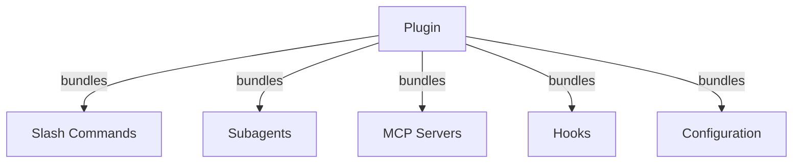
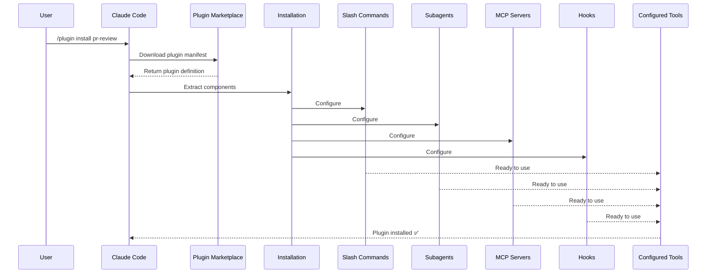

# Claude Code Plugins

This folder contains complete plugin examples that bundle multiple Claude Code features into cohesive, installable packages.

## Overview

Claude Code Plugins are bundled collections of customizations (slash commands, subagents, MCP servers, and hooks) that install with a single command. They represent the highest-level extension mechanism—combining multiple features into cohesive, shareable packages.

## Plugin Architecture



## Plugin Loading Process



> **No marketplace required (v2.1.157+)**: Plugins placed in `.claude/skills` directories now auto-load without a marketplace. Scaffold a new one with `claude plugin init <name>`, which creates it at `~/.claude/skills/<name>/` (user-global) and auto-loads it in the next session as `<name>@skills-dir`.

## Plugin Types & Distribution

| Type | Scope | Shared | Authority | Examples |
|------|-------|--------|-----------|----------|
| Official | Global | All users | Anthropic | PR Review, Security Guidance |
| Community | Public | All users | Community | DevOps, Data Science |
| Organization | Internal | Team members | Company | Internal standards, tools |
| Personal | Individual | Single user | Developer | Custom workflows |

## Plugin Definition Structure

Plugin manifest uses JSON format in `.claude-plugin/plugin.json`:

```json
{
  "name": "my-first-plugin",
  "description": "A greeting plugin",
  "version": "1.0.0",
  "author": {
    "name": "Your Name"
  },
  "homepage": "https://example.com",
  "repository": "https://github.com/user/repo",
  "license": "MIT"
}
```

Beyond those identity fields, the manifest can point Claude Code at components that live somewhere other than the default folders, and carry discovery and dependency metadata:

| Field | Type | Description |
|-------|------|-------------|
| `workflows` | string \| array | Custom [workflow](https://code.claude.com/docs/en/workflows) script files or directories (replaces the default `workflows/`) |
| `outputStyles` | string \| array | Custom output style files or directories (replaces the default `output-styles/`) |
| `lspServers` | string \| array \| object | LSP servers for code intelligence — go to definition, find references, diagnostics. Commonly `"./.lsp.json"`. See [LSP server configuration](#lsp-server-configuration) |
| `channels` | array | Channel declarations for message injection (Telegram, Slack, Discord style) |
| `dependencies` | array | Other plugins this plugin requires, optionally with semver version constraints |
| `keywords` | array | Discovery tags used when browsing and searching marketplaces |
| `metadata` | object | Free-form object for your own data, such as entitlement or catalog fields |
| `experimental.themes` | string \| array | Color theme files or directories (replaces the default `themes/`) |
| `experimental.monitors` | string \| array | [Background Monitor](#background-monitors-v21105) configurations that start automatically when the plugin is active |

## Plugin Structure Example

```
my-plugin/
├── .claude-plugin/
│   └── plugin.json       # Manifest (name, description, version, author)
├── commands/             # Skills as Markdown files
│   ├── task-1.md
│   ├── task-2.md
│   └── workflows/
├── agents/               # Custom agent definitions
│   ├── specialist-1.md
│   ├── specialist-2.md
│   └── configs/
├── skills/               # Agent Skills with SKILL.md files
│   ├── skill-1.md
│   └── skill-2.md
├── hooks/                # Event handlers in hooks.json
│   └── hooks.json
├── .mcp.json             # MCP server configurations
├── .lsp.json             # LSP server configurations for code intelligence
├── bin/                  # Executables added to Bash tool's PATH while plugin is enabled
├── settings.json         # Default settings applied when plugin is enabled (currently only `agent` key supported)
├── themes/               # Optional: ship custom Claude Code themes (v2.1.118+)
├── templates/
│   └── issue-template.md
├── scripts/
│   ├── helper-1.sh
│   └── helper-2.py
├── docs/
│   ├── README.md
│   └── USAGE.md
└── tests/
    └── plugin.test.js
```

> **Note**: `commands/` is **legacy**. Official guidance is *"Use `skills/` for new plugins."* Existing `commands/` directories keep working — the three example plugins in this module ship one — but a new plugin should put its capabilities in `skills/` as `SKILL.md` directories instead of flat Markdown command files.

### LSP server configuration

Plugins can include Language Server Protocol (LSP) support for real-time code intelligence. LSP servers provide diagnostics, code navigation, and symbol information as you work.

**Configuration locations**:
- `.lsp.json` file in the plugin root directory
- The `lspServers` key in `plugin.json` — the official manifest field name. It accepts a string, an array, or an object: a string or array points at LSP config file(s) or directories (for example `"./.lsp.json"`), and an object declares the servers inline.

#### Field reference

| Field | Required | Description |
|-------|----------|-------------|
| `command` | Yes | LSP server binary (must be in PATH) |
| `extensionToLanguage` | Yes | Maps file extensions to language IDs |
| `args` | No | Command-line arguments for the server |
| `transport` | No | Communication method: `stdio` (default) or `socket` |
| `env` | No | Environment variables for the server process |
| `initializationOptions` | No | Options sent during LSP initialization |
| `settings` | No | Workspace configuration passed to the server |
| `workspaceFolder` | No | Override the workspace folder path |
| `startupTimeout` | No | Maximum time (ms) to wait for server startup |
| `shutdownTimeout` | No | Maximum time (ms) for graceful shutdown |
| `restartOnCrash` | No | Automatically restart if the server crashes |
| `maxRestarts` | No | Maximum restart attempts before giving up |

#### Example configurations

**Go (gopls)**:

```json
{
  "go": {
    "command": "gopls",
    "args": ["serve"],
    "extensionToLanguage": {
      ".go": "go"
    }
  }
}
```

**Python (pyright)**:

```json
{
  "python": {
    "command": "pyright-langserver",
    "args": ["--stdio"],
    "extensionToLanguage": {
      ".py": "python",
      ".pyi": "python"
    }
  }
}
```

**TypeScript**:

```json
{
  "typescript": {
    "command": "typescript-language-server",
    "args": ["--stdio"],
    "extensionToLanguage": {
      ".ts": "typescript",
      ".tsx": "typescriptreact",
      ".js": "javascript",
      ".jsx": "javascriptreact"
    }
  }
}
```

#### Available LSP plugins

The official marketplace includes pre-configured LSP plugins:

| Plugin | Language | Server Binary | Install Command |
|--------|----------|---------------|----------------|
| `pyright-lsp` | Python | `pyright-langserver` | `pip install pyright` |
| `typescript-lsp` | TypeScript/JavaScript | `typescript-language-server` | `npm install -g typescript-language-server typescript` |
| `rust-lsp` | Rust | `rust-analyzer` | Install via `rustup component add rust-analyzer` |

#### LSP capabilities

Once configured, LSP servers provide:

- **Instant diagnostics** — errors and warnings appear immediately after edits
- **Code navigation** — go to definition, find references, implementations
- **Hover information** — type signatures and documentation on hover
- **Symbol listing** — browse symbols in the current file or workspace

### `bin/` directory on `PATH`

When a plugin is enabled, its `bin/` directory is prepended to the session's `PATH`. Any executable shipped there can be invoked directly from the Bash tool by name — no qualified path required.

```bash
# In a plugin layout:
my-plugin/
├── plugin.json
└── bin/
    └── my-tool          # executable file (chmod +x)

# Inside a Claude Code session with the plugin enabled:
$ my-tool --help
```

Use this for CLI helpers that hooks, skills, or commands inside the same plugin will shell out to. Mark the files executable in the plugin repo (`chmod +x`) — git preserves the bit.

## Plugin Options (v2.1.83+)

Plugins can declare user-configurable options in the manifest via `userConfig`. Values marked `sensitive: true` are stored in the system keychain rather than plain-text settings files:

```json
{
  "name": "my-plugin",
  "version": "1.0.0",
  "userConfig": {
    "apiKey": {
      "description": "API key for the service",
      "sensitive": true
    },
    "region": {
      "description": "Deployment region",
      "default": "us-east-1"
    }
  }
}
```

## Persistent Plugin Data (`${CLAUDE_PLUGIN_DATA}`) (v2.1.78+)

Plugins have access to a persistent state directory via the `${CLAUDE_PLUGIN_DATA\}` environment variable. This directory is unique per plugin and survives across sessions, making it suitable for caches, databases, and other persistent state:

```json
{
  "hooks": {
    "PostToolUse": [
      {
        "command": "node ${CLAUDE_PLUGIN_DATA}/track-usage.js"
      }
    ]
  }
}
```

The directory is created automatically when the plugin is installed. Files stored here persist until the plugin is uninstalled.

### Background Monitors (v2.1.105)

Plugins can register background monitors that auto-arm when a session starts or when the plugin's skill is invoked. Add a top-level `monitors` key to your plugin manifest:

```json
{
  "name": "my-plugin",
  "version": "1.0.0",
  "monitors": [
    {
      "command": "tail -f /var/log/app.log",
      "trigger": "session_start"
    }
  ]
}
```

The `trigger` field accepts:
- `"session_start"` — arm the monitor automatically when a session begins
- `"skill_invoke"` — arm the monitor when the plugin's skill is invoked

Monitors use the same Monitor tool under the hood, streaming stdout lines as events Claude can react to.

## Inline Plugin via Settings (`source: 'settings'`) (v2.1.80+)

Plugins can be defined inline in settings files as marketplace entries using the `source: 'settings'` field. This allows embedding a plugin definition directly without requiring a separate repository or marketplace:

```json
{
  "pluginMarketplaces": [
    {
      "name": "inline-tools",
      "source": "settings",
      "plugins": [
        {
          "name": "quick-lint",
          "source": "./local-plugins/quick-lint"
        }
      ]
    }
  ]
}
```

## Plugin Settings

Plugins can ship a `settings.json` file to provide default configuration. This currently supports the `agent` key, which sets the main thread agent for the plugin:

```json
{
  "agent": "agents/specialist-1.md"
}
```

When a plugin includes `settings.json`, its defaults are applied on installation. Users can override these settings in their own project or user configuration.

## Standalone vs Plugin Approach

| Approach | Command Names | Configuration | Best For |
|----------|---------------|---|---|
| **Standalone** | `/hello` | Manual setup in CLAUDE.md | Personal, project-specific |
| **Plugins** | `/plugin-name:hello` | Automated via plugin.json | Sharing, distribution, team use |

Use **standalone slash commands** for quick personal workflows. Use **plugins** when you want to bundle multiple features, share with a team, or publish for distribution.

> **Spaced invocation (v2.1.136+)**: Plugin slash commands also work with a space — `/myplugin review` resolves to the canonical `/myplugin:review`. Either form is fine; the colon form is canonical and recommended in scripts.

> **`skills/` discovery (v2.1.136+)**: A `skills` entry in `plugin.json` no longer hides the plugin's default `skills/` directory. Skills declared in both places are merged, so you can list a few highlights in `plugin.json` without losing the rest.

> **Root-level `SKILL.md` plugins (v2.1.142+)**: A plugin with a top-level `SKILL.md` and **no `skills/` subdirectory** is itself surfaced as a single skill — the plugin *is* the skill. This is an additional pattern, not a replacement for the `skills/` directory or the `plugin.json` `skills` entry; use it for small single-skill plugins where the directory layout adds no value.

## Practical Examples

### Example 1: PR Review Plugin

**File:** `.claude-plugin/plugin.json`

```json
{
  "name": "pr-review",
  "version": "1.0.0",
  "description": "Complete PR review workflow with security, testing, and docs",
  "author": {
    "name": "Anthropic"
  },
  "repository": "https://github.com/your-org/pr-review",
  "license": "MIT"
}
```

**File:** `commands/review-pr.md`

```markdown
---
name: Review PR
description: Start comprehensive PR review with security and testing checks
---

# PR Review

This command initiates a complete pull request review including:

1. Security analysis
2. Test coverage verification
3. Documentation updates
4. Code quality checks
5. Performance impact assessment
```

**File:** `agents/security-reviewer.md`

```yaml
---
name: security-reviewer
description: Security-focused code review
tools: Read, Grep, Bash
---

# Security Reviewer

Specializes in finding security vulnerabilities:
- Authentication/authorization issues
- Data exposure
- Injection attacks
- Secure configuration
```

**Installation:**

```bash
/plugin install pr-review

# Result:
# ✅ 3 slash commands installed
# ✅ 3 subagents configured
# ✅ 2 MCP servers connected
# ✅ 4 hooks registered
# ✅ Ready to use!
```

### Example 2: DevOps Plugin

**Components:**

```
devops-automation/
├── commands/
│   ├── deploy.md
│   ├── rollback.md
│   ├── status.md
│   └── incident.md
├── agents/
│   ├── deployment-specialist.md
│   ├── incident-commander.md
│   └── alert-analyzer.md
├── mcp/
│   ├── github-config.json
│   ├── kubernetes-config.json
│   └── prometheus-config.json
├── hooks/
│   ├── pre-deploy.js
│   ├── post-deploy.js
│   └── on-error.js
└── scripts/
    ├── deploy.sh
    ├── rollback.sh
    └── health-check.sh
```

### Example 3: Documentation Plugin

**Bundled Components:**

```
documentation/
├── commands/
│   ├── generate-api-docs.md
│   ├── generate-readme.md
│   ├── sync-docs.md
│   └── validate-docs.md
├── agents/
│   ├── api-documenter.md
│   ├── code-commentator.md
│   └── example-generator.md
├── mcp/
│   ├── github-docs-config.json
│   └── slack-announce-config.json
└── templates/
    ├── api-endpoint.md
    ├── function-docs.md
    └── adr-template.md
```

## Plugin Marketplace

The official Anthropic-managed plugin directory is `anthropics/claude-plugins-official`, auto-registered on first interactive launch. Enterprise admins can also create private plugin marketplaces for internal distribution.

There is also a **community marketplace**, `anthropics/claude-plugins-community`, hosting third-party plugins that have passed Anthropic's automated validation and safety screening — each pinned to a specific commit SHA in the catalog. Unlike the official marketplace you add it manually:

```bash
/plugin marketplace add anthropics/claude-plugins-community

# Then install from it using the claude-community marketplace name
