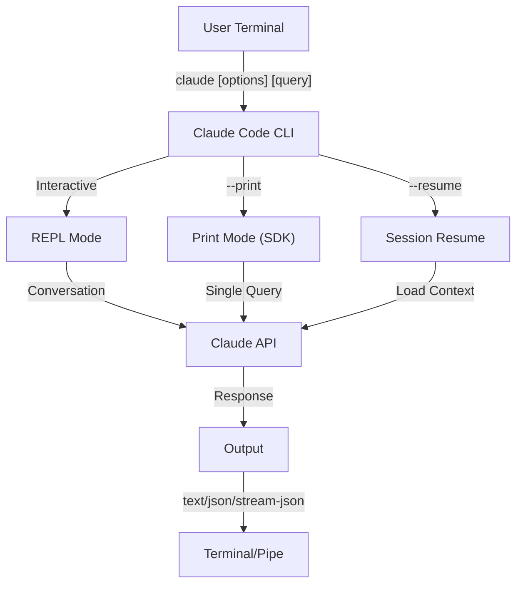

# CLI Reference

## Overview

The Claude Code CLI (Command Line Interface) is the primary way to interact with Claude Code. It provides powerful options for running queries, managing sessions, configuring models, and integrating Claude into your development workflows.

## Architecture

## Runtime & Packaging

Since **v2.1.113**, the Claude Code CLI launches a **native per-platform binary** (macOS, Linux, Windows) via optional npm dependencies. The binary is matched to your OS and architecture at install time — the older bundled-JavaScript runtime is no longer the default on macOS or Linux.

The **user-facing install is unchanged**: `npm install -g @anthropic-ai/claude-code` still works and remains the recommended path. Behind the scenes npm fetches the correct native binary for your platform.

**Download host** (v2.1.116+): native-binary artifacts are served from `https://downloads.claude.ai/claude-code-releases`.

> **Corporate / proxy users**: If your network requires an explicit allowlist, add `downloads.claude.ai` (and `https://downloads.claude.ai/claude-code-releases`) to your proxy egress rules. Environments that previously allowlisted only `storage.googleapis.com` or the npm registry will need to be updated or `claude update` and the initial install will fail.

The older JavaScript bundle is still produced for Windows and for environments that pin to it; those installs continue to ship Glob and Grep as first-class tools (see the Glob/Grep footnote under [Tools](#tool--permission-management)).

## CLI Commands

| Command | Description | Example |
|---------|-------------|---------|
| `claude` | Start interactive REPL | `claude` |
| `claude "query"` | Start REPL with initial prompt | `claude "explain this project"` |
| `claude -p "query"` | Print mode - query then exit | `claude -p "explain this function"` |
| `cat file \| claude -p "query"` | Process piped content | `cat logs.txt \| claude -p "explain"` |
| `claude -c` | Continue most recent conversation | `claude -c` |
| `claude -c -p "query"` | Continue in print mode | `claude -c -p "check for type errors"` |
| `claude -r "<session>" "query"` | Resume session by ID or name | `claude -r "auth-refactor" "finish this PR"` |
| `claude update` | Update to latest version | `claude update` |
| `/doctor` (slash command) | Diagnose installation, config, and plugin health. Since v2.1.116 it can be opened **while Claude is responding**, shows status icons inline, and accepts the `f` keypress to auto-fix detected issues. v2.1.178 refreshed the layout to a flat tree with clearer status icons and highlighted commands | run `/doctor` inside the REPL |
| `claude mcp` | Configure MCP servers (incl. `login`/`logout` for auth, v2.1.186+) | See [MCP documentation](/lib/09-harness/claude-howto/05-mcp) |
| `claude mcp serve` | Run Claude Code as an MCP server | `claude mcp serve` |
| `claude agents` | Open the **Agent View** (Research Preview, v2.1.139+) — multi-session manager listing every Claude Code session with its status. See [Agent View](#agent-view-claude-agents-v21139) below. | `claude agents` |
| `claude auto-mode defaults` | Print auto mode default rules as JSON | `claude auto-mode defaults` |
| `claude auto-mode reset` | Restore default auto-mode configuration, with a confirmation prompt (`--yes` to skip) (v2.1.212) | `claude auto-mode reset --yes` |
| `claude --remote-control [name]` | Start Remote Control (a flag, not a subcommand; alias `--rc`) | `claude --rc` |
| `claude plugin` | Manage plugins (install, enable, disable) | `claude plugin install my-plugin` |
| `claude plugin init <name>` | Scaffold a new plugin at `~/.claude/skills/<name>/` (user-global) — auto-loads in the next session as `<name>@skills-dir`, no marketplace required (v2.1.157+) | `claude plugin init my-plugin` |
| `claude plugin tag [path]` | Create a `{name}--v{version}` release git tag for the plugin at `[path]`, validating that `plugin.json` and any enclosing marketplace entry agree (v2.1.118+) | `claude plugin tag ./my-plugin` |
| `claude install [version]` | Install a specific native-binary version. Accepts `stable`, `latest`, or an explicit version string | `claude install 2.1.131` |
| `claude project purge [path]` | Delete all local Claude Code state for a project (transcripts, tasks, debug logs, file-edit history, prompt history, and `~/.claude.json` entry). Omit `[path]` for an interactive picker. Flags: `--dry-run` to preview, `-y/--yes` to skip confirmation, `-i/--interactive` to confirm each item, `--all` for every project (v2.1.126+) | `claude project purge ~/work/repo --dry-run` |
| `claude plugin prune` | Remove orphaned auto-installed plugin dependencies (parent plugin gone). `plugin uninstall --prune` does the same cascade after uninstalling a target (v2.1.121+) | `claude plugin prune` |
| `claude ultrareview [target]` | Run `/ultrareview` non-interactively. Prints findings to stdout, exits 0 on success / 1 on failure. Use `--json` for raw payload, `--timeout <minutes>` to override the 30-minute default, and `--post` / `--no-post` to control whether findings are posted back to the PR. **Requires Claude Code v2.1.227 or later** | `claude ultrareview 1234 --json --no-post` |
| `claude self-hosted-runner <setup\|doctor\|orchestrator>` | Turn your own machine or container into a place Claude Code web, mobile, and desktop sessions can run. `setup` provisions the runner, `doctor` diagnoses it, `orchestrator` runs the coordinating process. **Team and Enterprise plans; requires Claude Code v2.1.224 or later.** On Windows, startup requires an explicit `--base-dir` (v2.1.229) | `claude self-hosted-runner setup` |
| `claude auth login` | Log in (supports `--email`, `--sso`). Since v2.1.126, accepts the OAuth code pasted into the terminal as a fallback when the browser callback can't reach localhost (WSL2, SSH, containers) | `claude auth login --email user@example.com` |
| `claude auth logout` | Log out of current account | `claude auth logout` |
| `claude auth status` | Check auth status (exit 0 if logged in, 1 if not) | `claude auth status` |

## Core Flags

| Flag | Description | Example |
|------|-------------|---------|
| `-p, --print` | Print response without interactive mode | `claude -p "query"` |
| `-c, --continue` | Load most recent conversation | `claude --continue` |
| `-r, --resume` | Resume specific session by ID or name | `claude --resume auth-refactor` |
| `-v, --version` | Output version number | `claude -v` |
| `-w, --worktree` | Start in isolated git worktree. Accepts a GitLab merge-request URL as well as a GitHub PR URL since v2.1.233 | `claude -w` |
| `-n, --name` | Session display name | `claude -n "auth-refactor"` |
