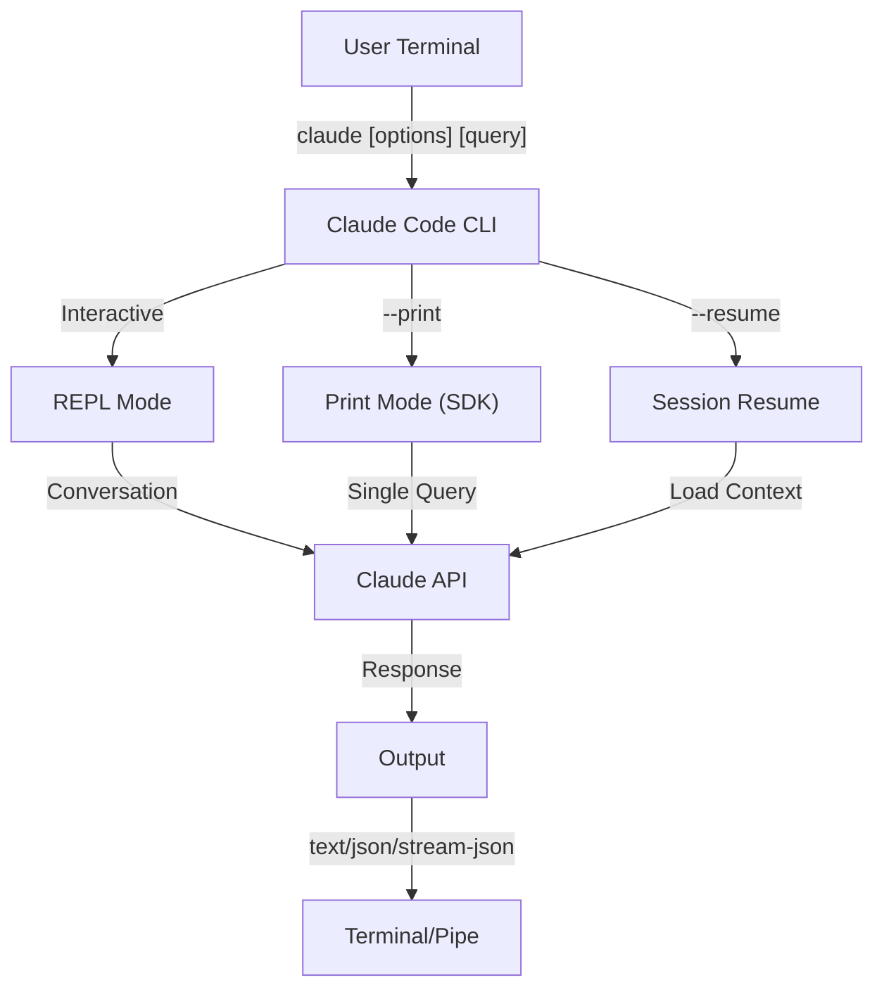

## Architecture

```mermaid
graph TD
    A["User Terminal"] -->|"claude [options] [query]"| B["Claude Code CLI"]
    B -->|Interactive| C["REPL Mode"]
    B -->|"--print"| D["Print Mode (SDK)"]
    B -->|"--resume"| E["Session Resume"]
    C -->|Conversation| F["Claude API"]
    D -->|Single Query| F
    E -->|Load Context| F
    F -->|Response| G["Output"]
    G -->|text/json/stream-json| H["Terminal/Pipe"]
```
