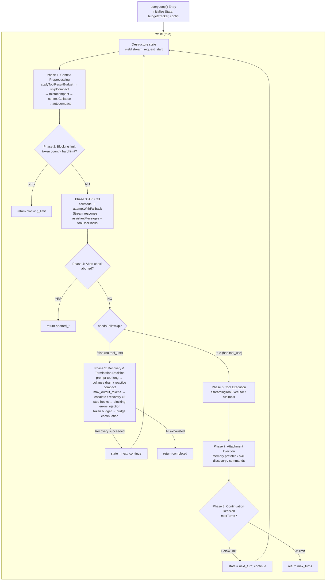

# Chapter 3: Agent Loop — The Full Lifecycle from User Input to Model Response

> *"A loop is not a loop when every iteration reshapes the world it runs in."*

This chapter is the anchor of the entire book. From Chapter 5's API call construction to Chapter 9's automatic compaction strategy, from Chapter 13's streaming response handling to Chapter 16's permission checking system — nearly all subsystems discussed in subsequent chapters are ultimately orchestrated, coordinated, and driven within the `queryLoop()` core loop. Understanding this loop means understanding the beating heart of Claude Code as an AI Agent.

## 3.1 Why the Agent Loop Is Not a Simple REPL

A traditional REPL (Read-Eval-Print Loop) is a stateless three-step cycle: read input, evaluate, print result. There's no context passing between iterations, no automatic recovery, no awareness of its own state.

The Agent Loop is fundamentally different. Consider this comparison table:

| Dimension | Traditional REPL | Claude Code Agent Loop |
|-----------|-----------------|----------------------|
| State model | Stateless or history-only | `State` type with 10 mutable fields, carried across iterations |
| Loop exit | User explicitly exits | 7 `Continue` transitions + 10 `Terminal` termination reasons |
| Error handling | Print error and continue | Auto-degradation, model switching, reactive compact, retry limits |
| Context management | None | snip -> microcompact -> context collapse -> autocompact four-level pipeline |
| Tool execution | None | Streaming parallel execution, permission checking, result budget trimming |
| Conversation capacity | Grows unbounded until OOM | Token budget tracking, automatic compaction, blocking limit hard cap |

Every iteration of the Agent Loop may change its own operating conditions: compaction reduces the message array, model degradation switches the inference backend, stop hooks inject new constraint messages. This isn't a loop — it's a **self-modifying state machine**.

## 3.2 queryLoop State Machine Overview

### 3.2.1 Entry: `query()` and `queryLoop()`

The entry function `query()` is a thin wrapper. It calls `queryLoop()` to get the result, then notifies all consumed commands of lifecycle completion:

```
restored-src/src/query.ts:219-238
```

```typescript
export async function* query(params: QueryParams): AsyncGenerator<...> {
  const consumedCommandUuids: string[] = []
  const terminal = yield* queryLoop(params, consumedCommandUuids)
  for (const uuid of consumedCommandUuids) {
    notifyCommandLifecycle(uuid, 'completed')
  }
  return terminal
}
```

The real state machine lives in `queryLoop()` (`restored-src/src/query.ts:241`). It's a `while (true)` loop that enters the next iteration via `state = next; continue`, or terminates via `return \{ reason: '...' \}`.

### 3.2.2 The State Type: Mutable State Across Iterations

The `State` type defines all mutable state the loop needs to carry between iterations (`restored-src/src/query.ts:204-217`):

| Field | Type | Semantics |
|-------|------|-----------|
| `messages` | `Message[]` | Current conversation message array; assistant responses and tool results are appended after each iteration |
| `toolUseContext` | `ToolUseContext` | Tool execution context, including available tool list, permission mode, abort signal, etc. |
| `autoCompactTracking` | `AutoCompactTrackingState \| undefined` | Auto-compaction tracking state, recording whether compaction has been triggered and consecutive failure count |
| `maxOutputTokensRecoveryCount` | `number` | Number of max_output_tokens recovery attempts made so far, capped at 3 |
| `hasAttemptedReactiveCompact` | `boolean` | Whether reactive compact has been attempted, preventing retry death loops |
| `maxOutputTokensOverride` | `number \| undefined` | Override value for default max_output_tokens, used for escalation retries (e.g., 8k -> 64k) |
| `pendingToolUseSummary` | `Promise<...> \| undefined` | Promise for the previous round's tool execution summary, awaited in parallel during the next round's model streaming |
| `stopHookActive` | `boolean \| undefined` | Marks whether a stop hook is active, preventing duplicate triggering |
| `turnCount` | `number` | Current turn count, used for `maxTurns` limit checking |
| `transition` | `Continue \| undefined` | Why the previous iteration continued — lets tests and debugging assert that recovery paths actually fired |

Note a key design decision: the source comments explicitly state "Continue sites write `state = \{ ... \}` instead of 9 separate assignments" (`restored-src/src/query.ts:267`). This means every continuation point must explicitly construct a complete `State` object. This approach eliminates the "forgot to reset a field" bug class — in a loop with 7 continuation points, this isn't a theoretical risk but an inevitable accident.

### 3.2.3 Continue Transition Types

The loop has 7 `continue` sites internally, each recording its transition reason. The complete enumeration extracted from source code:

| `Continue.reason` | Trigger Condition | Typical Behavior |
|-------------------|-------------------|------------------|
| `next_turn` | Model returned a `tool_use` block | Append assistant + tool_result, increment turnCount, begin next turn |
| `max_output_tokens_escalate` | Model output was truncated and hasn't escalated yet | Set maxOutputTokensOverride to 64k, retry same request as-is |
| `max_output_tokens_recovery` | Output truncated, escalation used up, recovery count < 3 | Inject meta message asking model to continue, increment recovery count |
| `reactive_compact_retry` | prompt-too-long or media-size error | Trigger reactive compact then retry |
| `collapse_drain_retry` | prompt-too-long with pending context collapse submissions | Execute all staged collapses, then retry |
| `stop_hook_blocking` | stop hook returned a blocking error | Inject blocking error into message stream, let model correct |
| `token_budget_continuation` | token budget not yet exhausted | Inject nudge message encouraging model to continue working |

### 3.2.4 Terminal Termination Reasons

The loop terminates via `return`, with a return value containing a `reason` field. The complete enumeration extracted from source code:

| `Terminal.reason` | Semantics |
|-------------------|-----------|
| `completed` | Model completed normally (no tool_use), or API error but recovery exhausted |
| `blocking_limit` | Token count hit hard limit, cannot continue |
| `prompt_too_long` | prompt-too-long error and all recovery means (collapse drain + reactive compact) failed |
| `image_error` | Image size/format error |
| `model_error` | Model call threw unexpected exception |
| `aborted_streaming` | User interrupted during streaming response |
| `aborted_tools` | User interrupted during tool execution |
| `stop_hook_prevented` | stop hook prevented continuation |
| `hook_stopped` | Hook prevented subsequent operations during tool execution |
| `max_turns` | Reached maximum turn limit |

> **Interactive version**: [Click to view the Agent Loop animated visualization](https://github.com/ZhangHanDong/harness-engineering-from-cc-to-ai-coding/blob/e40e0feec02b90e308ccbfc7a8911d64118ccca0/book-en/src/part1/agent-loop-viz.html) — Watch how a complete "help me fix a bug" conversation flows through the state machine, with each stage clickable for source references and detailed explanations.

The flow diagram below shows the complete topology of the state machine:



Below is the original ASCII version for readers who need a plain-text reading environment:


<summary>ASCII Flow Diagram (click to expand)</summary>

```
┌──────────────────────────────────────────────────────────────────────┐
│                        queryLoop() Entry                            │
│  Initialize State, budgetTracker, config, pendingMemoryPrefetch     │
└──────────────┬───────────────────────────────────────────────────────┘
               │
               ▼
┌──────────────────────────────────────────────────┐
│              while (true) {                      │
│  Destructure state → messages, toolUseContext, ...│
│  yield { type: 'stream_request_start' }          │
├──────────────────────────────────────────────────┤
│                                                  │
│  ┌─────────────────────────────────────────┐     │
│  │ Phase 1: Context Preprocessing           │     │
│  │ applyToolResultBudget                    │     │
│  │ → snipCompact (HISTORY_SNIP)             │     │
│  │ → microcompact                           │     │
│  │ → contextCollapse (CONTEXT_COLLAPSE)     │     │
│  │ → autocompact ───── See Ch.9 ──────────  │     │
│  └──────────────┬──────────────────────────┘     │
│                 │                                 │
│                 ▼                                 │
│  ┌─────────────────────────────────────────┐     │
│  │ Phase 2: Blocking limit check            │     │
│  │ token count > hard limit ?               │     │
│  │   YES → return {reason:'blocking_limit'} │     │
│  └──────────────┬──────────────────────────┘     │
│                 │ NO                              │
│                 ▼                                 │
│  ┌─────────────────────────────────────────┐     │
│  │ Phase 3: API Call ── See Ch.5 & Ch.13 ── │     │
│  │ attemptWithFallback loop                  │     │
│  │ callModel({                              │     │
│  │   messages: prependUserContext(...)       │     │
│  │   systemPrompt: appendSystemContext(...) │     │
│  │ })                                       │     │
│  │                                          │     │
│  │ Stream response → assistantMessages[]    │     │
│  │                → toolUseBlocks[]         │     │
│  │ FallbackTriggeredError → switch model    │     │
│  └──────────────┬──────────────────────────┘     │
│                 │                                 │
│                 ▼                                 │
│  ┌─────────────────────────────────────────┐     │
│  │ Phase 4: Abort check                     │     │
│  │ abortController.signal.aborted ?        │     │
│  │   YES → return {reason:'aborted_*'}     │     │
│  └──────────────┬──────────────────────────┘     │
│                 │ NO                              │
│                 ▼                                 │
│  ┌─────────────────────────────────────────┐     │
│  │ Phase 5: needsFollowUp == false branch   │     │
│  │ (model did not return tool_use)          │     │
│  │                                          │     │
│  │ ┌─ prompt-too-long recovery ──────────┐ │     │
│  │ │ collapse drain → reactive compact   │ │     │
│  │ │ Success → state=next; continue      │ │     │
│  │ └────────────────────────────────────-┘ │     │
│  │ ┌─ max_output_tokens recovery ────────┐ │     │
│  │ │ escalate(8k→64k) → recovery(×3)    │ │     │
│  │ │ Success → state=next; continue      │ │     │
│  │ └────────────────────────────────────-┘ │     │
│  │ ┌─ stop hooks ── See Ch.16 ──────────┐ │     │
│  │ │ blockingErrors → state=next;continue│ │     │
│  │ └────────────────────────────────────-┘ │     │
│  │ ┌─ token budget check ────────────────┐ │     │
│  │ │ budget remaining → state=next;      │ │     │
│  │ │ continue                            │ │     │
│  │ └────────────────────────────────────-┘ │     │
│  │                                          │     │
│  │ return { reason: 'completed' }           │     │
│  └──────────────────────────────────────-──┘     │
│                 │                                 │
│           needsFollowUp == true                  │
│                 │                                 │
│                 ▼                                 │
│  ┌─────────────────────────────────────────┐     │
│  │ Phase 6: Tool Execution                  │     │
│  │ streamingToolExecutor.getRemainingResults│     │
│  │ or runTools() ── See Ch.4 ────────────── │     │
│  │ → toolResults[]                         │     │
│  └──────────────┬──────────────────────────┘     │
│                 │                                 │
│                 ▼                                 │
│  ┌─────────────────────────────────────────┐     │
│  │ Phase 7: Attachment Injection            │     │
│  │ getAttachmentMessages()                 │     │
│  │ pendingMemoryPrefetch consume           │     │
│  │ skillDiscoveryPrefetch consume          │     │
│  │ queuedCommands drain                    │     │
│  └──────────────┬──────────────────────────┘     │
│                 │                                 │
│                 ▼                                 │
│  ┌─────────────────────────────────────────┐     │
│  │ Phase 8: Continuation Decision           │     │
│  │ maxTurns check                          │     │
│  │ state = { reason: 'next_turn', ... }    │     │
│  │ continue                                │     │
│  └─────────────────────────────────────────┘     │
│                                                  │
└──────────────────────────────────────────────────┘
```


## 3.3 Complete Flow of a Single Iteration

Let's trace every phase of a single iteration, from start to finish.

### 3.3.1 Context Preprocessing Pipeline

At the start of each iteration, the raw `messages` array must go through four to five levels of processing before being sent to the API. These stages execute in strict order, and the order is not interchangeable.

**Level 1: Tool Result Budget Trimming**

```
restored-src/src/query.ts:379-394
```

`applyToolResultBudget()` applies size limits to aggregated tool results. It runs before all compaction stages because subsequent cached microcompact operates only on `tool_use_id` without inspecting content — trimming content first doesn't interfere with it.

**Level 2: History Snip**

```
restored-src/src/query.ts:401-410
```

`snipCompactIfNeeded()` is a lightweight compaction: it snips old messages from history to free token space. Crucially, it returns a `tokensFreed` value — this is passed to autocompact so its threshold decision can account for the space already freed by snip.

**Level 3: Microcompact**

```
restored-src/src/query.ts:414-426
```

Microcompact is a fine-grained compaction that runs before autocompact. It also supports a "cached edit" mode (`CACHED_MICROCOMPACT`) that leverages the API's cache deletion mechanism to achieve zero-additional-API-call compaction.

**Level 4: Context Collapse**

```
restored-src/src/query.ts:440-447
```

Context Collapse is a read-time projection mechanism. Source comments reveal an elegant design:

> *"Nothing is yielded — the collapsed view is a read-time projection over the REPL's full history. Summary messages live in the collapse store, not the REPL array."* (`restored-src/src/query.ts:434-436`)

This means the collapse doesn't modify the original message array but re-projects at each iteration. The collapsed result is passed via `state.messages` at continuation points; the next `projectView()` becomes a no-op since archived messages are already absent from the input.

**Level 5: Autocompact** (see Chapter 9)

```
restored-src/src/query.ts:454-468
```

Automatic compaction is the heaviest preprocessing step. It runs after context collapse — if the collapse has already reduced the token count below the threshold, autocompact becomes a no-op, preserving finer-grained context rather than generating a single summary.

The design of this five-level pipeline follows one principle: **from light to heavy, from local to global**. Each level tries to free space without losing too much information; only when earlier levels aren't sufficient do later levels activate.

### 3.3.2 Context Injection: prependUserContext and appendSystemContext

After message preprocessing is complete, context is injected into the API request via two functions:

**`appendSystemContext`** (`restored-src/src/utils/api.ts:437-447`):

```typescript
export function appendSystemContext(
  systemPrompt: SystemPrompt,
  context: { [k: string]: string },
): string[] {
  return [
    ...systemPrompt,
    Object.entries(context)
      .map(([key, value]) => `${key}: ${value}`)
      .join('\n'),
  ].filter(Boolean)
}
```

System context is appended to the end of the system prompt. This content (like current date, working directory, etc.) benefits from the system prompt's special caching position — the API's prompt caching is most friendly to system prompts.

**`prependUserContext`** (`restored-src/src/utils/api.ts:449-474`):

```typescript
export function prependUserContext(
  messages: Message[],
  context: { [k: string]: string },
): Message[] {
  // ...
  return [
    createUserMessage({
      content: `<system-reminder>\n...\n</system-reminder>\n`,
      isMeta: true,
    }),
    ...messages,
  ]
}
```
