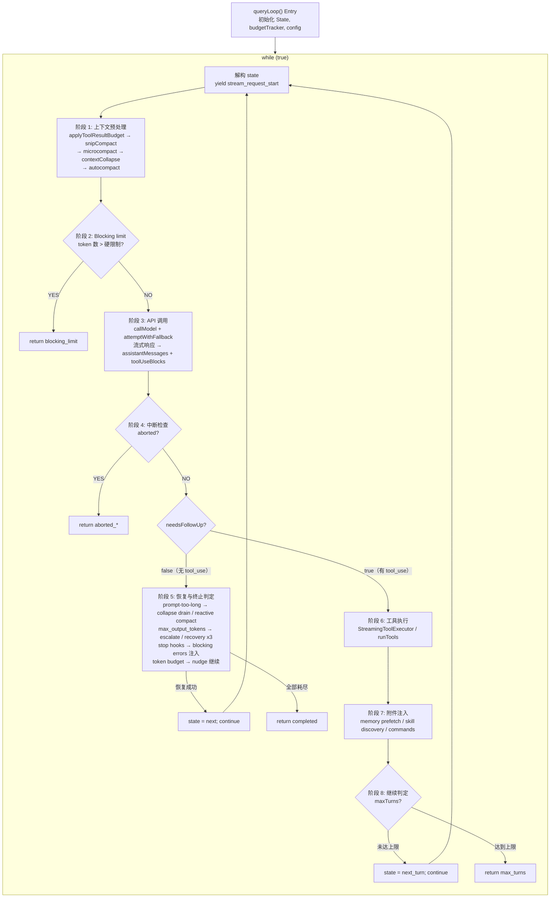

# 第3章：Agent Loop — 从用户输入到模型响应的完整生命周期

> **定位**：本章分析 `queryLoop()` 核心循环的完整状态机——从用户输入到模型响应、工具执行、上下文管理的全生命周期。前置依赖：第1章（三层架构）。适用场景：全书锚点章节——理解从用户输入到模型响应的完整循环，后续所有章节都引用本章来定位各自在循环中的位置。

> *"A loop is not a loop when every iteration reshapes the world it runs in."*

本章是全书的锚点。从第5章的 API 调用构建到第9章的自动压缩策略，从第13章的流式响应处理到第16章的权限检查体系——几乎所有后续章节讨论的子系统，最终都在 `queryLoop()` 这个核心循环中被编排、协调、驱动。理解这个循环，就是理解 Claude Code 作为 AI Agent 的运转心脏。

## 3.1 为什么 Agent Loop 不是简单的 REPL

传统的 REPL（Read-Eval-Print Loop）是一个无状态的三步循环：读取输入、求值、打印结果。每次迭代之间没有上下文传递，没有自动恢复，没有对自身状态的感知。

Agent Loop 根本不同。看这张对比表：

| 维度 | 传统 REPL | Claude Code Agent Loop |
|------|----------|----------------------|
| 状态模型 | 无状态或仅保留历史 | 10 个可变字段的 `State` 类型，跨迭代传递 |
| 循环退出 | 用户显式退出 | 7 种 `Continue` 转换 + 10 种 `Terminal` 终止原因 |
| 错误处理 | 打印错误并继续 | 自动降级、模型切换、reactive compact、重试上限 |
| 上下文管理 | 无 | snip → microcompact → context collapse → autocompact 四级管线 |
| 工具执行 | 无 | 流式并行执行、权限检查、结果预算裁剪 |
| 对话容量 | 无限增长直到 OOM | token 预算追踪、自动压缩、blocking limit 硬限制 |

Agent Loop 的每一次迭代都可能改变自身的运行条件：压缩会缩减消息数组，模型降级会切换推理后端，stop hook 会注入新的约束消息。这不是循环——这是一个**自修改状态机**（self-modifying state machine）。

## 3.2 queryLoop 状态机总览

### 3.2.1 入口：`query()` 与 `queryLoop()`

入口函数 `query()` 是一个薄包装器。它调用 `queryLoop()` 获得结果，然后通知所有已消费的命令完成生命周期：

```
restored-src/src/query.ts:219-238
```

```typescript
export async function* query(params: QueryParams): AsyncGenerator<...> {
  const consumedCommandUuids: string[] = []
  const terminal = yield* queryLoop(params, consumedCommandUuids)
  for (const uuid of consumedCommandUuids) {
    notifyCommandLifecycle(uuid, 'completed')
  }
  return terminal
}
```

真正的状态机在 `queryLoop()` 中（`restored-src/src/query.ts:241`）。它是一个 `while (true)` 循环，每次迭代通过 `state = next; continue` 进入下一轮，或通过 `return \{ reason: '...' \}` 终止。

### 3.2.2 State 类型：跨迭代的可变状态

`State` 类型定义了循环在迭代之间需要携带的所有可变状态（`restored-src/src/query.ts:204-217`）：

| 字段 | 类型 | 语义 |
|------|------|------|
| `messages` | `Message[]` | 当前对话消息数组，每轮迭代后追加 assistant 响应和 tool results |
| `toolUseContext` | `ToolUseContext` | 工具执行上下文，包含可用工具列表、权限模式、abort 信号等 |
| `autoCompactTracking` | `AutoCompactTrackingState \| undefined` | 自动压缩的追踪状态，记录是否已触发过压缩及连续失败次数 |
| `maxOutputTokensRecoveryCount` | `number` | 当前已尝试的 max_output_tokens 恢复次数，上限为 3 |
| `hasAttemptedReactiveCompact` | `boolean` | 是否已尝试过 reactive compact，防止重试死循环 |
| `maxOutputTokensOverride` | `number \| undefined` | 覆盖默认 max_output_tokens 的值，用于升级重试（如 8k → 64k） |
| `pendingToolUseSummary` | `Promise<...> \| undefined` | 上一轮工具执行的摘要生成 Promise，在下一轮模型流式传输期间并行等待 |
| `stopHookActive` | `boolean \| undefined` | 标记 stop hook 是否处于活跃状态，避免重复触发 |
| `turnCount` | `number` | 当前轮次计数，用于 `maxTurns` 限制检查 |
| `transition` | `Continue \| undefined` | 上一次迭代为何继续——让测试和调试能够断言恢复路径确实触发了 |

注意设计上的一个关键决策：源码注释明确说明"Continue sites write `state = \{ ... \}` instead of 9 separate assignments"（`restored-src/src/query.ts:267`）。这意味着每个继续点都必须显式构造完整的 `State` 对象。这种写法消除了"忘记重置某个字段"的 bug 类——在一个有 7 个继续点的循环中，这不是理论风险，而是必然会发生的事故。

### 3.2.3 Continue 转换类型

循环内部有 7 个 `continue` 站点，每个都记录了转换原因。从源码中提取的完整枚举：

| `Continue.reason` | 触发条件 | 典型行为 |
|-------------------|---------|---------|
| `next_turn` | 模型返回了 `tool_use` block | 追加 assistant + tool_result，递增 turnCount，开始下一轮 |
| `max_output_tokens_escalate` | 模型输出被截断，且尚未升级过 | 将 maxOutputTokensOverride 设为 64k，原样重试同一请求 |
| `max_output_tokens_recovery` | 输出截断且升级已用完，恢复次数 < 3 | 注入 meta 消息要求模型继续，递增恢复计数 |
| `reactive_compact_retry` | prompt-too-long 或 media-size 错误 | 触发 reactive compact 压缩后重试 |
| `collapse_drain_retry` | prompt-too-long 且有待提交的 context collapse | 执行所有暂存的 collapse，然后重试 |
| `stop_hook_blocking` | stop hook 返回了阻塞错误 | 将阻塞错误注入消息流，让模型修正 |
| `token_budget_continuation` | token budget 尚未耗尽 | 注入 nudge 消息鼓励模型继续工作 |

### 3.2.4 Terminal 终止原因

循环通过 `return` 终止，返回值包含 `reason` 字段。从源码提取的完整枚举：

| `Terminal.reason` | 语义 |
|-------------------|------|
| `completed` | 模型正常完成（无 tool_use），或 API 错误但恢复已耗尽 |
| `blocking_limit` | token 数触达硬限制，无法继续 |
| `prompt_too_long` | prompt-too-long 错误且所有恢复手段（collapse drain + reactive compact）均失败 |
| `image_error` | 图片尺寸/格式错误 |
| `model_error` | 模型调用抛出非预期异常 |
| `aborted_streaming` | 用户在流式响应期间中断 |
| `aborted_tools` | 用户在工具执行期间中断 |
| `stop_hook_prevented` | stop hook 阻止了继续 |
| `hook_stopped` | 工具执行时 hook 阻止了后续操作 |
| `max_turns` | 达到最大轮次限制 |

> **交互式版本**：[点击查看 Agent Loop 动画可视化](https://github.com/ZhangHanDong/harness-engineering-from-cc-to-ai-coding/blob/e40e0feec02b90e308ccbfc7a8911d64118ccca0/book/src/part1/agent-loop-viz.html) — 观看一次完整的"帮我修 bug"对话如何在状态机中流转，每个阶段可点击查看源码引用和详细解释。

下面的流程图展示了状态机的完整拓扑：



以下是原始 ASCII 版本，供需要纯文本阅读环境的读者参考：


<summary>ASCII 流程图（点击展开）</summary>

```
┌──────────────────────────────────────────────────────────────────────┐
│                        queryLoop() Entry                            │
│  初始化 State, budgetTracker, config, pendingMemoryPrefetch         │
└──────────────┬───────────────────────────────────────────────────────┘
               │
               ▼
┌──────────────────────────────────────────────────┐
│              while (true) {                      │
│  解构 state → messages, toolUseContext, ...       │
│  yield { type: 'stream_request_start' }          │
├──────────────────────────────────────────────────┤
│                                                  │
│  ┌─────────────────────────────────────────┐     │
│  │ 阶段 1: 上下文预处理                      │     │
│  │ applyToolResultBudget                    │     │
│  │ → snipCompact (HISTORY_SNIP)             │     │
│  │ → microcompact                           │     │
│  │ → contextCollapse (CONTEXT_COLLAPSE)     │     │
│  │ → autocompact ───── 详见第9章 ──────────  │     │
│  └──────────────┬──────────────────────────┘     │
│                 │                                 │
│                 ▼                                 │
│  ┌─────────────────────────────────────────┐     │
│  │ 阶段 2: Blocking limit 检查              │     │
│  │ token 数 > 硬限制 ?                      │     │
│  │   YES → return {reason:'blocking_limit'} │     │
│  └──────────────┬──────────────────────────┘     │
│                 │ NO                              │
│                 ▼                                 │
│  ┌─────────────────────────────────────────┐     │
│  │ 阶段 3: API 调用 ── 详见第5章和第13章 ──  │     │
│  │ attemptWithFallback 循环                  │     │
│  │ callModel({                              │     │
│  │   messages: prependUserContext(...)       │     │
│  │   systemPrompt: appendSystemContext(...) │     │
│  │ })                                       │     │
│  │                                          │     │
│  │ 流式响应 → assistantMessages[]           │     │
│  │         → toolUseBlocks[]                │     │
│  │ FallbackTriggeredError → 切换模型重试     │     │
│  └──────────────┬──────────────────────────┘     │
│                 │                                 │
│                 ▼                                 │
│  ┌─────────────────────────────────────────┐     │
│  │ 阶段 4: 中断检查                         │     │
│  │ abortController.signal.aborted ?        │     │
│  │   YES → return {reason:'aborted_*'}     │     │
│  └──────────────┬──────────────────────────┘     │
│                 │ NO                              │
│                 ▼                                 │
│  ┌─────────────────────────────────────────┐     │
│  │ 阶段 5: needsFollowUp == false 分支      │     │
│  │ (模型未返回 tool_use)                    │     │
│  │                                          │     │
│  │ ┌─ prompt-too-long 恢复 ──────────────┐ │     │
│  │ │ collapse drain → reactive compact   │ │     │
│  │ │ 成功 → state=next; continue         │ │     │
│  │ └────────────────────────────────────-┘ │     │
│  │ ┌─ max_output_tokens 恢复 ────────────┐ │     │
│  │ │ escalate(8k→64k) → recovery(×3)    │ │     │
│  │ │ 成功 → state=next; continue         │ │     │
│  │ └────────────────────────────────────-┘ │     │
│  │ ┌─ stop hooks ── 详见第16章 ──────────┐ │     │
│  │ │ blockingErrors → state=next;continue│ │     │
│  │ └────────────────────────────────────-┘ │     │
│  │ ┌─ token budget check ────────────────┐ │     │
│  │ │ budget未尽 → state=next; continue   │ │     │
│  │ └────────────────────────────────────-┘ │     │
│  │                                          │     │
│  │ return { reason: 'completed' }           │     │
│  └──────────────────────────────────────-──┘     │
│                 │                                 │
│           needsFollowUp == true                  │
│                 │                                 │
│                 ▼                                 │
│  ┌─────────────────────────────────────────┐     │
│  │ 阶段 6: 工具执行                         │     │
│  │ streamingToolExecutor.getRemainingResults│     │
│  │ 或 runTools() ── 详见第4章(工具执行编排) ─ │     │
│  │ → toolResults[]                         │     │
│  └──────────────┬──────────────────────────┘     │
│                 │                                 │
│                 ▼                                 │
│  ┌─────────────────────────────────────────┐     │
│  │ 阶段 7: 附件注入                         │     │
│  │ getAttachmentMessages()                 │     │
│  │ pendingMemoryPrefetch consume           │     │
│  │ skillDiscoveryPrefetch consume          │     │
│  │ queuedCommands drain                    │     │
│  └──────────────┬──────────────────────────┘     │
│                 │                                 │
│                 ▼                                 │
│  ┌─────────────────────────────────────────┐     │
│  │ 阶段 8: 继续判定                         │     │
│  │ maxTurns check                          │     │
│  │ state = { reason: 'next_turn', ... }    │     │
│  │ continue                                │     │
│  └─────────────────────────────────────────┘     │
│                                                  │
└──────────────────────────────────────────────────┘
```


## 3.3 单次迭代的完整流程

让我们跟踪一次迭代的每个阶段，从头到尾。

### 3.3.1 上下文预处理管线

每次迭代开始时，原始 `messages` 数组要经过四到五级处理才能送往 API。这些阶段按严格顺序执行，且顺序不可互换。

**第一级：工具结果预算裁剪（Tool Result Budget）**

```
restored-src/src/query.ts:379-394
```

`applyToolResultBudget()` 对聚合工具结果施加大小限制。它在所有压缩阶段之前运行，因为后续的 cached microcompact 仅通过 `tool_use_id` 操作，不检查内容——先裁剪内容不会干扰它。

**第二级：History Snip**

```
restored-src/src/query.ts:401-410
```

`snipCompactIfNeeded()` 是一种轻量级压缩：它截断（snip）历史中的旧消息，释放 token 空间。关键的是，它返回 `tokensFreed` 值——这个值会被传递给 autocompact，让后者的阈值判断能感知 snip 已经释放的空间。

**第三级：Microcompact**

```
restored-src/src/query.ts:414-426
```

Microcompact 是一种细粒度压缩，在 autocompact 之前运行。它还支持一种"缓存编辑"模式（`CACHED_MICROCOMPACT`），利用 API 的 cache 删除机制实现零额外 API 调用的压缩。

**第四级：Context Collapse**

```
restored-src/src/query.ts:440-447
```

Context Collapse（上下文折叠）是一种读时投影（read-time projection）机制。源码注释揭示了一个精妙的设计：

> *"Nothing is yielded — the collapsed view is a read-time projection over the REPL's full history. Summary messages live in the collapse store, not the REPL array."*（`restored-src/src/query.ts:434-436`）

这意味着折叠不改变原始消息数组，而是在每次迭代时重新投影。折叠结果通过 `state.messages` 在继续点传递，下一次 `projectView()` 因为归档消息已经不在输入中而成为空操作。

**第五级：Autocompact**（详见第9章）

```
restored-src/src/query.ts:454-468
```

自动压缩是最重量级的预处理步骤。它在 context collapse 之后运行——如果折叠已经把 token 数降到阈值以下，autocompact 就成为空操作，保留了更细粒度的上下文而不是生成单一摘要。

这五级管线的设计遵循一个原则：**从轻到重、从局部到全局**。每一级都试图在不丢失太多信息的前提下释放空间，只有前面的级别不够时，后面的级别才会启动。

### 3.3.2 上下文注入：prependUserContext 与 appendSystemContext

消息预处理完成后，上下文通过两个函数注入到 API 请求中：

**`appendSystemContext`**（`restored-src/src/utils/api.ts:437-447`）：

```typescript
export function appendSystemContext(
  systemPrompt: SystemPrompt,
  context: { [k: string]: string },
): string[] {
  return [
    ...systemPrompt,
    Object.entries(context)
      .map(([key, value]) => `${key}: ${value}`)
      .join('\n'),
  ].filter(Boolean)
}
```

系统上下文被追加到系统提示词（system prompt）的末尾。这些内容（如当前日期、工作目录等）享受系统提示词的特殊缓存位置——API 的 prompt caching 对系统提示词最为友好。

**`prependUserContext`**（`restored-src/src/utils/api.ts:449-474`）：

```typescript
export function prependUserContext(
  messages: Message[],
  context: { [k: string]: string },
): Message[] {
  // ...
  return [
    createUserMessage({
      content: `<system-reminder>\n...\n</system-reminder>\n`,
      isMeta: true,
    }),
    ...messages,
  ]
}
```
