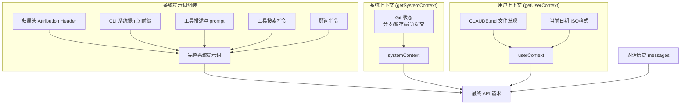

# 第 3 章：上下文工程

> 上下文工程是 Claude Code 能力的隐形支柱。模型的决策质量完全取决于它看到了什么上下文。

## 为什么上下文工程如此重要？

LLM 有一个固定大小的上下文窗口（Claude 当前最大 1M token）。而一次真实的编码会话，可能涉及几十次文件读取、数百次工具调用，产生的原始文本量轻松超过百万 token——很容易逼近甚至超出上下文窗口的容量。

这意味着系统必须做出艰难的取舍：哪些信息留在上下文中，哪些被压缩或丢弃。如果取舍不当，模型会忘记刚才编辑了哪个文件、重复读取已经看过的内容、或者产生与之前决策矛盾的输出。

可以把上下文窗口想象成一张办公桌：桌面有限，你必须把最重要的文档放在手边，其他的归档到抽屉里。上下文工程就是这套"文档管理系统"——决定桌上放什么（上下文构建）、什么时候把旧文档收进抽屉（压缩）、以及如何让归档的文档在需要时快速取回（持久化与恢复）。

但上下文工程面临的挑战不止于此。Claude Code 的每次 API 请求，光系统提示词和工具定义就可能有 50-100K token。为了避免每次都从零处理这些内容，Claude Code 依赖服务端的前缀缓存（Prefix Caching / KV Cache）——服务端记住之前处理过的前缀，后续请求只处理新增部分，省去重复消化整段前缀的延迟和成本。

但前缀缓存有一个残酷的约束：前缀必须字节级完全一致才能命中缓存。不是"差不多就行"，而是任何一个字节的变化——哪怕只是换了一个请求头、改了一个工具的顺序——都会导致整个前缀的缓存失效，50-100K token 全部需要重新处理。

这给上下文工程带来了一种"带着镣铐跳舞"的感觉：你不能随意调整提示词顺序，不能随意增删工具定义，不能中途改变请求元数据……每一个设计决策都必须同时满足两个目标——给模型最好的上下文，同时不打破缓存。本章中你会反复看到这种张力：很多看起来"过度设计"的机制，背后的驱动力都是缓存稳定性。

Claude Code 在这方面的工程量远超大多数人的预期。本章将深入分析它的完整上下文管理体系。

关键文件：`src/context.ts`（190 行）、`src/utils/api.ts`、`src/services/compact/`

## 3.1 上下文构建全景

每次调用 Claude API，模型都是从零开始的——它没有跨请求的持久记忆，只能看到当前请求中携带的内容。因此，Claude Code 必须在每次 API 调用前，将模型需要的所有信息组装成一个完整的请求。

这个组装过程涉及三大支柱：

1. 系统提示词（System Prompt）：定义模型的身份、能力边界和行为规则。这是最稳定的部分，跨请求基本不变。
2. 系统/用户上下文（System & User Context）：环境信息（git 状态、平台）和项目知识（CLAUDE.md 指令文件）。每会话计算一次。
3. 消息历史（Message History）：用户的提问、模型的回答、工具调用和结果——记录了对话中发生的一切。这是变化最快、占用空间最大的部分。



### 一次 API 请求的完整解剖

上面的三大支柱比较抽象，一次真实的 API 请求到底长什么样？Claude API 的请求体有三个顶级字段：`system`（系统提示词数组）、`tools`（工具 schema 数组）、`messages`（消息数组）。完整结构如下：

```
┌─────────────────────────────────────────────────────────────┐
│  system — 系统提示词数组（多个 TextBlock 拼接）               │
│  ┌────────────────────────────────────────────────────────┐  │
│  │ [0] 归属头 (Attribution Header)              不缓存    │  │
│  │ [1] CLI 前缀 (交互模式 / -p 模式指令)         不缓存    │  │
│  │ ─── 静态内容 ─────────────────────────── 🔒 global ── │  │
│  │ [2] 核心指令 + 工具描述 + 安全规则 + 行为准则           │  │
│  │     （所有用户完全相同）                                 │  │
│  │ ─── __SYSTEM_PROMPT_DYNAMIC_BOUNDARY__ ────────────── │  │
│  │ ─── 动态内容 ─────────────────────────── 不缓存 ───── │  │
│  │ [3] 输出风格、语言偏好、MCP 指令等                      │  │
│  │     （因用户/会话而异）                                  │  │
│  └────────────────────────────────────────────────────────┘  │
│                                                               │
│  tools — 工具 schema 数组                                     │
│  ┌────────────────────────────────────────────────────────┐  │
│  │ 内置工具 (Read, Edit, Bash, Grep, Write, Glob...)      │  │
│  │ MCP 工具 (用户安装的，可能标记 defer_loading 延迟加载)   │  │
│  │ 服务端工具 (advisor 等) 排在数组末尾                     │  │
│  │ 整个数组渲染在 system 之前，随 system 断点一并缓存        │  │
│  │ （快照中工具未单独打 cache_control，见 3.6）             │  │
│  └────────────────────────────────────────────────────────┘  │
│                                                               │
│  messages — 消息数组                                          │
│  ┌────────────────────────────────────────────────────────┐  │
│  │                                                          │  │
│  │ [User]  用户第 1 条消息                                   │  │
│  │ [Asst]  模型回复（可能包含 tool_use 块）                  │  │
│  │ [User]  tool_result 结果                                  │  │
│  │ [User]  附件消息（每条都是独立的 isMeta 用户消息）：       │  │
