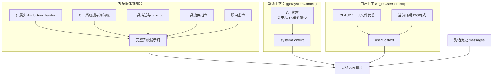

## 3.1 上下文构建全景

每次调用 Claude API，模型都是从零开始的——它没有跨请求的持久记忆，只能看到当前请求中携带的内容。因此，Claude Code 必须在每次 API 调用前，将模型需要的所有信息组装成一个完整的请求。

这个组装过程涉及三大支柱：

1. 系统提示词（System Prompt）：定义模型的身份、能力边界和行为规则。这是最稳定的部分，跨请求基本不变。
2. 系统/用户上下文（System & User Context）：环境信息（git 状态、平台）和项目知识（CLAUDE.md 指令文件）。每会话计算一次。
3. 消息历史（Message History）：用户的提问、模型的回答、工具调用和结果——记录了对话中发生的一切。这是变化最快、占用空间最大的部分。



### 一次 API 请求的完整解剖

上面的三大支柱比较抽象，一次真实的 API 请求到底长什么样？Claude API 的请求体有三个顶级字段：`system`（系统提示词数组）、`tools`（工具 schema 数组）、`messages`（消息数组）。完整结构如下：

```
┌─────────────────────────────────────────────────────────────┐
│  system — 系统提示词数组（多个 TextBlock 拼接）               │
│  ┌────────────────────────────────────────────────────────┐  │
│  │ [0] 归属头 (Attribution Header)              不缓存    │  │
│  │ [1] CLI 前缀 (交互模式 / -p 模式指令)         不缓存    │  │
│  │ ─── 静态内容 ─────────────────────────── 🔒 global ── │  │
│  │ [2] 核心指令 + 工具描述 + 安全规则 + 行为准则           │  │
│  │     （所有用户完全相同）                                 │  │
│  │ ─── __SYSTEM_PROMPT_DYNAMIC_BOUNDARY__ ────────────── │  │
│  │ ─── 动态内容 ─────────────────────────── 不缓存 ───── │  │
│  │ [3] 输出风格、语言偏好、MCP 指令等                      │  │
│  │     （因用户/会话而异）                                  │  │
│  └────────────────────────────────────────────────────────┘  │
│                                                               │
│  tools — 工具 schema 数组                                     │
│  ┌────────────────────────────────────────────────────────┐  │
│  │ 内置工具 (Read, Edit, Bash, Grep, Write, Glob...)      │  │
│  │ MCP 工具 (用户安装的，可能标记 defer_loading 延迟加载)   │  │
│  │ 服务端工具 (advisor 等) 排在数组末尾                     │  │
│  │ 整个数组渲染在 system 之前，随 system 断点一并缓存        │  │
│  │ （快照中工具未单独打 cache_control，见 3.6）             │  │
│  └────────────────────────────────────────────────────────┘  │
│                                                               │
│  messages — 消息数组                                          │
│  ┌────────────────────────────────────────────────────────┐  │
│  │                                                          │  │
│  │ [User]  用户第 1 条消息                                   │  │
│  │ [Asst]  模型回复（可能包含 tool_use 块）                  │  │
│  │ [User]  tool_result 结果                                  │  │
│  │ [User]  附件消息（每条都是独立的 isMeta 用户消息）：       │  │
