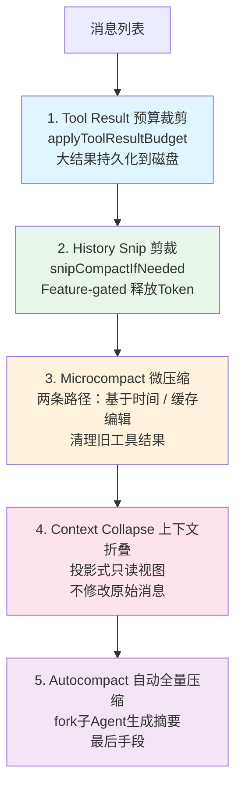
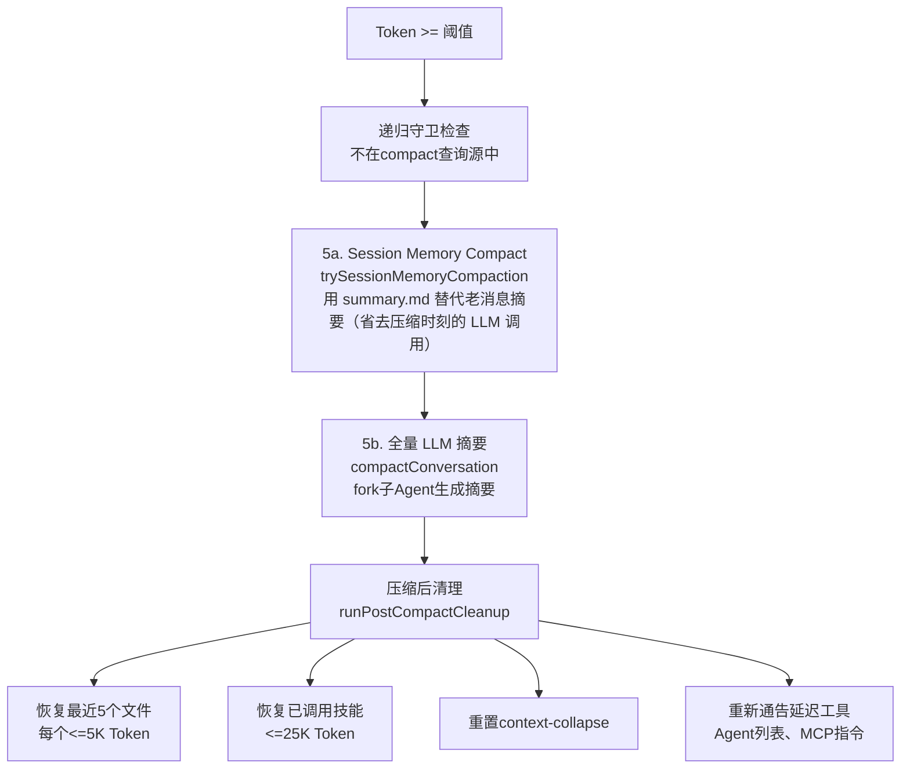

## 3.4 五级压缩流水线

这是 Claude Code 上下文管理的核心机制。当对话越来越长，Token 使用量不断增长，五级压缩流水线逐级启动。设计哲学是渐进式压缩——先用成本最低的手段尝试释放空间，只在必要时才动用更重的武器。



### 为什么按此顺序执行？

每一级都比前一级"更重"——消耗更多计算资源，或丢失更多上下文细节：

1. Tool Result Budget 最先：纯本地操作，不调用 API。大结果写入磁盘，上下文只保留预览。零延迟、零成本。
2. Snip 释放最多：直接从消息列表中移除冗余部分，释放大量 Token，可能使后续压缩不必要。
3. Microcompact 成本极低：清理旧工具结果，不调用 API，适合频繁执行。
4. Context Collapse 在 Autocompact 之前：Context Collapse（上下文折叠）是一种投影式压缩——创建消息的只读折叠视图，不修改原始数据（详见 Level 4）。折叠可能使 Token 使用量降到 Autocompact 阈值以下，从而阻止不必要的全量压缩——保留了更细粒度的上下文。
5. Autocompact 作为最后手段：需要 fork 一个子 Agent 调用 API 生成摘要，成本最高，且不可逆（原始消息被摘要替换）。

### 各级压缩详解

#### Level 1: Tool Result 预算裁剪

`applyToolResultBudget()` 是最轻量的处理——纯本地操作，不调用 API。它解决的核心问题是：单次工具调用可能返回巨大的结果。例如，用 `FileReadTool` 读取一个万行文件，或用 `BashTool` 执行 `find` 命令获取数千个文件路径。

处理机制（`src/utils/toolResultStorage.ts`）：

1. 每个工具声明一个 `maxResultSizeChars`，默认值为 `DEFAULT_MAX_RESULT_SIZE_CHARS = 50,000` 字符
2. 可通过 GrowthBook Feature Flag（`tengu_satin_quoll`）按工具名覆盖阈值
3. 当工具结果超过阈值时，不是简单截断，而是持久化到磁盘

```
持久化路径: {projectDir}/{sessionId}/tool-results/{tool_use_id}.{txt|json}
```

上下文中只保留一个紧凑的引用消息：

```xml
```

为什么选择持久化而非截断？ 截断意味着数据永久丢失——如果模型后来需要查看完整输出（比如在第 500 行发现了 bug），它无法恢复。持久化则保留了完整数据，模型可以随时使用 `Read` 工具读取磁盘文件来获取完整内容。2KB 的预览给了模型足够的信息来判断是否需要查看完整结果。

此外，`applyToolResultBudget` 还会追踪已替换的工具结果（`ContentReplacementState`），确保会话恢复（resume）时做出与原始会话完全相同的替换决策，维持提示词缓存的稳定性。

#### Level 2: History Snip

`snipCompactIfNeeded()` 是 Feature-gated 功能（`HISTORY_SNIP`），通过剪裁历史消息中的冗余部分释放 Token。释放量通过 `snipTokensFreed` 传递给后续的 autocompact 阈值检查——这很重要，因为 snip 移除了消息但最后一条 assistant 消息的 `usage` 仍然反映 snip 前的上下文大小，不做修正会导致 autocompact 过早触发。

#### Level 3: Microcompact

Microcompact 是 Claude Code 压缩体系中最精巧的一环。它的目标是清理历史中不再需要的旧工具结果——如果你 30 分钟前读取了一个文件，那个工具结果大概率已经不再有用，但它可能还占着数千 Token。

关键设计：Microcompact 有两条完全不同的路径，根据缓存状态选择：

**路径 A：基于时间的 Microcompact（缓存已冷）**

当用户离开一段时间后回来（距上次 assistant 消息超过配置的分钟数），服务端的提示词缓存已经过期（默认 5 分钟 TTL）。此时缓存已经"冷了"，无论怎么做都需要重新上传完整前缀。

在这种情况下，Microcompact 直接修改消息内容：

```typescript
// 将旧工具结果替换为占位符
return { ...block, content: '[Old tool result content cleared]' }
```

只保留最近 N 个可压缩工具的结果（`keepRecent`，最少保留 1 个），其他全部替换为占位符。因为缓存已经冷了，修改消息内容不会造成额外的缓存失效——缓存本来就需要重建。

可压缩的工具类型：`FileRead`、`Shell/Bash`、`Grep`、`Glob`、`WebSearch`、`WebFetch`、`FileEdit`、`FileWrite`。

**路径 B：缓存编辑 Microcompact（缓存仍热）**

当缓存还没过期时（用户一直在活跃对话），情况完全不同。如果直接修改消息内容，会导致缓存键（cache key）变化，使 100K+ token 的缓存前缀全部失效，需要重新上传和计费。

因此，缓存编辑路径完全不修改本地消息。它使用一种巧妙的 API 级机制：

1. 在工具结果块上添加 `cache_reference` 字段（等于 `tool_use_id`），让服务端能够定位缓存中的具体位置
2. 构造 `cache_edits` 块，告诉服务端"删除这些 `cache_reference` 指向的内容"
3. 服务端在缓存中就地删除，不需要客户端重新上传前缀

```typescript
// 消息本身不变，编辑在 API 层发生
// cache_edits 块通过 consumePendingCacheEdits() 传递给 API 层
return { messages } // 原样返回！
```

已发出的 `cache_edits` 通过 `pinCacheEdits()` 保存，在后续请求中按原始位置重新发送（服务端需要看到它们才能维持缓存一致性）。

| | 基于时间的 MC | 缓存编辑 MC |
|---|---|---|
| **触发条件** | 时间间隔超过阈值（缓存冷） | 工具数量超过阈值（缓存热） |
| **操作方式** | 直接修改消息内容 | `cache_edits` API 块 |
| **对缓存的影响** | 缓存本来就要重建，无额外影响 | 保持缓存热度，避免重新上传 |
| **API 调用** | 零 | 零（编辑在下次正常请求中捎带） |
| **适用场景** | 用户回来后的首次请求 | 活跃对话中的持续清理 |

两条路径互斥：时间触发优先级更高，如果时间触发生效，会跳过缓存编辑路径（因为缓存已冷，使用 `cache_edits` 没有意义）。

**路径 C：API 端原生 context management**

除了上面两条客户端路径，`src/services/compact/apiMicrocompact.ts` 还提供一条**让 API 自己清理**的路径——不在客户端动消息，而是在请求体里塞 `context_management.edits` 策略数组，让服务端在打 prefix cache 时顺便做清理。

两条独立策略：

| 策略 | 默认启用范围 | 何时触发 | 行为 |
|---|---|---|---|
| `clear_thinking_20251015` | 所有有 thinking 的请求 | 每次请求都声明 | `keep: 'all'`（默认）保留所有 thinking；`keep: \{ thinking_turns: 1 \}` 仅留最近一轮 |
| `clear_tool_uses_20250919` | 仅 Anthropic 内部员工（`USER_TYPE='ant'`），需 `USE_API_CLEAR_TOOL_RESULTS`/`USE_API_CLEAR_TOOL_USES` env 开 | `input_tokens > 180K`（`API_MAX_INPUT_TOKENS` 可覆盖） | 清旧 `tool_result` 内容或旧 `tool_use` 本体，`clear_at_least` 至少清出 140K |

`clearAllThinking=true` 何时 latch？`src/services/api/claude.ts:1446-1455`：

```typescript
let thinkingClearLatched = getThinkingClearLatched() === true
if (!thinkingClearLatched && isAgenticQuery) {
  const lastCompletion = getLastApiCompletionTimestamp()
  if (lastCompletion !== null && Date.now() - lastCompletion > CACHE_TTL_1HOUR_MS) {
    thinkingClearLatched = true
    setThinkingClearLatched(true)
  }
}
```

注释直白地道出意图——**距上次 API 完成超过 1h，cache TTL 必过期，prefix 反正要重写，趁机多清点 thinking blocks**。一旦 latch 上，整个会话都保持该状态（与 3.6 第二层的 sticky-on latch 一脉相承——避免 cache key 中途翻转）。

> 设计决策：为什么 `clear_tool_uses_20250919` 要设置 `clear_at_least: 140K`？
>
> 官方文档的 [Context editing 说明](https://platform.claude.com/docs/en/build-with-claude/prompt-caching) 明确指出：*Tool result clearing invalidates cached prompt prefixes when content is cleared. To account for this, clear enough tokens to make the cache invalidation worthwhile.* 清理工具结果会直接破坏 prompt cache 前缀——这意味着本次请求的缓存写入成本（cache_creation_input_tokens）必然发生。如果只清掉几千 token，付出了一整次缓存重写的代价却没换回多少上下文空间，得不偿失。`clear_at_least: 140K` 确保每次触发都清出足够量（180K 触发阈值 − 40K 目标 = 140K），让缓存失效的代价换来实质性的空间收益。
>
> 与此形成对比的是 `clear_thinking_20251015`：官方文档说明 *When thinking blocks are kept in context, the prompt cache is preserved*——保留 thinking blocks 不破坏缓存，所以不需要 `clear_at_least` 约束。但当 thinking blocks 被清除（`clearAllThinking=true`，即 `keep: \{ thinking_turns: 1 \}`）时同样会破坏缓存，只是那时已经是 1h idle 等到 cache TTL 过期后才触发，缓存反正要重写，所以也不需要特别保底。

#### Level 4: Context Collapse

投影式上下文折叠——关键特性是它不修改原始消息。它创建消息的折叠视图，将不重要的早期消息替换为摘要。这使得折叠可以跨轮次持久化，且可以在需要时回退。

```typescript
// src/query.ts — Context Collapse 是读时投影，不写原始消息
if (feature('CONTEXT_COLLAPSE') && contextCollapse) {
  const collapseResult = await contextCollapse.applyCollapsesIfNeeded(
    messagesForQuery, toolUseContext, querySource
  )
  messagesForQuery = collapseResult.messages
}
```

可以用数据库的 View 来类比：底层表（消息数组）的数据不变，但查询时（发送 API 请求时）看到的是一个过滤/转换后的视图。摘要存储在独立的 collapse store 中，`projectView()` 在每次循环入口将折叠视图叠加到原始消息之上。

以 `effectiveWindow` 为同一分母来看：Context Collapse 在约 90% 利用率时提交折叠、约 95% 时阻塞并派生子任务，而 Autocompact 在约 93%（`effective - 13k`）触发——恰好卡在两者之间，会与 collapse 竞争并通常获胜。源码注释明确指出 *"Autocompact firing at effective-13k (~93% of effective) sits right between collapse's commit-start (90%) and blocking (95%), so it would race collapse and usually win, nuking granular context that collapse was about to save"*。因此，当 Context Collapse 启用且活跃时，Autocompact 被抑制。

#### Level 5: Autocompact

这是最后的手段——当所有轻量级压缩都无法将 Token 使用量控制在安全范围内时，系统 fork 一个子 Agent 来生成整个对话的摘要。

但是"最后手段"也有两条子路径——按代价由低到高：

**5a. Session Memory Compact（省去压缩时刻的 LLM 调用）**：`src/services/compact/sessionMemoryCompact.ts` 的 `trySessionMemoryCompaction` 在 `compactConversation` 之前先尝试用 Session Memory 文件替代"老消息的摘要"。需要 Anthropic 通过 GrowthBook（Anthropic 内部使用的 feature flag 服务，类似 LaunchDarkly）同时开启两个 flag：`tengu_session_memory`（控制是否生成 Session Memory 文件）和 `tengu_sm_compact`（控制是否将该文件用于压缩替代）。这是 Anthropic 服务端的灰度策略，用户无法自行开启，但源码中用 `ENABLE_CLAUDE_CODE_SM_COMPACT` / `DISABLE_CLAUDE_CODE_SM_COMPACT` 环境变量提供了手动覆盖（仅测试用）。

> 注意命名歧义：**Session Memory ≠ 持久记忆系统（memdir/MEMORY.md）**。Session Memory 的路径是 `\{projectDir\}/\{sessionId\}/session-memory/summary.md`——**带 sessionId，只在本会话生效**；memdir 才是 `~/.claude/projects/\{slug\}/memory/MEMORY.md` 那种跨会话持久化。两者都叫 "memory" 但完全独立：memdir 是跨 session 长期事实存储，session memory 是当前会话持续维护的结构化工作笔记。

Session Memory 由后台 fork agent 周期性抽取，写入一个固定 10 section 的 markdown 模板（`# Current State` / `# Task specification` / `# Files and Functions` / `# Errors & Corrections` / `# Learnings` / `# Worklog` 等，见 `src/services/SessionMemory/prompts.ts`）。触发抽取的条件（`src/services/SessionMemory/sessionMemoryUtils.ts:32-38`）：上下文 ≥10K token 才初始化、之后每 ≥5K token 增长 + ≥3 次工具调用才更新一次——保证后台 fork agent 不喧宾夺主。

5a 子路径的输出：保留尾部 10K~40K token 原文 + 把前面段用 `summary.md` 内容包成 `isCompactSummary` 消息替代。`sessionMemoryCompactConfig` 默认值：

```typescript
minTokens: 10_000,        // 至少保留 10K token 的最近消息原文
minTextBlockMessages: 5,  // 至少 5 条含文本块的消息
maxTokens: 40_000,        // 最多保留 40K
```

`adjustIndexToPreserveAPIInvariants` 还会修正 startIndex：(1) 不切散 `tool_use`/`tool_result` 配对（orphan tool_result 会 422）；(2) 不切散 streaming 阶段同 `message.id` 但不同 uuid 的 thinking + tool_use（合并后丢 thinking）。

回退守卫：如果 summary.md 还是初始模板从未填充过，`src/services/compact/sessionMemoryCompact.ts:442-446` 直接回退到下面的 5b 全量 LLM 摘要路径。

**5b. 全量 LLM 摘要（compactConversation）**：经典路径，下面的章节详解。

触发条件（`shouldAutoCompact()`）——必须同时满足 5 个条件：

```typescript
// 1. 递归守卫：防止压缩 Agent 自己触发压缩（死循环）
querySource !== 'session_memory' && querySource !== 'compact'

// 2. 三重开关检查：任一禁用则不触发
isAutoCompactEnabled()
  // 检查 DISABLE_COMPACT 环境变量
  // 检查 DISABLE_AUTO_COMPACT 环境变量
  // 检查 userConfig.autoCompactEnabled 设置

// 3. 非 Reactive-only 模式
// 当 REACTIVE_COMPACT 启用且特定标志活跃时，
// 让 API 自己的 PTL 错误触发反应式压缩，而非主动压缩

// 4. 非 Context-collapse 模式
// 当 CONTEXT_COLLAPSE 启用且活跃时，autocompact 被抑制
// 原因：collapse 在 ~90% 提交，autocompact 在 ~93%（相对 effectiveWindow）触发——
// 两者阈值接近会竞争，autocompact 可能销毁 collapse 正要保存的细粒度上下文

// 5. Token 阈值（含 snipTokensFreed 修正）
tokenCountWithEstimation(messages) - snipTokensFreed >= getAutoCompactThreshold(model)
```

阈值计算：

```
// 源码：getEffectiveContextWindowSize()
reservedTokensForSummary = Math.min(getMaxOutputTokensForModel(model), MAX_OUTPUT_TOKENS_FOR_SUMMARY)
                         // MAX_OUTPUT_TOKENS_FOR_SUMMARY = 20,000（基于 p99.99 摘要输出 17,387 tokens）
                         // getMaxOutputTokensForModel 受 slot-cap feature flag 影响（开启时为 8K）
effectiveWindow = contextWindow - reservedTokensForSummary

// 源码：getAutoCompactThreshold()
autoCompactThreshold = effectiveWindow - AUTOCOMPACT_BUFFER_TOKENS  // AUTOCOMPACT_BUFFER_TOKENS = 13,000
```

以 200K 上下文窗口为例，实际阈值取决于 `reservedTokensForSummary`：

| 场景 | reservedTokensForSummary | effectiveWindow | autoCompactThreshold | 相对总窗口 |
|------|-------------------------|-----------------|---------------------|-----------|
| slot-cap 开启（max_output=8K） | min(8K, 20K) = **8K** | 192,000 | **179,000** | ~89.5% |
| slot-cap 关闭（max_output≥20K） | min(≥20K, 20K) = **20K** | 180,000 | **167,000** | ~83.5% |

可通过 `CLAUDE_AUTOCOMPACT_PCT_OVERRIDE` 环境变量按百分比覆盖。

压缩提示词的设计（`src/services/compact/prompt.ts`）：

压缩的质量取决于给子 Agent 的提示词。Claude Code 在这里使用了一个精巧的"分析-摘要"两阶段模式：

首先，一个激进的 `NO_TOOLS_PREAMBLE` 确保摘要模型不会尝试调用工具（在 Sonnet 4.6+ 的自适应思考模型上，模型有时会无视较弱的限制而尝试工具调用，导致无文本输出）：

```
CRITICAL: Respond with TEXT ONLY. Do NOT call any tools.
- Tool calls will be REJECTED and will waste your only turn — you will fail the task.
```

然后，模型被要求生成两个部分：

1. `<analysis>` 块——思考草稿，按时间顺序分析对话中的每条消息：用户的意图、采取的方法、关键决策、文件名、代码片段、错误及修复、用户反馈
2. `` 块——正式摘要，包含 9 个标准化部分：

| # | 部分 | 内容 |
|---|------|------|
| 1 | Primary Request | 用户的所有显式请求和意图 |
| 2 | Key Technical Concepts | 讨论的技术概念、框架 |
| 3 | Files and Code | 检查/修改/创建的文件及关键代码片段 |
| 4 | Errors and Fixes | 遇到的错误及修复方式，特别是用户反馈 |
| 5 | Problem Solving | 已解决的问题和进行中的排查 |
| 6 | All User Messages | 所有非工具结果的用户消息（原文） |
| 7 | Pending Tasks | 待完成的任务 |
| 8 | Current Work | 压缩前正在进行的工作（最详细） |
| 9 | Optional Next Step | 下一步计划（包含原始对话的直接引用） |

关键的设计巧思：`formatCompactSummary()` 会剥离 `<analysis>` 块，只保留 `` 进入上下文。这是经典的"链式思考草稿"（Chain-of-Thought Scratchpad）技术——让模型先推理再总结，质量远超直接生成摘要，但推理过程本身如果保留在上下文中会浪费大量 Token。丢弃分析、保留结论，两全其美。

压缩后恢复机制：

Autocompact 的风险是让模型"忘记"刚编辑的文件。系统会在压缩后自动执行 `runPostCompactCleanup()`：



1. 恢复最近 5 个文件：从压缩前的 `readFileState` 缓存中取出最近读取的 5 个文件，每个限 5K Token，作为附件消息注入
2. 恢复所有已激活的技能：预算 25K Token（每个技能限 5K Token），确保已加载的 [技能](/lib/09-harness/how-claude-code-works/docs-09-skills-system) 不丢失
3. 重新通告上下文增量：压缩吃掉了之前的延迟工具、Agent 列表、MCP 指令等增量通告，重新从当前状态生成
4. 重置 Context Collapse：清除折叠状态，为下一轮压缩准备
5. 恢复 Plan 状态：如果当前在 Plan 模式或有活跃计划，注入相关指令

这个恢复机制是 Claude Code 能在超长对话中保持连贯性的关键。没有它，模型在压缩后会忘记自己刚才编辑了哪些文件，导致后续操作可能重复读取或产生不一致的修改。

压缩请求本身可能超限：当对话已经极长时，发送完整消息让子 Agent 摘要的请求本身也可能触发 Prompt-Too-Long 错误。`truncateHeadForPTLRetry()` 通过按 API 轮次分组、从头部丢弃最旧的轮次来缩小压缩请求，最多重试 3 次。

熔断器机制：连续 3 次 autocompact 失败（`MAX_CONSECUTIVE_AUTOCOMPACT_FAILURES`），停止重试——上下文不可恢复地超限。这个熔断器来自真实数据：曾有 1,279 个会话连续失败超过 50 次（最高 3,272 次），浪费了约 250K 次 API 调用/天。

### 关键常量

| 常量 | 值 | 用途 |
|------|-----|------|
| AUTOCOMPACT_BUFFER_TOKENS | 13,000 | 触发阈值缓冲 |
| WARNING_THRESHOLD_BUFFER_TOKENS | 20,000 | UI 警告阈值 |
| ERROR_THRESHOLD_BUFFER_TOKENS | 20,000 | 阻塞限制阈值 |
| MANUAL_COMPACT_BUFFER_TOKENS | 3,000 | 手动压缩缓冲 |
| MAX_CONSECUTIVE_AUTOCOMPACT_FAILURES | 3 | 熔断器阈值 |
| DEFAULT_MAX_RESULT_SIZE_CHARS | 50,000 | 工具结果持久化阈值 |
| PREVIEW_SIZE_BYTES | 2,000 | 持久化结果的预览大小 |
| POST_COMPACT_MAX_FILES_TO_RESTORE | 5 | 压缩后恢复文件数 |
| POST_COMPACT_MAX_TOKENS_PER_FILE | 5,000 | 每个恢复文件的 Token 上限 |
| POST_COMPACT_SKILLS_TOKEN_BUDGET | 25,000 | 技能恢复总预算 |
