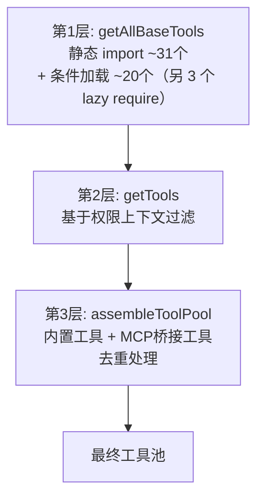

## 4.2 工具注册与组装

`src/tools.ts` 定义了工具从定义到可用的三层组装流水线，依次完成编译时裁剪、运行时过滤和缓存感知排序：



### Layer 1：getAllBaseTools() — 编译时工具裁剪

`getAllBaseTools()`（`src/tools.ts:193-251`）是所有工具的单一事实来源，返回当前构建环境下所有可能可用的工具。

核心工具约 31 个，静态 `import` 直接导入，始终存在；全部工具枚举下来约 55-60 个：

```typescript
import { BashTool } from './tools/BashTool/BashTool.js'
import { FileReadTool } from './tools/FileReadTool/FileReadTool.js'
import { FileEditTool } from './tools/FileEditTool/FileEditTool.js'
// ... 其他核心工具
```

Feature-gated 工具约 20 个，通过条件 `require()` 加载；另有 3 个 Team/SendMessage 工具也用 lazy `require()`，但那是为了打破循环依赖，不属于 feature gate：

```typescript
const SleepTool = feature('PROACTIVE') || feature('KAIROS')
  ? require('./tools/SleepTool/SleepTool.js').SleepTool
  : null

const SnipTool = feature('HISTORY_SNIP')
  ? require('./tools/SnipTool/SnipTool.js').SnipTool
  : null
```

这里的 `feature()` 不是运行时函数——它是 **Bun 打包器的编译时宏**。构建面向外部用户的版本时，`feature('PROACTIVE')` 在编译阶段求值为 `false`，整个三元表达式简化为 `const SleepTool = null`，`require()` 调用则被死代码消除（Dead Code Elimination）物理删除。这意味着内部工具不只是"隐藏"——它们在外部构建的二进制文件中根本不存在，从根本上杜绝了通过运行时手段绕过 Feature Gate 的可能。

还有一个优化：当 `hasEmbeddedSearchTools()` 返回 `true` 时（Anthropic 内部构建将 bfs/ugrep 编译进了 Bun 二进制文件），GlobTool 和 GrepTool 会被排除——因为 shell 别名已经指向了更快的嵌入式实现，专用工具就没有必要了。

### Layer 2：getTools() — 运行时上下文过滤

`getTools()`（`src/tools.ts:271-327`）在运行时根据当前环境和权限上下文过滤工具。它包含四层递进过滤：

**1. SIMPLE 模式**（`CLAUDE_CODE_SIMPLE` 环境变量 / `--bare` 标志）：将工具集削减到最小核心——仅保留 BashTool、FileReadTool、FileEditTool。这是最轻量的工具配置，适用于资源受限或嵌入式场景。当 REPL 模式同时启用时，REPLTool 会顶替这三个工具——REPL 的 VM 内部已经封装了它们。

**2. REPL 模式过滤**：当 `isReplModeEnabled()` 为 true 且 REPLTool 可用时，`REPL_ONLY_TOOLS` 集合中的工具（Bash、FileRead、FileEdit 等）从直接工具列表中隐藏。这些工具仍然存在于 REPL VM 的执行上下文中，但模型不能直接调用它们——必须通过 REPL 工具间接使用。

**3. Deny 规则过滤**：`filterToolsByDenyRules()` 检查每个工具是否匹配全局 deny 规则。一个没有 `ruleContent` 的 deny 规则（blanket deny）会完全移除对应工具，使模型在 system prompt 中根本看不到它。对于 MCP 工具，前缀匹配规则如 `mcp__server` 会一次性移除该服务器的所有工具——这是在模型看到工具列表之前就完成的，而不是在调用时才检查。

**4. `isEnabled()` 运行时检查**：系统调用每个工具的 `isEnabled()` 方法，过滤掉返回 `false` 的工具。这允许工具根据运行时条件（如依赖是否可用）自行决定是否启用。

### Layer 3：assembleToolPool() — 合并与缓存感知排序

`assembleToolPool()`（`src/tools.ts:345-367`）是最终的组装点，将内置工具和 MCP 工具合并为统一的工具池：

```typescript
export function assembleToolPool(
  permissionContext: ToolPermissionContext,
  mcpTools: Tools,
): Tools {
  const builtInTools = getTools(permissionContext)
  const allowedMcpTools = filterToolsByDenyRules(mcpTools, permissionContext)

  // 分区排序：内置工具作为连续前缀，MCP 工具作为后缀
  const byName = (a: Tool, b: Tool) => a.name.localeCompare(b.name)
  return uniqBy(
    [...builtInTools].sort(byName).concat(allowedMcpTools.sort(byName)),
    'name',
  )
}
```

这段代码有两个关键设计决策：

**分区排序而非全局排序**：内置工具按字母排序形成一个连续的前缀块，MCP 工具按字母排序后追加为后缀块。为什么不直接对所有工具做一次全局排序？因为 API 服务器的缓存策略（`claude_code_system_cache_policy`）在最后一个内置工具之后设置了缓存断点。如果做全局排序，一个名为 `mcp__github__create_issue` 的 MCP 工具会插入到 `GlobTool` 和 `GrepTool` 之间，导致所有下游缓存键失效。分区排序确保添加/移除 MCP 工具只影响后缀部分，内置工具前缀块更大，其缓存始终命中。

**`uniqBy('name')` 内置优先**：当内置工具和 MCP 工具同名时，`uniqBy` 保留首次出现的（即内置工具），因为内置工具在拼接数组中排在前面。这确保了 MCP 工具不会意外覆盖内置工具。
