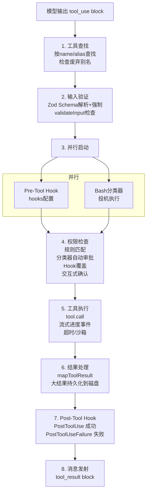

## 4.4 工具执行生命周期

当模型在流式输出中产生一个 `tool_use` block 时，这个调用请求并不会直接执行——它需要经历一条完整的处理流水线。从工具查找、输入验证、权限检查（可能涉及用户交互），到实际执行、结果格式化、再到 Hook 回调，共 8 个阶段。这条流水线对所有工具（内置、MCP、REPL）完全相同，是 4.1 节统一 `Tool` 接口的直接体现。理解这条流水线是理解 Claude Code 安全模型和执行语义的关键。



### 各阶段详解

**Stage 1 - 工具查找**

系统按 `name` 和 `aliases` 匹配工具定义。如果工具是通过已废弃的别名调用的，系统会在 tool_result 中附加一条废弃警告，引导模型在后续调用中使用新名称。如果未找到匹配工具，直接返回错误消息——这在模型幻觉出不存在的工具时会发生。

**Stage 2 - 输入验证**

输入验证分为两个阶段：

```typescript
// Phase 1: Zod Schema 强制转换
// Zod 的 safeParse 不仅验证，还会做类型强制（如字符串数字 → 数字）
const parsed = tool.inputSchema.safeParse(rawInput)
// 如果 Schema 验证失败，格式化错误信息返回给模型

// Phase 2: 业务逻辑验证
// 仅在 Schema 验证通过后执行
const validation = await tool.validateInput(parsed.data, context)
// 返回类型：
// { result: true }                              — 验证通过
// { result: false, message, errorCode }         — 直接拒绝
// { result: false, message, behavior: 'ask' }   — 显示 UI 提示让用户决定
```

两阶段分离，Schema 层做结构验证，管字段存在性和类型；业务层做语义验证，如 FileEditTool 检查文件是否存在、FileWriteTool 检查是否已读过文件再写入。`behavior: 'ask'` 模式允许工具在不确定的情况下把决策权交给用户，而非直接拒绝。

**Stage 3 - 并行启动**

Pre-Tool Hook 和 Bash 分类器同时启动，而不是串行等待。这两个操作可能各需要数十到数百毫秒，并行启动后总等待只取决于较慢的那一个，而不是两段相加。

- Pre-Tool Hook：执行用户在 `PreToolUse` 事件下配置的外部脚本，可以返回 `allow`、`deny` 或不干预
- Bash 分类器：对 BashTool 调用做投机性安全分类，判断命令是否只读，结果缓存以供权限检查使用

**Stage 4 - 权限检查**

权限检查是整个流水线中最复杂的阶段，实现在 `checkPermissionsAndCallTool()`（`src/services/tools/toolExecution.ts`）。它涉及多个决策源，按优先级链式求值——一旦某个环节做出明确决定，后续检查就不再执行：

**4a. Hook 权限覆盖（最高优先级）**

如果 Stage 3 的 Pre-Tool Hook 返回了权限决定（`hookPermissionResult`），它直接覆盖所有后续检查。Hook 可以返回三种结果：
- `allow`：跳过所有权限检查，直接执行（例如，企业内部 Hook 自动批准特定命令）
- `deny`：立即拒绝，附带拒绝原因
- 无决策：穿透到下一层检查

**4b. 工具自身的 `checkPermissions()`**

每个工具可以实现自己的权限逻辑。大部分工具使用默认实现，直接返回 `allow`；BashTool 的 `bashToolHasPermission()` 却是一个 200+ 行的复杂实现，详见 4.6 节。文件工具会检查路径是否在允许的工作目录范围内。

**4c. 规则匹配**

系统从 8 个来源收集权限规则：

| 来源 | 说明 | 示例 |
|------|------|------|
| `userSettings` | `~/.claude/settings.json` | 用户级全局设置 |
| `projectSettings` | `.claude/settings.json` | 项目级共享设置 |
| `localSettings` | `.claude/settings.local.json` | 不提交到 git 的个人设置 |
| `flagSettings` | `--settings` flag 传入的设置文件 | 命令行显式指定的设置 |
| `policySettings` | 组织策略（`managed-settings.json` 或 API 下发的远程设置） | 企业管理员下发的强制规则 |
| `cliArg` | 命令行参数指定的规则 | `--allowedTools 'Bash(git *)'` |
| `command` | 斜杠命令 / 命令 frontmatter 附带的规则 | 命令定义里声明的 allowedTools |
| `session` | 当前会话中用户的临时授权 | 用户点击"允许一次"时生成 |

每条规则有三种行为：`allow` 自动批准、`deny` 自动拒绝、`ask` 要求交互确认。这些来源之间并不是简单的线性优先级——真正决定结果的是**行为优先级 `deny > ask > allow`**：跨来源的 `deny` 一律先生效，`session` 的临时授权盖不掉企业 `policySettings` 里的 `deny`。设置类来源彼此之间遵循"后者覆盖前者"（`userSettings` < `projectSettings` < `localSettings` < `flagSettings` < `policySettings`，企业策略最强）。规则的 `ruleContent` 支持三种匹配模式：
- 精确匹配：`Bash(npm install)` 仅匹配完全相同的命令
- 前缀匹配：`Bash(git commit:*)` 匹配所有以 `git commit` 开头的命令
- 通配符匹配：`Bash(git *)` 匹配所有以 `git ` 开头的命令

**4d. 投机分类器结果（Bash 专用）**

在 Stage 3 中并行启动的 Bash 分类器此时返回结果。分类器是一个基于语义描述的 LLM 侧查询，用于判断命令是否匹配用户定义的 allow/deny 描述。如果分类器以高置信度判定命令安全，即匹配 allow 描述，权限弹窗就自动跳过。分类器的结果通过 `pendingClassifierCheck` Promise 异步传递，UI 层可以在展示弹窗前等待它。

**4e. 交互式确认弹窗**

如果以上所有检查都没有做出明确决定（既不是自动允许也不是自动拒绝），用户会看到一个权限确认弹窗。弹窗包含：
- 工具名称和完整输入（如 Bash 命令文本）
- 破坏性命令警告（如果适用，来自 `getDestructiveCommandWarning()`）
- 建议的权限规则（如 `Bash(git commit:*)`），用户可以选择保存以避免未来重复确认
- 三个操作选项：仅放行本次的"允许一次"、保存为规则的"始终允许"，以及"拒绝"

**4f. 拒绝追踪**

`DenialTrackingState` 跟踪连续权限拒绝。当同一工具或命令模式被多次拒绝后，系统会向对话中注入引导提示，帮助模型理解它应该尝试不同的方法，而不是反复请求已遭拒绝的操作。这防止了模型陷入"请求权限、遭拒、再次请求"的死循环。

**Stage 5 - 工具执行**

`tool.call()` 执行实际操作。关键机制是 `onProgress` 回调——它允许工具在执行过程中实时发射进度消息。例如，BashTool 通过此回调流式传输 stdout/stderr 输出，用户可以实时看到命令的输出而不必等待命令完成。后台任务（`run_in_background: true`）在超时阈值后自动转为异步执行。

**Stage 6 - 结果处理**

`mapToolResultToToolResultBlockParam()` 将工具的内部 `ToolResult` 转换为 API 兼容的 `ToolResultBlockParam` 格式。其中最要紧的是大结果处理：如果结果超过 `maxResultSizeChars`，完整内容保存到磁盘，模型接收到的是文件路径 + 截断指示符（详见 4.8 节）。这避免了一次 grep 搜索结果炸掉整个上下文窗口。

**Stage 7 - Post-Tool Hook**

Post-Tool Hook 分为两个独立事件：

| Hook 事件 | 触发时机 | 脚本接收内容 |
|-----------|----------|--------------|
| `PostToolUse` | 工具执行成功时触发 | 工具名称、输入和输出 |
| `PostToolUseFailure` | 工具执行失败时触发 | 工具名称、输入和错误详情 |

两者是独立的 Hook 事件，用户可以分别配置不同的处理逻辑。例如，可以在 `PostToolUse` 中对 BashTool 的 `git push` 命令发送通知，在 `PostToolUseFailure` 中记录失败日志。（事件名在 settings 配置里大小写敏感、按字面匹配——必须写成 `PostToolUse` / `PostToolUseFailure`，写成小写不会触发。）

### 错误处理与传播

工具执行流水线的错误处理遵循一个核心哲学：**错误是数据，不是异常**。在任何阶段发生的错误都不会导致进程崩溃或对话中断——它们一律转成 `tool_result` 消息（带有 `is_error: true` 标记）返回给模型，让模型可以自我纠正。

各阶段的错误形式：

| 阶段 | 错误类型 | 处理方式 |
|------|---------|---------|
| Schema 验证 | Zod parse 失败（类型错误、缺失字段） | `formatZodValidationError()` 格式化后包裹在 `<tool_use_error>` XML 标签中 |
| 业务验证 | `validateInput()` 返回 `\{result: false\}` | 返回验证错误消息，附带 `errorCode` |
| 权限拒绝 | 用户点击"拒绝"或规则匹配 deny | 返回 `CANCEL_MESSAGE` 或具体的拒绝原因 |
| 工具执行 | 运行时异常（文件不存在、命令失败等） | try-catch 捕获，`classifyToolError()` 分类后记录遥测 |
| MCP 工具 | `McpToolCallError` 或 `McpAuthError` | Auth 错误触发 OAuth 流程，其他错误返回给模型 |

`classifyToolError()`（`src/services/tools/toolExecution.ts`）要解决一个问题：minified 构建中，JavaScript 的 `error.constructor.name` 会被混淆为 `"nJT"` 之类的短标识符，无法用于遥测分析。因此该函数采用了一个鲁棒的分类优先级链：

1. `TelemetrySafeError` 实例：使用其 `telemetryMessage`（开发者显式标记为遥测安全的消息）
2. 标准 Error + errno 码：返回 `"Error:ENOENT"`、`"Error:EACCES"` 等（Node.js 文件系统错误的稳定标识）
3. Error 实例且 `.name` 长度 > 3（未被 minify）：使用原始错误名
4. 其他 Error：返回 `"Error"`
5. 非 Error 值：返回 `"UnknownError"`

这种设计确保了遥测数据在任何构建模式下都是可分析的，同时避免泄漏文件路径或代码片段到遥测系统中。
