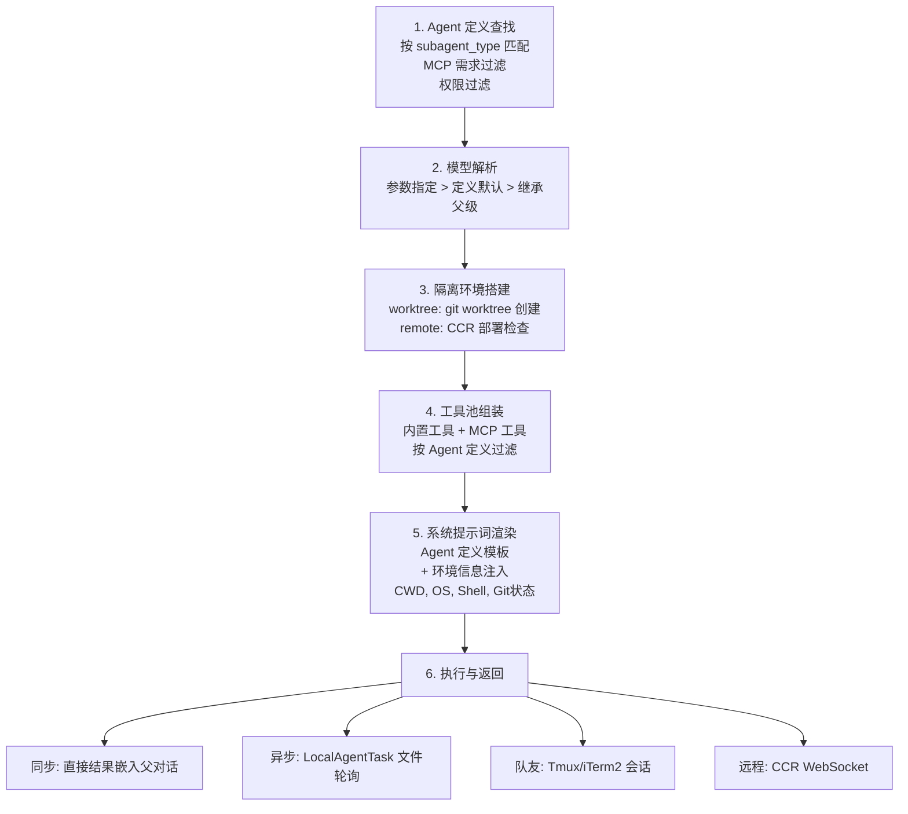

## 4.7 AgentTool 深度解析

AgentTool 负责派生子 Agent，是多 Agent 架构的核心：

```typescript
{
  description: string          // 3-5 词任务描述
  prompt: string               // 子 Agent 任务指令
  subagent_type?: string       // 专用 Agent 类型
  model?: 'sonnet' | 'opus' | 'haiku'
  run_in_background?: boolean  // 异步执行
  name?: string                // 可寻址的队友名称
  isolation?: 'worktree' | 'remote'  // 隔离模式
}
```

### 子 Agent 生命周期

子 Agent 从创建到执行经历 6 个阶段，每个阶段都有精确的决策逻辑：



Stage 1 - Agent 定义查找：如果提供了 `subagent_type`，系统按类型名匹配预定义的 Agent 定义（如 `coder`、`researcher`）。匹配时还会检查 Agent 定义所需的 MCP 服务是否可用、当前权限模式是否允许。未匹配到定义时使用通用默认配置。

Stage 2 - 模型解析：模型选择遵循三级优先级链——调用参数中的 `model` 字段优先级最高，没有就用 Agent 定义中的默认模型，再没有才继承父 Agent 当前使用的模型。这种设计允许开销敏感的任务使用 `haiku`，复杂任务升级到 `opus`。

Stage 3 - 隔离环境搭建：`worktree` 模式通过 `git worktree add` 创建独立工作树，子 Agent 在隔离的文件系统视图中工作，避免与父 Agent 的文件编辑冲突。`remote` 模式检查 CCR（Claude Code Remote）环境可用性，准备远程部署。

Stage 4 - 工具池组装：子 Agent 的工具池不一定与父 Agent 相同。Agent 定义可以指定工具白名单/黑名单，例如 `researcher` 类型可能只获得只读工具。MCP 工具也按 Agent 定义的需求过滤。

Stage 5 - 系统提示词渲染：将 Agent 定义中的提示词模板与环境信息合并。注入内容包括：当前工作目录、操作系统类型、Shell 类型、Git 仓库状态等。这确保子 Agent 对执行环境有准确的认知。

Stage 6 - 执行与返回：根据调用方式分为四种模式：
- 同步：子 Agent 在当前进程内直接执行，结果嵌入父对话的 tool_result 中
- 异步：创建 `LocalAgentTask`，子 Agent 将结果写入临时文件，父 Agent 通过 `TaskGetTool` 轮询获取
- 队友：通过 Tmux 或 iTerm2 创建新的终端会话，子 Agent 作为独立进程并行工作，可通过 `SendMessageTool` 通信
- 远程：通过 CCR 创建远程执行环境，返回 WebSocket URL，结果异步回传
