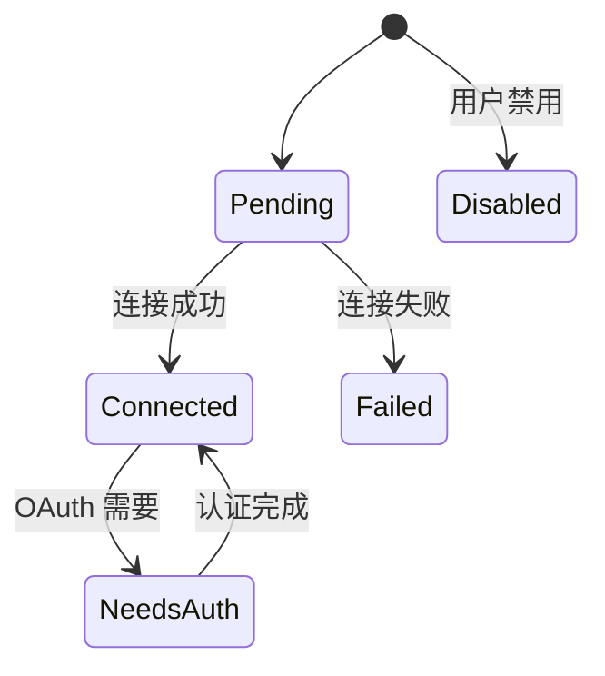

## 4.9 MCP 工具集成

MCP（Model Context Protocol）工具通过桥接层无缝集成到 Claude Code 的工具系统中。

### 桥接工具

| Claude Code 工具 | MCP 功能 |
|-----------------|---------|
| MCPTool | 调用单个 MCP 工具 |
| ListMcpResourcesTool | 列出 MCP 资源 |
| ReadMcpResourceTool | 读取 MCP 资源内容 |
| createMcpAuthTool() | OAuth 认证处理 |

### 传输机制与服务端配置类型

传输层由 `TransportSchema` 定义，共 6 种传输机制（`services/mcp/types.ts`）：

```typescript
// TransportSchema = z.enum([...])
type Transport =
  | 'stdio'    // 标准输入/输出（子进程 MCP 服务端）
  | 'sse'      // Server-Sent Events（HTTP 流式）
  | 'sse-ide'  // SSE 变体（IDE 扩展）
  | 'http'     // HTTP 传输（StreamableHTTPClientTransport）
  | 'ws'       // WebSocket（双向实时）
  | 'sdk'      // SDK 原生传输（进程内，SdkControlTransport）
```

而服务端配置 `McpServerConfigSchema` 是一个 8 种 config 的 discriminated union——在上面 6 种传输之外，还多了面向 IDE 的 `ws-ide`（`McpWebSocketIDEServerConfig`）与 Claude.ai 代理的 `claudeai-proxy`。换句话说：传输 enum 6 种、服务端配置类型 8 种，二者不是同一份清单。

### 连接状态机



客户端实例有 memoize 缓存，避免重复初始化。HTTP 404 + JSON-RPC -32001 检测会话过期。

### OAuth 支持

MCP 集成支持三阶段 OAuth：
1. 标准 OAuth 2.0 + PKCE：自动 Token 轮换，30 秒超时
2. 跨应用访问（XAA）via OIDC：企业 IdP 集成，一次登录多个 MCP 服务端
3. Token 验证：主动刷新接近过期的 Token，macOS Keychain 缓存

### 配置与作用域

```json
{
  "mcpServers": {
    "my-server": {
      "command": "node",
      "args": ["my-mcp-server.js"]
    },
    "remote-server": {
      "url": "https://api.example.com/mcp"
    }
  }
}
```

MCP 服务端配置支持 7 种作用域：local / user / project / dynamic / enterprise / claudeai / managed。

MCP 工具在 `assembleToolPool()` 阶段与内置工具合并，去重后统一注册。输出超过默认的 25,000 token 时就地截断并附截断提示，图片块会先尝试压缩进剩余预算（`utils/mcpValidation.ts`）；超大文本结果与其他工具一样走 tool-results 落盘机制。

> **设计决策：为什么 MCP 适合 Agent 生态？**
>
> MCP 的核心设计思想是**协议而非 SDK**——任何语言、任何进程都可以实现 MCP 服务端，只要遵循 JSON-RPC 协议。这与 Claude Code 的工具系统天然互补：内置工具是"深度集成"，直接访问进程内状态；MCP 工具是"广度扩展"，连接外部能力。6 种传输机制、8 种服务端配置类型，对应的是现实世界的多样性——本地工具用 stdio，零网络开销；远程服务用 HTTP/WebSocket，支持认证和断线重连；IDE 插件用 SSE-IDE，适配 VS Code 的进程模型。配置的 7 层作用域从本地到企业，覆盖了不同组织规模的管理需求。
