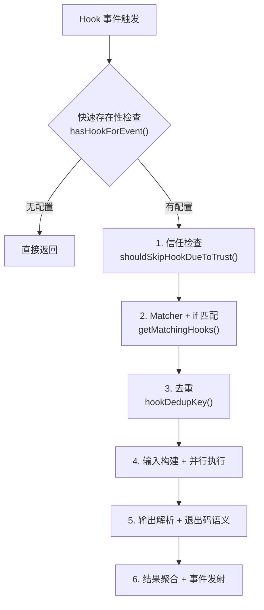

# 第 7 章：Hooks 与可扩展性

> Hooks 是 Claude Code 的事件驱动扩展机制——在不修改源码的前提下，注入自定义逻辑到关键生命周期节点。

想象一下这些场景：每次 Claude 执行 `git push` 之前自动运行 lint 检查；每次编辑文件后在后台跑测试，只在测试失败时中断 Claude；或者把所有工具调用发送到公司审计系统。这些都是 Hooks 的典型用法。

Hooks 的核心设计理念是：Agent Loop 的每个关键节点都暴露一个事件，外部代码可以监听这些事件并注入行为。这和 Git Hooks（pre-commit、post-merge）、Webpack Plugins 的设计理念一脉相承，但 Claude Code 面对的问题更复杂——它需要处理权限控制、异步长任务、多 Agent 协调等场景，因此 Hook 系统的设计远比传统的"前后拦截器"复杂得多。

本章主要内容：

- 7.1 事件全景：27 种 Hook 事件的分类与触发时机
- 7.2 Hook 类型：4 种可配置 Hook（Command/Prompt/Agent/HTTP），以及 Callback、Function 这 2 种编程式 Hook
- 7.3 Matcher 匹配器：三级匹配机制与 `if` 条件的配合
- 7.4 执行引擎：6 阶段流水线——信任检查、匹配、去重、并行执行、输出解析、结果聚合
- 7.5-7.9 高级主题：JSON 输出协议、信任模型与安全、PermissionRequest 深度解析、Stop Hook、实战模式

## 7.1 Hook 事件全景

### 为什么是这 27 种事件？

Claude Code 的 Hook 事件设计遵循一个原则：覆盖 Agent Loop 完整生命周期的所有关键决策点。回顾第 2 章的 Agent Loop，一次完整的交互要顺着这样一条链走：用户先输入，模型据此推理，然后调用工具；工具这一步内部又分权限检查、执行、返回结果；模型拿到结果再决定是否继续，最后给出输出。每个环节都可能需要外部干预，因此每个环节都要有对应的 Hook 事件。

源码中定义了完整的事件列表（`src/entrypoints/sdk/coreTypes.ts`）：

```typescript
export const HOOK_EVENTS = [
  'PreToolUse', 'PostToolUse', 'PostToolUseFailure',
  'Notification', 'UserPromptSubmit', 'SessionStart', 'SessionEnd',
  'Stop', 'StopFailure', 'SubagentStart', 'SubagentStop',
  'PreCompact', 'PostCompact', 'PermissionRequest', 'PermissionDenied',
  'Setup', 'TeammateIdle', 'TaskCreated', 'TaskCompleted',
  'Elicitation', 'ElicitationResult', 'ConfigChange',
  'WorktreeCreate', 'WorktreeRemove', 'InstructionsLoaded',
  'CwdChanged', 'FileChanged'
] as const
```

按功能分类：

| 类别 | 事件 | 触发时机 | Matcher 匹配值 |
|------|------|---------|----------------|
| **工具生命周期** | PreToolUse | 工具执行前 | `tool_name`（如 `Write`、`Bash`） |
| | PostToolUse | 工具执行成功后 | `tool_name` |
| | PostToolUseFailure | 工具执行失败后 | `tool_name` |
| **权限系统** | PermissionRequest | 权限判定时 | `tool_name` |
| | PermissionDenied | 自动分类器拒绝时 | `tool_name` |
| **通知** | Notification | 系统通知触发 | `notification_type` |
| **会话生命周期** | SessionStart | 会话开始 | `source`（`startup`/`resume`/`clear`/`compact`） |
| | SessionEnd | 会话结束 | `reason` |
| | UserPromptSubmit | 用户提交输入时 | 无 |
| **模型响应** | Stop | 模型决定停止时 | 无 |
| | StopFailure | API 调用失败时 | `error` |
| **Agent 协调** | SubagentStart | 子 Agent 启动 | `agent_type` |
| | SubagentStop | 子 Agent 停止 | `agent_type` |
| | TeammateIdle | 协作 Agent 空闲 | 无 |
| **任务系统** | TaskCreated | 任务创建 | 无 |
| | TaskCompleted | 任务完成 | 无 |
| **压缩** | PreCompact | 上下文压缩前 | `trigger`（`manual`/`auto`） |
| | PostCompact | 上下文压缩后 | `trigger` |
| **MCP 交互** | Elicitation | MCP 用户询问 | `mcp_server_name` |
| | ElicitationResult | 询问结果 | `mcp_server_name` |
| **环境变化** | ConfigChange | 配置文件变更 | `source` |
| | CwdChanged | 工作目录变更 | 无 |
| | FileChanged | 被监听文件变更 | 文件名（`basename`） |
| | InstructionsLoaded | 指令文件加载 | `load_reason` |
| **工作区** | Setup | 仓库初始化/维护 | `trigger`（`init`/`maintenance`） |
| | WorktreeCreate | Worktree 创建 | 无 |
| | WorktreeRemove | Worktree 移除 | 无 |

表格第四列"Matcher 匹配值"要专门说一下——它告诉你，当你在配置中写 `matcher: "Write"` 时，系统实际拿什么值来比较。对于工具相关事件，matcher 匹配的是工具名；对于 SessionStart，匹配的是触发源；对于 Notification，匹配的是通知类型。这个映射关系在 `getMatchingHooks()` 的一个 switch 语句中定义。

### 为什么需要这么多事件？

初看 27 种事件可能觉得过多，但每个事件都有明确的使用场景：

- 工具前后事件（PreToolUse/PostToolUse）：最核心的扩展点。前置 Hook 可以阻止执行、修改输入；后置 Hook 可以执行检查、注入上下文。
- 会话事件（SessionStart/SessionEnd）：初始化环境、清理资源、上报审计日志。
- 环境变化事件（FileChanged/CwdChanged/ConfigChange）：响应外部变化，实现"文件保存后自动 lint"等工作流。
- Agent 协调事件（SubagentStart/SubagentStop/TeammateIdle）：在多 Agent 场景中注入协调逻辑。

## 7.2 Hook 类型

Claude Code 支持四种可配置的 Hook 类型和两种编程式 Hook 类型。前四种可以写在 `settings.json` 中，后两种仅在 SDK/插件内部使用。

| 类型 | 持久化方式 | 执行方式 | 适用场景 |
|------|-----------|---------|---------|
| **Command** | settings.json | spawn Shell 子进程，stdin/stdout 通信 | 日志、lint、CI 触发等绝大多数场景 |
| **Prompt** | settings.json | 单轮 LLM 调用，返回 ok/not-ok | 需要语义理解的安全检查或代码审查 |
| **Agent** | settings.json | 多轮 Agent Loop，可调用工具验证 | 复杂验证流程（运行测试、类型检查） |
| **HTTP** | settings.json | POST 请求到外部端点 | Webhook 通知、审计日志、企业合规 |
| **Callback** | 仅内存（SDK/插件注册） | 进程内直接调用异步函数 | 内部埋点、文件跟踪、commit 归因 |
| **Function** | 仅内存（会话级注册） | 进程内调用，按 sessionId 隔离 | Agent Hook 的结构化输出强制 |

在讲具体类型之前，先看一个最简单的 Hook 配置示例，对整体格式有个直观认识：

```json
// ~/.claude/settings.json
{
  "hooks": {
    "PreToolUse": [
      {
        "matcher": "Bash",
        "hooks": [
          {
            "type": "command",
            "command": "echo 'About to run a Bash command'"
          }
        ]
      }
    ]
  }
}
```

这个结构不复杂：`hooks` 对象的 key 是事件名，比如 `PreToolUse`；value 是数组，每个元素含两个字段——`matcher` 做可选的匹配过滤，`hooks` 列出该匹配下要执行的 Hook。

### 1. 命令 Hook（Command）

这是最常用的类型。执行一条 Shell 命令，通过 stdin 接收 JSON 输入，通过 stdout 返回 JSON 结果，通过退出码表达成功/失败/阻塞。

```typescript
{
  type: 'command',
  command: string,           // Shell 命令
  if?: string,               // 权限规则语法的二次过滤
  shell?: 'bash' | 'powershell',  // Shell 类型，默认 bash
  timeout?: number,          // 超时（秒）
  statusMessage?: string,    // 执行时的 spinner 提示
  once?: boolean,            // 执行一次后自动移除
  async?: boolean,           // 异步执行，不阻塞
  asyncRewake?: boolean      // 异步执行 + 退出码 2 时唤醒模型
}
```

工作原理（`execCommandHook`）：

1. 进程创建：调用 `spawn()` 创建子进程。Shell 的选择逻辑是：如果指定了 `shell: 'powershell'`，用 `pwsh`，加上 `-NoProfile -NonInteractive`；否则走 `spawn(cmd, [], { shell: true })`——Unix 上即 `/bin/sh`，Windows 上换成 Git Bash（`findGitBashPath()`）。注意它并不读取用户的 `$SHELL`，schema 描述里的 "$SHELL" 说法与实际 spawn 实现不符。
2. 输入传递：将 Hook 的结构化输入序列化为 JSON，通过 stdin 传入子进程。这份输入包含 session_id、tool_name、tool_input 等字段，因此 Hook 脚本读一下 stdin 就能拿到完整的上下文。
3. 环境变量：子进程继承当前环境变量。如果是插件 Hook，额外注入两个变量——`CLAUDE_PLUGIN_ROOT` 指向插件根目录，`CLAUDE_PLUGIN_DATA` 指向插件数据目录；命令里的 `${CLAUDE_PLUGIN_ROOT}` 占位符也会被替换。
4. 输出收集：等待进程退出，收集 stdout 和 stderr。
5. 结果解析：根据退出码和 stdout 内容决定 Hook 结果，详见 7.4 节。

适用场景：日志记录、文件同步、CI/CD 触发、shell 脚本集成、自定义 linter。

### 2. 提示词 Hook（Prompt）

调用 LLM 从语义层面做判断。适用于需要"理解"而非简单模式匹配的场景。

```typescript
{
  type: 'prompt',
  prompt: string,            // 提示词（$ARGUMENTS 占位符会被替换为 JSON 输入）
  if?: string,               // 权限规则语法过滤
  model?: string,            // 指定模型（默认使用小快模型，如 Haiku）
  timeout?: number,          // 超时（秒，默认 30）
  statusMessage?: string,
  once?: boolean
}
```

工作原理（`execPromptHook`）：

1. 将 `$ARGUMENTS` 占位符替换为 Hook 输入的 JSON 字符串
2. 构建消息数组，可选地带上对话历史，再调用 `queryModelWithoutStreaming` 做单轮、无流式的请求
3. 系统提示词要求模型返回 `{"ok": true}` 或 `{"ok": false, "reason": "..."}`
4. 解析模型返回，`ok: false` 映射为阻塞错误

一个关键设计细节：Prompt Hook 直接调用 `createUserMessage` 而不经过 `processUserInput`——因为后者会触发 `UserPromptSubmit` Hook，导致无限递归。

适用场景：语义安全检查（"这个 SQL 查询是否可能删除数据？"）、代码审查（"这个修改是否符合项目规范？"）。

### 3. Agent Hook

与 Prompt Hook 类似，但以多轮 Agent 模式运行——它可以调用工具来验证条件，不仅仅是"想一想"。

```typescript
{
  type: 'agent',
  prompt: string,            // 验证指令（$ARGUMENTS 占位符）
  if?: string,
  model?: string,            // 默认使用 Haiku
  timeout?: number,          // 超时（秒，默认 60）
  statusMessage?: string,
  once?: boolean
}
```

它与 Prompt Hook 的关键区别在下表：

| | Prompt Hook | Agent Hook |
|--|-------------|------------|
| 调用方式 | `queryModelWithoutStreaming`（单轮） | `query`（多轮 Agent Loop） |
| 能否调用工具 | 不能（只有 LLM 推理） | 能（可以读文件、运行命令来验证） |
| 默认超时 | 30 秒 | 60 秒 |
| 输出格式 | 强制 `{ok, reason}` JSON | 通过注册结构化输出工具，返回 `{ok, reason}` |

Agent Hook 使用 `registerStructuredOutputEnforcement` 注册一个函数 Hook，确保 Agent 在结束时必须调用结构化输出工具返回结果。这是一个"Hook 嵌套 Hook"的设计——Agent Hook 本身在执行过程中注册临时的 Function Hook 来约束 Agent 行为。

适用场景：复杂验证流程——例如"运行测试并确认全部通过"、"检查编辑的文件是否能通过类型检查"。

### 4. HTTP Hook

向外部服务发送 POST 请求，适合与企业基础设施集成。

```typescript
{
  type: 'http',
  url: string,               // POST 端点
  if?: string,
  timeout?: number,          // 超时（秒，默认 10 分钟）
  headers?: Record<string, string>,  // 支持 $VAR 环境变量插值
  allowedEnvVars?: string[], // 允许插值的环境变量白名单
  statusMessage?: string,
  once?: boolean
}
```

工作原理（`execHttpHook`）：

1. URL 白名单检查：如果配置了 `allowedHttpHookUrls` 策略，先检查 URL 是否匹配允许的模式。不匹配直接拒绝，不发任何请求。
2. Header 环境变量插值：遍历 headers，匹配 `$VAR_NAME` 或 `${VAR_NAME}` 模式。只有在 `allowedEnvVars` 中列出的变量才会被替换，其他变量替换为空字符串。这防止了项目级 `.claude/settings.json` 中的恶意 Hook 窃取 `$HOME`、`$AWS_SECRET_ACCESS_KEY` 等敏感变量。
3. CRLF 注入防护：插值后的 header 值会被去除 `\r`、`\n`、`\x00` 字符，防止恶意环境变量注入额外的 HTTP 头。
4. 代理支持：自动检测 sandbox 代理和环境变量代理（`HTTP_PROXY`/`HTTPS_PROXY`），通过代理发送请求。
5. SSRF 防护：不通过代理时，使用 `ssrfGuardedLookup` 防止请求发往内网地址。
6. 响应解析：HTTP Hook 必须返回 JSON，这跟 Command Hook 不同——后者可以返回纯文本。空 body 被视为 `{}`，即成功且无特殊指令。

有一个重要限制：HTTP Hook 不支持 SessionStart 和 Setup 事件。原因是在 headless 模式下，这两个事件触发时 sandbox 的 structuredInput 消费者尚未启动，HTTP 请求会死锁。

适用场景：Webhook 通知、审计日志上报、第三方审批系统、合规检查。

### 5. 回调 Hook（Callback）— 仅限 SDK/插件

编程式函数，在进程内直接执行，不经过 spawn/HTTP 等 I/O 操作。

```typescript
{
  type: 'callback',
  callback: async (input, toolUseID, signal, index, context) => HookJSONOutput,
  timeout?: number,
  internal?: boolean  // 标记为内部 Hook（启用快速路径优化）
}
```

Callback Hook 为什么这么快？Claude Code 在 `executeHooks` 中有一个针对内部 Hook 的快速路径优化：

```typescript
// src/utils/hooks.ts
// isInternalHook(h): h.hook.type === 'callback' && h.hook.internal === true
// 只要匹配集合里有任何一个非内部 Hook（普通 callback、function、command…），
// userHooks.length > 0，就走常规路径
const userHooks = matchingHooks.filter(h => !isInternalHook(h))
if (userHooks.length === 0) {
  // 快速路径：所有匹配 Hook 都是 internal: true 的 callback，
  // 跳过 JSON 序列化、AbortSignal 创建、进度事件、结果处理
  for (const [i, { hook }] of matchingHooks.entries()) {
    if (hook.type === 'callback') {
      await hook.callback(hookInput, toolUseID, signal, i, context)
    }
  }
  return  // 不经过常规 processHookJSONOutput 流程
}
```

这个优化将内部 Hook 的开销从 ~6µs 降低到 ~1.8µs（-70%）。快速路径的触发条件是：所有匹配 Hook 都是 `internal: true` 的 callback，比如文件访问跟踪、commit 归因这类内置埋点。它们在每次工具调用时都触发，累积起来差距很大；而普通的、非 internal 的 SDK callback 和 function Hook 只要出现一个，整批就会走常规流程。

### 7. 函数 Hook（Function）— 仅限会话内

类似 Callback，但作用域限定在特定会话内，防止跨 Agent 泄漏。

```typescript
{
  type: 'function',
  id?: string,
  callback: (messages: Message[], signal?: AbortSignal) => boolean | Promise<boolean>,
  errorMessage: string,      // callback 返回 false 时显示的错误
  timeout?: number,
  statusMessage?: string
}
```

主要用途是 Agent Hook 的结构化输出强制，确保 Agent 必须通过特定工具返回结果。通过 `addFunctionHook()` 注册，`removeFunctionHook()` 移除，按 `sessionId` 隔离——这确保验证 Agent 的函数 Hook 不会泄漏到主 Agent。

### 通用字段说明

有几个字段在多种 Hook 类型中出现，值得单独解释：

`if` 条件是一个比 `matcher` 更精细的过滤器。Matcher 匹配工具名，比如 "Bash"；`if` 则用权限规则语法匹配工具的具体输入，比如 `"Bash(git *)"` 只在 Bash 工具执行 git 命令时触发。`if` 条件在 `prepareIfConditionMatcher` 中解析：它调用工具的 `preparePermissionMatcher` 对工具输入做模式匹配，复用了权限系统的匹配引擎。要注意 `if` 只能在工具相关事件（PreToolUse、PostToolUse、PostToolUseFailure、PermissionRequest）上求值。在其他事件上，带 `if` 条件的 Hook 会被 `ifFilteredHooks` 过滤器直接剔除、永不执行——源码里 `ifMatcher` 为 `undefined` 时就 `return false`，而不是"忽略 `if`、让 Hook 照常触发"。

`once` 字段：如果为 true，Hook 执行一次后自动从配置中移除。适用于一次性的初始化或验证。

`statusMessage` 字段：Hook 执行时在 spinner 中显示的自定义消息。默认显示命令内容，但对于复杂命令或包含敏感信息的命令，自定义消息更友好。

## 7.3 Matcher 匹配器

Matcher 是 Hook 系统的路由机制——决定一个 Hook 是否应该响应某个事件。

### 配置格式

```typescript
type HookMatcher = {
  matcher?: string,          // 匹配模式，不设置则匹配所有
  hooks: HookCommand[]       // 匹配时执行的 Hook 列表
}
```

配置示例：

```json
{
  "hooks": {
    "PreToolUse": [
      {
        "matcher": "Bash",
        "hooks": [{ "type": "command", "command": "echo 'Bash tool used'" }]
      },
      {
        "matcher": "Write|Edit",
        "hooks": [{ "type": "command", "command": "echo 'File modified'" }]
      }
    ]
  }
}
```

### 三种匹配模式

`matchesPattern()` 函数实现了三级匹配，按顺序尝试：

```typescript
// src/utils/hooks.ts
function matchesPattern(matchQuery: string, matcher: string): boolean {
  if (!matcher || matcher === '*') return true

  // 1. 精确匹配或管道分隔（只含字母数字和 | 的视为简单模式）
  if (/^[a-zA-Z0-9_|]+$/.test(matcher)) {
    if (matcher.includes('|')) {
      // "Write|Edit|Read" → 分割后逐个精确匹配
      return patterns.includes(matchQuery)
    }
    // "Write" → 直接精确匹配
    return matchQuery === matcher
  }

  // 2. 正则表达式（包含任何特殊字符时）
  const regex = new RegExp(matcher)
  return regex.test(matchQuery)
}
```

三种模式的设计体现了渐进复杂度：

| 模式 | 示例 | 使用场景 |
|------|------|---------|
| 精确匹配 | `"Write"` | 最常用，匹配单个工具 |
| 管道分隔 | `"Write\|Edit\|Read"` | 匹配多个工具（OR 语义） |
| 正则表达式 | `"^Bash.*"` / `"^(Write\|Edit)$"` | 复杂模式匹配 |

为什么不直接全部用正则？因为绝大多数用户只需要精确匹配。正则的字符串模式检测（`/^[a-zA-Z0-9_|]+$/`）确保简单的工具名不会被意外当成正则解析——比如 `"Bash"` 不会触发正则引擎。

### Matcher 与 `if` 条件的配合

Matcher 和 `if` 构成了两层过滤：

```
事件触发
  │
  ▼
Matcher 过滤：匹配工具名/事件类型（粗粒度）
  │ 不匹配 → 跳过，不 spawn 进程
  ▼
if 条件过滤：匹配工具的具体输入参数（细粒度）
  │ 不匹配 → 跳过，不 spawn 进程
  ▼
执行 Hook
```

举例：

```json
{
  "matcher": "Bash",
  "hooks": [{
    "type": "command",
    "command": "echo 'git command detected'",
    "if": "Bash(git push*)"
  }]
}
```

这个配置的匹配过程：
1. PreToolUse 事件触发，tool_name 是 "Bash" → matcher 匹配通过
2. 检查 `if` 条件：`"Bash(git push*)"` → 解析权限规则，检查工具输入的命令是否匹配 `git push*` 模式
3. 如果用户执行的是 `git push origin main` → 匹配通过，执行 Hook
4. 如果用户执行的是 `git status` → 匹配失败，跳过

这里的性能关键在于：两层过滤都在 spawn 子进程之前完成。如果一个 PreToolUse 事件触发了 10 个 Hook 配置，但只有 2 个通过了 matcher + if 的双重过滤，系统只会 spawn 2 个进程。这是"零成本抽象"——不触发的 Hook 完全没有运行时开销。

## 7.4 Hook 执行引擎

关键文件：`src/utils/hooks.ts`（核心调度）

Hook 执行经过 6 个阶段。下面逐一展开每个阶段的实现细节。



### Stage 0：快速存在性检查

在进入完整的 Hook 流程之前，`hasHookForEvent()` 提供了一个轻量级的短路判断：

```typescript
// src/utils/hooks.ts
function hasHookForEvent(hookEvent, appState, sessionId): boolean {
  const snap = getHooksConfigFromSnapshot()?.[hookEvent]
  if (snap && snap.length > 0) return true
  const reg = getRegisteredHooks()?.[hookEvent]
  if (reg && reg.length > 0) return true
  if (appState?.sessionHooks.get(sessionId)?.hooks[hookEvent]) return true
  return false
}
```

这个检查故意做成过度近似（over-approximates）：它不检查 matcher 是否匹配，不检查 managedOnly 策略——只要有任何配置存在就返回 true。假阳性只是多走一步完整匹配路径；假阴性则会跳过应执行的 Hook，所以宁可多查不可漏查。

这个优化的价值在于：绝大多数事件根本没有配置任何 Hook。一个没有配置 FileChanged Hook 的项目，每次文件变化事件都能在几微秒内短路返回，省掉了 `createBaseHookInput` 的路径拼接和 `getMatchingHooks` 的配置遍历。

### Stage 1：信任检查

`shouldSkipHookDueToTrust()` 是安全底线——所有 Hook 都需要工作区信任：

```typescript
// src/utils/hooks.ts
export function shouldSkipHookDueToTrust(): boolean {
  const isInteractive = !getIsNonInteractiveSession()
  if (!isInteractive) return false  // SDK 模式下信任隐式成立
  const hasTrust = checkHasTrustDialogAccepted()
  return !hasTrust  // true = 跳过 Hook
}
```

为什么要卡得这么死？Hooks 从 `.claude/settings.json` 读取配置并执行任意命令。如果不检查信任，恶意仓库可以通过在 `.claude/settings.json` 中注入 Hook 来执行代码——用户只要 clone 并打开仓库，Hook 就会自动运行。

这个设计是被历史漏洞逼出来的：

1. SessionEnd Hook 泄露：用户 clone 一个恶意仓库，打开 Claude Code，看到信任对话框后点了拒绝，随即退出。但 SessionEnd Hook 在退出时执行，并不检查信任，于是恶意 Hook 照样跑了一遍。
2. SubagentStop Hook 提前执行：子 Agent 在信任对话框弹出前就跑完了，SubagentStop 事件随之触发，Hook 就落在了未经信任的工作区里。

修复方案简单而有效：在 `executeHooks` 的最开头统一检查信任，所有 Hook 无一例外，都必须在工作区信任建立后才能执行。源码注释直接点明了这一点：

> *"This centralized check prevents RCE vulnerabilities for all current and future hooks"*

### Stage 2：Matcher 匹配与 Hook 收集

`getMatchingHooks()` 是整个引擎中逻辑最复杂的函数。它需要：

1. 收集所有来源的 Hook 配置：快照配置 + 注册的 SDK/插件 Hook + 会话 Hook + 函数 Hook
2. 根据事件类型确定 matchQuery：通过 switch 语句从 hookInput 中提取匹配值
3. Matcher 匹配过滤：对每个 HookMatcher，检查 matcher 是否匹配 matchQuery
4. `if` 条件过滤：使用 `prepareIfConditionMatcher` 生成匹配闭包，逐个检查
5. 特殊限制：HTTP Hook 在 SessionStart/Setup 事件中被过滤掉

matchQuery 的提取逻辑（源码 `getMatchingHooks` 中的 switch）：

```typescript
switch (hookInput.hook_event_name) {
  case 'PreToolUse':
  case 'PostToolUse':
  case 'PostToolUseFailure':
  case 'PermissionRequest':
  case 'PermissionDenied':
    matchQuery = hookInput.tool_name        // 工具名
    break
  case 'SessionStart':
    matchQuery = hookInput.source           // "startup" | "resume" | "clear" | "compact"
    break
  case 'Setup':
    matchQuery = hookInput.trigger          // "init" | "maintenance"
    break
  case 'Notification':
    matchQuery = hookInput.notification_type // 通知类型
    break
  case 'SubagentStart':
  case 'SubagentStop':
    matchQuery = hookInput.agent_type       // Agent 类型
    break
  case 'FileChanged':
    matchQuery = basename(hookInput.file_path) // 文件名（不含路径）
    break
  // ...
}
```

注意 `FileChanged` 用的是 `basename`——只匹配文件名，不匹配路径。这意味着 `matcher: ".env"` 会匹配任何目录下的 `.env` 文件。

### Stage 3：Hook 去重

当 Hook 配置在多个来源中重复出现时（比如用户设置和项目设置都定义了同一条 Hook），去重机制确保不会重复执行。

```typescript
// src/utils/hooks.ts
function hookDedupKey(m: MatchedHook, payload: string): string {
  return `${m.pluginRoot ?? m.skillRoot ?? ''}\0${payload}`
}
```

去重的核心设计：

- 同源 Hook 去重：来自 settings 的 Hook（无 pluginRoot/skillRoot）共享空字符串前缀，相同命令只保留最后合并的那个
- 跨源 Hook 不去重：插件 A 和插件 B 可能都有 `${CLAUDE_PLUGIN_ROOT}/hook.sh`，展开后指向不同文件。去重 key 包含 pluginRoot，确保它们不会被错误地合并
- 不同 `if` 条件不去重：即使命令相同，`if` 条件不同也是不同的 Hook

Last-wins 语义：`new Map(entries)` 在 key 冲突时保留最后一个 entry。对于 settings Hook，这意味着后合并的配置（如项目设置）覆盖先合并的用户设置。

Callback 和 Function Hook 跳过去重——每个回调函数都是唯一的，去重没有意义。

### Stage 4：输入构建与并行执行

先说输入构建。`createBaseHookInput()` 构建所有 Hook 共用的基础输入：

```typescript
{
  session_id: string,       // 会话 ID
  transcript_path: string,  // 对话记录文件路径
  cwd: string,              // 当前工作目录
  permission_mode?: string, // 权限模式
  agent_id?: string,        // 子 Agent ID
  agent_type?: string       // Agent 类型
}
```

`agent_type` 有一个值得注意的优先级逻辑：子 Agent 的类型（来自 toolUseContext）优先于主线程的 `--agent` 标志。这样 Hook 可以通过 `agent_id` 是否存在来区分"主 Agent 的工具调用"和"子 Agent 的工具调用"。

JSON 输入采用惰性序列化：Hook 输入只序列化一次，通过闭包共享给同一批次的所有 Hook：

```typescript
let jsonInputResult: { ok: true; value: string } | { ok: false; error: unknown } | undefined
function getJsonInput() {
  if (jsonInputResult !== undefined) return jsonInputResult
  try {
    return (jsonInputResult = { ok: true, value: jsonStringify(hookInput) })
  } catch (error) {
    return (jsonInputResult = { ok: false, error })
  }
}
```

如果一个事件触发了 5 个 Command Hook，hookInput 只被 `jsonStringify` 一次。

再看并行执行。所有匹配的 Hook 通过 `hookPromises.map(async function* ...)` 并行启动，用 `all()` 等待所有结果。这意味着 5 个 Hook 的执行时间取决于最慢的那个，而不是 5 个的总和。每个 Hook 有独立的超时控制，`createCombinedAbortSignal` 会把父级 signal 和 Hook 自己的超时合到一起。

执行分三种模式。

同步模式是默认的：等待进程退出，收集 stdout/stderr，解析输出。虽然多个 Hook 之间是并行的，但每个 Hook 自身是同步等待结果的。

异步模式（`async: true`）：Hook 进程在后台运行，通过 `registerPendingAsyncHook()` 注册到全局的 `AsyncHookRegistry`，立即返回 success。Agent Loop 在每轮循环中调用 `checkForAsyncHookResponses()` 轮询已完成的异步 Hook，将结果注入对话。这里的超时取值要分清两条路径：配置里写 `async: true` 的 Hook，后台超时沿用该 Hook 的 `timeout` 字段（`hook.timeout*1000`，缺省则是 `TOOL_HOOK_EXECUTION_TIMEOUT_MS` = 10 分钟），backgrounding 时以 `asyncTimeout: hookTimeoutMs` 传入；只有当 Hook 通过 stdout 自行返回 `{"async": true}` 却没带 `asyncTimeout` 时，才落到 `AsyncHookRegistry` 的 `|| 15000` 这条 15 秒兜底上。

异步唤醒模式（`asyncRewake: true`）最特殊，专为"后台检查 + 按需中断"场景设计：

```typescript
// src/utils/hooks.ts - executeInBackground()
if (asyncRewake) {
  // asyncRewake hooks 绕过 AsyncHookRegistry
  void shellCommand.result.then(async result => {
    if (result.code === 2) {
      // 退出码 2 = 阻塞错误 → 通过 notification 唤醒模型
      enqueuePendingNotification({
        value: wrapInSystemReminder(
          `Stop hook blocking error from command "${hookName}": ${stderr || stdout}`
        ),
        mode: 'task-notification',
      })
    }
  })
}
```

工作流程：
1. Hook 进程在后台运行，不阻塞当前操作
2. 退出码 0 → 静默成功，不打扰模型
