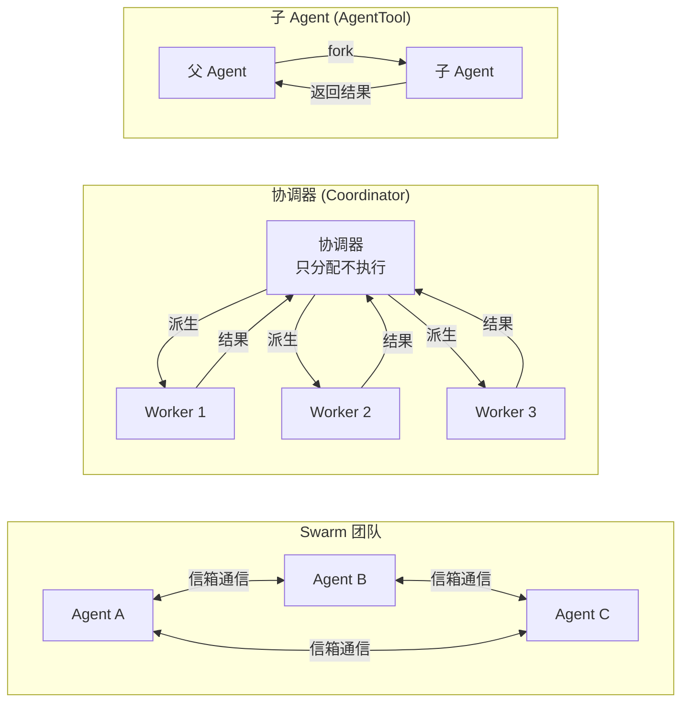

# 第 8 章：多 Agent 架构

> 从单个 Agent 到 Agent 团队——Claude Code 如何协调多个 Agent 并行完成复杂任务。

## 8.1 三种多 Agent 模式

Claude Code 支持三种多 Agent 协作模式，适用于不同复杂度的场景：

| 模式 | 适用场景 | 通信方式 | 特点 |
|------|---------|---------|------|
| **子 Agent** | 单个独立子任务 | fork-return | 最简单，父 Agent 等待结果 |
| **协调器** | 复杂多步任务 | 派生 + 综合 | 协调器不执行，只编排 |
| **Swarm 团队** | 并行协作任务 | 命名信箱 | Agent 间对等通信 |
